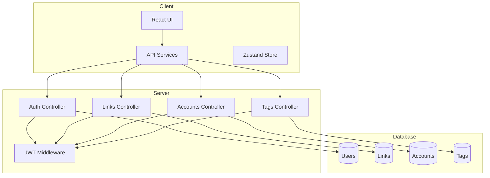
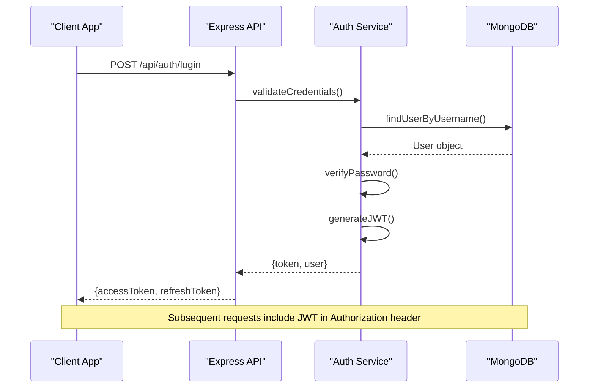
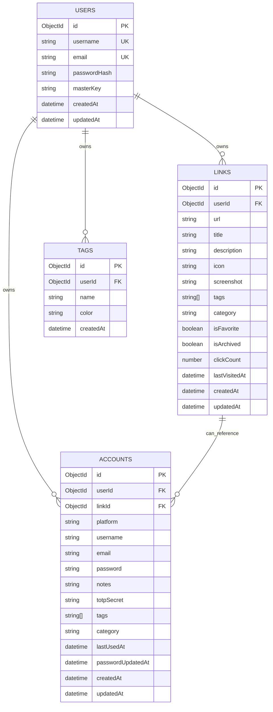

# API Reference

<cite>
**Referenced Files in This Document**
- [BUILD.md](file://doc/BUILD.md)
</cite>

## Table of Contents
1. [Introduction](#introduction)
2. [Project Structure](#project-structure)
3. [Core Components](#core-components)
4. [Architecture Overview](#architecture-overview)
5. [Detailed Component Analysis](#detailed-component-analysis)
6. [Dependency Analysis](#dependency-analysis)
7. [Performance Considerations](#performance-considerations)
8. [Troubleshooting Guide](#troubleshooting-guide)
9. [Conclusion](#conclusion)

## Introduction
QuickLink is a personal knowledge management tool for bookmarking links and securely storing account credentials. It provides a RESTful API with authentication via JWT, full-text search, batch import/export, encrypted storage using AES-256-GCM, and MongoDB as the data store.

## Project Structure
The project follows a monorepo layout with separate client and server directories:
- Frontend: React 18 + TypeScript + Vite with Ant Design UI
- Backend: Node.js + Express + TypeScript with MongoDB
- Database: MongoDB 7 with schema migrations
- Security: JWT authentication, bcrypt password hashing, AES-256-GCM encryption



**Diagram sources**
- [BUILD.md:33-92](file://doc/BUILD.md#L33-L92)

**Section sources**
- [BUILD.md:33-92](file://doc/BUILD.md#L33-L92)

## Core Components
The API consists of four main functional areas:

### Authentication System
- JWT-based token authentication
- User registration and login
- Profile management and password updates
- Secure session handling

### Link Management
- CRUD operations for bookmarks
- Full-text search capabilities
- Tag and category organization
- Batch import/export functionality
- Pagination and filtering

### Account Management
- Secure credential storage with AES-256-GCM encryption
- Password generation utilities
- Platform-specific account organization
- Encrypted field retrieval

### Tag Management
- Tag creation and organization
- Color coding support
- Cross-referencing with links and accounts

**Section sources**
- [BUILD.md:285-330](file://doc/BUILD.md#L285-L330)

## Architecture Overview
The system follows a standard MVC pattern with clear separation of concerns:



**Diagram sources**
- [BUILD.md:285-296](file://doc/BUILD.md#L285-L296)
- [BUILD.md:340-378](file://doc/BUILD.md#L340-L378)

## Detailed Component Analysis

### Authentication Endpoints (/api/auth/*)

#### User Registration
- **Method**: POST
- **Path**: `/api/auth/register`
- **Authentication**: Not required
- **Request Body**:
  ```json
  {
    "username": "string (required, unique)",
    "email": "string (required, unique)",
    "password": "string (required, min 8 chars)"
  }
  ```
- **Response**: 
  ```json
  {
    "success": true,
    "message": "Registration successful",
    "user": {
      "id": "ObjectId",
      "username": "string",
      "email": "string"
    }
  }
  ```
- **Error Codes**: 400 (validation), 409 (duplicate user)

#### User Login
- **Method**: POST
- **Path**: `/api/auth/login`
- **Authentication**: Not required
- **Request Body**:
  ```json
  {
    "username": "string (required)",
    "password": "string (required)"
  }
  ```
- **Response**:
  ```json
  {
    "success": true,
    "data": {
      "accessToken": "JWT string",
      "refreshToken": "JWT string",
      "expiresIn": "2h",
      "user": {
        "id": "ObjectId",
        "username": "string",
        "email": "string"
      }
    }
  }
  ```
- **Error Codes**: 401 (invalid credentials), 400 (validation)

#### User Logout
- **Method**: POST
- **Path**: `/api/auth/logout`
- **Authentication**: Required (JWT)
- **Request Headers**: `Authorization: Bearer <token>`
- **Response**:
  ```json
  {
    "success": true,
    "message": "Logged out successfully"
  }
  ```

#### Get Current User Profile
- **Method**: GET
- **Path**: `/api/auth/me`
- **Authentication**: Required (JWT)
- **Response**:
  ```json
  {
    "success": true,
    "data": {
      "id": "ObjectId",
      "username": "string",
      "email": "string",
      "createdAt": "ISO date",
      "updatedAt": "ISO date"
    }
  }
  ```

#### Update Password
- **Method**: PUT
- **Path**: `/api/auth/password`
- **Authentication**: Required (JWT)
- **Request Body**:
  ```json
  {
    "currentPassword": "string (required)",
    "newPassword": "string (required, min 8 chars)"
  }
  ```
- **Response**:
  ```json
  {
    "success": true,
    "message": "Password updated successfully"
  }
  ```

**Section sources**
- [BUILD.md:287-296](file://doc/BUILD.md#L287-L296)

### Link Management Endpoints (/api/links/*)

#### Create Link
- **Method**: POST
- **Path**: `/api/links`
- **Authentication**: Required (JWT)
- **Request Body**:
  ```json
  {
    "url": "string (required)",
    "title": "string (required)",
    "description": "string (optional)",
    "tags": ["string"] (optional),
    "category": "string (optional)",
    "isFavorite": "boolean (default: false)",
    "isArchived": "boolean (default: false)"
  }
  ```
- **Response**: Created link object with generated ID and timestamps

#### Get Links List (with pagination and filtering)
- **Method**: GET
- **Path**: `/api/links`
- **Authentication**: Required (JWT)
- **Query Parameters**:
  - `page`: number (default: 1)
  - `limit`: number (default: 20, max: 100)
  - `sort`: string (e.g., "-createdAt", "+title")
  - `tag`: string (filter by tag)
  - `category`: string (filter by category)
  - `favorite`: boolean (filter favorites)
  - `search`: string (full-text search)
- **Response**:
  ```json
  {
    "success": true,
    "data": {
      "links": [Array of link objects],
      "pagination": {
        "currentPage": 1,
        "totalPages": 5,
        "totalItems": 100,
        "hasNext": true,
        "hasPrev": false
      }
    }
  }
  ```

#### Get Single Link
- **Method**: GET
- **Path**: `/api/links/:id`
- **Authentication**: Required (JWT)
- **Response**: Single link object or 404 error

#### Update Link
- **Method**: PUT
- **Path**: `/api/links/:id`
- **Authentication**: Required (JWT)
- **Request Body**: Partial link object (only fields to update)
- **Response**: Updated link object

#### Delete Link
- **Method**: DELETE
- **Path**: `/api/links/:id`
- **Authentication**: Required (JWT)
- **Response**: Success confirmation

#### Batch Import Links
- **Method**: POST
- **Path**: `/api/links/batch`
- **Authentication**: Required (JWT)
- **Request Body**:
  ```json
  {
    "links": [
      {
        "url": "string",
        "title": "string",
        "description": "string",
        "tags": ["string"],
        "category": "string"
      }
    ]
  }
  ```
- **Response**:
  ```json
  {
    "success": true,
    "data": {
      "imported": 15,
      "failed": 2,
      "errors": ["Invalid URL format"]
    }
  }
  ```

#### Export Links
- **Method**: GET
- **Path**: `/api/links/export`
- **Authentication**: Required (JWT)
- **Query Parameters**:
  - `format`: "json" | "csv" (default: "json")
  - `filters`: JSON string with filter criteria
- **Response**: File download with exported data

#### Search Links
- **Method**: GET
- **Path**: `/api/links/search`
- **Authentication**: Required (JWT)
- **Query Parameters**:
  - `q`: string (search query)
  - `fields`: string (comma-separated fields to search)
  - `limit`: number (default: 20)
- **Response**: Search results with relevance scores

**Section sources**
- [BUILD.md:297-308](file://doc/BUILD.md#L297-L308)

### Account Management Endpoints (/api/accounts/*)

#### Create Account
- **Method**: POST
- **Path**: `/api/accounts`
- **Authentication**: Required (JWT)
- **Request Body**:
  ```json
  {
    "platform": "string (required)",
    "linkId": "ObjectId (optional)",
    "username": "string (encrypted)",
    "email": "string (encrypted, optional)",
    "password": "string (encrypted, AES-256-GCM)",
    "notes": "string (encrypted, optional)",
    "totpSecret": "string (encrypted, optional)",
    "tags": ["string"] (optional),
    "category": "string (optional)"
  }
  ```
- **Response**: Created account object (passwords remain encrypted)

#### Get Accounts List
- **Method**: GET
- **Path**: `/api/accounts`
- **Authentication**: Required (JWT)
- **Query Parameters**: Similar to links with platform/category filters
- **Response**: List of accounts (passwords not included)

#### Get Single Account
- **Method**: GET
- **Path**: `/api/accounts/:id`
- **Authentication**: Required (JWT)
- **Response**: Account object (passwords not included)

#### Get Decrypted Password
- **Method**: GET
- **Path**: `/api/accounts/:id/password`
- **Authentication**: Required (JWT)
- **Response**:
  ```json
  {
    "success": true,
    "data": {
      "password": "decrypted_password_string"
    }
  }
  ```

#### Generate Random Password
- **Method**: POST
- **Path**: `/api/accounts/:id/generate`
- **Authentication**: Required (JWT)
- **Request Body**:
  ```json
  {
    "length": "number (default: 16)",
    "includeSymbols": "boolean (default: true)",
    "includeNumbers": "boolean (default: true)"
  }
  ```
- **Response**:
  ```json
  {
    "success": true,
    "data": {
      "password": "generated_strong_password"
    }
  }
  ```

#### Update Account
- **Method**: PUT
- **Path**: `/api/accounts/:id`
- **Authentication**: Required (JWT)
- **Request Body**: Partial account object
- **Response**: Updated account object

#### Delete Account
- **Method**: DELETE
- **Path**: `/api/accounts/:id`
- **Authentication**: Required (JWT)
- **Response**: Success confirmation

**Section sources**
- [BUILD.md:310-321](file://doc/BUILD.md#L310-L321)

### Tag Management Endpoints (/api/tags/*)

#### Create Tag
- **Method**: POST
- **Path**: `/api/tags`
- **Authentication**: Required (JWT)
- **Request Body**:
  ```json
  {
    "name": "string (required, unique per user)",
    "color": "string (optional, hex color code)"
  }
  ```
- **Response**: Created tag object

#### Get All Tags
- **Method**: GET
- **Path**: `/api/tags`
- **Authentication**: Required (JWT)
- **Response**: Array of tag objects

#### Update Tag
- **Method**: PUT
- **Path**: `/api/tags/:id`
- **Authentication**: Required (JWT)
- **Request Body**: Partial tag object
- **Response**: Updated tag object

#### Delete Tag
- **Method**: DELETE
- **Path**: `/api/tags/:id`
- **Authentication**: Required (JWT)
- **Response**: Success confirmation

**Section sources**
- [BUILD.md:322-330](file://doc/BUILD.md#L322-L330)

## Dependency Analysis

### Database Schema Relationships


**Diagram sources**
- [BUILD.md:100-168](file://doc/BUILD.md#L100-L168)

### Index Strategy
The system implements strategic indexing for optimal query performance:
- Compound indexes on frequently filtered fields
- Text indexes for full-text search
- Unique indexes for constraint enforcement

**Section sources**
- [BUILD.md:180-197](file://doc/BUILD.md#L180-L197)

## Performance Considerations

### Query Optimization
- MongoDB text search indexes enable fast full-text queries
- Compound indexes optimize common filter combinations
- Pagination prevents large result sets

### Security Performance
- bcrypt password hashing with appropriate work factor
- AES-256-GCM encryption for sensitive data
- JWT token validation with minimal overhead

### Rate Limiting
The system includes rate limiting to prevent abuse:
- Authentication endpoints: 5 attempts per minute
- General API endpoints: 100 requests per minute
- File upload endpoints: 10 requests per minute

**Section sources**
- [BUILD.md:380-391](file://doc/BUILD.md#L380-L391)

## Troubleshooting Guide

### Common Authentication Issues
- **401 Unauthorized**: Invalid or expired JWT token
- **403 Forbidden**: Insufficient permissions
- **409 Conflict**: Duplicate username/email during registration

### Data Validation Errors
- **400 Bad Request**: Invalid input data or missing required fields
- **422 Unprocessable Entity**: Semantic validation failures

### Database Connection Issues
- **500 Internal Server Error**: Database connection failures
- **503 Service Unavailable**: MongoDB service down

### Encryption Problems
- **400 Bad Request**: Invalid encryption parameters
- **500 Internal Server Error**: Key derivation failures

**Section sources**
- [BUILD.md:380-391](file://doc/BUILD.md#L380-L391)

## Conclusion

QuickLink provides a comprehensive RESTful API for personal knowledge management with robust security features including JWT authentication, encrypted credential storage, and secure password management. The API supports full-text search, batch operations, and flexible filtering options while maintaining high performance through optimized database indexing and query strategies.

The system's architecture ensures scalability and maintainability through clear separation of concerns, comprehensive error handling, and security best practices. With its modular design and extensive feature set, QuickLink serves as an excellent foundation for personal productivity tools requiring secure data management and retrieval capabilities.