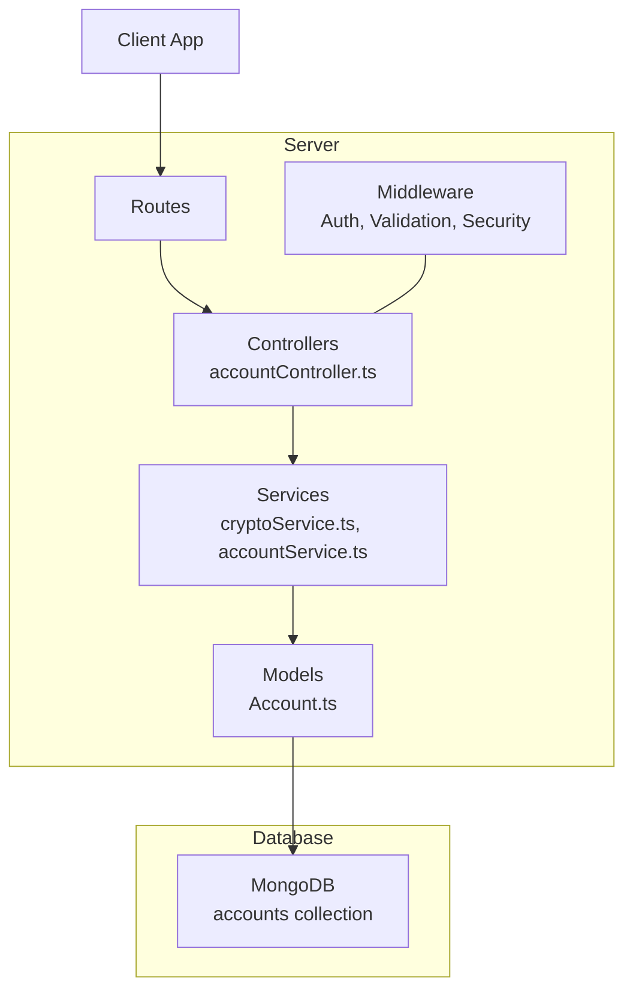
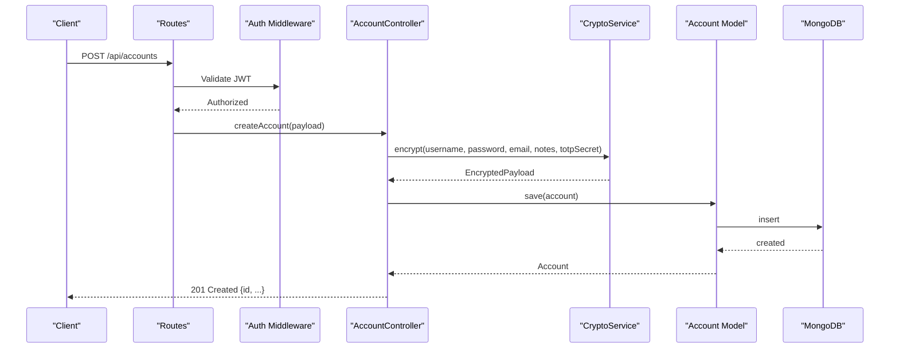
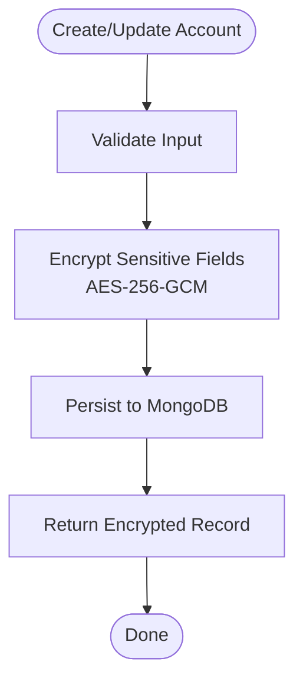
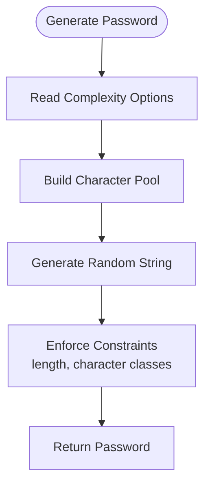
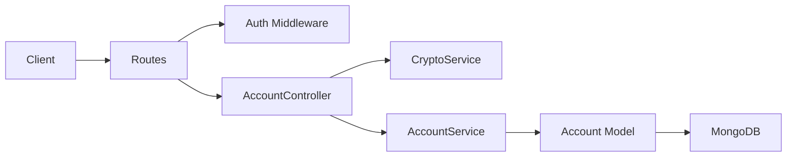

# Accounts & Passwords API

<cite>
**Referenced Files in This Document**
- [BUILD.md](file://doc/BUILD.md)
</cite>

## Table of Contents
1. [Introduction](#introduction)
2. [Project Structure](#project-structure)
3. [Core Components](#core-components)
4. [Architecture Overview](#architecture-overview)
5. [Detailed Component Analysis](#detailed-component-analysis)
6. [Dependency Analysis](#dependency-analysis)
7. [Performance Considerations](#performance-considerations)
8. [Troubleshooting Guide](#troubleshooting-guide)
9. [Conclusion](#conclusion)

## Introduction
This document provides detailed API documentation for QuickLink’s account and password management endpoints under /api/accounts/*. It covers secure credential storage using AES-256-GCM encryption, account creation with encrypted sensitive fields, password generation with customizable complexity options, secure retrieval and update operations, and TOTP secret management for two-factor authentication setup. Each endpoint specifies HTTP methods, URL patterns, encryption requirements, request/response schemas (with encrypted data handling), security headers, access controls, examples of secure workflows, and error handling guidance for encryption failures or invalid data formats.

## Project Structure
QuickLink is a full-stack application with a Node.js/Express backend and a React frontend. The accounts/password functionality resides in the server layer, including controllers, services, models, and routes. The design emphasizes secure storage of sensitive account data using AES-256-GCM and bcrypt for user passwords.

**Diagram sources**
- [BUILD.md:33-91](file://doc/BUILD.md#L33-L91)

**Section sources**
- [BUILD.md:33-91](file://doc/BUILD.md#L33-L91)

## Core Components
- Account model defines the schema for storing platform credentials with encrypted sensitive fields (username, email, password, notes, totpSecret).
- Encryption service implements AES-256-GCM for encrypting and decrypting sensitive fields, producing payloads containing IV, encrypted content, and auth tag.
- Account controller exposes CRUD endpoints plus specialized endpoints for retrieving decrypted passwords and generating strong passwords.
- Routes wire HTTP methods to controller handlers.
- Middleware enforces authentication (JWT), input validation, rate limiting, and security headers.

Key responsibilities:
- Encrypt sensitive fields before persistence and decrypt on demand.
- Generate secure passwords with configurable complexity.
- Manage TOTP secrets securely for 2FA setup.
- Enforce access control per user context.

**Section sources**
- [BUILD.md:136-156](file://doc/BUILD.md#L136-L156)
- [BUILD.md:353-378](file://doc/BUILD.md#L353-L378)
- [BUILD.md:310-320](file://doc/BUILD.md#L310-L320)

## Architecture Overview
The accounts API follows a layered architecture:
- Client sends authenticated requests to /api/accounts/* endpoints.
- Route handlers delegate to account controller methods.
- Controller validates inputs, invokes crypto service for encryption/decryption, and interacts with account service and MongoDB.
- Sensitive fields are stored encrypted; plaintext is only returned when explicitly requested via dedicated endpoints.

**Diagram sources**
- [BUILD.md:310-320](file://doc/BUILD.md#L310-L320)
- [BUILD.md:353-378](file://doc/BUILD.md#L353-L378)
- [BUILD.md:136-156](file://doc/BUILD.md#L136-L156)

## Detailed Component Analysis

### Endpoints Overview
All endpoints require authentication via JWT. Sensitive fields are encrypted at rest using AES-256-GCM. Decryption occurs only on explicit requests that return plaintext.

| Method | Path | Description | Authentication | Notes |
|---|---|---|---:|---|
| GET | /api/accounts | List accounts (no plaintext fields) | Yes | Returns encrypted fields |
| GET | /api/accounts/:id | Get single account (no plaintext fields) | Yes | Returns encrypted fields |
| POST | /api/accounts | Create account | Yes | Accepts plaintext; encrypts sensitive fields |
| PUT | /api/accounts/:id | Update account | Yes | Accepts plaintext for updated fields; encrypts sensitive fields |
| DELETE | /api/accounts/:id | Delete account | Yes | Removes account record |
| GET | /api/accounts/:id/password | Retrieve decrypted password | Yes | Decrypts and returns password |
| POST | /api/accounts/:id/generate | Generate random strong password | Yes | Returns generated password string |

**Section sources**
- [BUILD.md:310-320](file://doc/BUILD.md#L310-L320)

### Request/Response Schemas and Encryption Handling

#### Common Response Fields
- Non-password responses include encrypted values for username, email, password, notes, and totpSecret.
- Plaintext is never included in list or detail responses unless explicitly requested via dedicated endpoints.

#### Create Account (POST /api/accounts)
- Request body:
  - platform: string (required)
  - linkId: ObjectId (optional)
  - username: string (plaintext; will be encrypted)
  - email: string (optional; plaintext; will be encrypted)
  - password: string (plaintext; will be encrypted)
  - notes: string (optional; plaintext; will be encrypted)
  - totpSecret: string (optional; plaintext; will be encrypted)
  - tags: array of strings (optional)
  - category: string (optional)
- Response:
  - 201 Created with account object containing encrypted sensitive fields and metadata (createdAt, updatedAt).

#### Update Account (PUT /api/accounts/:id)
- Request body:
  - Any subset of updatable fields; if sensitive fields are provided, they will be encrypted before saving.
- Response:
  - 200 OK with updated account object containing encrypted sensitive fields.

#### Retrieve Decrypted Password (GET /api/accounts/:id/password)
- Purpose: Return plaintext password for the specified account.
- Response:
  - 200 OK with password field decrypted using AES-256-GCM.

#### Generate Strong Password (POST /api/accounts/:id/generate)
- Purpose: Generate a secure random password with customizable complexity options.
- Request body (optional):
  - length: number (default e.g., 16)
  - includeUppercase: boolean (default true)
  - includeLowercase: boolean (default true)
  - includeNumbers: boolean (default true)
  - includeSymbols: boolean (default true)
- Response:
  - 200 OK with generated password string.

Security Headers and Access Controls
- All endpoints require valid JWT in Authorization header.
- Recommended headers:
  - Content-Type: application/json
  - Authorization: Bearer <JWT>
- Rate limiting should be applied to prevent brute-force attacks.
- CORS must be configured to allow only trusted origins.

Encryption Requirements
- Sensitive fields are encrypted using AES-256-GCM with a key derived from the user’s master password via PBKDF2.
- Encrypted payloads include:
  - iv: initialization vector (hex)
  - encrypted: ciphertext (hex)
  - authTag: authentication tag (hex)

**Section sources**
- [BUILD.md:136-156](file://doc/BUILD.md#L136-L156)
- [BUILD.md:310-320](file://doc/BUILD.md#L310-L320)
- [BUILD.md:353-378](file://doc/BUILD.md#L353-L378)

### Secure Credential Storage Workflow

**Diagram sources**
- [BUILD.md:353-378](file://doc/BUILD.md#L353-L378)
- [BUILD.md:136-156](file://doc/BUILD.md#L136-L156)

### Password Generation Pattern

[No sources needed since this diagram shows conceptual workflow, not actual code structure]

### TOTP Secret Management
- TOTP secrets are treated as sensitive data and stored encrypted using AES-256-GCM.
- On creation/update, provide totpSecret as plaintext; it will be encrypted before storage.
- When retrieving account details, totpSecret remains encrypted unless explicitly decrypted by a dedicated endpoint (not listed here; follow same pattern as password retrieval if implemented).

**Section sources**
- [BUILD.md:136-156](file://doc/BUILD.md#L136-L156)

### Error Handling
Common errors and handling strategies:
- Invalid input format: Return 400 Bad Request with validation errors.
- Missing required fields: Return 400 Bad Request specifying missing fields.
- Encryption failure: Return 500 Internal Server Error with a generic message; log details securely.
- Decryption failure: Return 400 Bad Request indicating corrupted or tampered data.
- Unauthorized access: Return 401 Unauthorized for missing/invalid JWT.
- Not found: Return 404 Not Found for non-existent account IDs.

Best practices:
- Do not expose internal error details to clients.
- Log encryption/decryption errors with contextual metadata but without sensitive values.
- Use consistent error response schema across endpoints.

**Section sources**
- [BUILD.md:380-390](file://doc/BUILD.md#L380-L390)

## Dependency Analysis
The accounts API depends on:
- Authentication middleware for JWT verification.
- Validation middleware for input sanitization.
- Crypto service for AES-256-GCM encryption/decryption.
- Account service/model for database interactions.
- MongoDB for persistent storage.

**Diagram sources**
- [BUILD.md:33-91](file://doc/BUILD.md#L33-L91)
- [BUILD.md:310-320](file://doc/BUILD.md#L310-L320)
- [BUILD.md:353-378](file://doc/BUILD.md#L353-L378)

**Section sources**
- [BUILD.md:33-91](file://doc/BUILD.md#L33-L91)
- [BUILD.md:310-320](file://doc/BUILD.md#L310-L320)
- [BUILD.md:353-378](file://doc/BUILD.md#L353-L378)

## Performance Considerations
- Avoid decrypting sensitive fields in list endpoints; decrypt only when necessary.
- Cache decryption keys in memory per session to reduce repeated derivations.
- Use pagination and filtering for account lists to minimize payload size.
- Apply rate limiting to protect against brute-force attempts on password generation and decryption endpoints.
- Ensure MongoDB indexes exist for userId, platform, tags, and category to optimize queries.

[No sources needed since this section provides general guidance]

## Troubleshooting Guide
Common issues and resolutions:
- Encryption errors:
  - Verify correct key derivation and IV handling.
  - Ensure auth tag matches ciphertext and IV.
  - Check environment variables for encryption salt and JWT secret.
- Decryption failures:
  - Confirm stored payload integrity (iv, encrypted, authTag).
  - Validate that the correct user context/key was used.
- Invalid data formats:
  - Validate JSON schema and field types.
  - Sanitize inputs to prevent injection.
- Authentication issues:
  - Ensure JWT is present and valid.
  - Check token expiration and issuer configuration.

Operational checks:
- Confirm HTTPS is enforced.
- Review CORS settings.
- Audit logs for sensitive operations.

**Section sources**
- [BUILD.md:380-390](file://doc/BUILD.md#L380-L390)

## Conclusion
QuickLink’s accounts and passwords API provides secure, encrypted storage and controlled retrieval of sensitive credentials using AES-256-GCM. Endpoints support full CRUD operations, specialized password retrieval, and robust password generation with customizable complexity. Proper authentication, validation, and error handling ensure safe operation. Follow the documented schemas and workflows to implement secure client integrations and maintain data confidentiality.