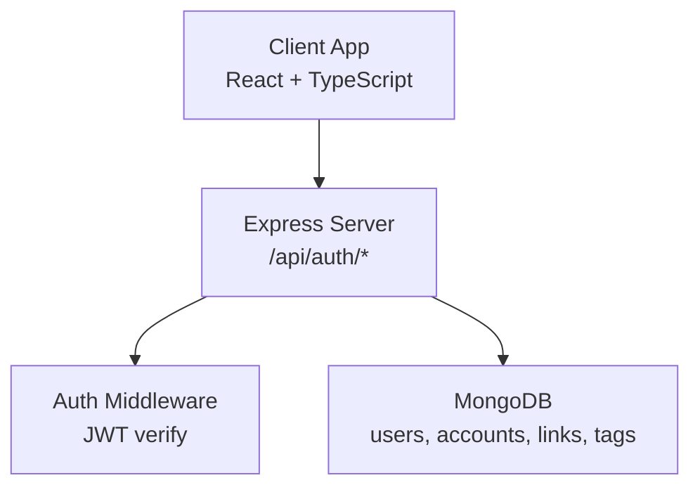
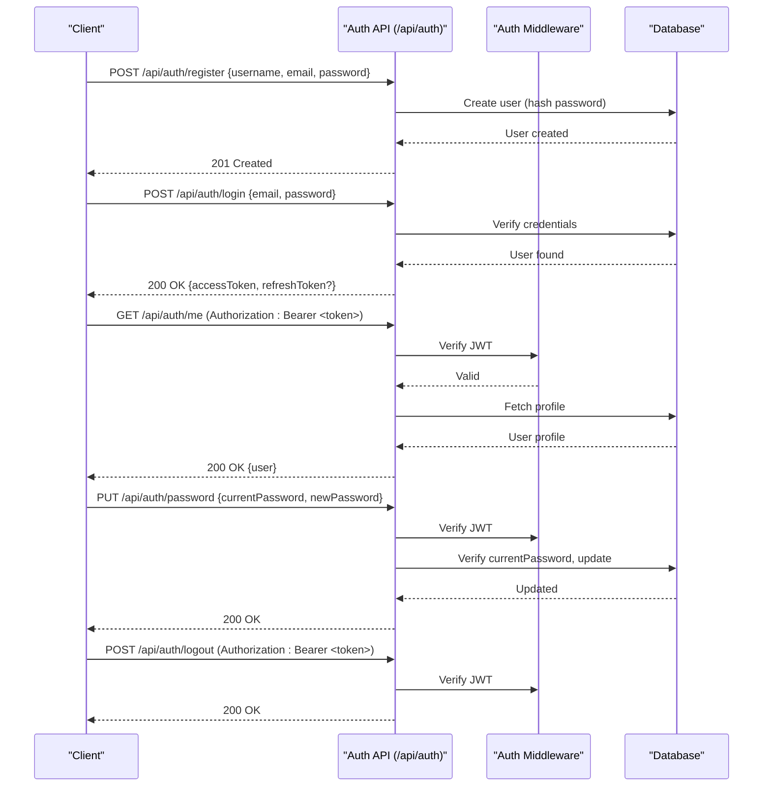
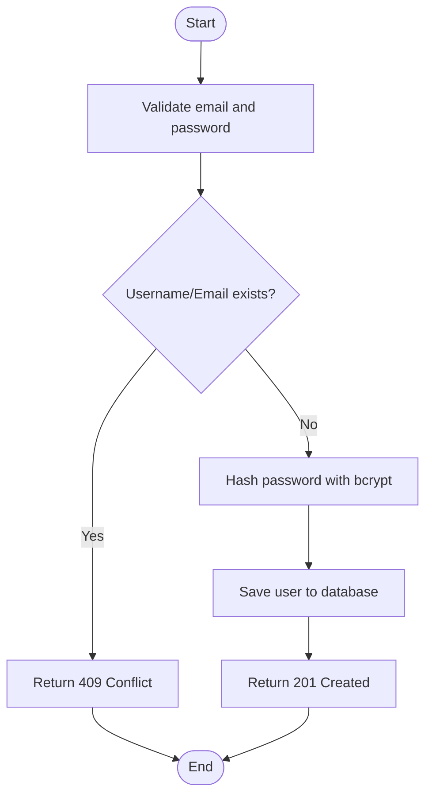
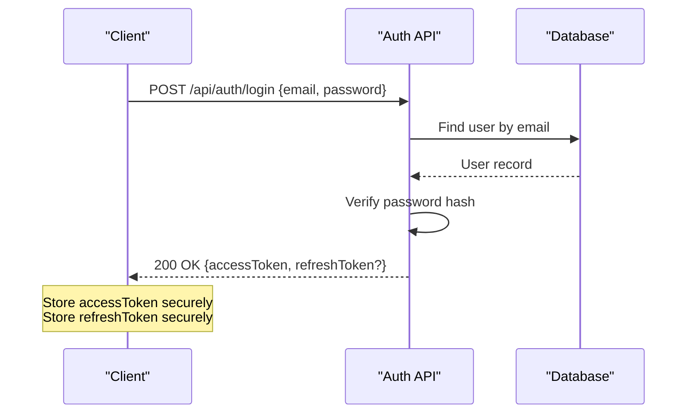
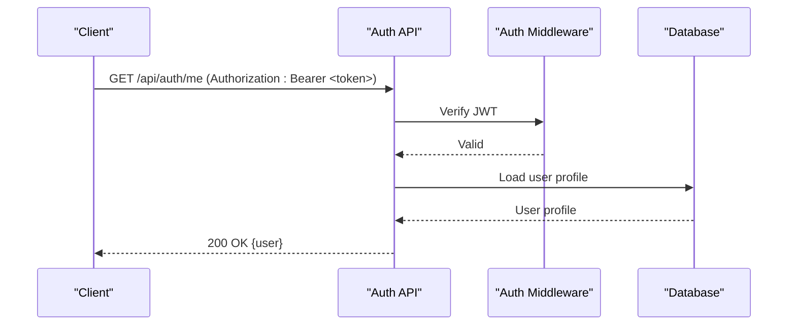
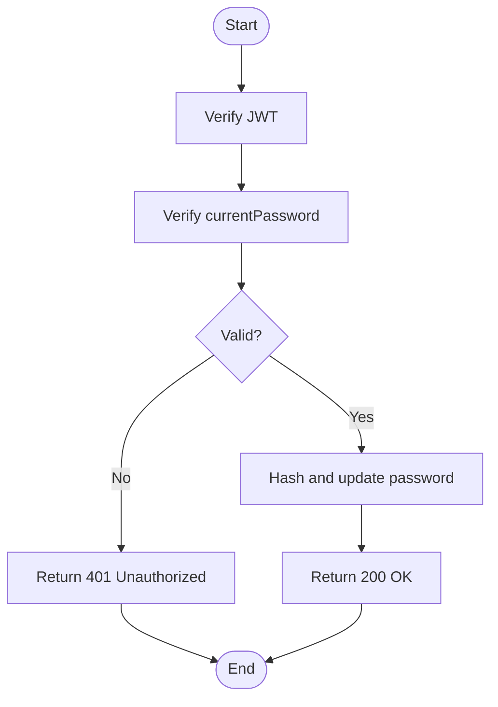
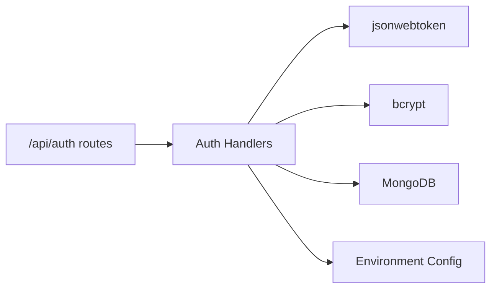

# Authentication API

<cite>
**Referenced Files in This Document**
- [BUILD.md](file://doc/BUILD.md)
</cite>

## Table of Contents
1. [Introduction](#introduction)
2. [Project Structure](#project-structure)
3. [Core Components](#core-components)
4. [Architecture Overview](#architecture-overview)
5. [Detailed Component Analysis](#detailed-component-analysis)
6. [Dependency Analysis](#dependency-analysis)
7. [Performance Considerations](#performance-considerations)
8. [Troubleshooting Guide](#troubleshooting-guide)
9. [Conclusion](#conclusion)
10. [Appendices](#appendices)

## Introduction
This document provides detailed API documentation for QuickLink’s authentication endpoints under /api/auth/*. It covers user registration with email validation and password requirements, login/logout flows including JWT token handling and session management, profile retrieval and modification, and password change functionality with current password verification. For each endpoint, it specifies HTTP methods, URL patterns, request/response schemas, middleware requirements, and client implementation guidelines for secure token storage and automatic refresh.

## Project Structure
QuickLink is a full-stack application with a Node.js/Express backend and a React frontend. The authentication endpoints are defined in the server layer and protected by JWT-based middleware. The project uses MongoDB for persistence and bcrypt/JWT for security.

**Diagram sources**
- [BUILD.md:285-330](file://doc/BUILD.md#L285-L330)

**Section sources**
- [BUILD.md:33-92](file://doc/BUILD.md#L33-L92)
- [BUILD.md:285-330](file://doc/BUILD.md#L285-L330)

## Core Components
- Authentication endpoints: register, login, logout, me (profile), password change.
- Security: bcrypt for password hashing, JWT for access tokens, optional refresh token handling via client-side storage and re-auth flow.
- Data model: users collection includes username, email, passwordHash, masterKey, timestamps.

Key responsibilities:
- Registration validates email uniqueness and enforces password policy.
- Login issues an access token; clients may store a refresh token to extend sessions.
- Protected routes require a valid JWT in the Authorization header.
- Profile retrieval returns non-sensitive user data.
- Password change verifies the current password before updating.

**Section sources**
- [BUILD.md:96-112](file://doc/BUILD.md#L96-L112)
- [BUILD.md:285-295](file://doc/BUILD.md#L285-L295)
- [BUILD.md:339-390](file://doc/BUILD.md#L339-L390)

## Architecture Overview
The authentication flow follows a standard JWT pattern:
- Register: create user, hash password, return success.
- Login: validate credentials, issue JWT access token (and optionally a refresh token).
- Protected requests: include Authorization: Bearer <access_token>.
- Logout: invalidate or expire tokens as per strategy.
- Profile: read-only user info for authenticated users.
- Password change: verify current password, update securely.

**Diagram sources**
- [BUILD.md:285-295](file://doc/BUILD.md#L285-L295)
- [BUILD.md:339-390](file://doc/BUILD.md#L339-L390)

## Detailed Component Analysis

### Endpoint: POST /api/auth/register
- Purpose: Create a new user account.
- Authentication: Not required.
- Request body schema:
  - username: string, unique, required.
  - email: string, valid email format, unique, required.
  - password: string, minimum length and complexity (see Password Policy below), required.
- Response:
  - 201 Created: { message: "User registered successfully", userId }
  - 400 Bad Request: Validation error details.
  - 409 Conflict: Username or email already exists.
- Notes:
  - Passwords are hashed using bcrypt before storage.
  - Email validation enforced on input.

**Section sources**
- [BUILD.md:285-295](file://doc/BUILD.md#L285-L295)
- [BUILD.md:96-112](file://doc/BUILD.md#L96-L112)
- [BUILD.md:380-390](file://doc/BUILD.md#L380-L390)

### Endpoint: POST /api/auth/login
- Purpose: Authenticate user and issue tokens.
- Authentication: Not required.
- Request body schema:
  - email: string, required.
  - password: string, required.
- Response:
  - 200 OK: { accessToken, refreshToken? }
    - accessToken: JWT string, included in subsequent requests via Authorization header.
    - refreshToken: Optional long-lived token for renewing access tokens (client-managed).
  - 401 Unauthorized: Invalid credentials.
  - 400 Bad Request: Missing fields or malformed input.
- Token handling:
  - Access token: short-lived, sent in Authorization: Bearer <token>.
  - Refresh token: stored securely (e.g., httpOnly cookie or secure storage), used to obtain a new access token when expired.

**Section sources**
- [BUILD.md:285-295](file://doc/BUILD.md#L285-L295)
- [BUILD.md:339-390](file://doc/BUILD.md#L339-L390)

### Endpoint: POST /api/auth/logout
- Purpose: End user session and invalidate tokens.
- Authentication: Required (JWT).
- Request headers:
  - Authorization: Bearer <accessToken>
- Response:
  - 200 OK: { message: "Logged out successfully" }
  - 401 Unauthorized: Missing or invalid token.
- Session management:
  - If server-side token blacklist is implemented, add token to blacklist.
  - If using stateless JWT, rely on expiration; optionally clear refresh token on client side.

**Section sources**
- [BUILD.md:285-295](file://doc/BUILD.md#L285-L295)
- [BUILD.md:339-390](file://doc/BUILD.md#L339-L390)

### Endpoint: GET /api/auth/me
- Purpose: Retrieve current authenticated user’s profile.
- Authentication: Required (JWT).
- Request headers:
  - Authorization: Bearer <accessToken>
- Response:
  - 200 OK: { id, username, email, createdAt, updatedAt }
  - 401 Unauthorized: Missing or invalid token.
- Notes:
  - Sensitive fields (passwordHash, masterKey) are not returned.

**Section sources**
- [BUILD.md:285-295](file://doc/BUILD.md#L285-L295)
- [BUILD.md:96-112](file://doc/BUILD.md#L96-L112)

### Endpoint: PUT /api/auth/password
- Purpose: Change the user’s password.
- Authentication: Required (JWT).
- Request body schema:
  - currentPassword: string, required.
  - newPassword: string, meets password policy, required.
- Response:
  - 200 OK: { message: "Password updated successfully" }
  - 400 Bad Request: Validation errors.
  - 401 Unauthorized: Invalid current password or missing/invalid token.
- Notes:
  - Current password verified against stored hash before update.
  - New password hashed using bcrypt.

**Section sources**
- [BUILD.md:285-295](file://doc/BUILD.md#L285-L295)
- [BUILD.md:339-390](file://doc/BUILD.md#L339-L390)

### Password Policy and Email Validation
- Password policy:
  - Minimum length and complexity (e.g., at least 8 characters, mix of uppercase, lowercase, numbers, special characters).
  - Enforced during registration and password changes.
- Email validation:
  - Must be a valid email format.
  - Must be unique across users.

**Section sources**
- [BUILD.md:380-390](file://doc/BUILD.md#L380-L390)
- [BUILD.md:96-112](file://doc/BUILD.md#L96-L112)

### Authentication Middleware Requirements
- All protected endpoints require a valid JWT in the Authorization header.
- Middleware verifies token signature and extracts user context for downstream handlers.
- On invalid/expired tokens, respond with 401 Unauthorized.

**Section sources**
- [BUILD.md:285-295](file://doc/BUILD.md#L285-L295)
- [BUILD.md:339-390](file://doc/BUILD.md#L339-L390)

### Typical Authentication Flows

#### Registration Flow

**Diagram sources**
- [BUILD.md:285-295](file://doc/BUILD.md#L285-L295)
- [BUILD.md:96-112](file://doc/BUILD.md#L96-L112)
- [BUILD.md:380-390](file://doc/BUILD.md#L380-L390)

#### Login and Token Handling Flow

**Diagram sources**
- [BUILD.md:285-295](file://doc/BUILD.md#L285-L295)
- [BUILD.md:339-390](file://doc/BUILD.md#L339-L390)

#### Profile Retrieval Flow

**Diagram sources**
- [BUILD.md:285-295](file://doc/BUILD.md#L285-L295)
- [BUILD.md:96-112](file://doc/BUILD.md#L96-L112)

#### Password Change Flow

**Diagram sources**
- [BUILD.md:285-295](file://doc/BUILD.md#L285-L295)
- [BUILD.md:339-390](file://doc/BUILD.md#L339-L390)

## Dependency Analysis
Authentication depends on:
- Express routing for /api/auth endpoints.
- JWT library for token issuance and verification.
- bcrypt for password hashing.
- MongoDB for user data persistence.
- Environment variables for secrets and configuration.

**Diagram sources**
- [BUILD.md:285-295](file://doc/BUILD.md#L285-L295)
- [BUILD.md:339-390](file://doc/BUILD.md#L339-L390)
- [BUILD.md:394-416](file://doc/BUILD.md#L394-L416)

**Section sources**
- [BUILD.md:285-295](file://doc/BUILD.md#L285-L295)
- [BUILD.md:339-390](file://doc/BUILD.md#L339-L390)
- [BUILD.md:394-416](file://doc/BUILD.md#L394-L416)

## Performance Considerations
- Use short-lived access tokens to minimize risk exposure.
- Implement rate limiting on login and register endpoints to prevent brute-force attacks.
- Cache frequent profile reads if necessary, respecting user privacy.
- Ensure efficient database queries and indexes for user lookups by email/username.

[No sources needed since this section provides general guidance]

## Troubleshooting Guide
Common issues and resolutions:
- 401 Unauthorized:
  - Missing or invalid Authorization header.
  - Expired access token; use refresh token to obtain a new one.
- 400 Bad Request:
  - Malformed JSON or missing required fields.
  - Email format invalid or already exists.
- 409 Conflict:
  - Username or email already registered.
- 403 Forbidden:
  - Insufficient permissions (if role-based access is added later).

Debugging tips:
- Log request payloads (sanitized) and responses for failed requests.
- Verify environment variables for JWT_SECRET and database connection.
- Check bcrypt salt rounds and ensure consistent hashing.

**Section sources**
- [BUILD.md:285-295](file://doc/BUILD.md#L285-L295)
- [BUILD.md:339-390](file://doc/BUILD.md#L339-L390)

## Conclusion
QuickLink’s authentication API provides a secure, standards-compliant set of endpoints for user registration, login, logout, profile retrieval, and password changes. By enforcing strong password policies, validating emails, and using JWT-based authorization, the system ensures robust security. Clients should implement secure token storage and automatic refresh mechanisms to maintain seamless user experiences.

[No sources needed since this section summarizes without analyzing specific files]

## Appendices

### Request/Response Examples

- Register
  - Request: POST /api/auth/register
    - Body: { username: string, email: string, password: string }
  - Response: 201 Created { message, userId }

- Login
  - Request: POST /api/auth/login
    - Body: { email: string, password: string }
  - Response: 200 OK { accessToken, refreshToken? }

- Get Profile
  - Request: GET /api/auth/me
    - Headers: Authorization: Bearer <accessToken>
  - Response: 200 OK { id, username, email, createdAt, updatedAt }

- Change Password
  - Request: PUT /api/auth/password
    - Headers: Authorization: Bearer <accessToken>
    - Body: { currentPassword: string, newPassword: string }
  - Response: 200 OK { message }

- Logout
  - Request: POST /api/auth/logout
    - Headers: Authorization: Bearer <accessToken>
  - Response: 200 OK { message }

**Section sources**
- [BUILD.md:285-295](file://doc/BUILD.md#L285-L295)
- [BUILD.md:96-112](file://doc/BUILD.md#L96-L112)
- [BUILD.md:339-390](file://doc/BUILD.md#L339-L390)

### Client Implementation Guidelines
- Secure token storage:
  - Store accessToken in memory or secure storage (e.g., httpOnly cookies for web apps).
  - Store refreshToken in secure storage (httpOnly cookie recommended for browsers).
- Automatic refresh:
  - On receiving 401 Unauthorized, attempt to refresh using refreshToken.
  - If refresh fails, redirect to login.
- Error handling:
  - Display user-friendly messages for validation errors and authentication failures.
  - Retry logic for transient network errors.

**Section sources**
- [BUILD.md:339-390](file://doc/BUILD.md#L339-L390)