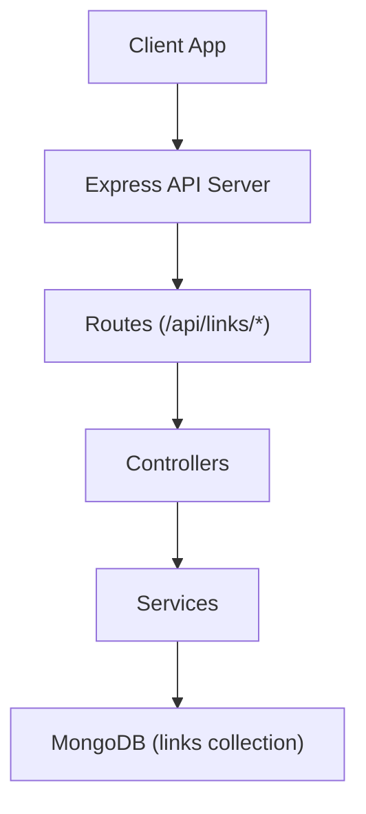
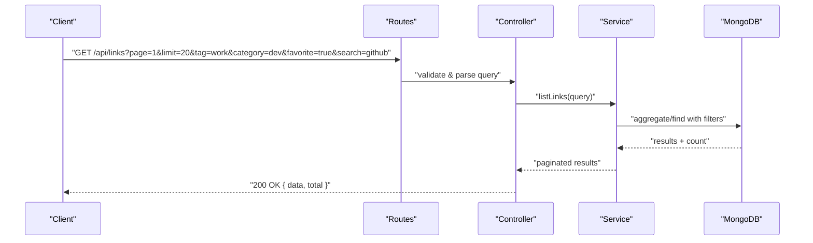
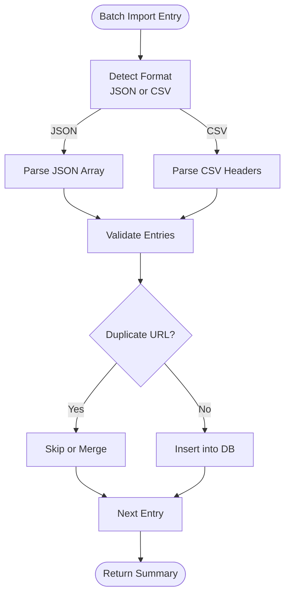
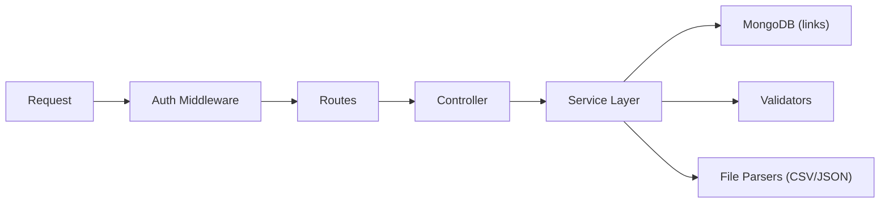

# Links Management API

<cite>
**Referenced Files in This Document**
- [BUILD.md](file://doc/BUILD.md)
</cite>

## Table of Contents
1. [Introduction](#introduction)
2. [Project Structure](#project-structure)
3. [Core Components](#core-components)
4. [Architecture Overview](#architecture-overview)
5. [Detailed Component Analysis](#detailed-component-analysis)
6. [Dependency Analysis](#dependency-analysis)
7. [Performance Considerations](#performance-considerations)
8. [Troubleshooting Guide](#troubleshooting-guide)
9. [Conclusion](#conclusion)
10. [Appendices](#appendices)

## Introduction
This document provides comprehensive API documentation for QuickLink’s link management endpoints under /api/links/*. It covers CRUD operations for individual links, batch import, export (JSON and CSV), full-text search with filtering by tags, categories, favorites, date ranges, and text content, as well as pagination support. Each endpoint includes HTTP methods, URL patterns, request/response schemas, query syntax, file upload formats, and response structures. Examples of complex queries, batch operations, and error handling are provided to help you integrate effectively.

## Project Structure
QuickLink is a monorepo-style project with separate client and server components. The backend is built with Node.js + Express + TypeScript and uses MongoDB for storage. The link management APIs are defined in the server routes and implemented via controllers and services. The database schema for links includes fields such as title, URL, description, tags, category, favorite status, and timestamps.

**Diagram sources**
- [BUILD.md:33-91](file://doc/BUILD.md#L33-L91)
- [BUILD.md:96-197](file://doc/BUILD.md#L96-L197)

**Section sources**
- [BUILD.md:33-91](file://doc/BUILD.md#L33-L91)
- [BUILD.md:96-197](file://doc/BUILD.md#L96-L197)

## Core Components
The link management subsystem exposes the following capabilities:
- Create, read, update, delete links
- Batch import multiple links
- Export links to JSON or CSV
- Full-text search with filters (tags, categories, favorites, date ranges, text)
- Pagination with page size and offset

These features are backed by a MongoDB links collection with indexes for efficient querying and sorting.

**Section sources**
- [BUILD.md:114-134](file://doc/BUILD.md#L114-L134)
- [BUILD.md:180-197](file://doc/BUILD.md#L180-L197)
- [BUILD.md:297-337](file://doc/BUILD.md#L297-L337)

## Architecture Overview
The link APIs follow a standard RESTful design:
- Resource: /api/links
- Actions: list, get, create, update, delete, batch import, export, search
- Authentication: JWT-based; all link endpoints require authentication
- Data model: links collection with fields for metadata, categorization, and tracking

**Diagram sources**
- [BUILD.md:297-337](file://doc/BUILD.md#L297-L337)
- [BUILD.md:180-197](file://doc/BUILD.md#L180-L197)

## Detailed Component Analysis

### Endpoints Overview
All link endpoints require authentication.

| Method | Path | Description | Auth |
| --- | --- | --- | --- |
| GET | /api/links | List links with pagination and filters | Yes |
| GET | /api/links/:id | Get a single link by ID | Yes |
| POST | /api/links | Create a new link | Yes |
| PUT | /api/links/:id | Update an existing link | Yes |
| DELETE | /api/links/:id | Delete a link | Yes |
| POST | /api/links/batch | Batch import links | Yes |
| GET | /api/links/export | Export links (JSON/CSV) | Yes |
| GET | /api/links/search?q= | Full-text search with filters | Yes |

**Section sources**
- [BUILD.md:297-337](file://doc/BUILD.md#L297-L337)

### Data Model: Link
A link record contains:
- userId (reference)
- url (required)
- title (required)
- description (optional)
- icon (optional favicon URL)
- screenshot (optional path)
- tags (array of strings)
- category (string, optional)
- isFavorite (boolean, default false)
- isArchived (boolean, default false)
- clickCount (number, default 0)
- lastVisitedAt (date, optional)
- createdAt (date)
- updatedAt (date)

Indexes include:
- userId + createdAt
- userId + tags
- userId + category
- userId + isFavorite
- text index on title and description

**Section sources**
- [BUILD.md:114-134](file://doc/BUILD.md#L114-L134)
- [BUILD.md:180-197](file://doc/BUILD.md#L180-L197)

### GET /api/links — List Links (Pagination + Filters)
- Purpose: Retrieve paginated list of links with optional filters.
- Query Parameters:
  - page: integer (default 1)
  - limit: integer (default 20)
  - sort: string (e.g., -createdAt, +title)
  - tag: string (filter by tag)
  - category: string (filter by category)
  - favorite: boolean (true/false)
  - search: string (full-text search across title/description)
  - from: ISO date (optional, filter by createdAt >= from)
  - to: ISO date (optional, filter by createdAt <= to)
- Response:
  - 200 OK: { data: Link[], total: number }
- Notes:
  - Uses MongoDB text index for search.
  - Supports combined filters and sorting.

Example:
- GET /api/links?page=1&limit=20&sort=-createdAt&tag=work&category=dev&favorite=true&search=github

**Section sources**
- [BUILD.md:297-337](file://doc/BUILD.md#L297-L337)
- [BUILD.md:180-197](file://doc/BUILD.md#L180-L197)

### GET /api/links/:id — Get Single Link
- Purpose: Retrieve a specific link by its ObjectId.
- Path Parameter:
  - id: string (ObjectId)
- Response:
  - 200 OK: Link object
  - 404 Not Found: if not found

**Section sources**
- [BUILD.md:297-337](file://doc/BUILD.md#L297-L337)

### POST /api/links — Create Link
- Purpose: Create a new link entry.
- Request Body:
  - title: string (required)
  - url: string (required, valid URL format)
  - description: string (optional)
  - icon: string (optional)
  - screenshot: string (optional)
  - tags: string[] (optional)
  - category: string (optional)
  - isFavorite: boolean (optional, default false)
  - isArchived: boolean (optional, default false)
- Response:
  - 201 Created: Link object
  - 400 Bad Request: validation errors (e.g., invalid URL)
  - 409 Conflict: duplicate URL for the same user (if enforced)

Notes:
- Validate URL format before insertion.
- Enforce uniqueness per userId if required.

**Section sources**
- [BUILD.md:114-134](file://doc/BUILD.md#L114-L134)
- [BUILD.md:297-337](file://doc/BUILD.md#L297-L337)

### PUT /api/links/:id — Update Link
- Purpose: Update an existing link.
- Path Parameter:
  - id: string (ObjectId)
- Request Body: Partial fields allowed (same as create).
- Response:
  - 200 OK: Updated Link object
  - 404 Not Found: if not found
  - 400 Bad Request: validation errors

**Section sources**
- [BUILD.md:297-337](file://doc/BUILD.md#L297-L337)

### DELETE /api/links/:id — Delete Link
- Purpose: Remove a link by ID.
- Path Parameter:
  - id: string (ObjectId)
- Response:
  - 204 No Content: success
  - 404 Not Found: if not found

**Section sources**
- [BUILD.md:297-337](file://doc/BUILD.md#L297-L337)

### POST /api/links/batch — Batch Import Links
- Purpose: Bulk add links from various formats.
- Supported Formats:
  - JSON array of link objects
  - CSV with headers: url, title, description, tags, category, isFavorite
- Request:
  - multipart/form-data with field: file (upload .json or .csv)
  - Alternatively, JSON body with key: items (array of link objects)
- Validation:
  - Validate each entry (URL format, required fields)
  - Handle duplicates per user (skip or merge based on policy)
- Response:
  - 200 OK: { imported: number, skipped: number, errors: [{ index, message }] }
  - 400 Bad Request: malformed input or unsupported format

Example flow:

**Section sources**
- [BUILD.md:297-337](file://doc/BUILD.md#L297-L337)

### GET /api/links/export — Export Links
- Purpose: Export links for portability.
- Query Parameters:
  - format: json | csv
  - Optional filters: same as list (page, limit, tag, category, favorite, search, from, to)
- Response:
  - application/json or text/csv stream
  - For JSON: array of link objects
  - For CSV: header row followed by rows

Notes:
- Respect pagination when exporting large datasets.
- Ensure sensitive fields are excluded.

**Section sources**
- [BUILD.md:297-337](file://doc/BUILD.md#L297-L337)

### GET /api/links/search — Full-Text Search
- Purpose: Search links using full-text index on title and description.
- Query Parameters:
  - q: string (search term)
  - tag: string (optional)
  - category: string (optional)
  - favorite: boolean (optional)
  - from: ISO date (optional)
  - to: ISO date (optional)
  - page: integer (optional)
  - limit: integer (optional)
  - sort: string (optional)
- Response:
  - 200 OK: { data: Link[], total: number }

Complex query examples:
- Search for “github” within work category and tagged “dev”, favorited only:
  - /api/links/search?q=github&category=work&tag=dev&favorite=true&page=1&limit=20
- Date range filter with text search:
  - /api/links/search?q=api&from=2025-01-01T00:00:00Z&to=2025-12-31T23:59:59Z

**Section sources**
- [BUILD.md:297-337](file://doc/BUILD.md#L297-L337)
- [BUILD.md:180-197](file://doc/BUILD.md#L180-L197)

## Dependency Analysis
The link endpoints depend on:
- Authentication middleware (JWT)
- Input validation (express-validator)
- MongoDB driver and indexes for performance
- File parsing utilities for batch import/export

**Diagram sources**
- [BUILD.md:285-337](file://doc/BUILD.md#L285-L337)
- [BUILD.md:542-568](file://doc/BUILD.md#L542-L568)

**Section sources**
- [BUILD.md:285-337](file://doc/BUILD.md#L285-L337)
- [BUILD.md:542-568](file://doc/BUILD.md#L542-L568)

## Performance Considerations
- Use indexes on frequently filtered fields (userId, tags, category, isFavorite, createdAt).
- Apply pagination to avoid large result sets.
- Limit export scope with filters to reduce payload size.
- Prefer server-side sorting over client-side sorting for large lists.
- Cache frequent queries if appropriate (not shown here).

[No sources needed since this section provides general guidance]

## Troubleshooting Guide
Common issues and resolutions:
- Invalid URL: Ensure URL format is correct; return 400 with details.
- Duplicate entries: If enforcing unique URLs per user, return 409 Conflict with guidance to update existing link.
- Missing required fields: Return 400 with field-level errors.
- Unauthorized access: Ensure JWT is present and valid; return 401.
- Large exports: Use pagination and filters to manage payload size.

Error response structure example:
- 400: { error: "Validation failed", details: [...] }
- 401: { error: "Unauthorized" }
- 404: { error: "Not found" }
- 409: { error: "Conflict", message: "Duplicate URL" }

**Section sources**
- [BUILD.md:297-337](file://doc/BUILD.md#L297-L337)

## Conclusion
QuickLink’s link management API provides a robust set of endpoints for creating, updating, deleting, searching, importing, and exporting links. With strong indexing and pagination, it supports efficient querying and scalable operations. Follow the documented schemas and query parameters to integrate seamlessly.

[No sources needed since this section summarizes without analyzing specific files]

## Appendices

### Appendix A: Request/Response Schemas

- Link Object:
  - _id: string (ObjectId)
  - userId: string (ObjectId reference)
  - url: string
  - title: string
  - description: string
  - icon: string
  - screenshot: string
  - tags: string[]
  - category: string
  - isFavorite: boolean
  - isArchived: boolean
  - clickCount: number
  - lastVisitedAt: date
  - createdAt: date
  - updatedAt: date

- List Response:
  - data: Link[]
  - total: number

- Batch Import Response:
  - imported: number
  - skipped: number
  - errors: [{ index: number, message: string }]

**Section sources**
- [BUILD.md:114-134](file://doc/BUILD.md#L114-L134)
- [BUILD.md:297-337](file://doc/BUILD.md#L297-L337)

### Appendix B: Example Complex Queries

- Filter by tags and category, favorited only, sorted by creation date:
  - GET /api/links?tag=work&category=dev&favorite=true&sort=-createdAt&page=1&limit=20

- Full-text search with date range:
  - GET /api/links/search?q=api&from=2025-01-01T00:00:00Z&to=2025-12-31T23:59:59Z

- Export CSV with filters:
  - GET /api/links/export?format=csv&category=work&favorite=true

**Section sources**
- [BUILD.md:297-337](file://doc/BUILD.md#L297-L337)