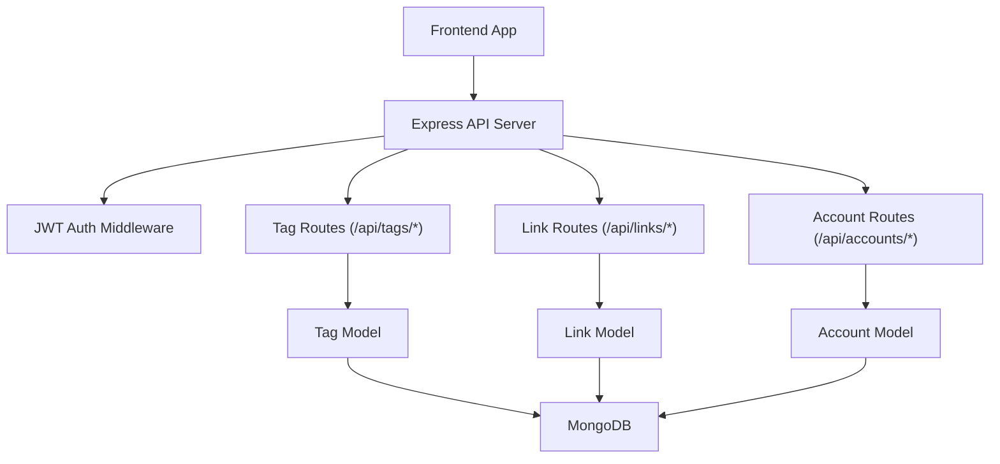
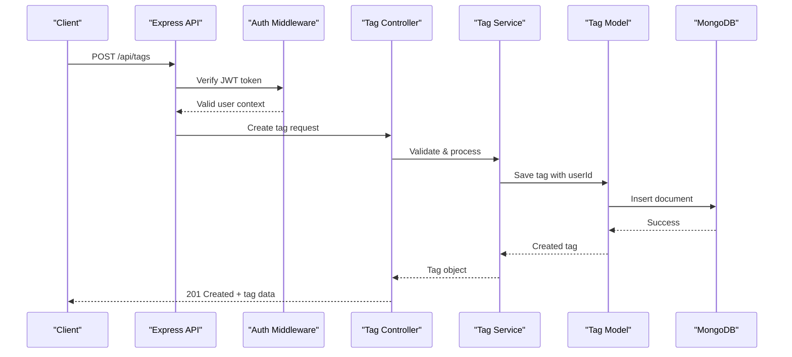
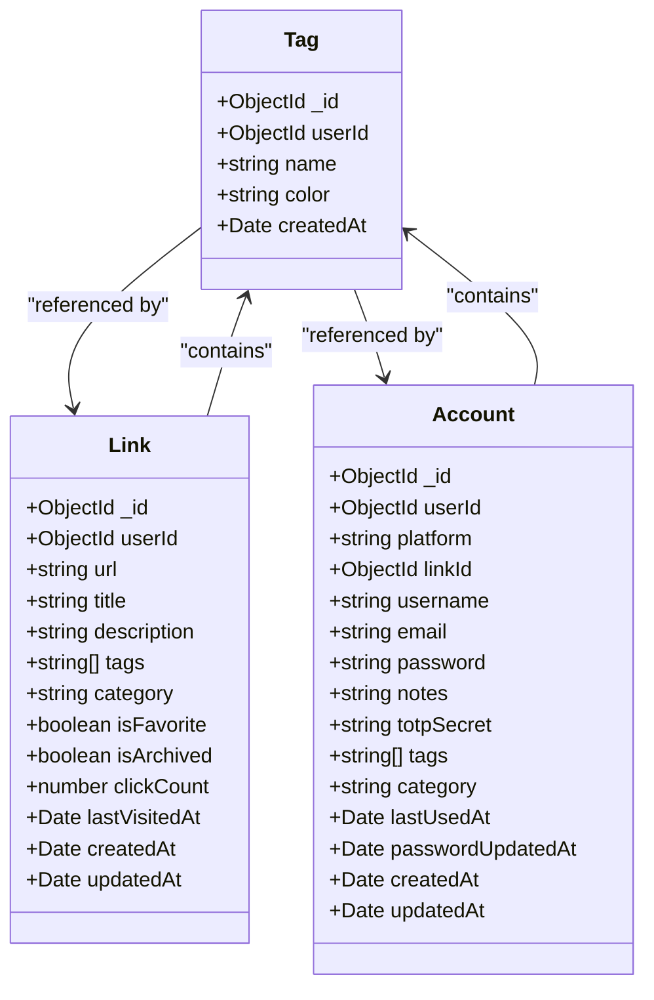

# Tags Management API

<cite>
**Referenced Files in This Document**
- [BUILD.md](file://doc/BUILD.md)
</cite>

## Table of Contents
1. [Introduction](#introduction)
2. [Project Structure](#project-structure)
3. [Core Components](#core-components)
4. [Architecture Overview](#architecture-overview)
5. [Detailed Component Analysis](#detailed-component-analysis)
6. [Dependency Analysis](#dependency-analysis)
7. [Performance Considerations](#performance-considerations)
8. [Troubleshooting Guide](#troubleshooting-guide)
9. [Conclusion](#conclusion)
10. [Appendices](#appendices)

## Introduction
This document provides comprehensive API documentation for QuickLink's tag management endpoints under /api/tags/*. It covers creating, retrieving, updating, and deleting tags; assigning and removing tags from links and accounts; search and filtering capabilities; naming conventions and validation rules; and integration patterns with link management workflows. The content is derived from the project's design and API specification.

## Project Structure
QuickLink is a full-stack application with:
- Frontend: React + TypeScript + Vite
- Backend: Node.js + Express + TypeScript
- Database: MongoDB 7 with schema migrations via migrate-mongo
- Authentication: JWT-based
- Security: AES-256-GCM encryption for sensitive fields and bcrypt for password hashing

The tag management functionality is part of the backend server and integrates with links and accounts through shared tagging concepts.



**Diagram sources**
- [BUILD.md:33-92](file://doc/BUILD.md#L33-L92)
- [BUILD.md:285-337](file://doc/BUILD.md#L285-L337)

**Section sources**
- [BUILD.md:33-92](file://doc/BUILD.md#L33-L92)
- [BUILD.md:285-337](file://doc/BUILD.md#L285-L337)

## Core Components
The tag system consists of:
- Tag model with user-scoped ownership
- Tag CRUD operations via RESTful endpoints
- Integration with links and accounts through tag arrays
- Indexing for efficient querying by user and tag name

Key entities:
- Tags collection stores user-specific tags with optional color metadata
- Links and Accounts collections include tag arrays for categorization
- Unique constraints ensure tag names are unique per user

**Section sources**
- [BUILD.md:158-168](file://doc/BUILD.md#L158-L168)
- [BUILD.md:114-134](file://doc/BUILD.md#L114-L134)
- [BUILD.md:136-156](file://doc/BUILD.md#L136-L156)
- [BUILD.md:180-197](file://doc/BUILD.md#L180-L197)

## Architecture Overview
The tag management API follows a standard RESTful pattern with authentication middleware protecting all endpoints. The architecture supports:
- User-scoped tag isolation
- Flexible tag assignment to multiple entities
- Efficient indexing for common query patterns
- Consistent error handling and validation



**Diagram sources**
- [BUILD.md:322-330](file://doc/BUILD.md#L322-L330)
- [BUILD.md:285-296](file://doc/BUILD.md#L285-L296)

## Detailed Component Analysis

### Tag Endpoints

#### GET /api/tags - Retrieve All Tags
Retrieves all tags belonging to the authenticated user.

- **Authentication**: Required (JWT)
- **Response Schema**: Array of tag objects
- **Query Parameters**: None
- **Success Response**: 200 OK with tag array
- **Error Responses**: 401 Unauthorized, 500 Internal Server Error

**Section sources**
- [BUILD.md:322-330](file://doc/BUILD.md#L322-L330)

#### POST /api/tags - Create Tag
Creates a new tag for the authenticated user.

- **Authentication**: Required (JWT)
- **Request Body Schema**:
  - name: string (required)
  - color: string (optional, hex color code)
- **Validation Rules**:
  - Tag name must be unique per user
  - Name should follow consistent naming conventions
- **Success Response**: 201 Created with created tag
- **Error Responses**: 400 Bad Request (validation), 409 Conflict (duplicate), 401 Unauthorized

**Section sources**
- [BUILD.md:158-168](file://doc/BUILD.md#L158-L168)
- [BUILD.md:322-330](file://doc/BUILD.md#L322-L330)
- [BUILD.md:180-197](file://doc/BUILD.md#L180-L197)

#### PUT /api/tags/:id - Update Tag
Updates an existing tag owned by the authenticated user.

- **Authentication**: Required (JWT)
- **URL Parameters**: id (tag ObjectId)
- **Request Body Schema**: Partial update of tag properties
- **Authorization**: User must own the tag
- **Success Response**: 200 OK with updated tag
- **Error Responses**: 404 Not Found, 403 Forbidden, 401 Unauthorized

**Section sources**
- [BUILD.md:322-330](file://doc/BUILD.md#L322-L330)

#### DELETE /api/tags/:id - Delete Tag
Deletes a tag owned by the authenticated user.

- **Authentication**: Required (JWT)
- **URL Parameters**: id (tag ObjectId)
- **Authorization**: User must own the tag
- **Success Response**: 204 No Content
- **Error Responses**: 404 Not Found, 403 Forbidden, 401 Unauthorized

**Section sources**
- [BUILD.md:322-330](file://doc/BUILD.md#L322-L330)

### Tag Assignment and Removal

Tags are assigned to links and accounts through their respective APIs. While specific tag assignment endpoints are not explicitly defined in the current specification, the data model shows that both links and accounts support tag arrays.

#### Link Tag Assignment
Links contain a tags array field that stores tag references or tag names.

- **Update Operation**: Modify link's tags array via PUT /api/links/:id
- **Batch Operations**: Use POST /api/links/batch for bulk updates
- **Search Integration**: Filter links by tags using query parameters

**Section sources**
- [BUILD.md:114-134](file://doc/BUILD.md#L114-L134)
- [BUILD.md:297-309](file://doc/BUILD.md#L297-L309)

#### Account Tag Assignment
Accounts also support tag arrays for categorization.

- **Update Operation**: Modify account's tags array via PUT /api/accounts/:id
- **Search Integration**: Filter accounts by tags using query parameters

**Section sources**
- [BUILD.md:136-156](file://doc/BUILD.md#L136-L156)

### Tag Search and Filtering

While dedicated tag search endpoints are not explicitly defined, the system supports filtering content by tags through the general query parameters used across the API.

#### Query Pattern
Use the common query parameter pattern to filter content by tags:

```
GET /api/links?tag=work&category=dev&search=github
```

#### Available Filters
- tag: Filter by specific tag name(s)
- category: Filter by category
- search: Full-text search across content
- favorite: Boolean filter for favorites
- Pagination: page, limit, sort parameters

**Section sources**
- [BUILD.md:331-337](file://doc/BUILD.md#L331-L337)

### Tag Naming Conventions and Validation

Based on the database schema and indexing strategy:

#### Naming Rules
- Tag names must be unique per user
- Names should be descriptive and consistent
- Consider using lowercase with underscores for consistency
- Avoid special characters that might cause issues

#### Validation Strategy
- Server-side validation for uniqueness per user
- Client-side validation for format and length
- Database-level unique index enforcement

**Section sources**
- [BUILD.md:158-168](file://doc/BUILD.md#L158-L168)
- [BUILD.md:180-197](file://doc/BUILD.md#L180-L197)

### Tag Hierarchy Support

The current implementation does not explicitly support hierarchical tags (parent-child relationships). Tags are flat collections associated with users. However, the system supports:

- Multiple tags per entity
- Tag-based categorization
- Category field for broader classification

For hierarchical organization, consider implementing:
- Tag naming conventions (e.g., "work/projects/frontend")
- Separate category field for top-level grouping
- Custom business logic for hierarchy traversal

**Section sources**
- [BUILD.md:114-134](file://doc/BUILD.md#L114-L134)
- [BUILD.md:136-156](file://doc/BUILD.md#L136-L156)
- [BUILD.md:158-168](file://doc/BUILD.md#L158-L168)

## Dependency Analysis

The tag system has the following dependencies and relationships:



**Diagram sources**
- [BUILD.md:114-134](file://doc/BUILD.md#L114-L134)
- [BUILD.md:136-156](file://doc/BUILD.md#L136-L156)
- [BUILD.md:158-168](file://doc/BUILD.md#L158-L168)

### Key Dependencies
- **User Context**: All tags are scoped to authenticated users
- **Database Indexes**: Optimized queries for user-tag combinations
- **Authentication**: JWT middleware protects all tag operations
- **Data Integrity**: Unique constraints prevent duplicate tags per user

**Section sources**
- [BUILD.md:180-197](file://doc/BUILD.md#L180-L197)
- [BUILD.md:285-296](file://doc/BUILD.md#L285-L296)

## Performance Considerations

### Database Optimization
- **Indexes**: Strategic indexing on userId and tags fields for fast lookups
- **Query Patterns**: Optimized for common filtering scenarios
- **Scalability**: MongoDB's document model handles tag arrays efficiently

### Best Practices
- **Batch Operations**: Use batch endpoints for bulk tag assignments
- **Pagination**: Implement pagination for large tag lists
- **Caching**: Consider client-side caching for frequently accessed tags
- **Lazy Loading**: Load tag details only when needed

### Monitoring
- Track query performance for tag-related operations
- Monitor database indexes effectiveness
- Log slow queries for optimization opportunities

**Section sources**
- [BUILD.md:180-197](file://doc/BUILD.md#L180-L197)
- [BUILD.md:297-309](file://doc/BUILD.md#L297-L309)

## Troubleshooting Guide

### Common Issues

#### Duplicate Tag Errors
- **Cause**: Attempting to create a tag with an existing name for the same user
- **Solution**: Check for existing tags before creation or handle conflict responses
- **Prevention**: Implement client-side validation and real-time availability checks

#### Permission Denied
- **Cause**: Attempting to modify another user's tags
- **Solution**: Ensure proper authentication and authorization checks
- **Prevention**: Validate user ownership before operations

#### Performance Issues
- **Cause**: Large tag collections without proper indexing
- **Solution**: Review database indexes and query patterns
- **Prevention**: Implement pagination and lazy loading

### Debugging Tips
- Enable detailed logging for tag operations
- Monitor database query performance
- Use MongoDB profiler for slow queries
- Implement health checks for tag service endpoints

**Section sources**
- [BUILD.md:180-197](file://doc/BUILD.md#L180-L197)
- [BUILD.md:339-391](file://doc/BUILD.md#L339-L391)

## Conclusion

QuickLink's tag management system provides a robust foundation for organizing links and accounts through flexible tagging. The API offers standard CRUD operations with user-scoped isolation, efficient database indexing, and integration points for tag assignment to various entities.

Key strengths include:
- Simple, RESTful API design
- User-scoped tag isolation
- Efficient database indexing
- Integration with existing link and account systems

Future enhancements could include:
- Hierarchical tag support
- Advanced tag analytics
- Bulk tag operations
- Tag import/export capabilities
- Enhanced search and filtering options

The current implementation provides a solid base that can be extended based on evolving requirements while maintaining backward compatibility and performance.

## Appendices

### Example Tag Organization Strategies

#### Flat Structure
```
work, personal, projects, reading, tools
```

#### Categorized Approach
```
work/frontend, work/backend, personal/finance, personal/health
```

#### Functional Grouping
```
development-tools, productivity, learning, reference
```

### Integration Patterns

#### Link Creation with Tags
1. Create tag if it doesn't exist
2. Create link with tag references
3. Update tag usage statistics

#### Batch Tag Operations
1. Fetch all items to update
2. Apply tag changes in transaction
3. Update tag counts atomically

#### Tag-Based Search
1. Parse search criteria
2. Build MongoDB query with tag filters
3. Return paginated results with tag metadata

**Section sources**
- [BUILD.md:297-337](file://doc/BUILD.md#L297-L337)
- [BUILD.md:114-168](file://doc/BUILD.md#L114-L168)