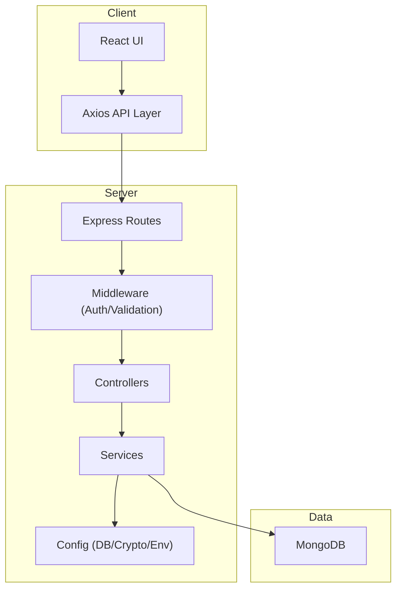
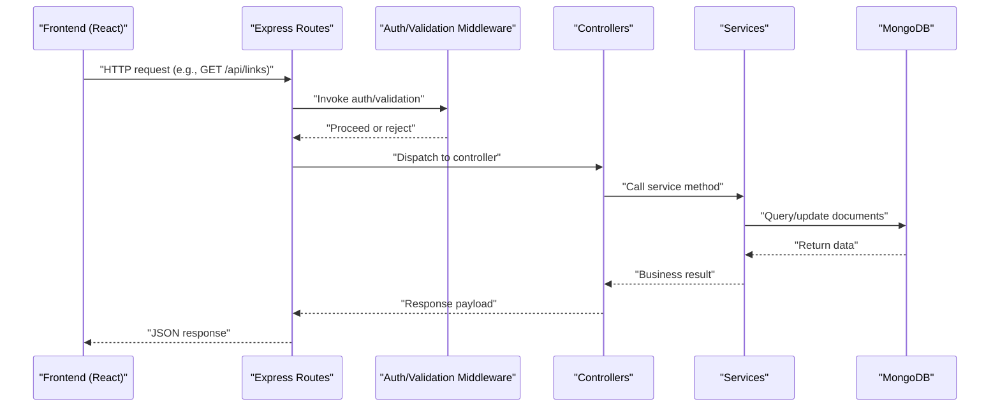
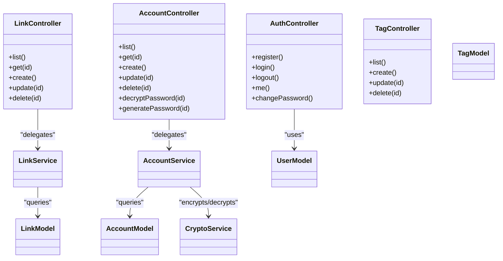
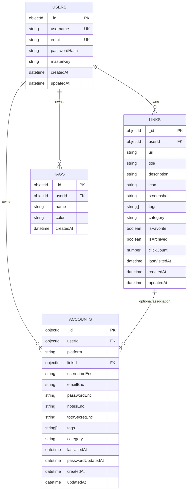
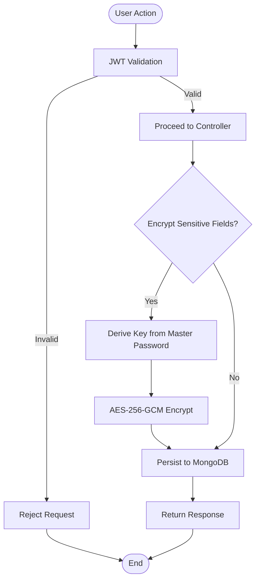
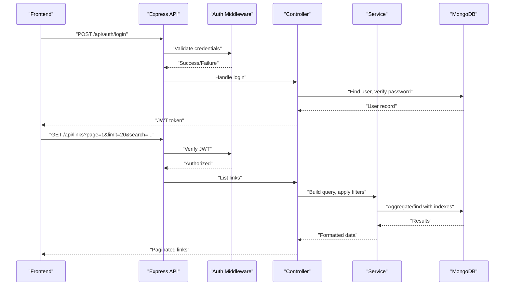
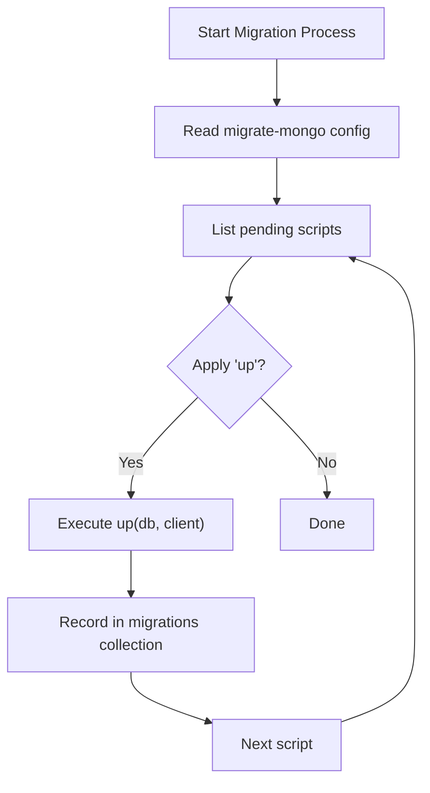
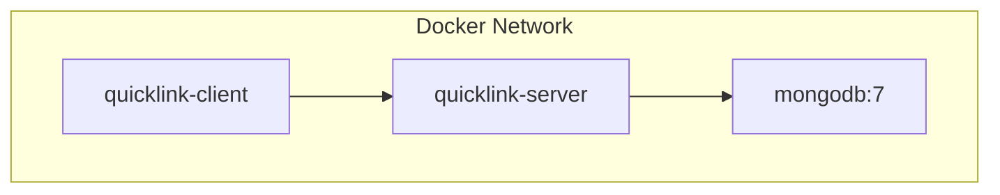
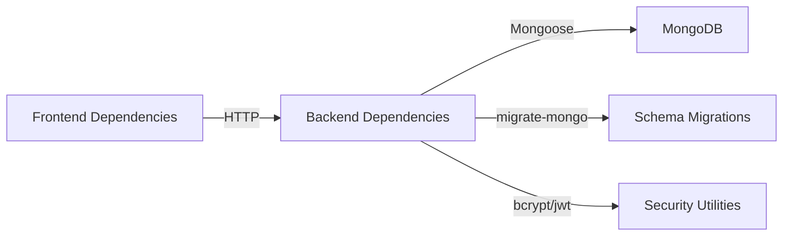

# Architecture Documentation

<cite>
**Referenced Files in This Document**
- [BUILD.md](file://doc/BUILD.md)
</cite>

## Table of Contents
1. Introduction
2. Project Structure
3. Core Components
4. Architecture Overview
5. Detailed Component Analysis
6. Dependency Analysis
7. Performance Considerations
8. Troubleshooting Guide
9. Conclusion

## Introduction
QuickLink is a full-stack monorepo that provides a personal knowledge management tool for bookmarking links and securely storing account credentials. The system separates the frontend (React + TypeScript + Vite) from the backend (Node.js + Express + TypeScript), with MongoDB as the data store. It implements an MVC-style backend, robust security using JWT, bcrypt, and AES-256-GCM encryption, and supports schema migrations via migrate-mongo. Deployment is containerized with Docker Compose to run client, server, and database together.

## Project Structure
The repository follows a monorepo layout with distinct client and server directories, shared configuration files, and Docker artifacts at the root level. The documentation describes:
- Client: React 18, TypeScript, Vite, Ant Design 5, Zustand for state management, Axios for HTTP calls.
- Server: Express, TypeScript, Mongoose, migrate-mongo, JWT, bcrypt, express-validator, rate limiting, CORS, Helmet.
- Database: MongoDB 7 with collections for users, links, accounts, tags, and migration tracking.
- DevOps: Docker Compose orchestrates MongoDB, server, and client containers; environment variables are managed via .env.

**Diagram sources**
- [BUILD.md:33-92](file://doc/BUILD.md#L33-L92)
- [BUILD.md:285-337](file://doc/BUILD.md#L285-L337)

**Section sources**
- [BUILD.md:33-92](file://doc/BUILD.md#L33-L92)

## Core Components
- Frontend (client): Pages for Dashboard, Links, Accounts, Settings, Auth; services encapsulate API calls; stores manage global state; hooks and utils support reusable logic.
- Backend (server): Controllers handle HTTP requests; services implement business logic; models define Mongoose schemas; routes map endpoints; middleware enforces authentication and validation; config centralizes DB, crypto, and env settings.
- Database: Collections include users, links, accounts, tags, and migrations; indexes optimize queries and searches.
- Security: JWT-based session management; bcrypt for password hashing; AES-256-GCM for encrypting sensitive fields derived from a master key.

**Section sources**
- [BUILD.md:17-30](file://doc/BUILD.md#L17-L30)
- [BUILD.md:33-92](file://doc/BUILD.md#L33-L92)
- [BUILD.md:96-198](file://doc/BUILD.md#L96-L198)
- [BUILD.md:339-391](file://doc/BUILD.md#L339-L391)

## Architecture Overview
The system uses a layered architecture:
- Presentation layer (React SPA) renders views and collects user input.
- API layer (Express routes) validates inputs and delegates to controllers.
- Business layer (services) performs domain operations, including encryption/decryption and data transformations.
- Data access layer (Mongoose models) interacts with MongoDB.
- Middleware handles cross-cutting concerns like authentication, rate limiting, and error handling.

**Diagram sources**
- [BUILD.md:285-337](file://doc/BUILD.md#L285-L337)
- [BUILD.md:339-391](file://doc/BUILD.md#L339-L391)

## Detailed Component Analysis

### Backend MVC Pattern
- Controllers: Handle HTTP request/response mapping, parameter extraction, and delegation to services.
- Services: Encapsulate business rules, orchestrate encryption/decryption, and coordinate data operations.
- Models: Define Mongoose schemas for users, links, accounts, and tags with field types, constraints, and timestamps.

**Diagram sources**
- [BUILD.md:59-86](file://doc/BUILD.md#L59-L86)
- [BUILD.md:285-337](file://doc/BUILD.md#L285-L337)

**Section sources**
- [BUILD.md:59-86](file://doc/BUILD.md#L59-L86)
- [BUILD.md:285-337](file://doc/BUILD.md#L285-L337)

### Database Schema and Indexing
Collections:
- users: identity and authentication data, includes password hash and encrypted master key.
- links: bookmarks with metadata, categorization, favorites, archive flags, visit counters, and timestamps.
- accounts: secure credential storage with platform identifiers, optional link associations, and encrypted sensitive fields.
- tags: user-scoped tags with optional color metadata.
- migrations: tracks applied migration scripts.

Indexing strategy:
- Composite indexes on userId with createdAt, tags, category, and favorite flags to optimize listing and filtering.
- Text index on title and description for full-text search.
- Unique composite index on userId and tag name to prevent duplicates per user.

**Diagram sources**
- [BUILD.md:96-198](file://doc/BUILD.md#L96-L198)

**Section sources**
- [BUILD.md:96-198](file://doc/BUILD.md#L96-L198)

### Security Architecture
- Authentication: JWT tokens issued upon login, validated by middleware for protected routes.
- Password Hashing: bcrypt used to store password hashes for user authentication.
- Encryption: AES-256-GCM encrypts sensitive fields (passwords, emails, notes, TOTP secrets) using keys derived from the user’s master password via PBKDF2.
- Operational Security: HTTPS enforcement, token expiration, rate limiting, input validation, CORS whitelisting, audit logging, strong password policies, and environment-based secrets.

**Diagram sources**
- [BUILD.md:339-391](file://doc/BUILD.md#L339-L391)

**Section sources**
- [BUILD.md:339-391](file://doc/BUILD.md#L339-L391)

### API Endpoints and Data Flow
Endpoints cover authentication, links, accounts, and tags with standard CRUD operations, batch import/export, search, and specialized actions like password decryption and generation.

**Diagram sources**
- [BUILD.md:285-337](file://doc/BUILD.md#L285-L337)
- [BUILD.md:96-198](file://doc/BUILD.md#L96-L198)

**Section sources**
- [BUILD.md:285-337](file://doc/BUILD.md#L285-L337)

### Migration Strategy
- Tool: migrate-mongo manages versioned schema changes.
- Configuration: Centralized config points to MongoDB URI and database name, with migration directory and changelog collection.
- Scripts: Timestamped filenames ensure ordering; each script defines up/down functions to apply or revert changes.
- Commands: Status checks, apply migrations, rollback, and create new scripts.

**Diagram sources**
- [BUILD.md:201-282](file://doc/BUILD.md#L201-L282)

**Section sources**
- [BUILD.md:201-282](file://doc/BUILD.md#L201-L282)

### Deployment Topology
Docker Compose defines three services:
- mongodb: persistent volume for data, exposed port 27017.
- server: builds from Dockerfile.server, exposes port 3000, depends on mongodb.
- client: builds from Dockerfile.client, exposes port 5173 mapped to container port 80, depends on server.

**Diagram sources**
- [BUILD.md:418-459](file://doc/BUILD.md#L418-L459)

**Section sources**
- [BUILD.md:418-459](file://doc/BUILD.md#L418-L459)

## Dependency Analysis
- Frontend dependencies: React ecosystem, Ant Design, Axios, Zustand, Day.js, Vite toolchain.
- Backend dependencies: Express, Mongoose, migrate-mongo, JWT, bcrypt, validators, rate limiter, CORS, Helmet, dotenv.
- External integrations: MongoDB as the sole data store; no additional microservices in this design.

**Diagram sources**
- [BUILD.md:540-594](file://doc/BUILD.md#L540-L594)

**Section sources**
- [BUILD.md:540-594](file://doc/BUILD.md#L540-L594)

## Performance Considerations
- Query Optimization: Use composite indexes on frequently filtered fields (userId, tags, category, favorite flags) and text indexes for search.
- Pagination and Filtering: Implement server-side pagination and filtering to reduce payload sizes.
- Caching: Consider in-memory caching for read-heavy endpoints if needed.
- Rate Limiting: Protect endpoints against abuse and brute-force attempts.
- Encryption Overhead: Decrypt only when necessary; avoid exposing sensitive fields in list responses.
- Connection Pooling: Tune Mongoose connection pool settings for high concurrency.

[No sources needed since this section provides general guidance]

## Troubleshooting Guide
- Authentication Issues: Verify JWT secret and expiration settings; ensure middleware is applied to protected routes.
- Encryption Errors: Confirm master key derivation parameters and IV/tag handling; validate stored payloads format.
- Database Connectivity: Check MongoDB URI, database name, and network reachability within Docker network.
- Migration Failures: Inspect migration logs; use status commands to identify pending or failed scripts; roll back if necessary.
- Input Validation: Ensure express-validator rules match expected payloads; review error responses for clues.

**Section sources**
- [BUILD.md:339-391](file://doc/BUILD.md#L339-L391)
- [BUILD.md:201-282](file://doc/BUILD.md#L201-L282)

## Conclusion
QuickLink’s architecture cleanly separates client and server concerns while enforcing strong security practices and scalable data access patterns. The MVC backend organizes responsibilities across controllers, services, and models, backed by a well-indexed MongoDB schema. Containerized deployment simplifies local development and production-like environments. With clear migration strategies and comprehensive security controls, the system is positioned for maintainable growth and reliable operation.