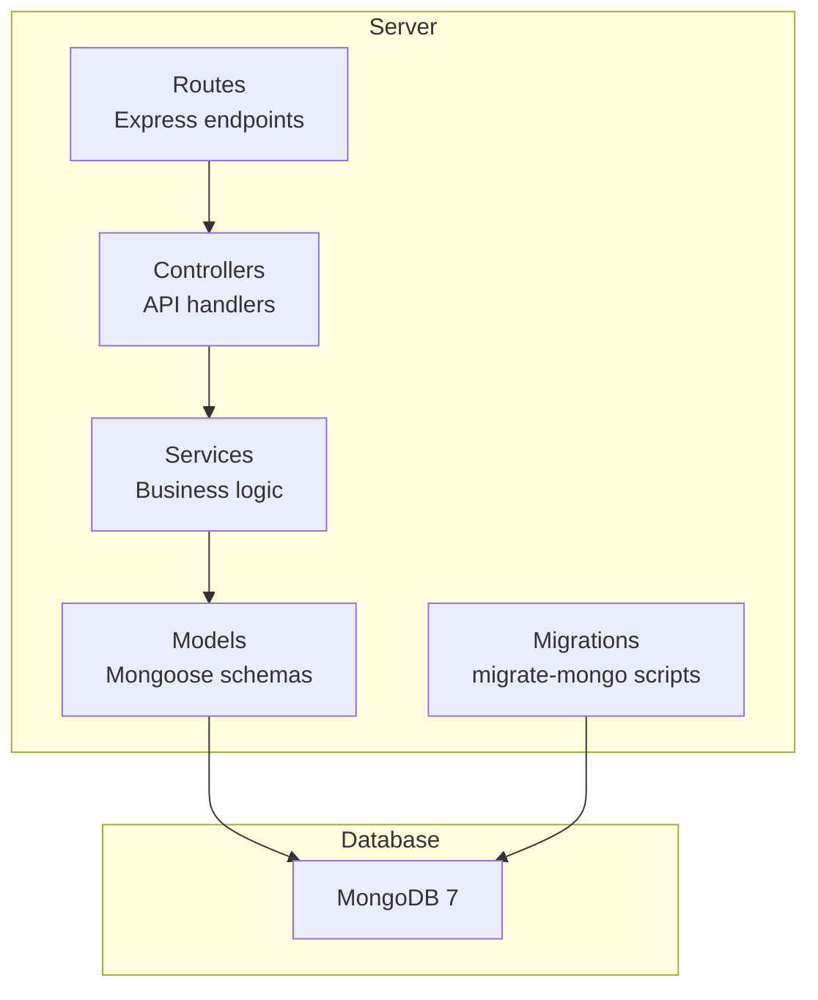
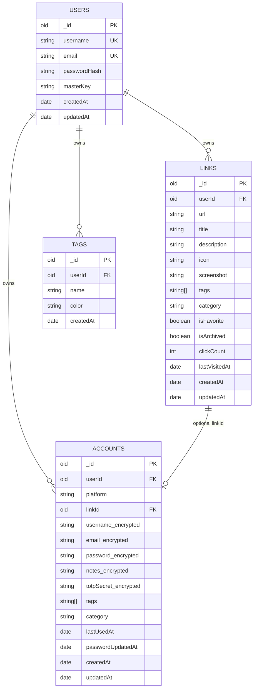
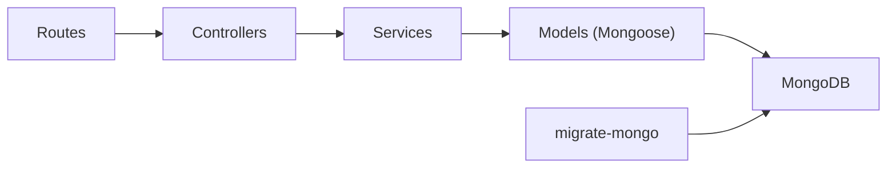

# Database Schema Design

<cite>
**Referenced Files in This Document**
- [BUILD.md](file://doc/BUILD.md)
</cite>

## Table of Contents
1. Introduction
2. Project Structure
3. Core Components
4. Architecture Overview
5. Detailed Component Analysis
6. Dependency Analysis
7. Performance Considerations
8. Troubleshooting Guide
9. Conclusion
10. Appendices

## Introduction
This document specifies the MongoDB database schema for QuickLink, covering collections (users, links, accounts, tags), field definitions, data types, validation rules, relationships, indexing strategy, migration approach with migrate-mongo, security measures for sensitive fields, and backup/recovery procedures for production deployments. It is intended for developers and operators who need a clear, authoritative reference for data modeling and operational practices.

## Project Structure
QuickLink uses a monorepo-style layout with separate client and server directories. The server contains Mongoose models, controllers, services, routes, middleware, and migrations. The database layer relies on MongoDB 7 with migrate-mongo for versioned schema changes.

**Section sources**
- [BUILD.md:33-92](file://doc/BUILD.md#L33-L92)
- [BUILD.md:203-281](file://doc/BUILD.md#L203-L281)

## Core Components
The following collections are defined for QuickLink:

- users
- links
- accounts
- tags
- migrations (managed by migrate-mongo)

Each collection’s fields, types, and constraints are described below.

### users
Purpose: Stores user identity and authentication material.

- _id: ObjectId (primary key)
- username: string; unique; required
- email: string; unique; required
- passwordHash: string; bcrypt hash
- masterKey: string; encrypted; used to derive encryption keys
- createdAt: Date
- updatedAt: Date

Validation notes:
- Unique constraints enforced at application/database level via indexes and validators.
- Passwords stored as bcrypt hashes; never plaintext.
- masterKey is encrypted at rest using AES-256-GCM derived from the user’s master password.

Relationships:
- One-to-many with links (userId reference)
- One-to-many with accounts (userId reference)
- One-to-many with tags (userId reference)

Indexes:
- Unique index on username
- Unique index on email

Sample document structure:
- See Sample Documents section for a representative example.

**Section sources**
- [BUILD.md:100-112](file://doc/BUILD.md#L100-L112)
- [BUILD.md:341-351](file://doc/BUILD.md#L341-L351)

### links
Purpose: Stores bookmarked links with metadata, categorization, and tagging.

- _id: ObjectId (primary key)
- userId: ObjectId; ref: users; required
- url: string; required
- title: string; required
- description: string; optional
- icon: string; optional; favicon URL
- screenshot: string; optional; path or URL
- tags: array of strings; optional
- category: string; optional
- isFavorite: boolean; default false
- isArchived: boolean; default false
- clickCount: number; default 0
- lastVisitedAt: Date; optional
- createdAt: Date
- updatedAt: Date

Validation notes:
- Required fields validated at application layer and optionally via JSON Schema in migrations.
- Tags are plain strings; normalization should be enforced at write time.

Relationships:
- Belongs to users via userId
- Optional association to accounts via linkId (one account may be linked to one link)

Indexes:
- Compound: { userId: 1, createdAt: -1 }
- Compound: { userId: 1, tags: 1 }
- Compound: { userId: 1, category: 1 }
- Compound: { userId: 1, isFavorite: 1 }
- Text index: { title: "text", description: "text" } with default_language set to none

Sample document structure:
- See Sample Documents section for a representative example.

**Section sources**
- [BUILD.md:114-134](file://doc/BUILD.md#L114-L134)
- [BUILD.md:182-188](file://doc/BUILD.md#L182-L188)

### accounts
Purpose: Securely stores platform credentials and related metadata.

- _id: ObjectId (primary key)
- userId: ObjectId; ref: users; required
- platform: string; required; platform name
- linkId: ObjectId; ref: links; optional
- username: string; encrypted
- email: string; encrypted; optional
- password: string; encrypted; AES-256-GCM
- notes: string; encrypted; optional
- totpSecret: string; encrypted; optional; 2FA secret
- tags: array of strings; optional
- category: string; optional
- lastUsedAt: Date; optional
- passwordUpdatedAt: Date
- createdAt: Date
- updatedAt: Date

Validation notes:
- Sensitive fields are encrypted at rest using AES-256-GCM.
- Encryption/decryption performed by server-side crypto service using keys derived from the user’s master password.

Relationships:
- Belongs to users via userId
- Optional association to links via linkId

Indexes:
- Compound: { userId: 1, platform: 1 }
- Compound: { userId: 1, tags: 1 }
- Compound: { userId: 1, category: 1 }

Sample document structure:
- See Sample Documents section for a representative example.

**Section sources**
- [BUILD.md:136-156](file://doc/BUILD.md#L136-L156)
- [BUILD.md:353-378](file://doc/BUILD.md#L353-L378)

### tags
Purpose: User-defined tags for organizing links and accounts.

- _id: ObjectId (primary key)
- userId: ObjectId; ref: users; required
- name: string; required
- color: string; optional; tag color
- createdAt: Date

Validation notes:
- Enforce uniqueness per user on tag name.

Relationships:
- Belongs to users via userId
- Referenced by links.tags and accounts.tags as string values

Indexes:
- Compound unique: { userId: 1, name: 1 }

Sample document structure:
- See Sample Documents section for a representative example.

**Section sources**
- [BUILD.md:158-168](file://doc/BUILD.md#L158-L168)
- [BUILD.md:196-196](file://doc/BUILD.md#L196-L196)

### migrations
Purpose: Records applied migration files managed by migrate-mongo.

- _id: ObjectId (primary key)
- fileName: string
- appliedAt: Date

Behavior:
- Automatically maintained by migrate-mongo to track which migrations have been applied.

**Section sources**
- [BUILD.md:170-178](file://doc/BUILD.md#L170-L178)

## Architecture Overview
The data architecture centers around four primary collections with clear ownership by user. Links and accounts can be associated with each other via an optional linkId reference. Tags are shared across links and accounts as string arrays, while tag entities provide metadata such as colors.

**Diagram sources**
- [BUILD.md:100-168](file://doc/BUILD.md#L100-L168)

## Detailed Component Analysis

### Data Validation Rules
- Application-level validation:
  - Required fields enforced before persistence (e.g., userId, url, title for links).
  - Tag normalization (lowercasing, trimming) to reduce duplicates.
  - Input sanitization and length limits to prevent abuse.
- Database-level validation:
  - JSON Schema validators can be applied during migrations to enforce required fields and types.
  - Unique indexes ensure data integrity (e.g., username, email, tag names per user).

References:
- JSON Schema usage in migrations for enforcing required fields and types.
- Indexes for uniqueness and query performance.

**Section sources**
- [BUILD.md:240-265](file://doc/BUILD.md#L240-L265)
- [BUILD.md:182-196](file://doc/BUILD.md#L182-L196)

### Relationships and Referential Integrity
- users → links: Many links belong to one user via userId.
- users → accounts: Many accounts belong to one user via userId.
- users → tags: Many tags belong to one user via userId.
- links ↔ accounts: Optional one-to-one via linkId on accounts referencing a link.

Operational guidance:
- Use transactions when creating cross-collection references to maintain consistency.
- Cascade deletes should be handled explicitly in application logic due to NoSQL nature.

**Section sources**
- [BUILD.md:100-168](file://doc/BUILD.md#L100-L168)

### Indexing Strategy
Optimized indexes for common queries:

- links
  - { userId: 1, createdAt: -1 }: Recent links per user
  - { userId: 1, tags: 1 }: Filter by tags per user
  - { userId: 1, category: 1 }: Filter by category per user
  - { userId: 1, isFavorite: 1 }: Favorites per user
  - Text index on { title: "text", description: "text" } with default_language: none for full-text search

- accounts
  - { userId: 1, platform: 1 }: Platform lookup per user
  - { userId: 1, tags: 1 }: Tag filtering per user
  - { userId: 1, category: 1 }: Category filtering per user

- tags
  - { userId: 1, name: 1 } unique: Ensure unique tag names per user

Rationale:
- Compound indexes align with frequent query patterns (user-scoped filters).
- Text index enables fast full-text search without external engines.

**Section sources**
- [BUILD.md:182-196](file://doc/BUILD.md#L182-L196)

### Security Measures
- Password hashing:
  - User passwords stored as bcrypt hashes for secure login verification.
- Encryption of sensitive fields:
  - Accounts’ username, email, password, notes, and totpSecret are encrypted using AES-256-GCM.
  - Keys are derived from the user’s master password using PBKDF2.
- Access control:
  - All API endpoints require JWT-based authentication.
  - Server enforces user scoping on all data operations (userId checks).
- Operational security:
  - HTTPS for all API traffic.
  - Rate limiting to mitigate brute-force attempts.
  - Input validation to prevent injection attacks.
  - CORS whitelist configuration.
  - Audit logging for sensitive operations.

Encryption flow overview:
- Master password → PBKDF2 → AES Key
- AES-256-GCM encrypts/decrypts sensitive fields at rest.

**Section sources**
- [BUILD.md:341-378](file://doc/BUILD.md#L341-L378)

### Migration Strategy with migrate-mongo
- Configuration:
  - migrate-mongo config points to MongoDB URI and database name.
  - Changelog collection named migrations tracks applied scripts.
- Script naming convention:
  - Timestamp-prefixed filenames for ordering (e.g., YYYYMMDDHHMMSS-description.js).
- Up/down functions:
  - up: Create collections, apply JSON Schema validators, create indexes.
  - down: Reverse changes (drop collections/indexes) where appropriate.
- Commands:
  - status, up, down, create to manage migrations.

Best practices:
- Keep migrations idempotent and reversible.
- Validate schema changes with tests before deployment.
- Back up the database prior to running migrations in production.

**Section sources**
- [BUILD.md:203-281](file://doc/BUILD.md#L203-L281)

### Backup and Recovery Procedures
Recommended production practices:
- Automated backups:
  - Schedule regular mongodump or cloud provider snapshots.
  - Retain multiple generations (daily, weekly, monthly).
- Restore process:
  - Stop writes, restore from latest snapshot, verify integrity, restart services.
- Disaster recovery:
  - Test restores periodically in staging.
  - Maintain runbooks for RTO/RPO targets.
- Security:
  - Encrypt backups at rest and in transit.
  - Restrict access to backup storage.

[No sources needed since this section provides general guidance]

## Dependency Analysis
High-level dependencies between components and the database:

**Diagram sources**
- [BUILD.md:33-92](file://doc/BUILD.md#L33-L92)
- [BUILD.md:203-281](file://doc/BUILD.md#L203-L281)

**Section sources**
- [BUILD.md:33-92](file://doc/BUILD.md#L33-L92)
- [BUILD.md:203-281](file://doc/BUILD.md#L203-L281)

## Performance Considerations
- Query optimization:
  - Leverage compound indexes for user-scoped queries.
  - Use text indexes for full-text search on titles and descriptions.
- Write optimization:
  - Batch updates where possible.
  - Avoid unnecessary writes to encrypted fields.
- Read scalability:
  - Consider read replicas for heavy read workloads.
  - Cache frequently accessed lists (e.g., tags) in memory if appropriate.
- Monitoring:
  - Track slow queries and index usage via MongoDB profiling.

[No sources needed since this section provides general guidance]

## Troubleshooting Guide
Common issues and resolutions:
- Duplicate key errors:
  - Check unique indexes on username, email, and tag names per user.
- Missing indexes:
  - Ensure indexes exist for common query patterns; add compound indexes as needed.
- Migration failures:
  - Review migration logs; rollback if necessary; fix idempotency issues.
- Encryption errors:
  - Verify correct key derivation and IV/tag handling for AES-256-GCM.
- Authentication failures:
  - Confirm JWT validity and expiration settings; check rate limiting.

**Section sources**
- [BUILD.md:182-196](file://doc/BUILD.md#L182-L196)
- [BUILD.md:240-281](file://doc/BUILD.md#L240-L281)
- [BUILD.md:341-378](file://doc/BUILD.md#L341-L378)

## Conclusion
QuickLink’s MongoDB schema is designed for clarity, security, and performance. Collections are user-scoped with well-defined relationships, robust indexing, and strong encryption for sensitive data. migrate-mongo ensures controlled schema evolution, and recommended backup and recovery practices support reliable production operations.

[No sources needed since this section summarizes without analyzing specific files]

## Appendices

### Sample Documents
Representative structures illustrating typical data and relationships:

- users
  - _id: ObjectId
  - username: string
  - email: string
  - passwordHash: string
  - masterKey: string (encrypted)
  - createdAt: Date
  - updatedAt: Date

- links
  - _id: ObjectId
  - userId: ObjectId
  - url: string
  - title: string
  - description: string
  - icon: string
  - screenshot: string
  - tags: ["string"]
  - category: string
  - isFavorite: boolean
  - isArchived: boolean
  - clickCount: number
  - lastVisitedAt: Date
  - createdAt: Date
  - updatedAt: Date

- accounts
  - _id: ObjectId
  - userId: ObjectId
  - platform: string
  - linkId: ObjectId (optional)
  - username: string (encrypted)
  - email: string (encrypted)
  - password: string (encrypted)
  - notes: string (encrypted)
  - totpSecret: string (encrypted)
  - tags: ["string"]
  - category: string
  - lastUsedAt: Date
  - passwordUpdatedAt: Date
  - createdAt: Date
  - updatedAt: Date

- tags
  - _id: ObjectId
  - userId: ObjectId
  - name: string
  - color: string
  - createdAt: Date

- migrations
  - _id: ObjectId
  - fileName: string
  - appliedAt: Date

**Section sources**
- [BUILD.md:100-178](file://doc/BUILD.md#L100-L178)