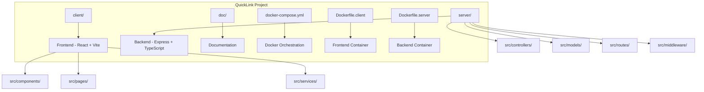
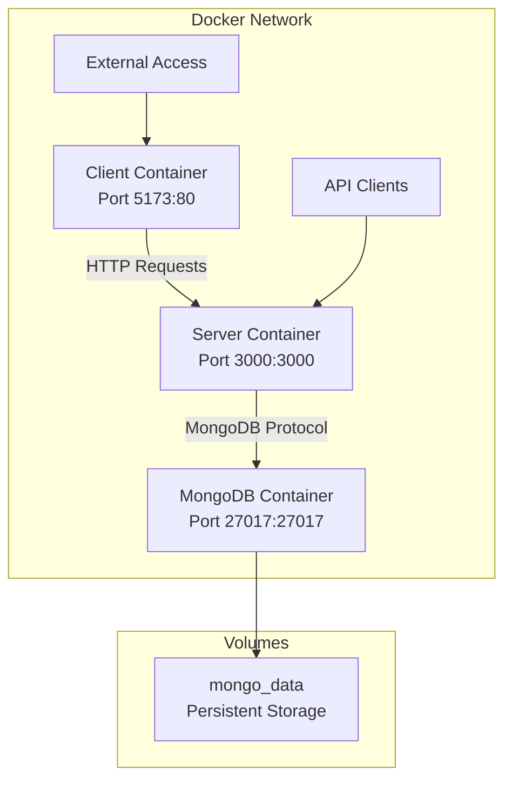
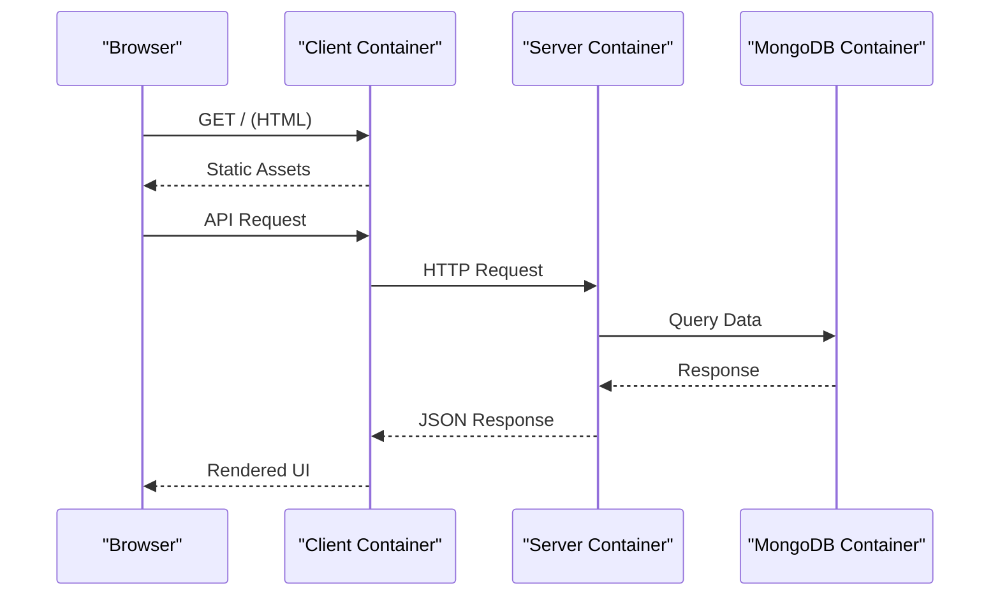
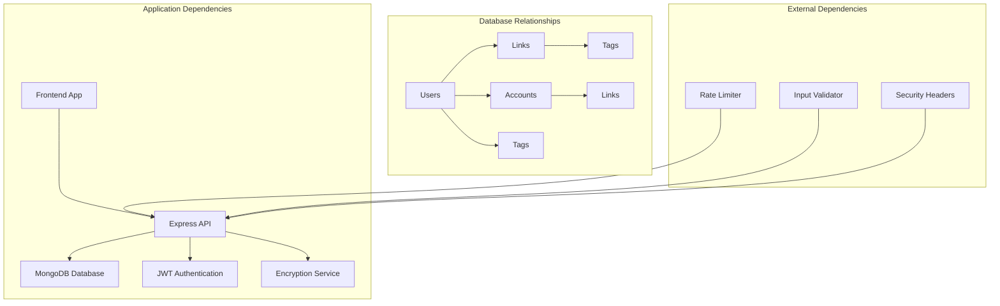

# Deployment Architecture

<cite>
**Referenced Files in This Document**
- [BUILD.md](file://doc/BUILD.md)
</cite>

## Table of Contents
1. [Introduction](#introduction)
2. [Project Structure](#project-structure)
3. [Core Components](#core-components)
4. [Architecture Overview](#architecture-overview)
5. [Detailed Component Analysis](#detailed-component-analysis)
6. [Dependency Analysis](#dependency-analysis)
7. [Performance Considerations](#performance-considerations)
8. [Troubleshooting Guide](#troubleshooting-guide)
9. [Conclusion](#conclusion)
10. [Appendices](#appendices)

## Introduction

QuickLink is a comprehensive link collection and password management tool built with modern web technologies. The application features a React 18 frontend with TypeScript, a Node.js Express backend, and MongoDB database storage. The deployment architecture leverages Docker Compose to provide a streamlined development and production environment with separate containers for each service component.

The system supports advanced features including encrypted password storage using AES-256-GCM, JWT-based authentication, full-text search capabilities, and schema migrations through migrate-mongo. The architecture is designed for scalability, security, and ease of deployment across different environments.

## Project Structure

The QuickLink project follows a monorepo structure with clear separation between frontend and backend components:

**Diagram sources**
- [BUILD.md:33-92](file://doc/BUILD.md#L33-L92)

**Section sources**
- [BUILD.md:33-92](file://doc/BUILD.md#L33-L92)

## Core Components

### Frontend Application (React + Vite)
- **Technology Stack**: React 18, TypeScript, Vite build tool
- **UI Framework**: Ant Design 5 for consistent user interface components
- **State Management**: Zustand for lightweight state management
- **Build Optimization**: Vite provides fast development server and optimized production builds
- **Responsive Design**: Mobile-first approach supporting desktop and mobile browsers

### Backend API Server (Node.js + Express)
- **Runtime**: Node.js with TypeScript for type safety
- **Framework**: Express.js for RESTful API endpoints
- **Database**: MongoDB 7 with Mongoose ODM for data modeling
- **Authentication**: JWT-based token authentication system
- **Security**: Helmet for HTTP security headers, rate limiting, input validation

### Database Layer (MongoDB)
- **Version**: MongoDB 7 for document-based data storage
- **Schema Migration**: migrate-mongo for version-controlled database schema changes
- **Data Models**: Users, Links, Accounts, Tags with proper indexing strategy
- **Encryption**: AES-256-GCM for sensitive data encryption at rest

**Section sources**
- [BUILD.md:17-29](file://doc/BUILD.md#L17-L29)
- [BUILD.md:96-198](file://doc/BUILD.md#L96-L198)

## Architecture Overview

The QuickLink deployment architecture uses Docker Compose to orchestrate three primary services:

**Diagram sources**
- [BUILD.md:418-459](file://doc/BUILD.md#L418-L459)

### Service Communication Patterns

1. **Frontend to Backend**: HTTP/HTTPS requests from React SPA to Express API
2. **Backend to Database**: MongoDB driver connection for data operations
3. **Container Networking**: Docker internal network for inter-service communication
4. **External Access**: Port mapping for browser access and API consumption

**Section sources**
- [BUILD.md:418-459](file://doc/BUILD.md#L418-L459)

## Detailed Component Analysis

### Docker Compose Configuration

The Docker Compose setup defines three interconnected services with proper dependency management:

#### MongoDB Service
- **Image**: mongo:7 official image
- **Volume**: Persistent data storage via named volume
- **Environment**: Database name configuration
- **Networking**: Internal Docker network access

#### Backend Service (Server)
- **Build Context**: Root directory with Dockerfile.server
- **Dependencies**: Depends on MongoDB service availability
- **Environment Variables**: MongoDB connection string and database configuration
- **Port Mapping**: External port 3000 mapped to container port 3000

#### Frontend Service (Client)
- **Build Context**: Root directory with Dockerfile.client
- **Dependencies**: Depends on backend service availability
- **Port Mapping**: External port 5173 mapped to container port 80
- **Static Assets**: Built React application served by nginx or similar

**Diagram sources**
- [BUILD.md:418-459](file://doc/BUILD.md#L418-L459)

### Environment Variable Configuration

The system supports multiple deployment stages through environment variables:

#### Development Environment
- **PORT**: 3000 for local development
- **NODE_ENV**: development mode with verbose logging
- **MONGODB_URI**: Local MongoDB connection
- **JWT_SECRET**: Development-only secret key
- **VITE_API_BASE_URL**: Development API endpoint

#### Production Environment
- **NODE_ENV**: production mode with optimized settings
- **MONGODB_URI**: Production MongoDB connection string
- **JWT_SECRET**: Secure production secret from secrets manager
- **ENCRYPTION_SALT**: Production encryption salt
- **CORS_ORIGIN**: Restricted CORS configuration

**Section sources**
- [BUILD.md:394-416](file://doc/BUILD.md#L394-L416)

### Build Processes

#### Frontend Build Process
1. **Dependency Installation**: npm install with production dependencies only
2. **TypeScript Compilation**: Type checking and compilation
3. **Asset Optimization**: Image compression, code splitting, tree shaking
4. **Static Generation**: Vite builds optimized static assets
5. **Containerization**: Multi-stage build for minimal image size

#### Backend Build Process
1. **Dependency Installation**: Production dependencies with caching
2. **TypeScript Compilation**: Source code compilation to JavaScript
3. **Migration Setup**: Database migration preparation
4. **Production Optimization**: Minification and bundling
5. **Security Scanning**: Dependency vulnerability checks

**Section sources**
- [BUILD.md:540-594](file://doc/BUILD.md#L540-L594)

## Dependency Analysis

The QuickLink application has well-defined service dependencies and data relationships:

**Diagram sources**
- [BUILD.md:96-198](file://doc/BUILD.md#L96-L198)

### Service Coupling Analysis

1. **Loose Coupling**: Services communicate through well-defined APIs
2. **Database Independence**: MongoDB abstraction through Mongoose ODM
3. **Configuration Driven**: Environment-based configuration for different stages
4. **Scalable Architecture**: Stateless backend enables horizontal scaling

**Section sources**
- [BUILD.md:96-198](file://doc/BUILD.md#L96-L198)

## Performance Considerations

### Horizontal Scaling Strategy
- **Stateless Backend**: Express API servers can be horizontally scaled behind load balancer
- **Connection Pooling**: MongoDB connection pooling for optimal database performance
- **Caching Layer**: Potential Redis integration for session and query result caching
- **CDN Integration**: Static asset distribution through content delivery networks

### Resource Optimization
- **Multi-stage Docker Builds**: Reduced image sizes and improved build times
- **Memory Limits**: Container resource constraints prevent memory leaks from affecting other services
- **Health Checks**: Container health monitoring for automatic restarts
- **Log Rotation**: Centralized logging with rotation to prevent disk space issues

### Database Performance
- **Index Strategy**: Optimized indexes for common query patterns
- **Connection Management**: Proper connection pooling and lifecycle management
- **Query Optimization**: Efficient Mongoose queries with proper field selection

## Troubleshooting Guide

### Common Deployment Issues

#### Container Communication Problems
- **Network Connectivity**: Verify Docker network configuration and service discovery
- **Port Conflicts**: Check for port conflicts on host machine
- **DNS Resolution**: Ensure internal DNS resolution works between containers

#### Database Connection Issues
- **Connection String**: Validate MongoDB URI format and credentials
- **Authentication**: Check MongoDB authentication configuration
- **Network Policies**: Verify firewall rules allow container-to-container communication

#### Build Failures
- **Dependency Resolution**: Clear node_modules and reinstall dependencies
- **TypeScript Errors**: Fix compilation errors before building containers
- **Resource Constraints**: Increase Docker memory limits if builds fail due to insufficient resources

### Monitoring and Logging

#### Health Check Implementation
- **API Health Endpoint**: `/api/health` endpoint for service status
- **Database Connectivity**: MongoDB connection health monitoring
- **Resource Usage**: Memory and CPU usage tracking per container

#### Log Aggregation
- **Structured Logging**: JSON-formatted logs for easy parsing
- **Centralized Collection**: Docker logging drivers for log aggregation
- **Error Tracking**: Integration with error tracking services

**Section sources**
- [BUILD.md:339-392](file://doc/BUILD.md#L339-L392)

## Conclusion

The QuickLink deployment architecture provides a robust, scalable foundation for deploying a modern web application. The Docker Compose-based approach offers simplicity for development while maintaining production-grade capabilities through proper service isolation, networking, and configuration management.

Key architectural strengths include:
- **Service Separation**: Clear boundaries between frontend, backend, and database layers
- **Environment Flexibility**: Consistent deployment across development, staging, and production
- **Scalability**: Stateless backend design enables horizontal scaling
- **Security**: Comprehensive security measures including encryption, authentication, and input validation
- **Maintainability**: Well-documented build processes and clear service dependencies

The architecture supports future enhancements such as microservices decomposition, cloud-native deployment patterns, and advanced monitoring capabilities while maintaining operational simplicity.

## Appendices

### Security Considerations

#### Container Security Best Practices
- **Image Scanning**: Regular vulnerability scanning of base images and dependencies
- **Least Privilege**: Running containers with minimal required permissions
- **Secret Management**: Using Docker secrets or external secret managers for sensitive configuration
- **Network Segmentation**: Isolating services with appropriate network policies

#### Runtime Security
- **Health Monitoring**: Continuous health checks and automated recovery
- **Resource Limits**: Preventing resource exhaustion through container limits
- **Audit Logging**: Comprehensive audit trails for security-sensitive operations
- **Backup Strategy**: Regular database backups and disaster recovery procedures

### Rollback Procedures

#### Version Rollback Strategy
1. **Database Backups**: Automated snapshots before deployments
2. **Blue-Green Deployment**: Parallel deployment of new versions with traffic switching
3. **Rollback Triggers**: Automated rollback on health check failures
4. **Data Migration Safety**: Backward-compatible schema migrations

**Section sources**
- [BUILD.md:339-392](file://doc/BUILD.md#L339-L392)