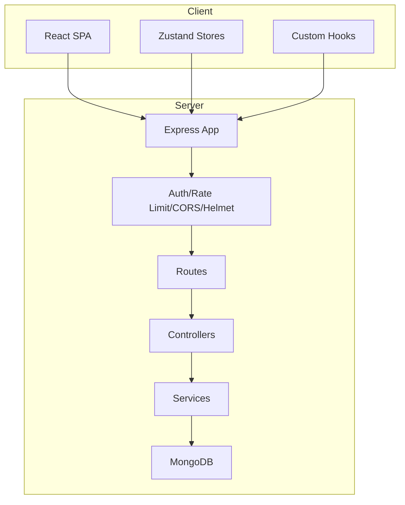
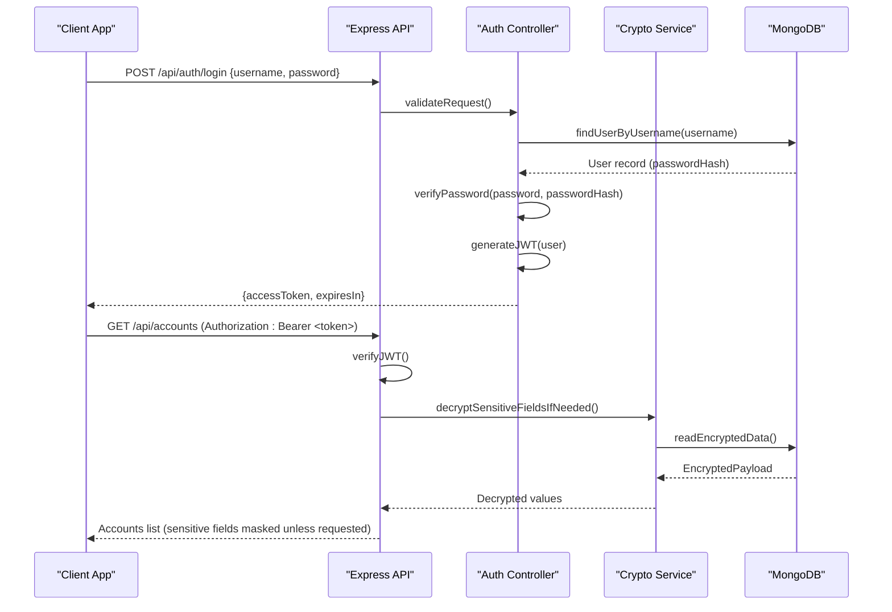
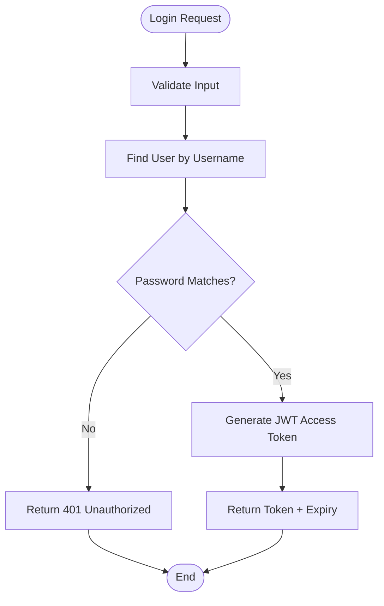
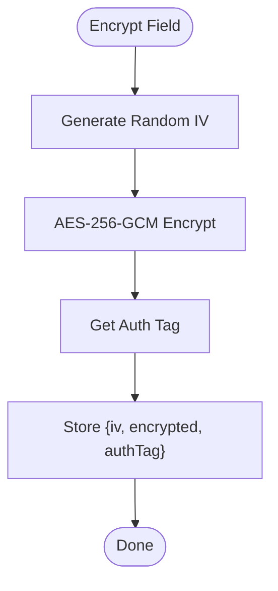
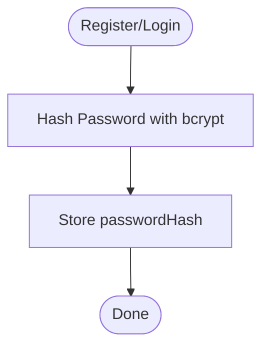
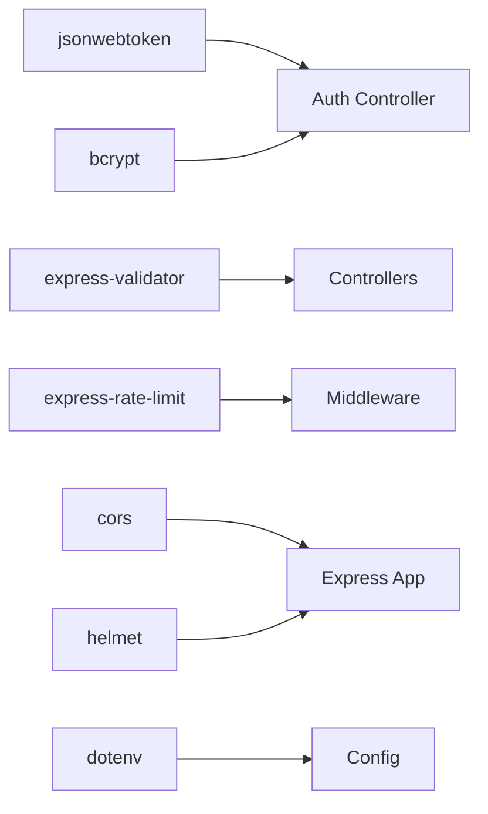

# Security Architecture

<cite>
**Referenced Files in This Document**
- [BUILD.md](file://doc/BUILD.md)
</cite>

## Table of Contents
1. [Introduction](#introduction)
2. [Project Structure](#project-structure)
3. [Core Components](#core-components)
4. [Architecture Overview](#architecture-overview)
5. [Detailed Component Analysis](#detailed-component-analysis)
6. [Dependency Analysis](#dependency-analysis)
7. [Performance Considerations](#performance-considerations)
8. [Troubleshooting Guide](#troubleshooting-guide)
9. [Conclusion](#conclusion)
10. [Appendices](#appendices)

## Introduction
This document describes the security architecture for QuickLink’s authentication and authorization systems, focusing on JWT-based authentication flows, AES-256-GCM encryption for sensitive account data, bcrypt password hashing, session management, token expiration policies, secure storage practices, threat mitigation strategies (XSS, CSRF, injection), input validation and sanitization, API security measures (rate limiting, CORS, request validation), and environment/secret management best practices for development and production.

The information is derived from the project’s build and design documentation, which outlines the technology stack, data models, API surface, and security controls.

## Project Structure
QuickLink follows a monorepo structure with separate client and server components:
- Client: React + TypeScript + Vite SPA
- Server: Node.js + Express + TypeScript REST API
- Database: MongoDB 7 with schema migrations via migrate-mongo
- Security: JWT for authentication, bcrypt for password hashing, AES-256-GCM for encrypting sensitive fields, plus middleware for rate limiting, CORS, helmet, and validation

**Diagram sources**
- [BUILD.md:33-92](file://doc/BUILD.md#L33-L92)

**Section sources**
- [BUILD.md:33-92](file://doc/BUILD.md#L33-L92)

## Core Components
- Authentication: JWT-based login/logout, protected routes, user profile retrieval
- Authorization: Route-level guards ensuring authenticated access to resources
- Encryption: AES-256-GCM for sensitive fields such as passwords and TOTP secrets; PBKDF2-derived key from master password
- Password Hashing: bcrypt for storing password hashes
- Input Validation: express-validator for request payload validation
- API Security: Rate limiting, CORS configuration, helmet headers
- Data Models: Users, Links, Accounts, Tags with appropriate indexes and constraints

Key responsibilities:
- Auth controller handles registration, login, logout, and profile endpoints
- Crypto service manages encryption/decryption using AES-256-GCM and key derivation
- Middleware enforces authentication and rate limits
- Services implement business logic and interact with MongoDB

**Section sources**
- [BUILD.md:27-29](file://doc/BUILD.md#L27-L29)
- [BUILD.md:60-86](file://doc/BUILD.md#L60-L86)
- [BUILD.md:96-198](file://doc/BUILD.md#L96-L198)
- [BUILD.md:339-391](file://doc/BUILD.md#L339-L391)

## Architecture Overview
The system uses a layered architecture where the frontend communicates with a secured backend API. Authentication is enforced via JWT tokens, and sensitive data is encrypted at rest using AES-256-GCM. The database stores hashed passwords and encrypted credentials, while tokens are short-lived and validated per request.

**Diagram sources**
- [BUILD.md:287-320](file://doc/BUILD.md#L287-L320)
- [BUILD.md:339-391](file://doc/BUILD.md#L339-L391)
- [BUILD.md:96-198](file://doc/BUILD.md#L96-L198)

## Detailed Component Analysis

### JWT-Based Authentication Flow
- Registration: Create user with username, email, and bcrypt-hashed password
- Login: Verify credentials, issue short-lived JWT access token
- Protected Routes: Middleware validates JWT before allowing access
- Logout: Invalidate or expire token on client side; server may maintain denylist if needed
- Token Expiration: Configurable via environment variables; recommended short TTL (e.g., 2 hours)

**Diagram sources**
- [BUILD.md:287-295](file://doc/BUILD.md#L287-L295)
- [BUILD.md:396-416](file://doc/BUILD.md#L396-L416)

**Section sources**
- [BUILD.md:287-295](file://doc/BUILD.md#L287-L295)
- [BUILD.md:396-416](file://doc/BUILD.md#L396-L416)

### AES-256-GCM Encryption for Sensitive Data
- Master Key Derivation: PBKDF2(masterPassword, salt, iterations, keyLength) produces a 256-bit AES key
- Encryption: For each sensitive field (e.g., password, TOTP secret), generate random IV, encrypt with AES-256-GCM, store IV, ciphertext, and auth tag
- Decryption: Use stored IV and auth tag to decrypt when necessary; avoid exposing decrypted values in lists unless explicitly requested

**Diagram sources**
- [BUILD.md:341-378](file://doc/BUILD.md#L341-L378)

**Section sources**
- [BUILD.md:341-378](file://doc/BUILD.md#L341-L378)

### Bcrypt Password Hashing
- Algorithm: bcrypt with appropriate cost factor to balance security and performance
- Storage: Only passwordHash stored in users collection; never store plaintext passwords
- Verification: Compare provided password against stored hash during login

**Diagram sources**
- [BUILD.md:100-112](file://doc/BUILD.md#L100-L112)
- [BUILD.md:339-351](file://doc/BUILD.md#L339-L351)

**Section sources**
- [BUILD.md:100-112](file://doc/BUILD.md#L100-L112)
- [BUILD.md:339-351](file://doc/BUILD.md#L339-L351)

### Session Management and Token Policies
- Stateless Sessions: No server-side sessions; rely on JWT access tokens
- Token Expiration: Configure JWT_EXPIRES_IN to a reasonable duration (e.g., 2 hours)
- Refresh Strategy: If implemented, use refresh tokens securely stored and rotated; otherwise, require re-authentication after expiry
- Secure Storage: Tokens stored in memory or httpOnly cookies on client; avoid localStorage for sensitive tokens

**Section sources**
- [BUILD.md:396-416](file://doc/BUILD.md#L396-L416)

### Secure Storage Practices
- Database:
  - Users: passwordHash (bcrypt), masterKey (encrypted)
  - Accounts: username, email, password, notes, totpSecret (AES-256-GCM encrypted)
  - Links/Tags: non-sensitive metadata only
- Indexes: Optimized queries for userId, tags, category, favorites, text search
- Secrets: Environment variables for DB URI, JWT secret, encryption salt

**Section sources**
- [BUILD.md:96-198](file://doc/BUILD.md#L96-L198)
- [BUILD.md:396-416](file://doc/BUILD.md#L396-L416)

### Threat Mitigation Strategies
- XSS: Use helmet to set secure HTTP headers; sanitize outputs on client; avoid rendering untrusted HTML
- CSRF: Prefer stateless JWT with sameSite cookie policy if using cookies; ensure proper CORS configuration
- Injection: Validate and sanitize all inputs with express-validator; parameterize queries; avoid string concatenation in DB operations
- Brute Force: Rate limiting on auth endpoints; lockout policies if needed
- Data Exposure: Mask sensitive fields in responses; decrypt only when necessary

**Section sources**
- [BUILD.md:380-391](file://doc/BUILD.md#L380-L391)

### Input Validation and Sanitization Patterns
- Request Validation: Use express-validator to enforce schema, length, format, and allowed values
- Type Safety: TypeScript types for payloads; runtime validation ensures correctness
- Sanitization: Strip dangerous characters; normalize strings; reject invalid formats early

**Section sources**
- [BUILD.md:380-391](file://doc/BUILD.md#L380-L391)

### API Security Measures
- Rate Limiting: Apply express-rate-limit to throttle requests, especially on auth endpoints
- CORS: Configure allowed origins, methods, headers; restrict to known clients
- Helmet: Set secure headers (HSTS, X-Frame-Options, CSP, etc.)
- Request Validation: Enforce strict schemas for all endpoints

**Section sources**
- [BUILD.md:540-568](file://doc/BUILD.md#L540-L568)
- [BUILD.md:380-391](file://doc/BUILD.md#L380-L391)

## Dependency Analysis
Security-related dependencies and their roles:
- jsonwebtoken: Issues and verifies JWT access tokens
- bcrypt: Password hashing and verification
- express-validator: Input validation and sanitization
- express-rate-limit: Throttles requests to mitigate brute force and abuse
- cors: Controls cross-origin resource sharing
- helmet: Sets secure HTTP response headers
- dotenv: Loads environment variables for secrets and configuration

**Diagram sources**
- [BUILD.md:540-568](file://doc/BUILD.md#L540-L568)

**Section sources**
- [BUILD.md:540-568](file://doc/BUILD.md#L540-L568)

## Performance Considerations
- bcrypt Cost Factor: Tune to balance security and latency; monitor CPU usage under load
- AES-256-GCM: Efficient symmetric encryption; minimize decryption calls; cache decrypted values in-memory when safe
- JWT Size: Keep claims minimal to reduce overhead
- Database Queries: Use indexes judiciously; avoid N+1 queries; paginate large result sets
- Rate Limiting: Adjust thresholds based on expected traffic and abuse patterns

[No sources needed since this section provides general guidance]

## Troubleshooting Guide
Common issues and resolutions:
- Invalid JWT: Check token signature, expiration, and issuer; ensure correct secret and algorithm
- Decryption Failures: Validate IV, auth tag, and key derivation; ensure consistent encoding (hex/base64)
- Rate Limit Errors: Increase limits temporarily; investigate abuse; adjust thresholds
- CORS Errors: Verify allowed origins and headers; ensure preflight requests succeed
- Validation Failures: Inspect request payloads; update schemas to match client expectations

**Section sources**
- [BUILD.md:380-391](file://doc/BUILD.md#L380-L391)
- [BUILD.md:396-416](file://doc/BUILD.md#L396-L416)

## Conclusion
QuickLink implements a robust security architecture centered on JWT authentication, strong password hashing with bcrypt, and AES-256-GCM encryption for sensitive data. The system leverages modern middleware for rate limiting, CORS, and secure headers, along with comprehensive input validation to mitigate common vulnerabilities. Proper environment variable management and secret rotation procedures are essential for maintaining security across development and production environments.

[No sources needed since this section summarizes without analyzing specific files]

## Appendices

### API Security Surface
- Authentication endpoints: register, login, logout, get current user, change password
- Resource endpoints: links, accounts, tags with CRUD operations and search/export
- All protected endpoints require valid JWT; sensitive fields are encrypted at rest and decrypted on demand

**Section sources**
- [BUILD.md:287-329](file://doc/BUILD.md#L287-L329)

### Environment Variables and Secrets
- JWT_SECRET, JWT_EXPIRES_IN for token lifecycle
- ENCRYPTION_SALT for key derivation
- MONGODB_URI, MONGODB_DB_NAME for database connectivity
- VITE_API_BASE_URL for client API base path

**Section sources**
- [BUILD.md:396-416](file://doc/BUILD.md#L396-L416)