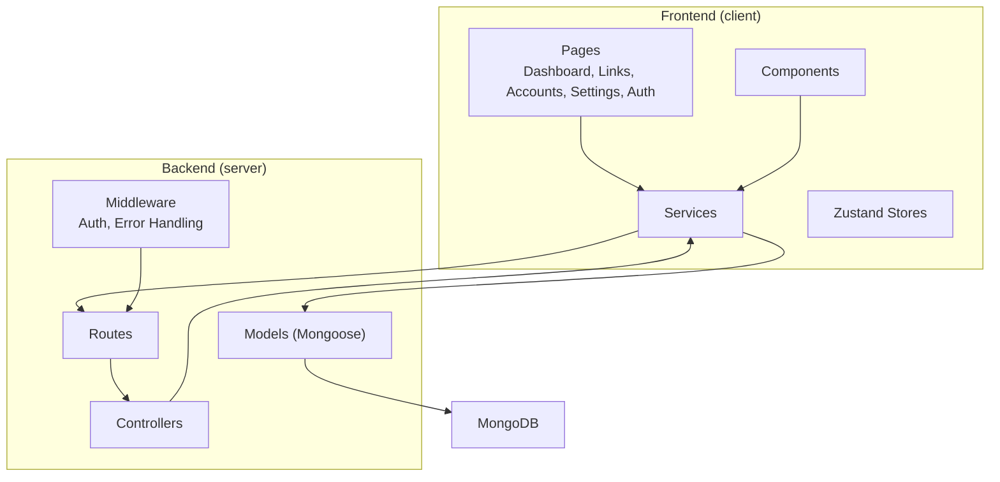
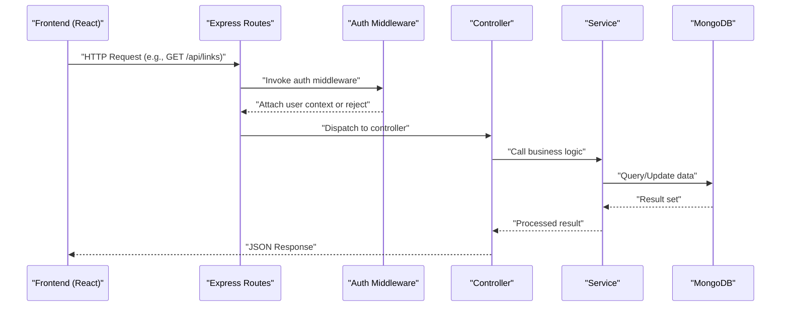
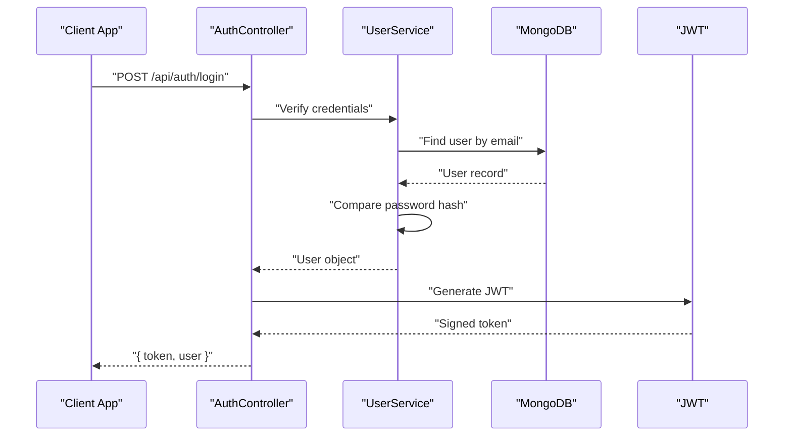
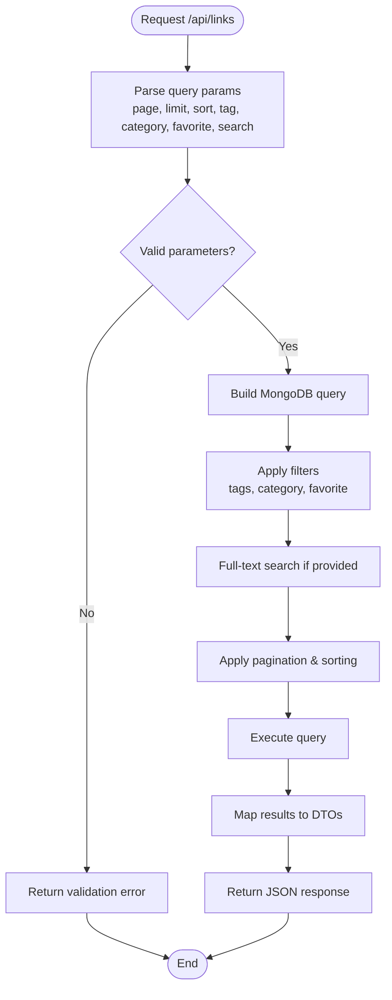
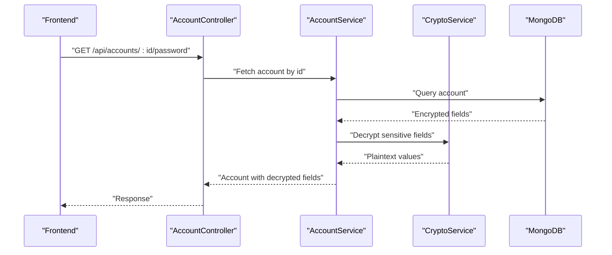
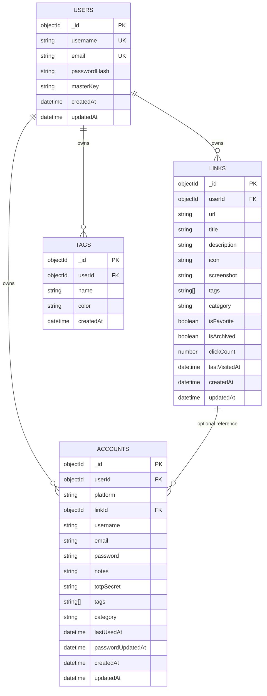
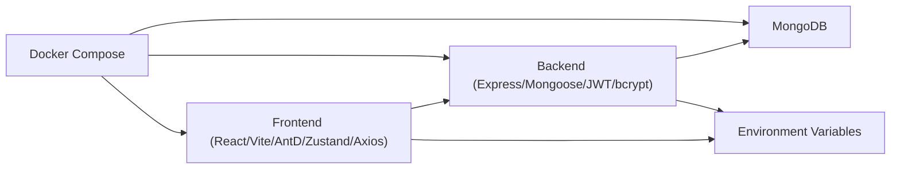

# System Architecture Overview

<cite>
**Referenced Files in This Document**
- [BUILD.md](file://doc/BUILD.md)
</cite>

## Table of Contents
1. [Introduction](#introduction)
2. [Project Structure](#project-structure)
3. [Core Components](#core-components)
4. [Architecture Overview](#architecture-overview)
5. [Detailed Component Analysis](#detailed-component-analysis)
6. [Dependency Analysis](#dependency-analysis)
7. [Performance Considerations](#performance-considerations)
8. [Troubleshooting Guide](#troubleshooting-guide)
9. [Conclusion](#conclusion)

## Introduction
QuickLink is a full-stack monorepo that provides a personal knowledge management tool for bookmarking links and securely managing account credentials. The system separates concerns into a React + TypeScript + Vite frontend and a Node.js + Express + TypeScript backend, communicating via REST APIs. It uses MongoDB as the data store with schema migrations, JWT-based authentication, and AES-256-GCM encryption for sensitive fields.

The architecture follows an MVC pattern on the server: controllers handle HTTP requests, services encapsulate business logic, and models define data schemas. Middleware enforces cross-cutting concerns such as authentication and error handling. The frontend organizes UI by pages and components, with state managed via Zustand and API calls abstracted through service modules.

This document explains the high-level design, component interactions, communication patterns, technology decisions, and scalability considerations based on the repository’s documentation.

**Section sources**
- [BUILD.md:1-30](file://doc/BUILD.md#L1-L30)

## Project Structure
The monorepo contains two primary applications:
- client: React 18 + TypeScript + Vite SPA using Ant Design 5, Zustand for state, and Axios for HTTP requests.
- server: Node.js + Express + TypeScript REST API with Mongoose models, middleware, routes, and services.

Key directories and responsibilities:
- client/src/pages: Feature pages (Dashboard, Links, Accounts, Settings, Auth).
- client/src/components: Reusable UI components.
- client/src/services: API call wrappers.
- client/src/stores: Zustand stores for global state.
- client/src/hooks: Custom hooks for shared behavior.
- client/src/utils: Utility functions.
- client/src/types: Shared TypeScript types.
- server/src/config: Database, crypto, and environment configuration.
- server/src/controllers: HTTP request handlers per domain.
- server/src/models: Mongoose schemas for users, links, accounts, tags.
- server/src/routes: Route definitions wired to controllers.
- server/src/middleware: Authentication and error-handling middleware.
- server/src/services: Business logic (e.g., encryption, link/account operations).
- server/src/migrations: Schema migration scripts managed by migrate-mongo.

**Diagram sources**
- [BUILD.md:33-92](file://doc/BUILD.md#L33-L92)

**Section sources**
- [BUILD.md:33-92](file://doc/BUILD.md#L33-L92)

## Core Components
- Frontend application:
  - React 18 with TypeScript and Vite for fast development and optimized builds.
  - Ant Design 5 for UI components and forms.
  - Zustand for lightweight state management across features.
  - Axios for HTTP requests to the backend API.
- Backend application:
  - Express + TypeScript for building REST APIs.
  - Mongoose models for data validation and schema definition.
  - JWT for authentication and session management.
  - bcrypt for password hashing; AES-256-GCM for encrypting sensitive fields.
  - migrate-mongo for versioned database schema changes.
- Data layer:
  - MongoDB collections: users, links, accounts, tags, migrations.
  - Indexes for efficient querying and search.

Technology stack decisions emphasize developer productivity, security, and scalability:
- TypeScript across both layers improves maintainability and reduces runtime errors.
- Vite accelerates frontend iteration and bundling.
- Express keeps the API lightweight and easy to extend.
- MongoDB supports flexible schemas and aggregation queries suitable for dynamic content like links and accounts.
- Docker Compose enables consistent local and production environments.

**Section sources**
- [BUILD.md:17-30](file://doc/BUILD.md#L17-L30)
- [BUILD.md:96-198](file://doc/BUILD.md#L96-L198)

## Architecture Overview
The system implements a layered architecture:
- Presentation layer: React SPA renders UI and collects user inputs.
- API layer: Express routes expose REST endpoints.
- Controller layer: Validates input and delegates to services.
- Service layer: Encapsulates business rules, encryption, and orchestration.
- Data access layer: Mongoose models interact with MongoDB.
- Cross-cutting: Middleware handles authentication, rate limiting, and error handling.

**Diagram sources**
- [BUILD.md:285-337](file://doc/BUILD.md#L285-L337)
- [BUILD.md:339-391](file://doc/BUILD.md#L339-L391)

**Section sources**
- [BUILD.md:285-337](file://doc/BUILD.md#L285-L337)
- [BUILD.md:339-391](file://doc/BUILD.md#L339-L391)

## Detailed Component Analysis

### Authentication Flow
Authentication uses JWT tokens protected by middleware. The flow ensures only authenticated users can access protected endpoints.

**Diagram sources**
- [BUILD.md:287-295](file://doc/BUILD.md#L287-L295)
- [BUILD.md:339-391](file://doc/BUILD.md#L339-L391)

**Section sources**
- [BUILD.md:287-295](file://doc/BUILD.md#L287-L295)
- [BUILD.md:339-391](file://doc/BUILD.md#L339-L391)

### Link Management Flow
Links are CRUD-managed with filtering, pagination, and full-text search.

**Diagram sources**
- [BUILD.md:297-308](file://doc/BUILD.md#L297-L308)
- [BUILD.md:180-198](file://doc/BUILD.md#L180-L198)

**Section sources**
- [BUILD.md:297-308](file://doc/BUILD.md#L297-L308)
- [BUILD.md:180-198](file://doc/BUILD.md#L180-L198)

### Account Password Management Flow
Accounts store encrypted credentials. Sensitive fields are encrypted at rest using AES-256-GCM and decrypted on demand for authorized operations.

**Diagram sources**
- [BUILD.md:310-321](file://doc/BUILD.md#L310-L321)
- [BUILD.md:339-391](file://doc/BUILD.md#L339-L391)

**Section sources**
- [BUILD.md:310-321](file://doc/BUILD.md#L310-L321)
- [BUILD.md:339-391](file://doc/BUILD.md#L339-L391)

### Data Models and Relationships
The data model centers around users, links, accounts, and tags with clear relationships and indexes for performance.

**Diagram sources**
- [BUILD.md:96-178](file://doc/BUILD.md#L96-L178)

**Section sources**
- [BUILD.md:96-178](file://doc/BUILD.md#L96-L178)

## Dependency Analysis
High-level dependencies between layers and external systems:
- Frontend depends on React, Ant Design, Zustand, Axios, and Vite.
- Backend depends on Express, Mongoose, JWT, bcrypt, and migrate-mongo.
- Both layers depend on environment variables for configuration.
- Deployment relies on Docker Compose to orchestrate MongoDB, server, and client.

**Diagram sources**
- [BUILD.md:540-594](file://doc/BUILD.md#L540-L594)
- [BUILD.md:394-459](file://doc/BUILD.md#L394-L459)

**Section sources**
- [BUILD.md:540-594](file://doc/BUILD.md#L540-L594)
- [BUILD.md:394-459](file://doc/BUILD.md#L394-L459)

## Performance Considerations
- Database indexing:
  - Composite indexes on frequently filtered fields (userId, tags, category, isFavorite).
  - Text index for full-text search on links.
- Query optimization:
  - Use projection to return only necessary fields.
  - Leverage aggregation pipelines for complex analytics.
- Caching:
  - Introduce Redis or in-memory cache for hot data (e.g., popular links, tags).
- Rate limiting:
  - Protect endpoints against brute-force and abuse using express-rate-limit.
- Security hardening:
  - Enforce HTTPS, helmet headers, CORS whitelisting, and input validation.
- Frontend optimizations:
  - Code splitting and lazy loading for large pages.
  - Debounce search inputs to reduce API calls.
- Deployment:
  - Containerize with Docker Compose for consistent environments.
  - Reverse proxy (Nginx) for TLS termination and static asset caching.

[No sources needed since this section provides general guidance]

## Troubleshooting Guide
Common issues and strategies:
- Authentication failures:
  - Verify JWT secret and expiration settings.
  - Ensure middleware attaches user context correctly.
- Encryption errors:
  - Confirm encryption salt and key derivation parameters.
  - Validate IV and authTag usage for AES-256-GCM.
- Migration problems:
  - Check migrate-mongo status and ensure migrations are applied in order.
  - Review changelog collection for applied migrations.
- API validation errors:
  - Use express-validator to enforce input constraints and return descriptive errors.
- CORS and network issues:
  - Configure CORS origins to match frontend domains.
  - Ensure environment variables point to correct API base URL.

**Section sources**
- [BUILD.md:339-391](file://doc/BUILD.md#L339-L391)
- [BUILD.md:201-283](file://doc/BUILD.md#L201-L283)

## Conclusion
QuickLink’s architecture cleanly separates frontend and backend concerns while enforcing secure practices and scalable patterns. The MVC structure on the server, combined with middleware-driven request processing and service-layer abstraction, provides a robust foundation for extending functionality. The frontend leverages modern tools for rapid development and a responsive user experience. With well-defined data models, indexes, and migration strategies, the system is positioned for growth and maintainability. Future enhancements can build upon these patterns, adding caching, advanced analytics, and enhanced security controls as needed.

[No sources needed since this section summarizes without analyzing specific files]