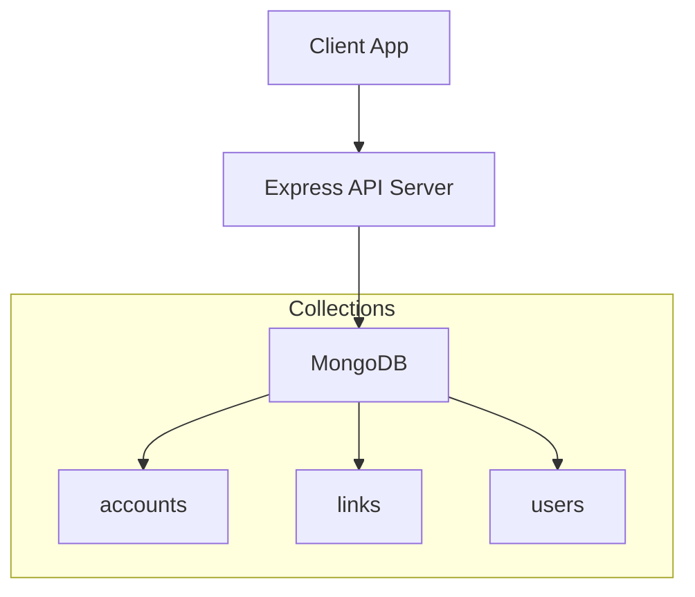
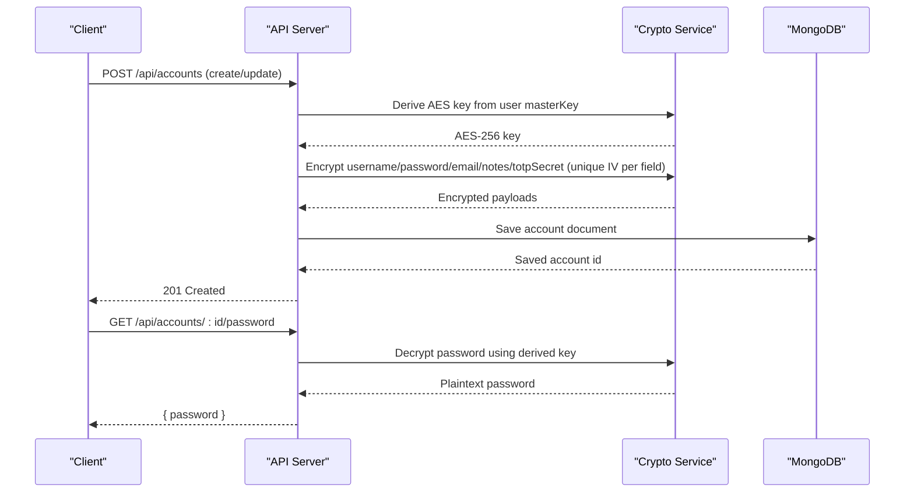
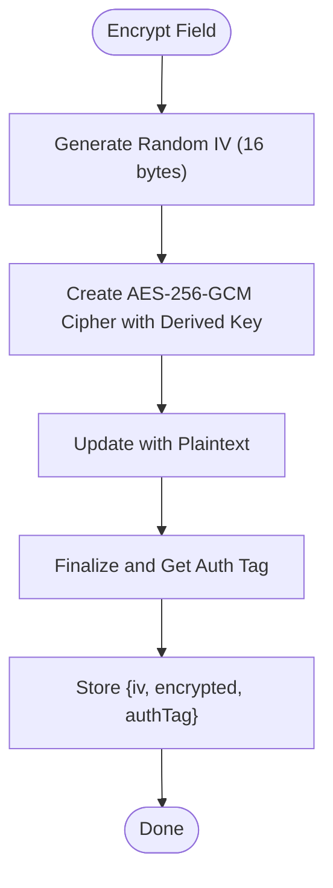
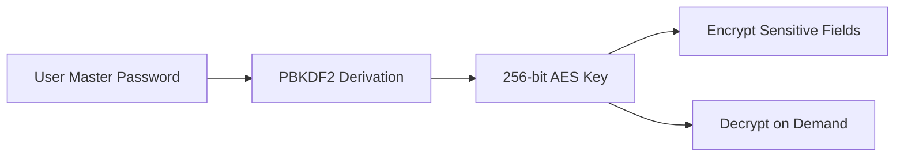
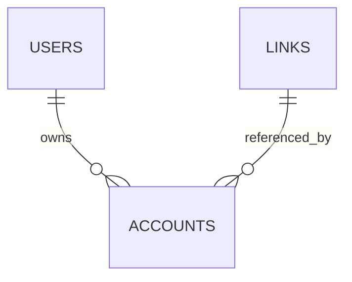
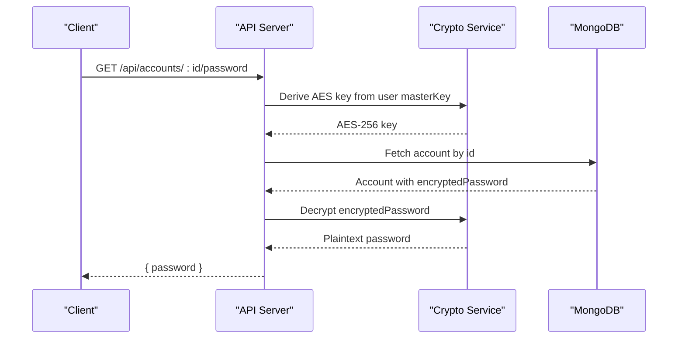
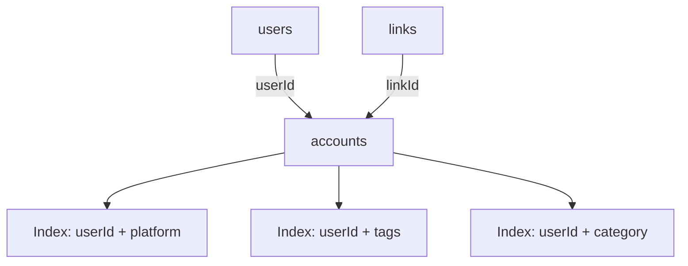

# Accounts Collection

<cite>
**Referenced Files in This Document**
- [BUILD.md](file://doc/BUILD.md)
</cite>

## Table of Contents
1. [Introduction](#introduction)
2. [Project Structure](#project-structure)
3. [Core Components](#core-components)
4. [Architecture Overview](#architecture-overview)
5. [Detailed Component Analysis](#detailed-component-analysis)
6. [Dependency Analysis](#dependency-analysis)
7. [Performance Considerations](#performance-considerations)
8. [Troubleshooting Guide](#troubleshooting-guide)
9. [Conclusion](#conclusion)
10. [Appendices](#appendices)

## Introduction
This document describes the accounts collection schema designed for secure credential storage within the QuickLink project. It explains all fields, encryption implementation using AES-256-GCM with unique initialization vectors per field, and the security architecture including key derivation from a user master key, encryption/decryption workflows, and safe handling of sensitive data. It also documents relationships with the links collection and provides examples of common operations such as adding credentials, updating them, and securely retrieving decrypted values.

## Project Structure
The repository contains documentation that defines the database schema, API endpoints, and security design for the accounts feature. The relevant sections outline:
- The accounts collection schema and its fields
- Indexes to optimize queries by owner and attributes
- API endpoints for account management
- Encryption approach using AES-256-GCM and PBKDF2-based key derivation
- Environment configuration for cryptographic parameters

**Diagram sources**
- [BUILD.md:136-156](file://doc/BUILD.md#L136-L156)
- [BUILD.md:180-197](file://doc/BUILD.md#L180-L197)
- [BUILD.md:310-321](file://doc/BUILD.md#L310-L321)

**Section sources**
- [BUILD.md:33-92](file://doc/BUILD.md#L33-L92)
- [BUILD.md:96-197](file://doc/BUILD.md#L96-L197)
- [BUILD.md:310-321](file://doc/BUILD.md#L310-L321)

## Core Components
- accounts collection: Stores encrypted credentials and metadata for platform accounts.
- users collection: Holds user identity and a masterKey used to derive per-user encryption keys.
- links collection: Optional contextual association via linkId to tie credentials to specific bookmarks.

Key responsibilities:
- Securely store sensitive fields (username, password, email, notes, totpSecret) using AES-256-GCM with unique IVs per field.
- Provide APIs to create, update, list, retrieve, and decrypt passwords on demand.
- Maintain indexes for efficient querying by userId and other attributes.

**Section sources**
- [BUILD.md:136-156](file://doc/BUILD.md#L136-L156)
- [BUILD.md:180-197](file://doc/BUILD.md#L180-L197)
- [BUILD.md:310-321](file://doc/BUILD.md#L310-L321)

## Architecture Overview
The security architecture centers around deriving a strong symmetric key from the user’s master key and using it to encrypt/decrypt sensitive fields with AES-256-GCM. Each field is encrypted independently with a fresh random initialization vector (IV), ensuring semantic security and preventing pattern leakage.

**Diagram sources**
- [BUILD.md:341-378](file://doc/BUILD.md#L341-L378)
- [BUILD.md:310-321](file://doc/BUILD.md#L310-L321)

**Section sources**
- [BUILD.md:339-391](file://doc/BUILD.md#L339-L391)
- [BUILD.md:310-321](file://doc/BUILD.md#L310-L321)

## Detailed Component Analysis

### Accounts Schema Fields
- _id: ObjectId identifier for the account document.
- userId: Reference to the owning user; ensures isolation and enables scoped queries.
- platform: Required string identifying the service name (e.g., GitHub, Gmail).
- linkId: Optional reference to a related link document for contextual association.
- encryptedUsername: AES-256-GCM encrypted username; stored as ciphertext with associated IV and auth tag.
- encryptedEmail: Optional AES-256-GCM encrypted email.
- encryptedPassword: AES-256-GCM encrypted password; primary secret field.
- encryptedNotes: Optional AES-256-GCM encrypted notes/metadata.
- encryptedTotpSecret: Optional AES-256-GCM encrypted TOTP secret for two-factor authentication.
- tags: Array of strings for categorization and filtering.
- category: Optional string for grouping accounts.
- lastUsedAt: Optional timestamp indicating recent usage.
- passwordUpdatedAt: Timestamp when the password was last updated.
- createdAt/updatedAt: Standard audit timestamps.

Notes:
- All sensitive fields are encrypted at rest using AES-256-GCM.
- Each field uses a unique, randomly generated IV to ensure uniqueness and prevent identical plaintexts from producing identical ciphertexts.
- Non-sensitive fields (platform, tags, category, timestamps) remain unencrypted for efficient querying and display.

**Section sources**
- [BUILD.md:136-156](file://doc/BUILD.md#L136-L156)

### Encryption Implementation (AES-256-GCM)
- Key derivation: A 256-bit AES key is derived from the user’s master key using PBKDF2 with a salt and iteration count.
- Per-field encryption: For each sensitive field, generate a fresh 16-byte IV, encrypt with AES-256-GCM, and capture the authentication tag. Store the IV and tag alongside the ciphertext.
- Decryption workflow: Retrieve the stored IV and tag, reconstruct the decipher with the derived key, verify the tag, and recover plaintext only when necessary.

**Diagram sources**
- [BUILD.md:341-378](file://doc/BUILD.md#L341-L378)

**Section sources**
- [BUILD.md:341-378](file://doc/BUILD.md#L341-L378)

### Security Architecture
- Master key handling: The user’s master key is never stored in plaintext; it is used to derive an AES key for encrypting/decrypting sensitive fields.
- Least privilege exposure: Only the password decryption endpoint returns plaintext, minimizing exposure surface.
- Transport security: All API endpoints should be served over HTTPS.
- Operational safeguards: Rate limiting, input validation, CORS configuration, and audit logging are recommended.

**Diagram sources**
- [BUILD.md:341-351](file://doc/BUILD.md#L341-L351)

**Section sources**
- [BUILD.md:339-391](file://doc/BUILD.md#L339-L391)

### Relationship with Links Collection
- Contextual association: An account can optionally reference a link via linkId to associate credentials with a specific bookmarked URL.
- Query patterns: Users can retrieve accounts by userId and filter by platform, tags, or category; optional joins or application-level enrichment can resolve linkId to link details.

**Diagram sources**
- [BUILD.md:114-156](file://doc/BUILD.md#L114-L156)

**Section sources**
- [BUILD.md:114-156](file://doc/BUILD.md#L114-L156)

### Sample Account Documents
Below are conceptual examples illustrating how encrypted fields appear in documents. Actual values will vary per run due to random IVs and ciphertext.

Example 1: Basic account with encrypted password
- _id: ObjectId
- userId: ObjectId
- platform: "GitHub"
- encryptedUsername: "<hex-encoded ciphertext>"
- encryptedPassword: "<hex-encoded ciphertext>"
- tags: ["work", "dev"]
- category: "Development"
- createdAt: Date
- updatedAt: Date

Example 2: Full-featured account with optional fields
- _id: ObjectId
- userId: ObjectId
- platform: "Gmail"
- linkId: ObjectId (optional)
- encryptedUsername: "<hex-encoded ciphertext>"
- encryptedEmail: "<hex-encoded ciphertext>"
- encryptedPassword: "<hex-encoded ciphertext>"
- encryptedNotes: "<hex-encoded ciphertext>"
- encryptedTotpSecret: "<hex-encoded ciphertext>"
- tags: ["personal", "email"]
- category: "Communication"
- lastUsedAt: Date
- passwordUpdatedAt: Date
- createdAt: Date
- updatedAt: Date

Note: Each encrypted field includes its own IV and authentication tag stored alongside the ciphertext.

**Section sources**
- [BUILD.md:136-156](file://doc/BUILD.md#L136-L156)

### Common Operations

- Create a new account
  - Endpoint: POST /api/accounts
  - Behavior: Derive AES key from user master key, encrypt sensitive fields with unique IVs, persist document, return created account id.

- Update an existing account
  - Endpoint: PUT /api/accounts/:id
  - Behavior: Re-encrypt changed sensitive fields with fresh IVs, update timestamps, persist changes.

- List accounts
  - Endpoint: GET /api/accounts
  - Behavior: Return accounts for the authenticated user; exclude plaintext secrets; support filters by tags/category/platform.

- Retrieve a single account
  - Endpoint: GET /api/accounts/:id
  - Behavior: Return account metadata without plaintext secrets.

- Decrypt password on demand
  - Endpoint: GET /api/accounts/:id/password
  - Behavior: Derive AES key, decrypt password field, return plaintext securely to the caller.

- Generate a strong random password
  - Endpoint: POST /api/accounts/:id/generate
  - Behavior: Produce a cryptographically strong password; encrypt and save if requested.

**Diagram sources**
- [BUILD.md:310-321](file://doc/BUILD.md#L310-L321)
- [BUILD.md:341-378](file://doc/BUILD.md#L341-L378)

**Section sources**
- [BUILD.md:310-321](file://doc/BUILD.md#L310-L321)
- [BUILD.md:341-378](file://doc/BUILD.md#L341-L378)

## Dependency Analysis
- Collections and references:
  - accounts.userId references users._id to enforce ownership and enable scoped queries.
  - accounts.linkId optionally references links._id for contextual association.
- Indexes:
  - Optimized queries by userId combined with platform, tags, and category for fast listing and filtering.

**Diagram sources**
- [BUILD.md:114-156](file://doc/BUILD.md#L114-L156)
- [BUILD.md:180-197](file://doc/BUILD.md#L180-L197)

**Section sources**
- [BUILD.md:114-156](file://doc/BUILD.md#L114-L156)
- [BUILD.md:180-197](file://doc/BUILD.md#L180-L197)

## Performance Considerations
- Use compound indexes on userId with frequently filtered fields (platform, tags, category) to minimize query latency.
- Avoid returning plaintext secrets in list responses; decrypt only via dedicated endpoints.
- Keep payload sizes small by storing only necessary metadata; large attachments should be externalized.
- Consider caching derived keys in memory for short-lived sessions to reduce repeated derivations during batch operations.

[No sources needed since this section provides general guidance]

## Troubleshooting Guide
- Decryption failures:
  - Verify the correct derived key is used and that the stored IV and auth tag match the ciphertext.
  - Ensure consistent encoding (hex/base64) between encryption and decryption steps.
- Performance issues:
  - Confirm indexes exist for userId-based queries.
  - Check for unnecessary full collections scans or missing filters.
- Security checks:
  - Ensure HTTPS is enforced.
  - Validate rate limiting and input sanitization are active.
  - Audit logs should record sensitive operations like password decryption.

**Section sources**
- [BUILD.md:339-391](file://doc/BUILD.md#L339-L391)

## Conclusion
The accounts collection provides a robust, secure foundation for managing credentials. By leveraging AES-256-GCM with per-field IVs and PBKDF2-derived keys, sensitive data remains protected both in transit and at rest. The optional linkId relationship enables contextual management of credentials tied to specific links, while well-designed indexes and APIs support efficient and secure operations.

[No sources needed since this section summarizes without analyzing specific files]

## Appendices

### Environment Configuration for Encryption
- ENCRYPTION_SALT: Used in PBKDF2 key derivation to strengthen the derived AES key.
- Other environment variables control server behavior, database connectivity, and JWT settings.

**Section sources**
- [BUILD.md:394-416](file://doc/BUILD.md#L394-L416)