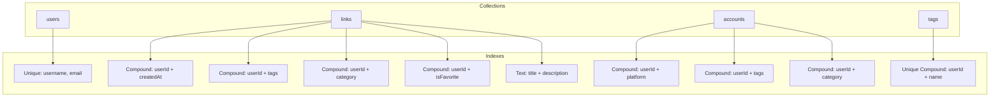
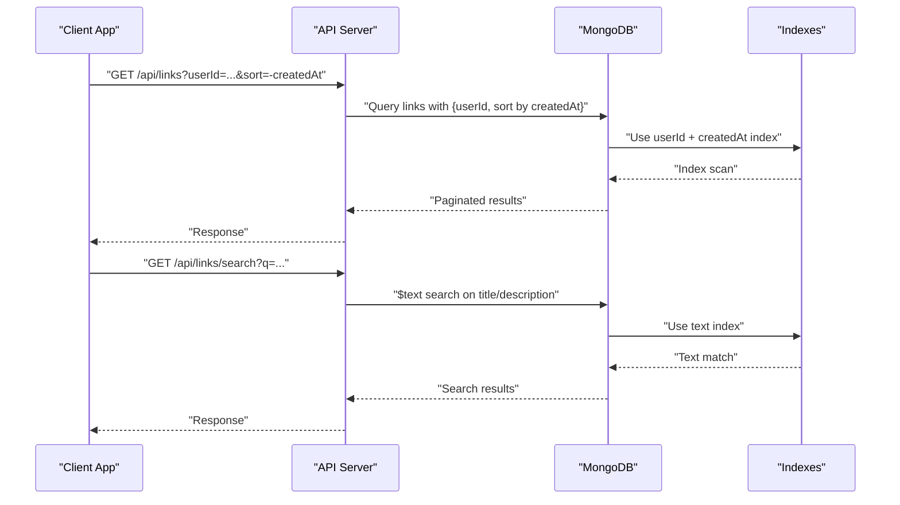
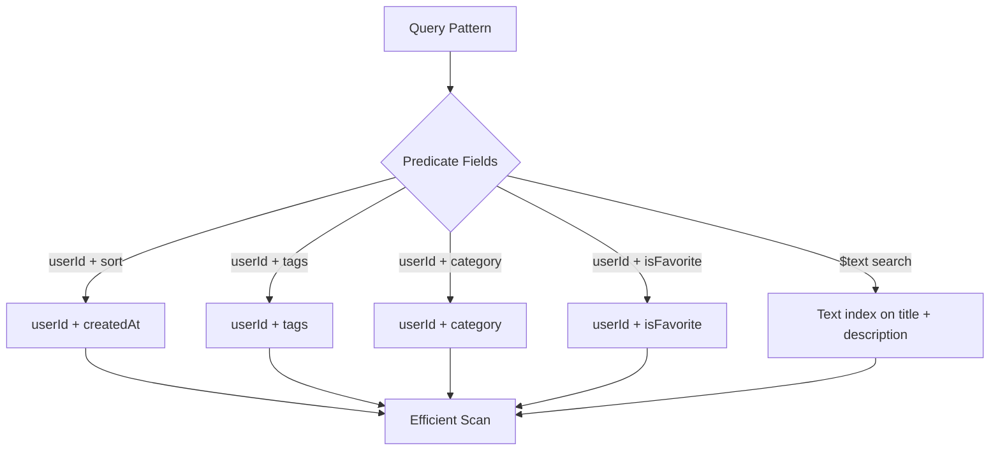

# Database Indexes

<cite>
**Referenced Files in This Document**
- [BUILD.md](file://doc/BUILD.md)
</cite>

## Table of Contents
1. [Introduction](#introduction)
2. [Project Structure](#project-structure)
3. [Core Components](#core-components)
4. [Architecture Overview](#architecture-overview)
5. [Detailed Component Analysis](#detailed-component-analysis)
6. [Dependency Analysis](#dependency-analysis)
7. [Performance Considerations](#performance-considerations)
8. [Troubleshooting Guide](#troubleshooting-guide)
9. [Conclusion](#conclusion)
10. [Appendices](#appendices)

## Introduction
This document provides comprehensive guidance for QuickLink’s MongoDB index design and optimization strategies. It covers unique indexes on user identifiers, text search indexes for full-text queries, compound indexes for user-scoped filtering and sorting, and tag-based indexing to support efficient filtering and sorting. It also includes rationale for each index choice based on query patterns, example creation scripts, maintenance procedures, and techniques for optimizing query performance through proper index selection, query planning, and slow query monitoring.

## Project Structure
QuickLink uses a Node.js/Express backend with MongoDB as the data store. The database schema and index definitions are documented in the project build documentation. The relevant sections define collections (users, links, accounts, tags) and the indexes created per collection to optimize common read and write workloads.

**Diagram sources**
- [BUILD.md:100-168](file://doc/BUILD.md#L100-L168)
- [BUILD.md:180-197](file://doc/BUILD.md#L180-L197)

**Section sources**
- [BUILD.md:96-197](file://doc/BUILD.md#L96-L197)

## Core Components
The core components for indexing are the four primary collections and their associated indexes:

- users
  - Unique indexes on username and email to enforce uniqueness and accelerate lookups by these fields.
- links
  - Compound indexes for user-scoped queries and sorting:
    - userId + createdAt for paginated lists sorted by time.
    - userId + tags for filtering by tags within a user scope.
    - userId + category for filtering by category within a user scope.
    - userId + isFavorite for toggling favorites efficiently.
  - Text index on title and description for full-text search across link metadata.
- accounts
  - Compound indexes for user-scoped queries:
    - userId + platform for listing or finding accounts by platform.
    - userId + tags for tag-based filtering.
    - userId + category for category-based filtering.
- tags
  - Unique compound index on userId + name to ensure one tag per user with a given name and to speed up tag lookups scoped to a user.

Rationale:
- User-scoped compound indexes align with multi-tenant access patterns where most queries filter by userId first, then by secondary fields.
- Text indexes enable fast full-text search without scanning entire collections.
- Unique constraints prevent duplicates and provide implicit high-performance equality lookups.

**Section sources**
- [BUILD.md:100-168](file://doc/BUILD.md#L100-L168)
- [BUILD.md:180-197](file://doc/BUILD.md#L180-L197)

## Architecture Overview
The indexing strategy supports the application’s key workflows:

- Authentication and user management rely on unique indexes for fast identity checks.
- Link browsing and searching leverage compound and text indexes to deliver responsive list views and full-text search results.
- Account management benefits from user-scoped compound indexes for quick retrieval and filtering.
- Tag management ensures uniqueness and fast lookup per user.

**Diagram sources**
- [BUILD.md:180-197](file://doc/BUILD.md#L180-L197)

## Detailed Component Analysis

### Users Collection Indexes
- Unique indexes on username and email:
  - Purpose: Enforce uniqueness and accelerate authentication flows that check credentials by username or email.
  - Benefits: O(1) average lookup for equality filters; prevents duplicate entries at the database level.

Example creation references:
- See unique constraints in the users schema definition.

**Section sources**
- [BUILD.md:100-112](file://doc/BUILD.md#L100-L112)

### Links Collection Indexes
- Compound indexes:
  - userId + createdAt: Optimizes paginated lists sorted by creation date within a user’s scope.
  - userId + tags: Supports filtering links by tags for a specific user.
  - userId + category: Supports filtering by category within a user’s scope.
  - userId + isFavorite: Supports toggling favorites and retrieving favorite links quickly.
- Text index:
  - title + description: Enables full-text search across link titles and descriptions.

Rationale:
- Most link operations are user-scoped; placing userId as the leading field maximizes index selectivity and reuse across multiple queries.
- Sorting by createdAt after userId avoids in-memory sorts and leverages index order.

Example creation references:
- See index definitions for links.

**Section sources**
- [BUILD.md:114-134](file://doc/BUILD.md#L114-L134)
- [BUILD.md:184-188](file://doc/BUILD.md#L184-L188)

### Accounts Collection Indexes
- Compound indexes:
  - userId + platform: Fast retrieval of accounts by platform within a user’s scope.
  - userId + tags: Tag-based filtering for accounts.
  - userId + category: Category-based filtering for accounts.

Rationale:
- Similar to links, account queries are typically scoped to a user and filtered by platform, tags, or category.

Example creation references:
- See index definitions for accounts.

**Section sources**
- [BUILD.md:136-156](file://doc/BUILD.md#L136-L156)
- [BUILD.md:191-193](file://doc/BUILD.md#L191-L193)

### Tags Collection Indexes
- Unique compound index on userId + name:
  - Ensures each user has unique tag names.
  - Accelerates tag lookups and enforces uniqueness at the database level.

Example creation references:
- See index definition for tags.

**Section sources**
- [BUILD.md:158-168](file://doc/BUILD.md#L158-L168)
- [BUILD.md:196](file://doc/BUILD.md#L196)

### Query Patterns and Index Selection
- Paginated link lists by user and date:
  - Uses userId + createdAt index to avoid sorting and reduce I/O.
- Full-text search:
  - Uses text index on title and description to perform efficient matching.
- Tag-based filtering:
  - Uses userId + tags index to narrow results within a user’s scope.
- Favorite toggling and retrieval:
  - Uses userId + isFavorite index for fast boolean filtering.

How MongoDB selects indexes:
- The optimizer chooses the index that best matches the query predicate and projection, prioritizing equality filters followed by range/sort fields.
- For text searches, the $text operator uses the text index when available.

**Section sources**
- [BUILD.md:184-197](file://doc/BUILD.md#L184-L197)

### Example Queries Leveraging Specific Indexes
- List links for a user, sorted by newest first:
  - Query filters by userId and sorts by createdAt descending; uses userId + createdAt index.
- Search links by keywords:
  - Uses $text search on title and description; leverages the text index.
- Filter links by tags for a user:
  - Filters by userId and tags array; uses userId + tags index.
- Retrieve favorite links for a user:
  - Filters by userId and isFavorite; uses userId + isFavorite index.

Note: These examples describe the intended index usage aligned with the documented index design.

**Section sources**
- [BUILD.md:184-197](file://doc/BUILD.md#L184-L197)

## Dependency Analysis
Indexes depend on the shape of queries and the distribution of data. Key dependencies include:
- Multi-tenant isolation via userId as the leading field in compound indexes.
- Text search requiring a dedicated text index to avoid full collection scans.
- Uniqueness constraints requiring unique indexes to maintain data integrity and improve lookup performance.

**Diagram sources**
- [BUILD.md:184-197](file://doc/BUILD.md#L184-L197)

**Section sources**
- [BUILD.md:184-197](file://doc/BUILD.md#L184-L197)

## Performance Considerations
- Index selection:
  - Ensure queries include equality predicates on leading index fields (e.g., userId) to maximize selectivity.
  - Sort fields should follow equality fields in compound indexes to avoid in-memory sorts.
- Query planning:
  - Use explain plans to verify index usage and identify unnecessary sorts or scans.
  - Prefer projections that match indexed fields to minimize data transfer.
- Monitoring slow queries:
  - Enable profiling or use built-in tools to capture slow queries and analyze their execution plans.
  - Regularly review and update indexes based on evolving query patterns.
- Write-heavy workloads:
  - Each additional index increases write overhead; balance read performance gains against write costs.
  - Consider background index builds during low-traffic periods to minimize impact.

[No sources needed since this section provides general guidance]

## Troubleshooting Guide
Common issues and resolutions:
- Missing index usage:
  - Verify that queries include fields present in the index prefix; adjust query predicates accordingly.
- Slow full-text search:
  - Confirm the presence of a text index on the targeted fields; validate language settings if necessary.
- Duplicate tag errors:
  - Ensure the unique compound index on userId + name exists; handle duplicate key errors gracefully in the application layer.
- High write latency:
  - Review index count and consider consolidating or removing unused indexes; schedule rebuilds during maintenance windows.

**Section sources**
- [BUILD.md:180-197](file://doc/BUILD.md#L180-L197)

## Conclusion
QuickLink’s index design centers on user-scoped compound indexes and a text index for full-text search. This approach optimizes the most frequent query patterns—paginated lists, filtering by tags/categories/favorites, and keyword search—while maintaining data integrity through unique constraints. By aligning indexes with actual workload characteristics and continuously monitoring performance, the system can deliver responsive reads while managing write overhead effectively.

[No sources needed since this section summarizes without analyzing specific files]

## Appendices

### Index Creation Scripts Reference
- links:
  - Compound indexes for userId with createdAt, tags, category, and isFavorite.
  - Text index on title and description.
- accounts:
  - Compound indexes for userId with platform, tags, and category.
- tags:
  - Unique compound index on userId and name.

References:
- See index definitions in the database design section.

**Section sources**
- [BUILD.md:184-197](file://doc/BUILD.md#L184-L197)

### Maintenance Procedures
- Rebuilding indexes:
  - Schedule index rebuilds during low-traffic periods to minimize impact on writes.
- Monitoring index usage:
  - Use explain plans and profiling to confirm index effectiveness and identify unused indexes.
- Optimizing for write-heavy workloads:
  - Evaluate the necessity of each index; remove or consolidate underutilized indexes to reduce write amplification.

**Section sources**
- [BUILD.md:180-197](file://doc/BUILD.md#L180-L197)