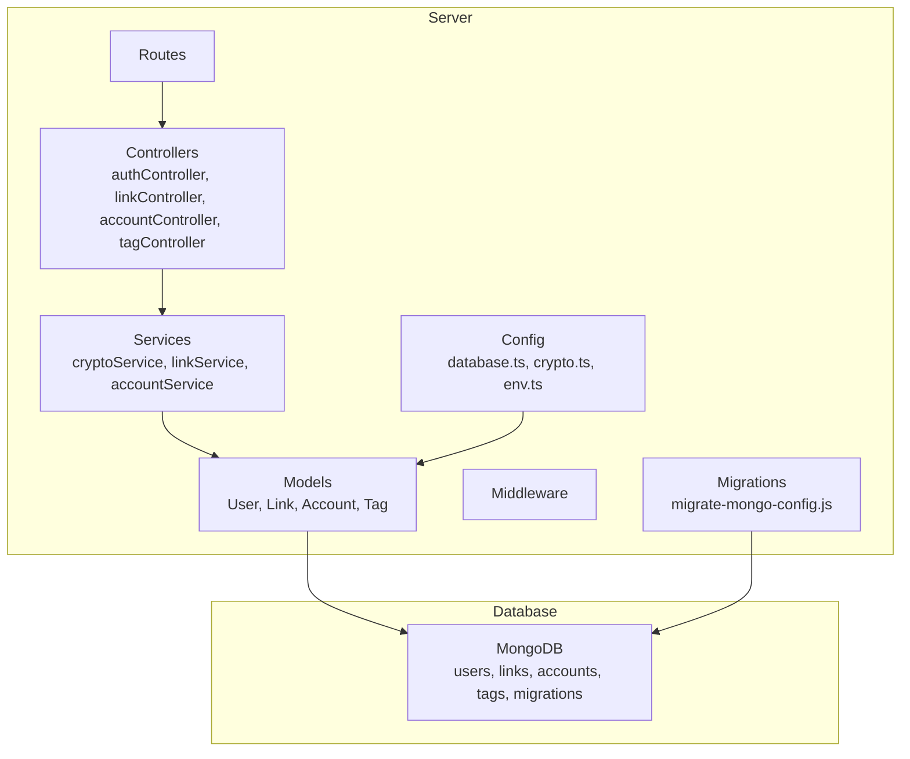
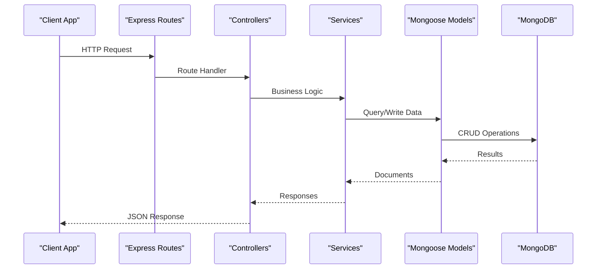
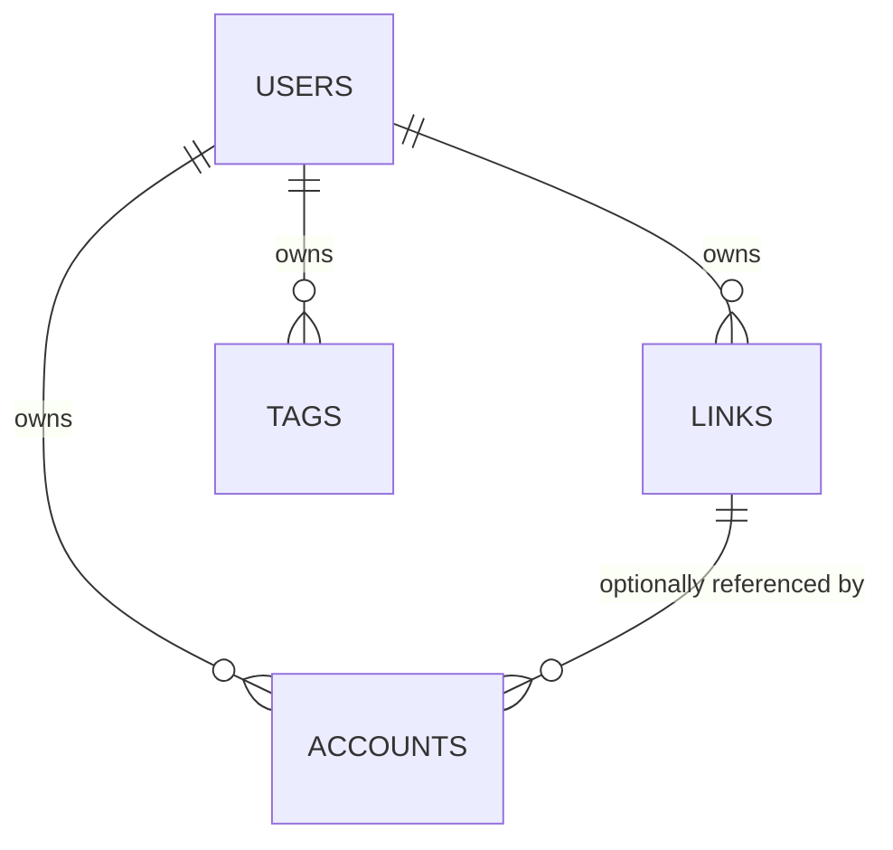

# Database Schema

<cite>
**Referenced Files in This Document**
- [BUILD.md](file://doc/BUILD.md)
</cite>

## Table of Contents
1. [Introduction](#introduction)
2. [Project Structure](#project-structure)
3. [Core Components](#core-components)
4. [Architecture Overview](#architecture-overview)
5. [Detailed Component Analysis](#detailed-component-analysis)
6. [Dependency Analysis](#dependency-analysis)
7. [Performance Considerations](#performance-considerations)
8. [Troubleshooting Guide](#troubleshooting-guide)
9. [Conclusion](#conclusion)
10. [Appendices](#appendices)

## Introduction
This document describes QuickLink’s MongoDB schema design and data model for the core entities: users, links, accounts, and tags. It covers field definitions, data types, validation rules, indexes, relationships, sample documents, lifecycle management, and migration strategies using migrate-mongo. The goal is to provide a clear, comprehensive reference for developers and operators working with QuickLink’s database layer.

## Project Structure
QuickLink uses a monorepo-style structure with separate client and server directories. The server contains Mongoose models, services, controllers, routes, middleware, and migrations. The database configuration and migration tooling are part of the server module.

**Diagram sources**
- [BUILD.md:33-92](file://doc/BUILD.md#L33-L92)
- [BUILD.md:196-225](file://doc/BUILD.md#L196-L225)

**Section sources**
- [BUILD.md:33-92](file://doc/BUILD.md#L33-L92)

## Core Components
QuickLink’s data model centers on four primary collections:

- users: Stores user identity and authentication material.
- links: Stores bookmarked links with metadata, categorization, flags, and click tracking.
- accounts: Stores encrypted credentials associated with platforms and optionally linked to links.
- tags: Stores user-scoped tags used for organization and color customization.

Key characteristics:
- All collections include standard audit timestamps (createdAt, updatedAt).
- Users have unique constraints on username and email.
- Links support full-text search over title and description.
- Accounts store sensitive fields (username, email, password, notes, totpSecret) using AES-256-GCM encryption derived from the user’s master key.
- Tags are scoped per user and enforce uniqueness per user.

**Section sources**
- [BUILD.md:100-178](file://doc/BUILD.md#L100-L178)
- [BUILD.md:180-197](file://doc/BUILD.md#L180-L197)

## Architecture Overview
The following diagram shows how the application layers interact with the database and each other.

**Diagram sources**
- [BUILD.md:33-92](file://doc/BUILD.md#L33-L92)
- [BUILD.md:285-336](file://doc/BUILD.md#L285-L336)

## Detailed Component Analysis

### users Collection
Purpose:
- Represents an authenticated user.
- Stores identity fields and secure authentication material.

Fields:
- _id: ObjectId — Primary key.
- username: string — Unique, required. User-facing identifier.
- email: string — Unique, required. Contact and recovery address.
- passwordHash: string — bcrypt hash of the user’s password. Used for login verification.
- masterKey: string — Encrypted value used to derive the symmetric key for encrypting/decrypting sensitive fields in other collections.
- createdAt: Date — Record creation timestamp.
- updatedAt: Date — Last update timestamp.

Validation and constraints:
- username and email must be unique across the collection.
- passwordHash must be present for authentication flows.
- masterKey must be present to enable encryption operations for accounts.

Relationships:
- One-to-many with links via userId references.
- One-to-many with accounts via userId references.
- One-to-many with tags via userId references.

Indexes:
- Unique index on username.
- Unique index on email.
- Compound indexes may be added for common queries such as login by email or username.

Sample document:
- See “Sample Documents” section below for a representative example.

Security considerations:
- passwordHash is never stored in plaintext; only the bcrypt hash is persisted.
- masterKey is encrypted at rest and should be managed securely; it underpins encryption for other collections.

**Section sources**
- [BUILD.md:100-112](file://doc/BUILD.md#L100-L112)
- [BUILD.md:340-351](file://doc/BUILD.md#L340-L351)

### links Collection
Purpose:
- Stores bookmarks with rich metadata, categorization, flags, and analytics.

Fields:
- _id: ObjectId — Primary key.
- userId: ObjectId (ref: users) — Owner of the link.
- url: string — Required. Target URL.
- title: string — Required. Display title.
- description: string — Optional. Additional context.
- icon: string — Optional. Favicon URL.
- screenshot: string — Optional. Path or URL to a screenshot asset.
- tags: array of strings — List of tag names for filtering and grouping.
- category: string — Optional. High-level grouping label.
- isFavorite: boolean — Default false. Marks favorites.
- isArchived: boolean — Default false. Indicates archived state.
- clickCount: number — Default 0. Tracks total clicks.
- lastVisitedAt: Date — Optional. Timestamp of last visit.
- createdAt: Date — Creation time.
- updatedAt: Date — Last modification time.

Validation and constraints:
- userId, url, and title are required.
- isFavorite and isArchived default to false if not provided.
- clickCount defaults to 0.

Indexes:
- Compound indexes for user-scoped queries:
  - { userId: 1, createdAt: -1 }
  - { userId: 1, tags: 1 }
  - { userId: 1, category: 1 }
  - { userId: 1, isFavorite: 1 }
- Text index for full-text search:
  - { title: "text", description: "text" } with language set to none.

Relationships:
- Belongs to a user via userId.
- Optionally associated with accounts via linkId in accounts.

Sample document:
- See “Sample Documents” section below for a representative example.

Search behavior:
- Full-text search supports querying title and description fields without language-specific tokenization.

**Section sources**
- [BUILD.md:114-134](file://doc/BUILD.md#L114-L134)
- [BUILD.md:180-188](file://doc/BUILD.md#L180-L188)

### accounts Collection
Purpose:
- Securely stores platform credentials and related metadata, optionally linked to a specific link.

Fields:
- _id: ObjectId — Primary key.
- userId: ObjectId (ref: users) — Owner of the credential.
- platform: string — Required. Platform name (e.g., GitHub, Gmail).
- linkId: ObjectId (ref: links) — Optional. Associates this credential with a link.
- username: string — Encrypted (AES-256-GCM).
- email: string — Encrypted (optional).
- password: string — Encrypted (AES-256-GCM).
- notes: string — Encrypted (optional).
- totpSecret: string — Encrypted (optional). Two-factor secret storage.
- tags: array of strings — For filtering and grouping.
- category: string — Optional. Grouping label.
- lastUsedAt: Date — Optional. Last access time.
- passwordUpdatedAt: Date — When password was last updated.
- createdAt: Date — Creation time.
- updatedAt: Date — Last modification time.

Validation and constraints:
- userId and platform are required.
- Sensitive fields are always encrypted at rest.

Indexes:
- Compound indexes for user-scoped queries:
  - { userId: 1, platform: 1 }
  - { userId: 1, tags: 1 }
  - { userId: 1, category: 1 }

Relationships:
- Belongs to a user via userId.
- Optionally references a link via linkId.

Encryption details:
- Uses AES-256-GCM for confidentiality and integrity.
- Encryption keys are derived from the user’s master key using PBKDF2.

Sample document:
- See “Sample Documents” section below for a representative example.

**Section sources**
- [BUILD.md:136-156](file://doc/BUILD.md#L136-L156)
- [BUILD.md:340-378](file://doc/BUILD.md#L340-L378)

### tags Collection
Purpose:
- Provides user-scoped tags for organizing links and accounts, with optional color customization.

Fields:
- _id: ObjectId — Primary key.
- userId: ObjectId (ref: users) — Owner of the tag.
- name: string — Required. Tag name.
- color: string — Optional. Hex or named color for UI display.
- createdAt: Date — Creation time.

Validation and constraints:
- userId and name are required.
- Unique constraint on (userId, name) prevents duplicate tags per user.

Indexes:
- Unique compound index on { userId: 1, name: 1 }.

Relationships:
- Belongs to a user via userId.
- Referenced by links and accounts via tag names.

Sample document:
- See “Sample Documents” section below for a representative example.

**Section sources**
- [BUILD.md:158-168](file://doc/BUILD.md#L158-L168)
- [BUILD.md:196-197](file://doc/BUILD.md#L196-L197)

### Sample Documents
Below are representative documents for each collection. These illustrate typical field usage and values.

- users:
  - _id: ObjectId
  - username: "alice"
  - email: "alice@example.com"
  - passwordHash: "<bcrypt hash>"
  - masterKey: "<encrypted master key>"
  - createdAt: ISODate
  - updatedAt: ISODate

- links:
  - _id: ObjectId
  - userId: ObjectId(ref: users)
  - url: "https://example.com"
  - title: "Example Site"
  - description: "A sample website"
  - icon: "https://example.com/favicon.ico"
  - screenshot: "/screenshots/example.png"
  - tags: ["work", "dev"]
  - category: "development"
  - isFavorite: true
  - isArchived: false
  - clickCount: 12
  - lastVisitedAt: ISODate
  - createdAt: ISODate
  - updatedAt: ISODate

- accounts:
  - _id: ObjectId
  - userId: ObjectId(ref: users)
  - platform: "GitHub"
  - linkId: ObjectId(ref: links)
  - username: "<encrypted>"
  - email: "<encrypted>"
  - password: "<encrypted>"
  - notes: "<encrypted>"
  - totpSecret: "<encrypted>"
  - tags: ["dev", "tools"]
  - category: "development"
  - lastUsedAt: ISODate
  - passwordUpdatedAt: ISODate
  - createdAt: ISODate
  - updatedAt: ISODate

- tags:
  - _id: ObjectId
  - userId: ObjectId(ref: users)
  - name: "work"
  - color: "#1677ff"
  - createdAt: ISODate

**Section sources**
- [BUILD.md:100-178](file://doc/BUILD.md#L100-L178)

## Dependency Analysis
Entity relationships and dependencies:

Explanation:
- Each user owns multiple links, accounts, and tags.
- An account can optionally reference a link via linkId.

**Diagram sources**
- [BUILD.md:100-178](file://doc/BUILD.md#L100-L178)

Index dependencies and performance:
- User-scoped compound indexes improve query performance for lists and filters.
- Text indexes enable efficient full-text search across link titles and descriptions.
- Unique constraints prevent duplicates and maintain data integrity.

**Section sources**
- [BUILD.md:180-197](file://doc/BUILD.md#L180-L197)

## Performance Considerations
- Use user-scoped compound indexes to optimize list views and filtered queries.
- Leverage text indexes for fast full-text search on links.
- Keep frequently accessed fields indexed (e.g., isFavorite, category).
- Avoid excessive writes to clickCount; consider batching or background updates if high volume.
- Ensure encryption/decryption operations are performed only when necessary to reduce CPU overhead.

[No sources needed since this section provides general guidance]

## Troubleshooting Guide
Common issues and resolutions:

- Duplicate username/email:
  - Cause: Violation of unique constraints on users.username or users.email.
  - Resolution: Ensure uniqueness during registration and updates.

- Missing required fields:
  - Cause: Insert/update missing required fields (e.g., userId, url, title for links; userId, platform for accounts).
  - Resolution: Validate inputs before writing to the database.

- Search returns no results:
  - Cause: Text index not created or query syntax incorrect.
  - Resolution: Verify text index exists and use proper $search or $text query patterns.

- Encryption failures:
  - Cause: Incorrect masterKey or key derivation parameters.
  - Resolution: Confirm masterKey presence and consistent PBKDF2 parameters.

- Migration errors:
  - Cause: Inconsistent migration state or failed up/down scripts.
  - Resolution: Check migrate-mongo status and review migration logs.

**Section sources**
- [BUILD.md:180-197](file://doc/BUILD.md#L180-L197)
- [BUILD.md:201-281](file://doc/BUILD.md#L201-L281)

## Conclusion
QuickLink’s MongoDB schema is designed for scalability, security, and usability. The users collection anchors identity and encryption, while links and accounts provide rich metadata and secure credential storage. Tags enable flexible organization. Thoughtful indexing and migration practices ensure performance and maintainability. Following these guidelines will help teams implement robust features and evolve the schema safely over time.

[No sources needed since this section summarizes without analyzing specific files]

## Appendices

### Database Index Design Summary
- users:
  - Unique index on username.
  - Unique index on email.
- links:
  - Compound indexes: { userId: 1, createdAt: -1 }, { userId: 1, tags: 1 }, { userId: 1, category: 1 }, { userId: 1, isFavorite: 1 }.
  - Text index: { title: "text", description: "text" } with default_language set to none.
- accounts:
  - Compound indexes: { userId: 1, platform: 1 }, { userId: 1, tags: 1 }, { userId: 1, category: 1 }.
- tags:
  - Unique compound index: { userId: 1, name: 1 }.

**Section sources**
- [BUILD.md:180-197](file://doc/BUILD.md#L180-L197)

### Migration Strategy with migrate-mongo
- Configuration:
  - MongoDB connection and database name via environment variables.
  - Migration directory and changelog collection configured.
- Naming convention:
  - Timestamp-based filenames for deterministic ordering.
- Lifecycle:
  - Create initial schema and indexes in the first migration.
  - Add new fields or indexes in subsequent migrations.
  - Provide down functions to rollback changes where safe.
- Commands:
  - Status, up, down, create commands for managing migrations.

**Section sources**
- [BUILD.md:201-281](file://doc/BUILD.md#L201-L281)

### Data Lifecycle Management
- Creation:
  - New users register with unique username/email and hashed passwords.
  - Links and accounts are created with required fields and defaults.
- Updates:
  - Update timestamps reflect modifications.
  - Click counts increment on link visits.
- Deletion:
  - Deleting a user cascades logically by removing their links, accounts, and tags.
- Archival:
  - Links can be archived without deletion for retention and retrieval.

**Section sources**
- [BUILD.md:100-178](file://doc/BUILD.md#L100-L178)