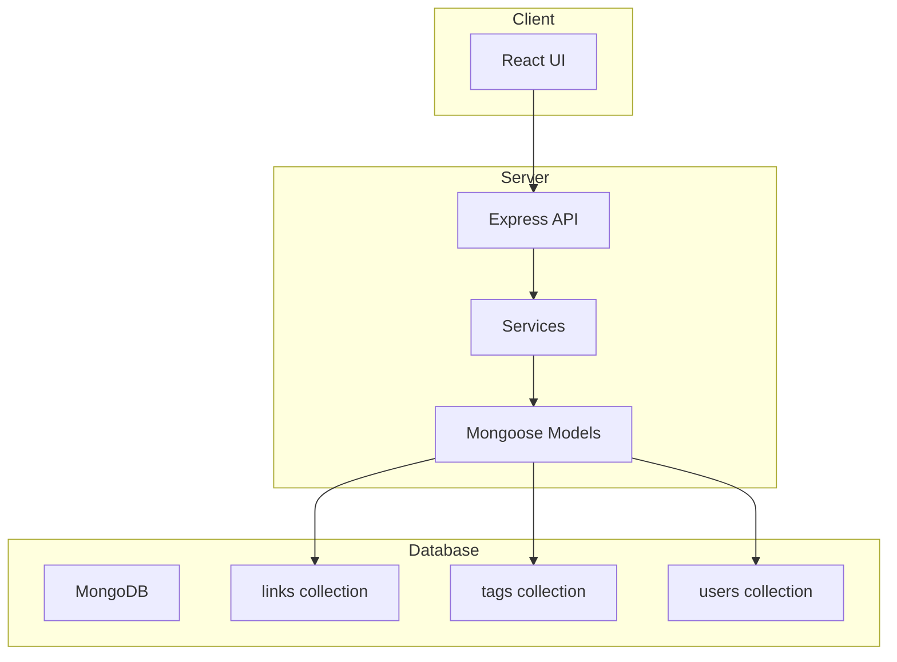
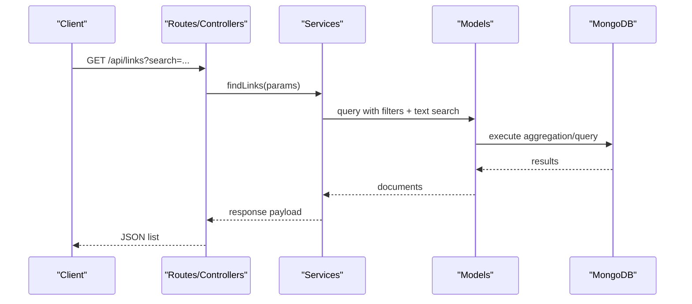
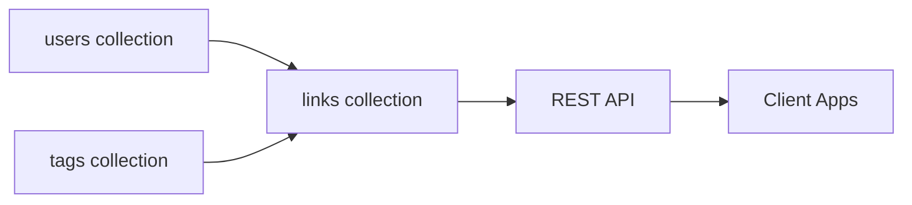

# Links Collection

<cite>
**Referenced Files in This Document**
- [BUILD.md](file://doc/BUILD.md)
</cite>

## Table of Contents
1. [Introduction](#introduction)
2. [Project Structure](#project-structure)
3. [Core Components](#core-components)
4. [Architecture Overview](#architecture-overview)
5. [Detailed Component Analysis](#detailed-component-analysis)
6. [Dependency Analysis](#dependency-analysis)
7. [Performance Considerations](#performance-considerations)
8. [Troubleshooting Guide](#troubleshooting-guide)
9. [Conclusion](#conclusion)

## Introduction
This document describes the links collection used to store web bookmarks and URLs for the QuickLink application. It covers the full schema, relationships with users and tags, full-text search using MongoDB text indexes, indexing strategy for performance, and example documents representing different states (active, favorite, archived). The guidance is derived from the project’s database design and index definitions documented in the build guide.

## Project Structure
The QuickLink project uses a monorepo layout with separate client and server directories and a MongoDB-backed backend. The links collection resides in the server’s data layer and is accessed via REST APIs exposed by the server.

[No sources needed since this diagram shows conceptual workflow, not actual code structure]

## Core Components
The links collection stores each bookmark as a document with fields for identity, content, categorization, activity tracking, and ownership. Key fields include:
- _id: ObjectId primary key
- userId: reference to the owning user
- url: required string for the link address
- title: required string for display name
- description: optional string for detailed information
- icon: optional favicon URL
- screenshot: optional path or URL for a screenshot
- tags: array of strings for categorization labels
- category: optional string for grouping
- isFavorite: boolean flag for quick access
- isArchived: boolean for inactive items
- clickCount: number for usage analytics
- lastVisitedAt: optional date for activity tracking
- createdAt: timestamp
- updatedAt: timestamp

Relationships:
- User ownership: Each link belongs to a user via userId.
- Tags: Links carry an array of tag names; tags themselves are stored in a separate tags collection and can be scoped per user.

Full-text search:
- A text index is defined over title and description to support full-text queries across those fields.

Indexing strategy:
- Compound indexes optimize common user-scoped queries such as listing by creation date, filtering by tags, category, and favorites.
- Text search index enables efficient full-text search over title and description.

API surface:
- Standard CRUD endpoints for links exist, including list, get, create, update, delete, batch import/export, and a search endpoint for full-text queries.

**Section sources**
- [BUILD.md:114-134](file://doc/BUILD.md#L114-L134)
- [BUILD.md:180-197](file://doc/BUILD.md#L180-L197)
- [BUILD.md:297-335](file://doc/BUILD.md#L297-L335)

## Architecture Overview
The links feature follows a layered architecture:
- Client sends HTTP requests to the server’s REST API.
- Server controllers handle routing and validation, delegating to services.
- Services implement business logic and interact with Mongoose models.
- Models define schemas and indexes and communicate with MongoDB collections.

[No sources needed since this diagram shows conceptual workflow, not actual code structure]

## Detailed Component Analysis

### Links Schema
The links collection documents represent individual bookmarks. Fields capture identity, content, categorization, activity metrics, timestamps, and ownership. Optional fields allow flexibility for icons, screenshots, and visit history.

Key characteristics:
- Ownership model: userId ties each link to a specific user.
- Categorization: category groups links; tags provide flexible multi-label classification.
- Activity tracking: clickCount and lastVisitedAt record usage and recency.
- State flags: isFavorite and isArchived enable quick access and archival workflows.

Example documents (representative states):
- Active, unfavorite, unarchived link with tags and category.
- Favorite link with increased clickCount and recent lastVisitedAt.
- Archived link with zero clicks and no recent visit.

[No sources needed since this section summarizes schema semantics without quoting code]

**Section sources**
- [BUILD.md:114-134](file://doc/BUILD.md#L114-L134)

### Full-Text Search Implementation
Full-text search is enabled via a MongoDB text index on title and description. Queries use the $text operator to match terms across these fields. The index configuration disables default language processing to treat tokens uniformly.

Search capabilities:
- Phrase matching and term weighting supported by MongoDB text search.
- Combined with other filters (userId, category, tags, favorite/archived) for precise result sets.

Query patterns:
- Simple keyword search across title and description.
- Boolean operators for advanced queries (AND/OR/NOT) where applicable.

**Section sources**
- [BUILD.md:180-197](file://doc/BUILD.md#L180-L197)

### Relationship with Tags Collection
Tags are stored in a dedicated tags collection with user scoping. Links reference tags by name within an array field. This design supports:
- Per-user tag namespaces to avoid collisions.
- Flexible tagging without strict referential integrity at the database level.
- Efficient filtering by tags via compound indexes on userId and tags.

User ownership model:
- Both links and tags are associated with userId, ensuring isolation between users’ data.
- Aggregations can join or filter by tags while respecting user boundaries.

**Section sources**
- [BUILD.md:158-168](file://doc/BUILD.md#L158-L168)
- [BUILD.md:180-197](file://doc/BUILD.md#L180-L197)

### Indexing Strategy for Performance
Indexes are designed to accelerate common queries and searches:
- User-scoped listing by creation date: { userId: 1, createdAt: -1 }
- Filtering by tags: { userId: 1, tags: 1 }
- Grouping by category: { userId: 1, category: 1 }
- Favorites filtering: { userId: 1, isFavorite: 1 }
- Full-text search: text index on { title: "text", description: "text" } with default_language set to none

These indexes reduce scan costs for frequent operations such as paginated lists, filtered views, and search results.

**Section sources**
- [BUILD.md:180-197](file://doc/BUILD.md#L180-L197)

### API Endpoints for Links
The server exposes standard REST endpoints for managing links:
- List links with pagination and filters
- Get a single link by ID
- Create a new link
- Update an existing link
- Delete a link
- Batch import links
- Export links in JSON or CSV
- Full-text search endpoint

Common query parameters include page, limit, sort, tag, category, favorite, and search.

**Section sources**
- [BUILD.md:297-335](file://doc/BUILD.md#L297-L335)

## Dependency Analysis
The links feature depends on:
- users collection for ownership and authentication context
- tags collection for categorization metadata
- MongoDB text index for search performance
- Express routes/controllers for request handling
- Services and models for business logic and persistence

[No sources needed since this diagram shows conceptual relationships, not actual code structure]

## Performance Considerations
- Use compound indexes to optimize user-scoped queries and filters.
- Leverage text indexes for full-text search on title and description.
- Keep frequently filtered fields indexed (category, tags, isFavorite).
- Avoid unnecessary projections in queries to reduce payload size.
- Monitor index usage and query plans to ensure optimal performance.

[No sources needed since this section provides general guidance]

## Troubleshooting Guide
Common issues and resolutions:
- Missing text index: Ensure a text index exists on title and description for search endpoints to function efficiently.
- Slow user-scoped queries: Verify compound indexes on userId combined with commonly filtered fields (createdAt, tags, category, isFavorite).
- Tag mismatches: Confirm tag names are consistent between links and tags collection entries.
- Pagination performance: Use appropriate sort and limit parameters to avoid large scans.

[No sources needed since this section provides general guidance]

## Conclusion
The links collection provides a robust foundation for storing and retrieving web bookmarks with strong support for user ownership, categorization, and full-text search. The defined indexes and API surface enable efficient querying and a smooth user experience. By following the indexing strategy and leveraging text search, applications can deliver fast and scalable link management features.