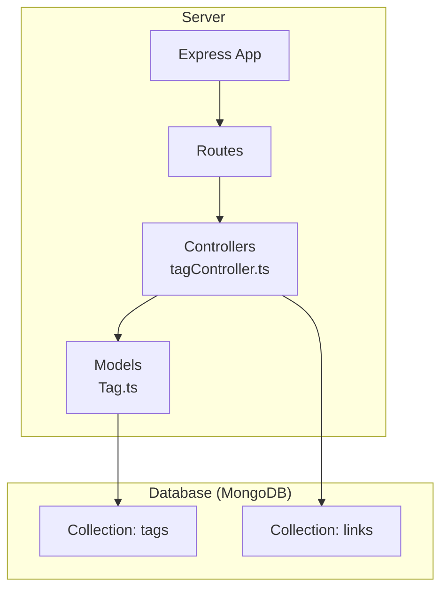
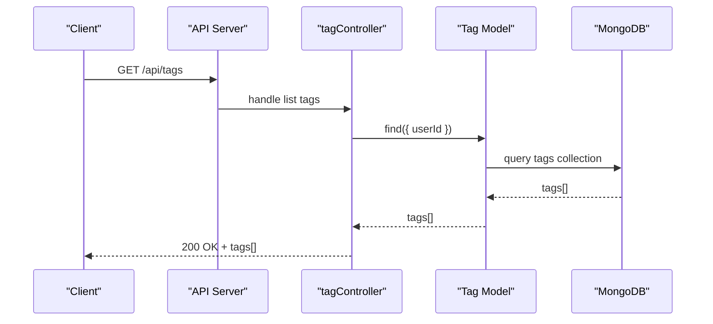
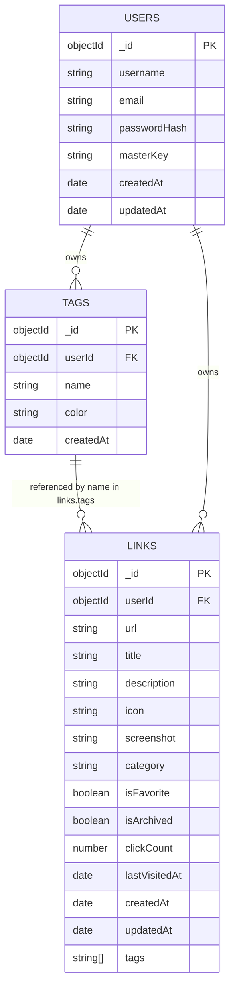
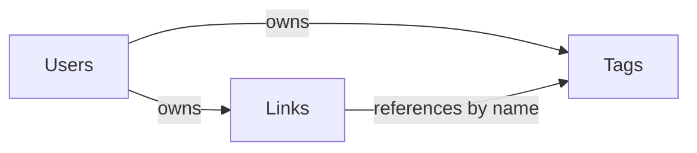
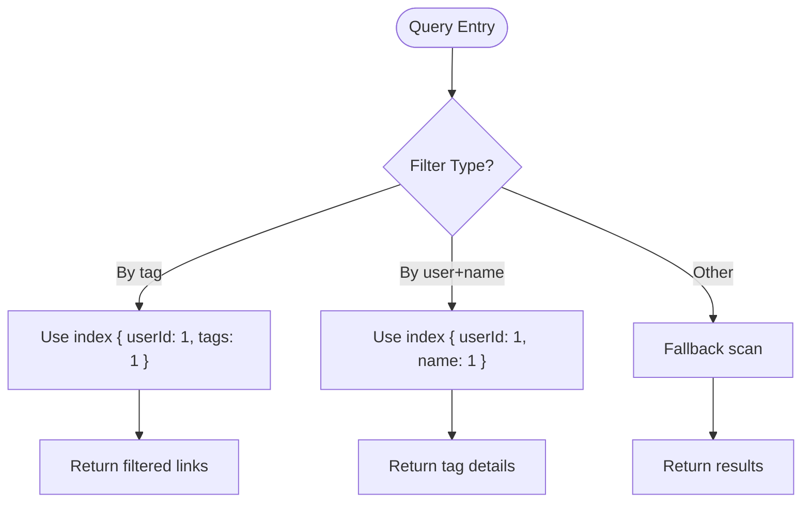

# Tags Collection

<cite>
**Referenced Files in This Document**
- [BUILD.md](file://doc/BUILD.md)
</cite>

## Table of Contents
1. [Introduction](#introduction)
2. [Project Structure](#project-structure)
3. [Core Components](#core-components)
4. [Architecture Overview](#architecture-overview)
5. [Detailed Component Analysis](#detailed-component-analysis)
6. [Dependency Analysis](#dependency-analysis)
7. [Performance Considerations](#performance-considerations)
8. [Troubleshooting Guide](#troubleshooting-guide)
9. [Conclusion](#conclusion)
10. [Appendices](#appendices)

## Introduction
This document describes the tags collection schema used for content organization and categorization within the QuickLink project. It explains how tags are modeled, how they relate to links, and how they can be managed through the API. It also covers indexing strategies that enable efficient tag-based queries and filtering across large datasets.

## Project Structure
The project is a monorepo with separate client and server directories. The backend uses Express with TypeScript and Mongoose models for MongoDB collections including tags and links. The database design and indexes are defined in the build documentation.

**Diagram sources**
- [BUILD.md:33-92](file://doc/BUILD.md#L33-L92)
- [BUILD.md:96-198](file://doc/BUILD.md#L96-L198)

**Section sources**
- [BUILD.md:33-92](file://doc/BUILD.md#L33-L92)
- [BUILD.md:96-198](file://doc/BUILD.md#L96-L198)

## Core Components
- Tags collection stores user-owned tags with metadata such as name and color.
- Links collection references tags by an array of tag names, enabling many-to-many relationships between links and tags.
- Indexes on tags and links support fast lookups by userId, tag names, and other common filters.

Key fields and relationships:
- tags collection:
  - _id: ObjectId
  - userId: ObjectId (reference to users)
  - name: string (required)
  - color: string (optional; hex color code for UI display)
  - createdAt: Date
- links collection:
  - tags: array of strings referencing tag names
  - userId: ObjectId (reference to users)
  - additional link fields as defined in the schema

Note: The current tags schema does not include updatedAt or usageCount fields. These can be added via migrations if needed.

**Section sources**
- [BUILD.md:158-168](file://doc/BUILD.md#L158-L168)
- [BUILD.md:114-134](file://doc/BUILD.md#L114-L134)

## Architecture Overview
The tag system integrates with the links collection through arrays of tag names. Queries typically filter links by tag names and/or by userId. Indexes ensure performance at scale.

**Diagram sources**
- [BUILD.md:322-330](file://doc/BUILD.md#L322-L330)
- [BUILD.md:96-198](file://doc/BUILD.md#L96-L198)

## Detailed Component Analysis

### Tags Schema and Relationships
- Ownership: Each tag belongs to a specific user via userId.
- Identification: name serves as the tag identifier and is unique per user.
- Display: color is an optional hex color code used by the UI to render tag badges.
- Timestamps: createdAt records when a tag was created.
- Association with links: links.tags is an array of tag names. This allows multiple tags per link and supports hierarchical naming conventions (e.g., “work/frontend”, “work/backend”) if desired.

**Diagram sources**
- [BUILD.md:100-112](file://doc/BUILD.md#L100-L112)
- [BUILD.md:114-134](file://doc/BUILD.md#L114-L134)
- [BUILD.md:158-168](file://doc/BUILD.md#L158-L168)

### Tag Management Operations
The API exposes standard CRUD endpoints for tags:
- List tags: GET /api/tags
- Create tag: POST /api/tags
- Update tag: PUT /api/tags/:id
- Delete tag: DELETE /api/tags/:id

These operations allow:
- Creating new tags with name and optional color
- Renaming tags by updating the name field
- Updating colors for visual customization
- Deleting tags when no longer needed

When renaming a tag, consider whether existing links should be updated to reflect the new name. If so, implement a migration step that updates links.tags entries accordingly.

**Section sources**
- [BUILD.md:322-330](file://doc/BUILD.md#L322-L330)

### Color Customization
- The color field is optional and intended for UI display.
- Typical values are hex color codes (e.g., “#FF5733”).
- Clients can render tag badges using this color.

**Section sources**
- [BUILD.md:158-168](file://doc/BUILD.md#L158-L168)

### Tag Hierarchy Possibilities
- While the schema does not enforce hierarchy, you can simulate it using naming conventions in the name field (e.g., “work/frontend”, “work/backend”).
- Queries can then use prefix matching or regex patterns to group related tags.

[No sources needed since this section provides conceptual guidance]

### Sample Tag Documents
Below are example documents illustrating different colors and usage patterns. Replace placeholders with actual values when implementing.

- Example 1: Basic tag with default color
  - userId: <ObjectId>
  - name: "work"
  - color: null or omitted
  - createdAt: <Date>

- Example 2: Tag with custom color
  - userId: <ObjectId>
  - name: "personal"
  - color: "#4CAF50"
  - createdAt: <Date>

- Example 3: Hierarchical-style tag
  - userId: <ObjectId>
  - name: "work/frontend"
  - color: "#2196F3"
  - createdAt: <Date>

[No sources needed since this section provides conceptual examples]

### Usage Count Tracking
- The current tags schema does not include a usageCount field.
- To track popularity, add a usageCount field and increment it whenever a link references the tag.
- Alternatively, compute usage counts on the fly by aggregating over links.tags.

[No sources needed since this section provides conceptual guidance]

## Dependency Analysis
Tags depend on users for ownership and are referenced by links via arrays of tag names. Indexes optimize common queries.

**Diagram sources**
- [BUILD.md:100-112](file://doc/BUILD.md#L100-L112)
- [BUILD.md:114-134](file://doc/BUILD.md#L114-L134)
- [BUILD.md:158-168](file://doc/BUILD.md#L158-L168)

**Section sources**
- [BUILD.md:100-112](file://doc/BUILD.md#L100-L112)
- [BUILD.md:114-134](file://doc/BUILD.md#L114-L134)
- [BUILD.md:158-168](file://doc/BUILD.md#L158-L168)

## Performance Considerations
Indexes are defined to support efficient queries:
- tags: unique index on { userId: 1, name: 1 } ensures uniqueness per user and speeds up lookups.
- links: index on { userId: 1, tags: 1 } enables fast filtering of links by tag names within a user’s scope.
- Additional useful indexes include { userId: 1, category: 1 } and full-text search on title/description.

**Diagram sources**
- [BUILD.md:180-198](file://doc/BUILD.md#L180-L198)

**Section sources**
- [BUILD.md:180-198](file://doc/BUILD.md#L180-L198)

## Troubleshooting Guide
Common issues and resolutions:
- Duplicate tag names per user: The unique index on { userId: 1, name: 1 } will reject duplicates. Ensure your application handles duplicate creation attempts gracefully.
- Orphaned tag references: When renaming or deleting tags, verify whether links.tags need to be updated to avoid stale references.
- Missing timestamps or usage count: If you require updatedAt or usageCount, add them via migrations and update relevant services.

**Section sources**
- [BUILD.md:180-198](file://doc/BUILD.md#L180-L198)

## Conclusion
The tags collection provides a flexible, user-scoped tagging system integrated with links through arrays of tag names. With appropriate indexes, queries remain efficient even at scale. Optional color customization enhances UI presentation. For advanced needs like usage tracking or hierarchical structures, extend the schema and leverage naming conventions.

## Appendices

### API Endpoints for Tags
- GET /api/tags
- POST /api/tags
- PUT /api/tags/:id
- DELETE /api/tags/:id

**Section sources**
- [BUILD.md:322-330](file://doc/BUILD.md#L322-L330)