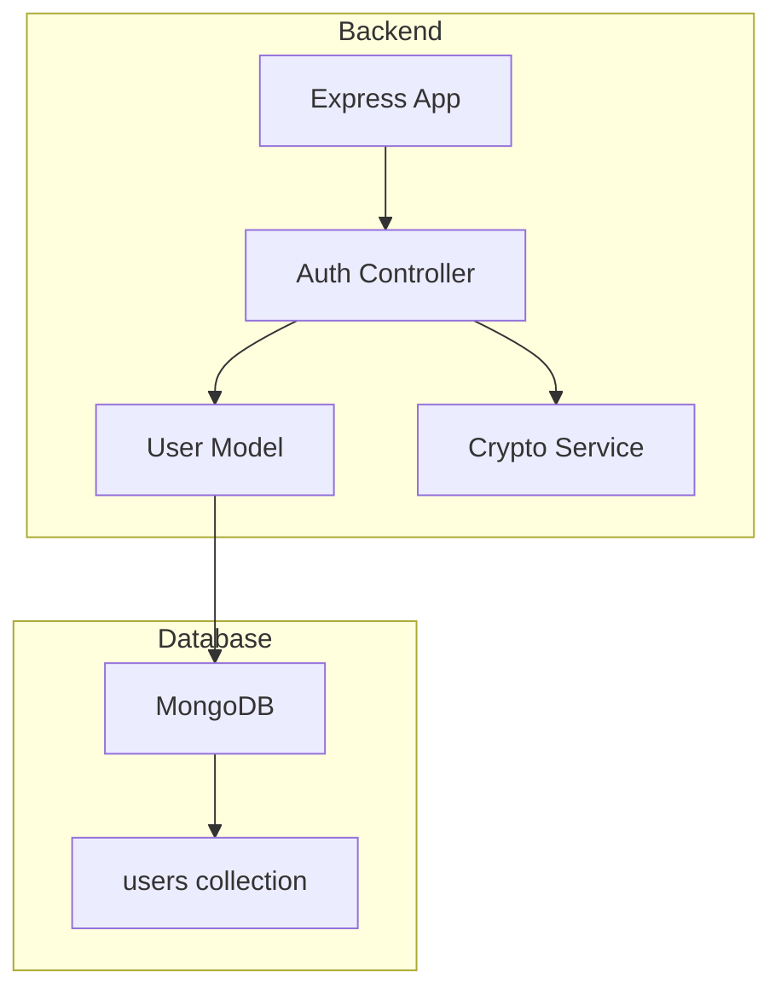
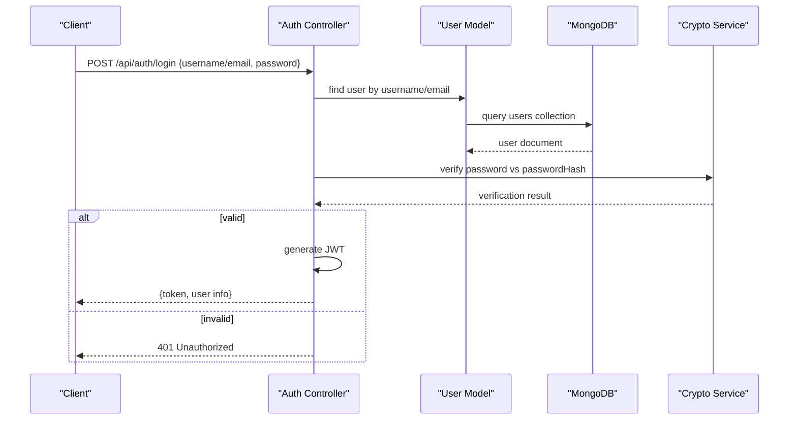
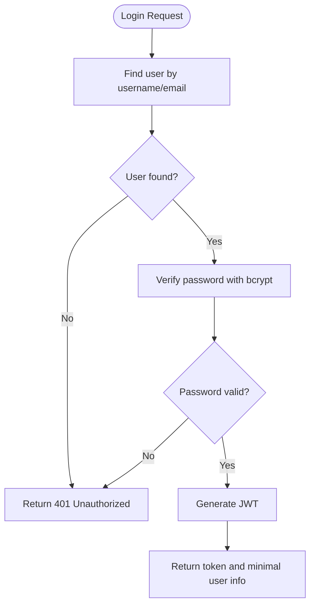
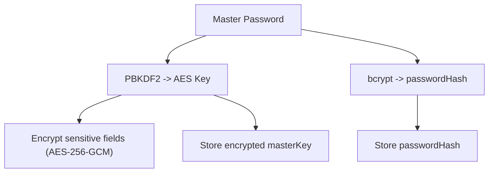
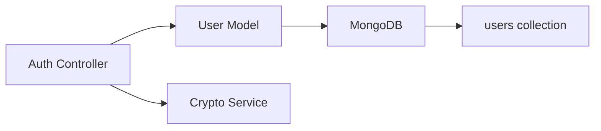

# Users Collection

<cite>
**Referenced Files in This Document**
- [BUILD.md](file://doc/BUILD.md)
</cite>

## Table of Contents
1. [Introduction](#introduction)
2. [Project Structure](#project-structure)
3. [Core Components](#core-components)
4. [Architecture Overview](#architecture-overview)
5. [Detailed Component Analysis](#detailed-component-analysis)
6. [Dependency Analysis](#dependency-analysis)
7. [Performance Considerations](#performance-considerations)
8. [Troubleshooting Guide](#troubleshooting-guide)
9. [Conclusion](#conclusion)
10. [Appendices](#appendices)

## Introduction
This document specifies the MongoDB users collection schema for QuickLink, including field definitions, validation rules, data types, and constraints. It also explains how the users collection integrates with authentication (JWT), session management, encryption practices (bcrypt and AES-256-GCM), security considerations, and common queries for user lookup, authentication, and profile updates.

## Project Structure
QuickLink’s backend is a Node.js + Express + TypeScript application that uses MongoDB as its database. The project structure includes server-side controllers, models, routes, middleware, services, and migrations. The users collection is defined within the database design section of the build documentation.

[No sources needed since this diagram shows conceptual workflow, not actual code structure]

## Core Components
The users collection stores core identity and security-related fields:
- _id: ObjectId (primary key)
- username: string (unique, required) — unique identifier for the user
- email: string (unique, required) — used for authentication and communication
- passwordHash: string (required) — bcrypt hash of the user’s password
- masterKey: string (encrypted) — encrypted value used to derive an AES-256-GCM key for encrypting sensitive account data
- createdAt: Date — record creation timestamp
- updatedAt: Date — last update timestamp

Validation and constraints:
- Unique indexes on username and email to prevent duplicates
- Required fields enforced at the application layer; optional schema-level validation can be applied via migration scripts
- Timestamps managed by application logic or Mongoose defaults

Security notes:
- Passwords are never stored in plaintext; only bcrypt hashes are persisted
- masterKey is stored encrypted; it should be derived from the user’s master password using PBKDF2 and used to encrypt/decrypt sensitive fields such as account credentials

Sample user document structure:
- See the users collection sample in the database design section for a typical document shape.

**Section sources**
- [BUILD.md:100-112](file://doc/BUILD.md#L100-L112)

## Architecture Overview
Authentication flow integrates JWT tokens with the users collection:
- Registration: create a new user with hashed password and encrypted master key
- Login: verify password against passwordHash, issue a JWT token
- Protected routes: validate JWT before accessing user-specific resources
- Session management: stateless via JWT; consider refresh tokens if long-lived sessions are required

**Diagram sources**
- [BUILD.md:287-295](file://doc/BUILD.md#L287-L295)
- [BUILD.md:341-351](file://doc/BUILD.md#L341-L351)

**Section sources**
- [BUILD.md:287-295](file://doc/BUILD.md#L287-L295)
- [BUILD.md:341-351](file://doc/BUILD.md#L341-L351)

## Detailed Component Analysis

### Users Collection Schema
Field definitions and constraints:
- _id: ObjectId — primary key generated by MongoDB
- username: string — unique, required; serves as the unique identifier
- email: string — unique, required; used for login and notifications
- passwordHash: string — bcrypt hash; never store raw passwords
- masterKey: string — encrypted; used to derive AES-256-GCM key for sensitive data
- createdAt: Date — auto-set on creation
- updatedAt: Date — updated on modifications

Indexes:
- Unique index on username
- Unique index on email

Data types and validation:
- Enforce required fields at the API layer
- Apply schema validation via migrations if desired
- Ensure timestamps are set consistently

Example document shape:
- Refer to the users collection sample in the database design section.

**Section sources**
- [BUILD.md:100-112](file://doc/BUILD.md#L100-L112)

### Authentication Flow Integration
- Registration:
  - Validate input (username, email, password)
  - Hash password with bcrypt
  - Derive AES key from master password using PBKDF2 and store encrypted masterKey
  - Create user document with timestamps
- Login:
  - Find user by username or email
  - Verify password against passwordHash
  - Issue JWT with appropriate claims and expiration
- Protected endpoints:
  - Validate JWT in middleware
  - Attach user context to request
- Logout:
  - Invalidate client-side token; optionally maintain a short-lived blacklist if needed

**Diagram sources**
- [BUILD.md:287-295](file://doc/BUILD.md#L287-L295)
- [BUILD.md:341-351](file://doc/BUILD.md#L341-L351)

**Section sources**
- [BUILD.md:287-295](file://doc/BUILD.md#L287-L295)
- [BUILD.md:341-351](file://doc/BUILD.md#L341-L351)

### Encryption and Security Considerations
- Password hashing:
  - Use bcrypt for passwordHash; ensure proper salt rounds
- Master key derivation and storage:
  - Derive AES-256-GCM key from master password using PBKDF2
  - Store masterKey encrypted; never store plaintext master password
- Sensitive data encryption:
  - Use AES-256-GCM for encrypting account credentials and other sensitive fields
- Security checklist:
  - HTTPS for all APIs
  - Reasonable JWT expiration
  - Rate limiting on auth endpoints
  - Input validation and sanitization
  - CORS configuration
  - Audit logging for sensitive operations
  - Strong password policy enforcement

**Diagram sources**
- [BUILD.md:341-351](file://doc/BUILD.md#L341-L351)
- [BUILD.md:353-378](file://doc/BUILD.md#L353-L378)

**Section sources**
- [BUILD.md:341-351](file://doc/BUILD.md#L341-L351)
- [BUILD.md:353-378](file://doc/BUILD.md#L353-L378)
- [BUILD.md:380-390](file://doc/BUILD.md#L380-L390)

### Common Queries
- User lookup by username:
  - Query users collection where username equals the provided value
- User lookup by email:
  - Query users collection where email equals the provided value
- Authentication:
  - Retrieve user by username/email, then compare provided password against passwordHash
- Profile updates:
  - Update fields like email or username with validation; ensure uniqueness constraints are respected
- Timestamps:
  - Set createdAt on creation; update updatedAt on any modification

Note: These queries align with the API endpoints for authentication and user management.

**Section sources**
- [BUILD.md:287-295](file://doc/BUILD.md#L287-L295)
- [BUILD.md:100-112](file://doc/BUILD.md#L100-L112)

## Dependency Analysis
The users collection depends on:
- Authentication controller for login/register flows
- User model for database interactions
- Crypto service for password hashing and encryption
- MongoDB for persistence

**Diagram sources**
- [BUILD.md:287-295](file://doc/BUILD.md#L287-L295)
- [BUILD.md:341-351](file://doc/BUILD.md#L341-L351)

**Section sources**
- [BUILD.md:287-295](file://doc/BUILD.md#L287-L295)
- [BUILD.md:341-351](file://doc/BUILD.md#L341-L351)

## Performance Considerations
- Indexes:
  - Unique indexes on username and email improve lookup performance
- Query optimization:
  - Select only necessary fields when returning user profiles
- Encryption overhead:
  - Minimize decrypt operations; cache decrypted values per request scope if safe
- Connection pooling:
  - Configure MongoDB connection pool appropriately for expected load

[No sources needed since this section provides general guidance]

## Troubleshooting Guide
Common issues and resolutions:
- Duplicate username/email:
  - Ensure unique constraints are enforced; handle duplicate key errors gracefully
- Invalid password:
  - Verify bcrypt comparison logic and ensure correct password input handling
- JWT failures:
  - Check token expiration, secret configuration, and middleware validation
- Encryption errors:
  - Validate IV, auth tag, and key derivation steps; ensure consistent encoding formats

Operational checks:
- Confirm environment variables for MongoDB, JWT secrets, and encryption salts
- Review rate limiting and input validation configurations

**Section sources**
- [BUILD.md:380-390](file://doc/BUILD.md#L380-L390)
- [BUILD.md:396-416](file://doc/BUILD.md#L396-L416)

## Conclusion
The users collection underpins QuickLink’s identity and security model. By enforcing strict field constraints, leveraging bcrypt for password hashing, and using AES-256-GCM with a securely derived master key, the system maintains strong confidentiality and integrity for sensitive data. Integrating JWT-based authentication ensures secure, stateless access control across protected endpoints.

[No sources needed since this section summarizes without analyzing specific files]

## Appendices

### Field Reference
- _id: ObjectId — primary key
- username: string — unique, required
- email: string — unique, required
- passwordHash: string — bcrypt hash
- masterKey: string — encrypted; used to derive AES-256-GCM key
- createdAt: Date
- updatedAt: Date

**Section sources**
- [BUILD.md:100-112](file://doc/BUILD.md#L100-L112)

### API Endpoints Related to Users
- POST /api/auth/register
- POST /api/auth/login
- POST /api/auth/logout
- GET /api/auth/me
- PUT /api/auth/password

**Section sources**
- [BUILD.md:287-295](file://doc/BUILD.md#L287-L295)

### Environment Variables
- MONGODB_URI
- MONGODB_DB_NAME
- JWT_SECRET
- JWT_EXPIRES_IN
- ENCRYPTION_SALT

**Section sources**
- [BUILD.md:396-416](file://doc/BUILD.md#L396-L416)