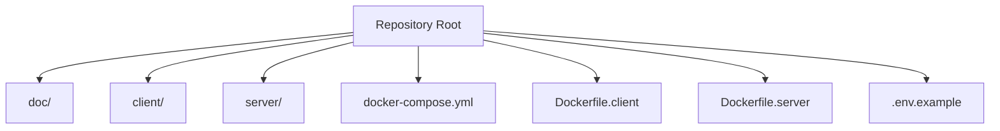
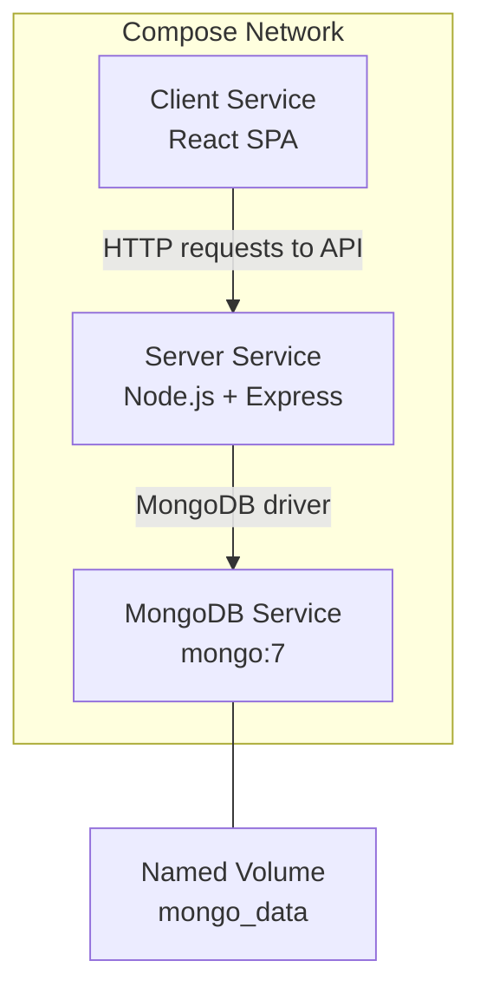
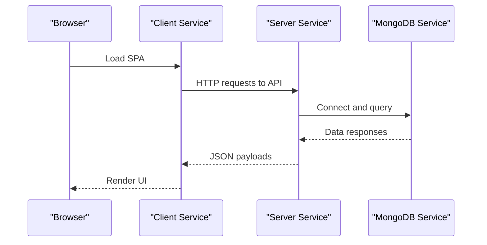

# Docker Deployment

<cite>
**Referenced Files in This Document**
- [BUILD.md](file://doc/BUILD.md)
</cite>

## Table of Contents
1. [Introduction](#introduction)
2. [Project Structure](#project-structure)
3. [Core Components](#core-components)
4. [Architecture Overview](#architecture-overview)
5. [Detailed Component Analysis](#detailed-component-analysis)
6. [Dependency Analysis](#dependency-analysis)
7. [Performance Considerations](#performance-considerations)
8. [Troubleshooting Guide](#troubleshooting-guide)
9. [Conclusion](#conclusion)
10. [Appendices](#appendices)

## Introduction
This document provides comprehensive guidance for containerizing and deploying QuickLink using Docker Compose. It covers the orchestration of MongoDB, server, and client services; networking and volume management for data persistence; environment variable injection; service dependencies; health checks; restart policies; resource limits; logging; debugging; environment-specific customization; and scaling considerations for high-traffic scenarios. The content is derived from the project’s documented structure and deployment configuration references.

**Section sources**
- [BUILD.md:17-31](file://doc/BUILD.md#L17-L31)
- [BUILD.md:33-92](file://doc/BUILD.md#L33-L92)

## Project Structure
QuickLink follows a monorepo-style layout with separate frontend (client) and backend (server) directories, plus documentation and deployment artifacts at the repository root. The documented structure includes Docker-related files at the root level and a dedicated documentation folder.

**Diagram sources**
- [BUILD.md:33-92](file://doc/BUILD.md#L33-L92)

**Section sources**
- [BUILD.md:33-92](file://doc/BUILD.md#L33-L92)

## Core Components
QuickLink’s containerized deployment consists of three primary services:
- MongoDB: persistent NoSQL database for links, accounts, tags, users, and migrations.
- Server: Node.js + Express REST API that connects to MongoDB and serves business logic.
- Client: React SPA served by a static web server image.

The documented Docker Compose setup defines these services with appropriate ports, volumes, environment variables, and dependency ordering.

Key aspects:
- Networking: Services communicate over the default Compose network using service names as hostnames (e.g., server uses mongodb as the hostname).
- Volumes: MongoDB data is persisted via a named volume.
- Environment Variables: Server and client are configured through environment variables, including database connection strings and API base URLs.

**Section sources**
- [BUILD.md:418-459](file://doc/BUILD.md#L418-L459)

## Architecture Overview
The following diagram shows how the services interact within the Docker Compose network:

**Diagram sources**
- [BUILD.md:418-459](file://doc/BUILD.md#L418-L459)

## Detailed Component Analysis

### MongoDB Service
- Image: mongo:7
- Container name: quicklink-mongo
- Ports: Exposes 27017 on the host
- Volumes: Named volume mongo_data mounted at /data/db for persistence
- Environment: Initializes the database name via MONGO_INITDB_DATABASE

Operational notes:
- Data durability: Ensure the named volume is retained across deployments to preserve user data.
- Security: In production, restrict port exposure and consider authentication and TLS termination at the reverse proxy layer.

**Section sources**
- [BUILD.md:423-433](file://doc/BUILD.md#L423-L433)

### Server Service
- Build context: Repository root
- Dockerfile: Dockerfile.server
- Container name: quicklink-server
- Ports: Exposes 3000 on the host
- Environment: Provides MongoDB connection details (MONGODB_URI, MONGODB_DB_NAME)
- Dependencies: depends_on mongodb

Operational notes:
- Startup order: depends_on ensures MongoDB starts before the server. For robust readiness, add healthcheck-based dependencies in advanced setups.
- Configuration: Use environment variables for secrets and endpoints; avoid hardcoding values.

**Section sources**
- [BUILD.md:434-446](file://doc/BUILD.md#L434-L446)

### Client Service
- Build context: Repository root
- Dockerfile: Dockerfile.client
- Container name: quicklink-client
- Ports: Maps host 5173 to container 80
- Dependencies: depends_on server

Operational notes:
- Static serving: The client image serves built assets; ensure the build process produces a static output compatible with the chosen web server image.
- API endpoint: Configure the client’s API base URL via environment variables so it can reach the server service within the Compose network.

**Section sources**
- [BUILD.md:447-456](file://doc/BUILD.md#L447-L456)

### Environment Variables and Secrets
- Server environment:
  - MONGODB_URI: Connection string pointing to the MongoDB service
  - MONGODB_DB_NAME: Database name used by the application
- Client environment:
  - VITE_API_BASE_URL: Base URL for API calls from the frontend
- Shared example file: .env.example documents available variables for both server and client

Best practices:
- Never commit secrets to version control; use environment files or secret managers.
- Keep environment keys consistent across development, staging, and production.

**Section sources**
- [BUILD.md:394-416](file://doc/BUILD.md#L394-L416)
- [BUILD.md:418-459](file://doc/BUILD.md#L418-L459)

### Dockerfiles (Frontend and Backend)
- Frontend Dockerfile: Dockerfile.client
- Backend Dockerfile: Dockerfile.server

These files define how images are built for each service. While their detailed contents are not included here, they are referenced by the Compose configuration and should encapsulate:
- Multi-stage builds to minimize final image size
- Installation of dependencies and build steps
- Copying of compiled artifacts into a minimal runtime image
- Setting environment variables and entrypoints

Recommendations:
- Use multi-stage builds to separate build-time and runtime layers.
- Pin base image versions for reproducibility.
- Minimize installed packages in the final image.

**Section sources**
- [BUILD.md:87-90](file://doc/BUILD.md#L87-L90)
- [BUILD.md:434-456](file://doc/BUILD.md#L434-L456)

## Dependency Analysis
Service dependency chain and communication paths:

**Diagram sources**
- [BUILD.md:418-459](file://doc/BUILD.md#L418-L459)

**Section sources**
- [BUILD.md:418-459](file://doc/BUILD.md#L418-L459)

## Performance Considerations
- Resource Limits: Apply CPU and memory limits to each service to prevent noisy-neighbor issues and protect host stability.
- Health Checks: Implement healthchecks for MongoDB and application services to enable automatic restarts and readiness probes.
- Logging: Centralize logs from all services to facilitate monitoring and troubleshooting.
- Scaling:
  - Horizontal scaling: Run multiple replicas of the server behind a reverse proxy/load balancer.
  - Read-heavy workloads: Consider read replicas for MongoDB if supported by your deployment model.
- Caching: Introduce caching layers (e.g., Redis) for frequently accessed data if needed.
- Database Tuning: Optimize indexes and queries based on usage patterns.

[No sources needed since this section provides general guidance]

## Troubleshooting Guide
Common issues and resolutions:

- MongoDB connectivity failures:
  - Verify MONGODB_URI points to the correct service name and port within the Compose network.
  - Confirm the database name matches initialization settings.
  - Check that the named volume exists and has proper permissions.

- Server startup errors:
  - Validate environment variables for secrets and endpoints.
  - Ensure the server waits for MongoDB to be ready before processing requests.

- Client cannot reach API:
  - Confirm VITE_API_BASE_URL is set correctly and reachable from the client container.
  - Check CORS settings on the server if cross-origin requests fail.

- Port conflicts:
  - Adjust host port mappings if other services occupy 27017 or 3000/5173.

- Data loss concerns:
  - Ensure the mongo_data named volume is backed up regularly.
  - Avoid deleting volumes unintentionally during cleanup.

- Logs and debugging:
  - Inspect container logs using standard Docker commands.
  - Enable verbose logging in development environments.
  - Use interactive shells to debug inside containers when necessary.

**Section sources**
- [BUILD.md:418-459](file://doc/BUILD.md#L418-L459)

## Conclusion
QuickLink’s containerized deployment leverages Docker Compose to orchestrate MongoDB, server, and client services with clear separation of concerns, persistent storage, and environment-driven configuration. By applying health checks, resource limits, centralized logging, and environment-specific customizations, you can reliably run the application across development, staging, and production while preparing for scale-out strategies under high traffic.

[No sources needed since this section summarizes without analyzing specific files]

## Appendices

### Environment-Specific Customization
- Development:
  - Use local ports and verbose logging.
  - Mount source code for hot-reload where applicable.
- Staging:
  - Mirror production configuration with non-sensitive credentials.
  - Enable stricter security headers and rate limiting.
- Production:
  - Restrict exposed ports; terminate TLS at a reverse proxy.
  - Use secret managers for sensitive variables.
  - Set resource limits and health checks.

[No sources needed since this section provides general guidance]

### Scaling Considerations
- Horizontal scaling of the server service behind a load balancer.
- Database scaling via sharding or replica sets depending on workload characteristics.
- Stateless design for server instances to support easy replication.
- Monitoring and alerting for performance metrics and error rates.

[No sources needed since this section provides general guidance]