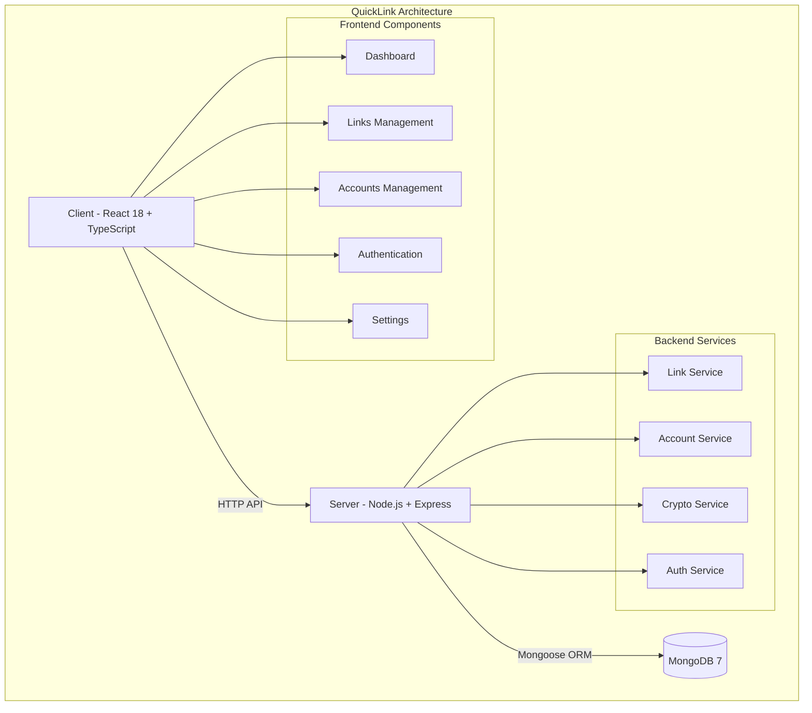
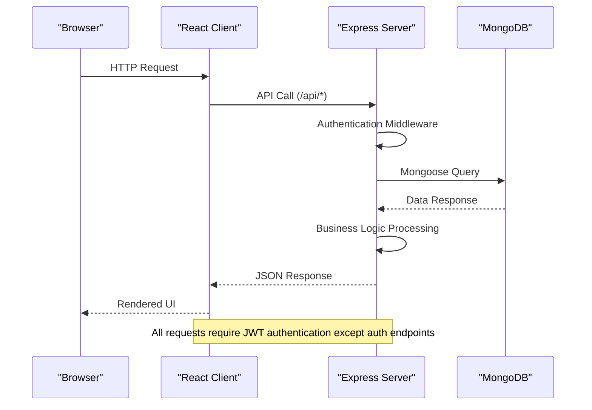
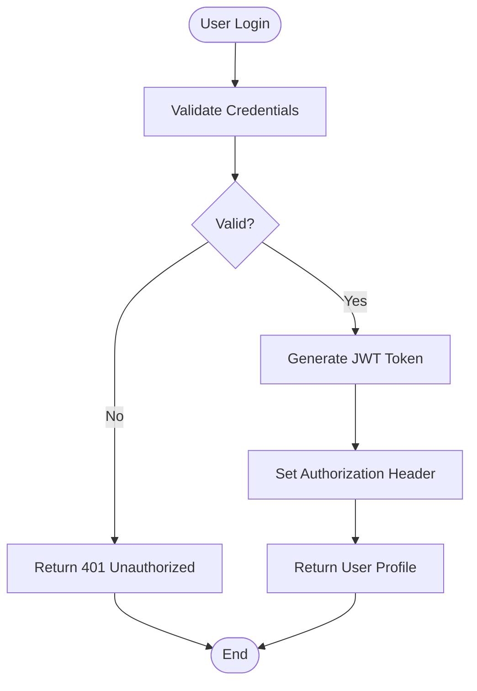
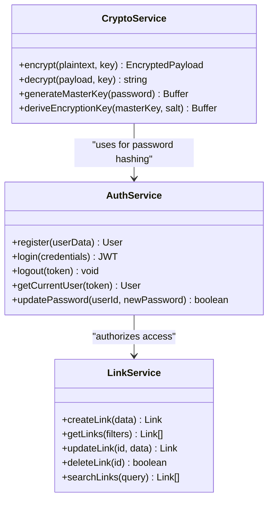
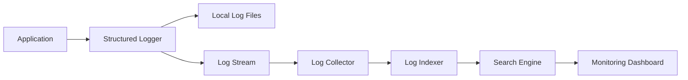
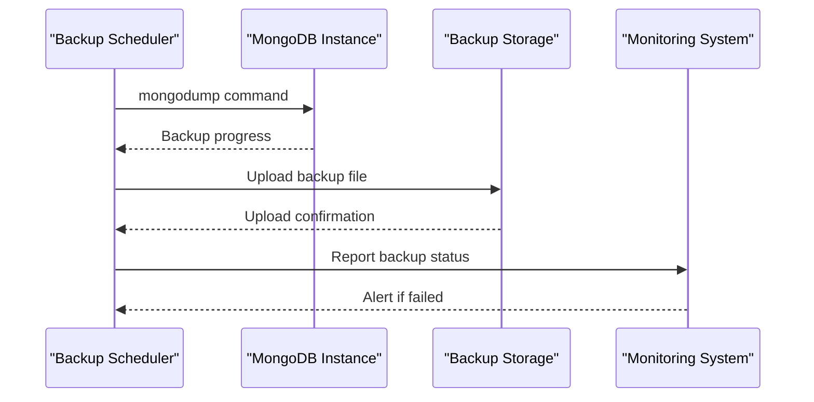
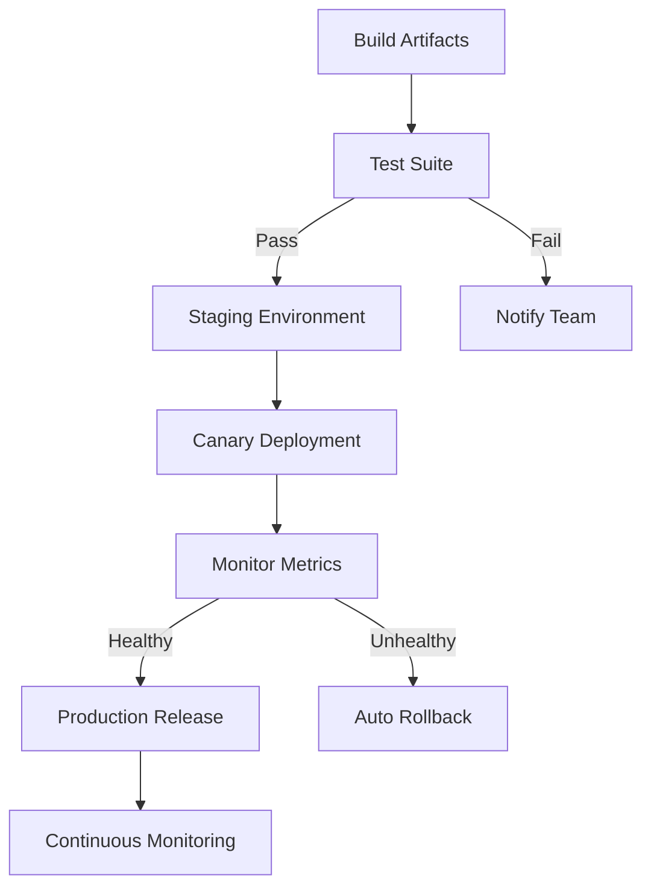
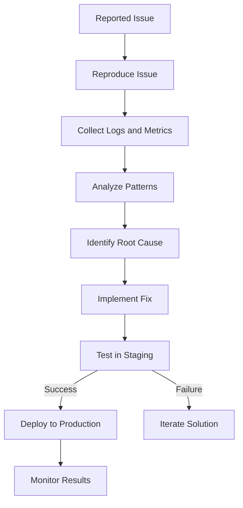

# Operational Procedures

<cite>
**Referenced Files in This Document**
- [BUILD.md](file://doc/BUILD.md)
</cite>

## Table of Contents
1. [Introduction](#introduction)
2. [Project Structure](#project-structure)
3. [Core Components](#core-components)
4. [Architecture Overview](#architecture-overview)
5. [Detailed Component Analysis](#detailed-component-analysis)
6. [Health Check and Monitoring](#health-check-and-monitoring)
7. [Logging Configuration](#logging-configuration)
8. [Backup and Recovery Procedures](#backup-and-recovery-procedures)
9. [Scaling Considerations](#scaling-considerations)
10. [Deployment Automation](#deployment-automation)
11. [Troubleshooting Guide](#troubleshooting-guide)
12. [Conclusion](#conclusion)

## Introduction

QuickLink is a comprehensive link collection and password management tool designed for personal knowledge management. The system provides secure storage for web links with categorization and tagging capabilities, along with encrypted account credential management. Built with modern technologies including React 18 + TypeScript for the frontend, Node.js + Express + TypeScript for the backend, and MongoDB 7 as the database, QuickLink offers a robust foundation for production deployment.

The operational procedures outlined in this document cover essential aspects of running QuickLink in production environments, including health monitoring, logging strategies, backup procedures, scaling considerations, and troubleshooting methodologies.

## Project Structure

QuickLink follows a monorepo structure with clear separation between frontend and backend components:



**Diagram sources**
- [BUILD.md:33-92](file://doc/BUILD.md#L33-L92)

The project structure includes:
- **Client**: React-based frontend with Ant Design UI framework
- **Server**: Express.js backend with TypeScript support
- **Database**: MongoDB with schema migrations using migrate-mongo
- **Docker**: Containerized deployment with Docker Compose

**Section sources**
- [BUILD.md:33-92](file://doc/BUILD.md#L33-L92)

## Core Components

### Technology Stack Overview

QuickLink employs a modern technology stack optimized for performance and maintainability:

| Component | Technology | Purpose |
|-----------|------------|---------|
| Frontend | React 18 + TypeScript + Vite | SPA architecture with responsive design |
| UI Framework | Ant Design 5 | Mature component library with built-in forms/tables/search |
| Backend | Node.js + Express + TypeScript | Lightweight REST API, easy deployment and scaling |
| Database | MongoDB 7 | Document-based NoSQL with flexible schema and aggregation queries |
| Migration Tool | migrate-mongo | MongoDB-specific migration tool with versioned migrations |
| Encryption | AES-256-GCM + bcrypt | Secure field encryption and password hashing |
| Authentication | JWT (jsonwebtoken) | User session management |
| Testing | Vitest (frontend) + Jest (backend) | Unit and integration testing |
| Deployment | Docker Compose | One-click startup of frontend + backend + MongoDB |

**Section sources**
- [BUILD.md:17-30](file://doc/BUILD.md#L17-L30)

### Data Models

The system manages four primary data collections:

#### Users Collection
Handles user authentication and master key management for encryption operations.

#### Links Collection  
Stores bookmarked web links with metadata including titles, descriptions, tags, categories, and visit tracking.

#### Accounts Collection  
Manages encrypted credentials for various platforms with support for 2FA secrets and password rotation tracking.

#### Tags Collection  
Provides organizational tagging system for both links and accounts with color coding support.

**Section sources**
- [BUILD.md:96-178](file://doc/BUILD.md#L96-L178)

## Architecture Overview

QuickLink follows a three-tier architecture pattern with clear separation of concerns:



**Diagram sources**
- [BUILD.md:285-337](file://doc/BUILD.md#L285-L337)

The architecture supports:
- **RESTful API Design**: Standard HTTP methods with consistent endpoint patterns
- **JWT Authentication**: Stateless authentication with configurable token expiration
- **Data Encryption**: AES-256-GCM encryption for sensitive fields
- **Schema Validation**: MongoDB document validation for data integrity
- **Migration Support**: Versioned database schema changes with rollback capability

**Section sources**
- [BUILD.md:285-337](file://doc/BUILD.md#L285-L337)

## Detailed Component Analysis

### Authentication System

The authentication system implements JWT-based stateless authentication with secure password handling:



**Diagram sources**
- [BUILD.md:287-295](file://doc/BUILD.md#L287-L295)

Key authentication features:
- Password hashing with bcrypt for secure storage
- JWT token generation with configurable expiration
- Protected route middleware for API authorization
- Master key derivation for encryption key management

### Security Implementation

QuickLink implements comprehensive security measures:



**Diagram sources**
- [BUILD.md:341-378](file://doc/BUILD.md#L341-L378)

Security measures include:
- AES-256-GCM encryption for sensitive data fields
- PBKDF2 key derivation for encryption keys
- Rate limiting to prevent brute force attacks
- Input validation with express-validator
- CORS configuration for cross-origin security
- Helmet middleware for HTTP security headers

**Section sources**
- [BUILD.md:339-391](file://doc/BUILD.md#L339-L391)

## Health Check and Monitoring

### Health Check Endpoints

While specific health check implementation details are not provided in the current codebase, the following endpoints should be implemented for production monitoring:

#### Recommended Health Check Endpoints

| Endpoint | Method | Purpose | Response |
|----------|--------|---------|----------|
| `/api/health` | GET | Basic service health | `{"status": "healthy", "timestamp": "ISO date"}` |
| `/api/health/db` | GET | Database connectivity check | `{"db": "connected", "latency": "ms"}` |
| `/api/health/mem` | GET | Memory usage monitoring | `{"heapUsed": "MB", "rss": "MB"}` |
| `/api/health/disk` | GET | Disk space monitoring | `{"available": "GB", "used": "GB"}` |

### Prometheus Integration Setup

For production monitoring, implement Prometheus metrics collection:

#### Metrics to Expose

- **Request Metrics**: Total requests, request rate, response times
- **Error Metrics**: HTTP error rates, application errors
- **Business Metrics**: Active users, link creation rate, account operations
- **System Metrics**: Memory usage, CPU utilization, disk I/O
- **Database Metrics**: Connection pool status, query performance

#### Implementation Approach

1. **Metrics Library**: Use `prom-client` for Node.js metrics collection
2. **Middleware**: Implement Express middleware to capture request/response metrics
3. **Custom Metrics**: Add business-specific counters and gauges
4. **Export Endpoint**: Create `/metrics` endpoint for Prometheus scraping
5. **Alerting Rules**: Configure alerts for critical thresholds

### Monitoring Tools Integration

#### Application Performance Monitoring (APM)
- **New Relic**: Comprehensive APM with distributed tracing
- **DataDog**: Full-stack monitoring with custom dashboards
- **Sentry**: Error tracking and performance monitoring

#### Log Aggregation
- **ELK Stack**: Elasticsearch, Logstash, Kibana for log analysis
- **Splunk**: Enterprise log management and analytics
- **CloudWatch**: AWS-native logging solution

**Section sources**
- [BUILD.md:394-416](file://doc/BUILD.md#L394-L416)

## Logging Configuration

### Structured Logging Strategy

Implement structured logging for better log analysis and debugging:

#### Log Levels and Usage

| Level | Usage | Example |
|-------|-------|---------|
| ERROR | Critical failures requiring immediate attention | Database connection failures, authentication errors |
| WARN | Potential issues that don't stop functionality | High memory usage, slow queries |
| INFO | Normal operational events | User login, API requests, background jobs |
| DEBUG | Detailed debugging information | Request/response payloads, internal state |

#### Log Format Specification

```json
{
  "timestamp": "ISO 8601 timestamp",
  "level": "ERROR|WARN|INFO|DEBUG",
  "service": "quicklink-server",
  "environment": "production",
  "requestId": "unique-request-id",
  "userId": "user-id-if-available",
  "message": "Human-readable message",
  "metadata": {
    "endpoint": "/api/links",
    "method": "GET",
    "statusCode": 200,
    "responseTime": 45
  }
}
```

### Log Rotation and Retention

#### File-Based Rotation
- **Size-based rotation**: Rotate logs when they exceed 50MB
- **Time-based rotation**: Daily log rotation at midnight
- **Retention policy**: Keep logs for 30 days in production
- **Compression**: Compress rotated logs to save space

#### Centralized Log Aggregation



**Diagram sources**
- [BUILD.md:394-416](file://doc/BUILD.md#L394-L416)

### Sensitive Data Handling

Ensure sensitive information is never logged:
- Mask passwords and tokens in log output
- Remove or redact PII from request/response bodies
- Use correlation IDs for request tracing without exposing sensitive data
- Implement log sanitization middleware

**Section sources**
- [BUILD.md:394-416](file://doc/BUILD.md#L394-L416)

## Backup and Recovery Procedures

### MongoDB Backup Strategy

#### Automated Backup Schedule

| Frequency | Type | Retention | Storage Location |
|-----------|------|-----------|------------------|
| Hourly | Incremental | 24 hours | Local disk |
| Daily | Full | 7 days | Local disk + Cloud storage |
| Weekly | Full | 4 weeks | Cloud storage |
| Monthly | Full | 12 months | Cold storage |

#### Backup Implementation



**Diagram sources**
- [BUILD.md:418-459](file://doc/BUILD.md#L418-L459)

### Disaster Recovery Plan

#### Recovery Scenarios

1. **Single Document Loss**: Use point-in-time recovery with oplog
2. **Collection Corruption**: Restore from latest full backup
3. **Database Corruption**: Complete database restore from offsite backup
4. **Complete Site Failure**: Multi-region failover with automated DNS switching

#### Recovery Time Objectives (RTO) and Recovery Point Objectives (RPO)

| Scenario | RTO | RPO | Recovery Procedure |
|----------|-----|-----|-------------------|
| Minor data loss | 1 hour | 1 hour | Point-in-time recovery |
| Database corruption | 4 hours | 24 hours | Full database restore |
| Complete outage | 8 hours | 24 hours | Multi-region failover |
| Regional disaster | 24 hours | 24 hours | Geographic failover |

### Backup Verification and Testing

#### Regular Backup Testing
- **Monthly restore tests**: Verify backup integrity by restoring to test environment
- **Automated validation**: Script-based backup verification after each backup
- **Performance testing**: Measure restore times and identify bottlenecks
- **Documentation updates**: Update recovery procedures based on test results

#### Offsite Backup Strategy
- **Geographic distribution**: Store backups in multiple geographic regions
- **Encryption**: Encrypt backups at rest and in transit
- **Access control**: Restrict backup access to authorized personnel only
- **Audit logging**: Log all backup and restore operations

**Section sources**
- [BUILD.md:418-459](file://doc/BUILD.md#L418-L459)

## Scaling Considerations

### Horizontal Scaling

#### Application Layer Scaling
- **Stateless design**: Ensure server instances are stateless for easy horizontal scaling
- **Load balancing**: Distribute traffic across multiple application instances
- **Session management**: Use external session storage (Redis) for shared sessions
- **Caching layer**: Implement Redis cache for frequently accessed data

#### Database Scaling
- **Read replicas**: Configure MongoDB read replicas for read-heavy workloads
- **Sharding**: Implement MongoDB sharding for large datasets
- **Connection pooling**: Optimize database connection pools per instance
- **Query optimization**: Monitor and optimize slow queries

### Vertical Scaling

#### Resource Optimization
- **Memory allocation**: Tune Node.js heap size based on workload
- **CPU scaling**: Scale up CPU cores for compute-intensive operations
- **I/O optimization**: Use SSD storage for improved database performance
- **Network tuning**: Optimize network settings for high-throughput scenarios

### Load Balancing Configuration

#### Nginx Load Balancer Setup

```nginx
upstream quicklink_backend {
    server app1:3000;
    server app2:3000;
    server app3:3000;
    keepalive 32;
}

server {
    listen 80;
    server_name quicklink.example.com;
    
    location / {
        proxy_pass http://quicklink_backend;
        proxy_set_header Host $host;
        proxy_set_header X-Real-IP $remote_addr;
        proxy_set_header X-Forwarded-For $proxy_add_x_forwarded_for;
        proxy_set_header X-Forwarded-Proto $scheme;
    }
    
    # Health checks
    location /health {
        return 200 'OK';
        add_header Content-Type text/plain;
    }
}
```

### Container Orchestration

#### Docker Swarm Configuration

```yaml
version: '3.8'

services:
  app:
    image: quicklink-app:latest
    deploy:
      replicas: 3
      resources:
        limits:
          cpus: '1.0'
          memory: 512M
        reservations:
          cpus: '0.25'
          memory: 128M
    networks:
      - app-network
    environment:
      - NODE_ENV=production
      - MONGODB_URI=mongodb://mongo:27017

  mongo:
    image: mongo:7
    deploy:
      replicas: 1
    volumes:
      - mongo-data:/data/db
    networks:
      - app-network

networks:
  app-network:
    driver: overlay

volumes:
  mongo-data:
```

#### Kubernetes Deployment

```yaml
apiVersion: apps/v1
kind: Deployment
metadata:
  name: quicklink-app
spec:
  replicas: 3
  selector:
    matchLabels:
      app: quicklink
  template:
    metadata:
      labels:
        app: quicklink
    spec:
      containers:
      - name: app
        image: quicklink-app:latest
        ports:
        - containerPort: 3000
        resources:
          requests:
            cpu: 250m
            memory: 256Mi
          limits:
            cpu: 1000m
            memory: 512Mi
        envFrom:
        - configMapRef:
            name: quicklink-config
```

**Section sources**
- [BUILD.md:418-459](file://doc/BUILD.md#L418-L459)

## Deployment Automation

### CI/CD Pipeline Integration

#### GitHub Actions Workflow

```yaml
name: QuickLink CI/CD

on:
  push:
    branches: [main, develop]
  pull_request:
    branches: [main]

jobs:
  test:
    runs-on: ubuntu-latest
    steps:
    - uses: actions/checkout@v3
    - uses: actions/setup-node@v3
      with:
        node-version: '18'
    - run: npm ci
    - run: npm test
    - run: npm run build

  deploy:
    needs: test
    if: github.ref == 'refs/heads/main'
    runs-on: ubuntu-latest
    steps:
    - uses: actions/checkout@v3
    - name: Deploy to Production
      run: ./deploy.sh
      env:
        DEPLOY_KEY: ${{ secrets.DEPLOY_KEY }}
```

### Rollback Procedures

#### Automated Rollback Strategy

1. **Health Check Validation**: Post-deployment health checks before marking deployment successful
2. **Canary Deployments**: Gradual rollout to subset of servers
3. **Automatic Rollback**: Roll back if error rate exceeds threshold
4. **Manual Rollback**: One-click rollback to previous stable version

#### Version Management



**Diagram sources**
- [BUILD.md:498-505](file://doc/BUILD.md#L498-L505)

### Environment Management

#### Environment Variables Management
- **Secrets Management**: Use environment-specific secret stores
- **Configuration Validation**: Validate required environment variables at startup
- **Feature Flags**: Implement feature flags for gradual rollouts
- **Environment Parity**: Maintain identical configurations across environments

**Section sources**
- [BUILD.md:498-505](file://doc/BUILD.md#L498-L505)

## Troubleshooting Guide

### Common Production Issues

#### Database Connectivity Issues

**Symptoms**: 
- Connection timeout errors
- Slow query performance
- Connection pool exhaustion

**Resolution Steps**:
1. Check MongoDB service status and network connectivity
2. Verify connection string and authentication credentials
3. Monitor connection pool usage and adjust pool size if needed
4. Review slow query logs and optimize problematic queries

#### Memory Leaks and Performance Issues

**Symptoms**:
- Increasing memory usage over time
- Slow response times
- Out of memory errors

**Resolution Steps**:
1. Use Node.js profiling tools to identify memory leaks
2. Monitor heap memory usage and garbage collection statistics
3. Implement proper resource cleanup in long-running processes
4. Scale horizontally if single-instance limitations are reached

#### Authentication and Authorization Problems

**Symptoms**:
- Users unable to log in
- Unauthorized access errors
- JWT token validation failures

**Resolution Steps**:
1. Verify JWT secret configuration across all instances
2. Check token expiration and refresh token logic
3. Review authentication middleware for proper error handling
4. Audit user permissions and role assignments

### Debugging Techniques

#### Application Debugging



**Diagram sources**
- [BUILD.md:508-536](file://doc/BUILD.md#L508-L536)

#### Log Analysis Strategies

1. **Correlation IDs**: Implement request correlation IDs for tracing
2. **Structured Logging**: Use structured logs for better parsing and analysis
3. **Log Aggregation**: Centralize logs for cross-service correlation
4. **Alerting**: Set up alerts for error patterns and performance degradation

### Incident Response Procedures

#### Severity Classification

| Severity | Description | Response Time | Escalation |
|----------|-------------|---------------|------------|
| P0 - Critical | Complete system outage | 15 minutes | Immediate escalation to management |
| P1 - High | Major functionality impaired | 30 minutes | Engineering lead notification |
| P2 - Medium | Partial functionality affected | 2 hours | Team lead notification |
| P3 - Low | Minor issue with workaround | 24 hours | Next sprint planning |

#### Incident Response Workflow

1. **Detection**: Automated monitoring alerts or user reports
2. **Assessment**: Determine severity and impact scope
3. **Containment**: Isolate the problem to prevent further damage
4. **Resolution**: Implement fix and verify restoration
5. **Post-mortem**: Document incident and preventive measures

### Performance Monitoring

#### Key Performance Indicators (KPIs)

- **Response Time**: P95 and P99 latency percentiles
- **Throughput**: Requests per second and concurrent connections
- **Error Rate**: Percentage of failed requests
- **Resource Utilization**: CPU, memory, and disk usage
- **Database Performance**: Query execution times and connection pool usage

#### Monitoring Tools Integration

- **Application Performance Monitoring**: New Relic, DataDog, or similar
- **Infrastructure Monitoring**: Prometheus with Grafana dashboards
- **Log Analysis**: ELK Stack or cloud-native solutions
- **Synthetic Monitoring**: Uptime monitoring and synthetic transactions

**Section sources**
- [BUILD.md:508-536](file://doc/BUILD.md#L508-L536)

## Conclusion

This operational procedures document provides comprehensive guidance for deploying and maintaining QuickLink in production environments. The outlined procedures cover essential aspects including health monitoring, logging strategies, backup and recovery, scaling considerations, deployment automation, and troubleshooting methodologies.

Key recommendations for production readiness include:

1. **Implement comprehensive monitoring** with health checks and alerting
2. **Establish robust backup and recovery procedures** with regular testing
3. **Plan for horizontal and vertical scaling** based on expected growth
4. **Automate deployment processes** with CI/CD pipelines and rollback capabilities
5. **Develop thorough troubleshooting guides** for common production issues
6. **Maintain detailed documentation** of operational procedures and configurations

By following these operational procedures, teams can ensure reliable, scalable, and maintainable production deployments of QuickLink while minimizing downtime and maximizing system availability.