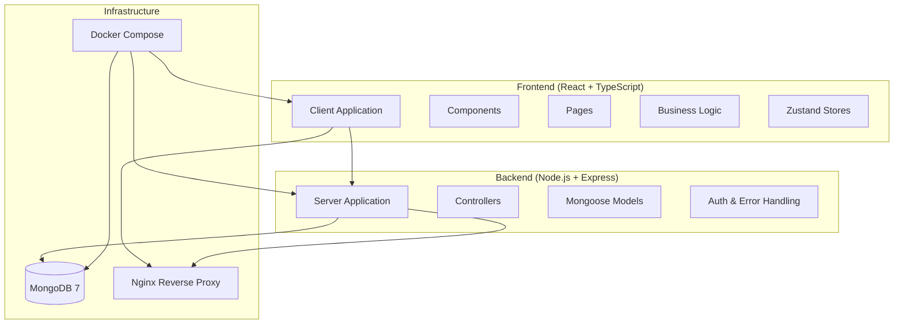
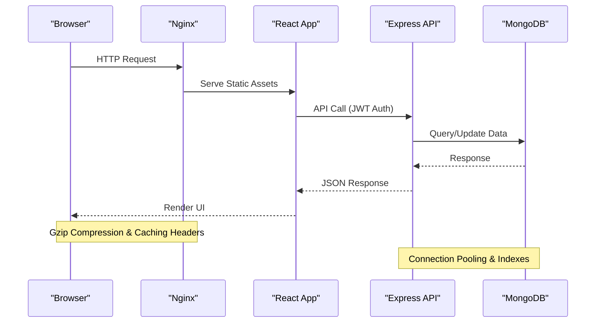
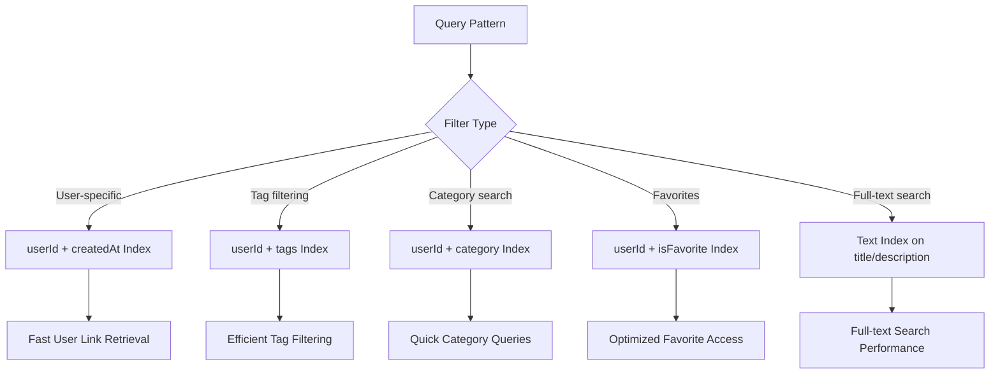

# Performance Optimization

<cite>
**Referenced Files in This Document**
- [BUILD.md](file://doc/BUILD.md)
</cite>

## Table of Contents
1. [Introduction](#introduction)
2. [Project Structure](#project-structure)
3. [Core Components](#core-components)
4. [Architecture Overview](#architecture-overview)
5. [Detailed Component Analysis](#detailed-component-analysis)
6. [Dependency Analysis](#dependency-analysis)
7. [Performance Considerations](#performance-considerations)
8. [Troubleshooting Guide](#troubleshooting-guide)
9. [Conclusion](#conclusion)

## Introduction

This document provides comprehensive performance optimization guidance for QuickLink production environments. QuickLink is a link bookmarking and credential management tool built with React 18 + TypeScript + Vite frontend, Node.js + Express + TypeScript backend, and MongoDB 7 database. The system supports secure storage of credentials using AES-256-GCM encryption and JWT authentication.

The performance optimization strategies covered include Nginx reverse proxy configuration, MongoDB connection pooling, caching layers, CDN integration, application-level optimizations, and monitoring tools for production deployments.

## Project Structure

QuickLink follows a monorepo structure with separate client and server applications:

**Diagram sources**
- [BUILD.md:33-92](file://doc/BUILD.md#L33-L92)

**Section sources**
- [BUILD.md:33-92](file://doc/BUILD.md#L33-L92)

## Core Components

### Technology Stack Overview

| Layer | Technology | Purpose |
|-------|------------|---------|
| **Frontend** | React 18 + TypeScript + Vite | SPA architecture with responsive design |
| **UI Framework** | Ant Design 5 | Mature component library with built-in forms/tables/search |
| **Backend** | Node.js + Express + TypeScript | Lightweight REST API, easy deployment and scaling |
| **Database** | MongoDB 7 | Document-based NoSQL with flexible schema and aggregation queries |
| **Migration** | migrate-mongo | MongoDB-specific migration tool with versioned migrations |
| **Encryption** | AES-256-GCM + bcrypt | Secure field encryption and password hashing |
| **Authentication** | JWT (jsonwebtoken) | User session management |
| **Testing** | Vitest (frontend) + Jest (backend) | Unit and integration testing |
| **Deployment** | Docker Compose | One-click startup of frontend + backend + MongoDB |

**Section sources**
- [BUILD.md:17-30](file://doc/BUILD.md#L17-L30)

## Architecture Overview

The QuickLink architecture follows a modern three-tier pattern with clear separation of concerns:

**Diagram sources**
- [BUILD.md:33-92](file://doc/BUILD.md#L33-L92)
- [BUILD.md:418-459](file://doc/BUILD.md#L418-L459)

## Detailed Component Analysis

### Database Schema and Indexing Strategy

QuickLink implements a well-structured database schema with strategic indexing for optimal query performance:

#### Core Collections

| Collection | Purpose | Key Fields | Indexes |
|------------|---------|------------|---------|
| **users** | User accounts and authentication | username, email, passwordHash, masterKey | Compound indexes on frequently queried fields |
| **links** | Bookmarked links and metadata | userId, url, title, description, tags, category | Multi-field compound indexes for filtering |
| **accounts** | Encrypted credentials storage | userId, platform, encrypted username/password | Indexed by user and platform combinations |
| **tags** | Link categorization | userId, name, color | Unique compound index on user+name |

#### Optimized Index Strategy

**Diagram sources**
- [BUILD.md:180-197](file://doc/BUILD.md#L180-L197)

**Section sources**
- [BUILD.md:96-197](file://doc/BUILD.md#L96-L197)

### API Design Patterns

QuickLink implements RESTful API patterns with consistent pagination, filtering, and search capabilities:

#### Authentication Endpoints
- **POST /api/auth/register**: User registration with validation
- **POST /api/auth/login**: JWT token generation
- **POST /api/auth/logout**: Session termination
- **GET /api/auth/me**: Current user profile retrieval
- **PUT /api/auth/password**: Password update with security validation

#### Resource Management APIs
- **Links CRUD**: Full CRUD operations with batch import/export
- **Accounts Management**: Secure credential storage with encryption/decryption
- **Tags System**: Dynamic categorization with color support

#### Advanced Query Capabilities
- **Pagination**: `page=1&limit=20` parameters
- **Sorting**: `sort=-createdAt` (descending) or `sort=+fieldName`
- **Filtering**: `tag=work&category=dev&favorite=true`
- **Search**: `search=github` for full-text content search

**Section sources**
- [BUILD.md:285-336](file://doc/BUILD.md#L285-L336)

### Security Architecture

QuickLink implements enterprise-grade security measures:

#### Encryption Strategy
- **Password Storage**: bcrypt hashing for user passwords
- **Field-Level Encryption**: AES-256-GCM for sensitive data (credentials, notes)
- **Key Derivation**: PBKDF2(masterPassword, salt, 100000, 32) for encryption key generation

#### Security Measures
- HTTPS enforcement for all API endpoints
- JWT tokens with configurable expiration (default 2h)
- Rate limiting to prevent brute force attacks
- Input validation with express-validator
- CORS whitelist configuration
- Audit logging for sensitive operations
- Password strength validation requirements

**Section sources**
- [BUILD.md:339-391](file://doc/BUILD.md#L339-L391)

## Dependency Analysis

### External Dependencies

QuickLink leverages mature, well-maintained libraries for core functionality:

#### Backend Dependencies
| Package | Version | Purpose |
|---------|---------|---------|
| **express** | ^4.18.0 | Web framework for API development |
| **mongoose** | ^7.0.0 | MongoDB object modeling and ODM |
| **migrate-mongo** | ^11.0.0 | Database schema migration management |
| **jsonwebtoken** | ^9.0.0 | JWT token creation and verification |
| **bcrypt** | ^5.1.0 | Password hashing and comparison |
| **express-validator** | ^7.0.0 | Request input validation |
| **express-rate-limit** | ^7.0.0 | API rate limiting |
| **cors** | ^2.8.5 | Cross-origin resource sharing |
| **helmet** | ^7.0.0 | Security headers middleware |
| **dotenv** | ^16.0.0 | Environment variable management |

#### Frontend Dependencies
| Package | Version | Purpose |
|---------|---------|---------|
| **react** | ^18.2.0 | UI framework and component library |
| **react-router-dom** | ^6.0.0 | Client-side routing |
| **antd** | ^5.0.0 | Enterprise UI component library |
| **axios** | ^1.6.0 | HTTP client for API communication |
| **zustand** | ^4.0.0 | Lightweight state management |
| **dayjs** | ^11.11.0 | Date manipulation and formatting |

**Section sources**
- [BUILD.md:540-593](file://doc/BUILD.md#L540-L593)

## Performance Considerations

### Nginx Reverse Proxy Configuration

For optimal production performance, configure Nginx with the following optimizations:

#### Gzip Compression
Enable gzip compression for text-based responses to reduce bandwidth usage:
- Enable gzip for HTML, CSS, JavaScript, JSON, and XML content
- Set appropriate compression levels (typically 6-8)
- Configure minimum response size thresholds
- Disable compression for already compressed formats (images, videos)

#### Browser Caching Headers
Implement aggressive caching strategies for static assets:
- Set Cache-Control headers for static files (CSS, JS, images)
- Use ETags for conditional requests
- Configure long-lived cache headers for versioned assets
- Implement proper cache invalidation strategies

#### Static Asset Serving
Configure Nginx to efficiently serve static content:
- Direct serving of React build artifacts
- Proper MIME type configuration
- Enable HTTP/2 for improved performance
- Configure connection keep-alive settings

### MongoDB Connection Pooling

Optimize MongoDB connections for high-throughput scenarios:

#### Connection Pool Settings
- Configure pool size based on application concurrency needs
- Set appropriate connection timeout values
- Implement connection health checks
- Monitor connection utilization metrics

#### Query Optimization Techniques
- Use projection to retrieve only necessary fields
- Implement proper indexing strategy
- Leverage MongoDB aggregation pipeline for complex queries
- Utilize cursor batching for large result sets

#### Database Indexing Strategies
- Create compound indexes for common query patterns
- Implement text indexes for full-text search
- Use partial indexes for conditional data access
- Regularly analyze query performance with explain()

### Caching Layer Integration

Implement Redis or similar caching solutions for enhanced performance:

#### Session Storage
- Store JWT blacklists in Redis for immediate token revocation
- Cache user sessions with appropriate TTL
- Implement distributed session management for horizontal scaling

#### Frequently Accessed Data Caching
- Cache user profiles and preferences
- Store computed aggregations and statistics
- Implement cache warming strategies for critical data
- Use Redis pub/sub for cache invalidation across instances

### CDN Integration

Deploy content delivery network for global performance:

#### Static Asset Distribution
- Serve React build artifacts through CDN
- Configure CDN caching policies
- Implement cache busting for version updates
- Optimize image delivery with automatic format conversion

#### Image Optimization
- Automatic image format detection and conversion
- Responsive image serving based on device capabilities
- Lazy loading implementation for above-the-fold content
- Image compression and optimization pipelines

### Application-Level Optimizations

#### Response Compression
- Enable response compression at application level
- Implement selective compression for large payloads
- Configure compression thresholds appropriately

#### Lazy Loading Implementation
- Code splitting for React components
- Lazy loading of heavy dependencies
- Route-based code splitting
- Image lazy loading with intersection observer

#### Efficient API Design Patterns
- Implement request/response caching headers
- Use GraphQL or custom query languages for complex data fetching
- Implement optimistic UI updates where appropriate
- Batch multiple API calls when possible

## Troubleshooting Guide

### Performance Monitoring

#### Key Metrics to Track
- **Response Times**: P50, P95, P99 latency percentiles
- **Throughput**: Requests per second and concurrent connections
- **Error Rates**: HTTP status code distribution
- **Resource Utilization**: CPU, memory, disk I/O, network usage
- **Database Performance**: Query execution times, connection pool usage

#### Monitoring Tools Integration
- **Application Performance Monitoring (APM)**: New Relic, DataDog, or similar
- **Log Aggregation**: Centralized logging with structured logs
- **Metrics Collection**: Prometheus with Grafana dashboards
- **Alerting**: Automated alerts for performance degradation

### Common Performance Issues

#### Slow Database Queries
- Identify slow queries using MongoDB profiling
- Analyze query plans with explain()
- Review and optimize indexing strategy
- Consider query refactoring or denormalization

#### Memory Leaks
- Monitor heap memory usage patterns
- Use Node.js profiler to identify memory leaks
- Implement proper cleanup of event listeners and timers
- Regular garbage collection tuning

#### Connection Pool Exhaustion
- Monitor connection pool utilization
- Adjust pool sizes based on workload patterns
- Implement connection timeout and retry logic
- Consider connection multiplexing strategies

**Section sources**
- [BUILD.md:498-505](file://doc/BUILD.md#L498-L505)

## Conclusion

QuickLink's performance optimization strategy focuses on several key areas: efficient database design with proper indexing, intelligent caching layers, CDN integration for global content delivery, and comprehensive monitoring for continuous performance analysis. The modular architecture allows for independent scaling of different components while maintaining optimal performance characteristics.

Production deployments should prioritize:
1. **Database optimization** with proper indexing and query planning
2. **Caching strategies** for frequently accessed data and sessions
3. **CDN integration** for static asset delivery
4. **Comprehensive monitoring** for proactive performance management
5. **Regular performance audits** to identify and address bottlenecks

By implementing these optimization strategies, QuickLink can achieve high availability, excellent user experience, and scalable performance in production environments.