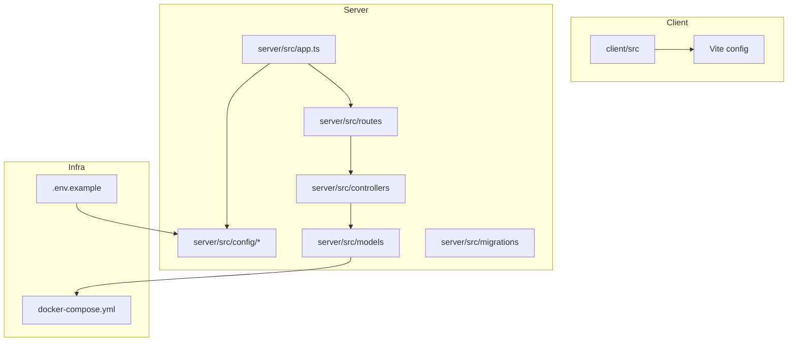
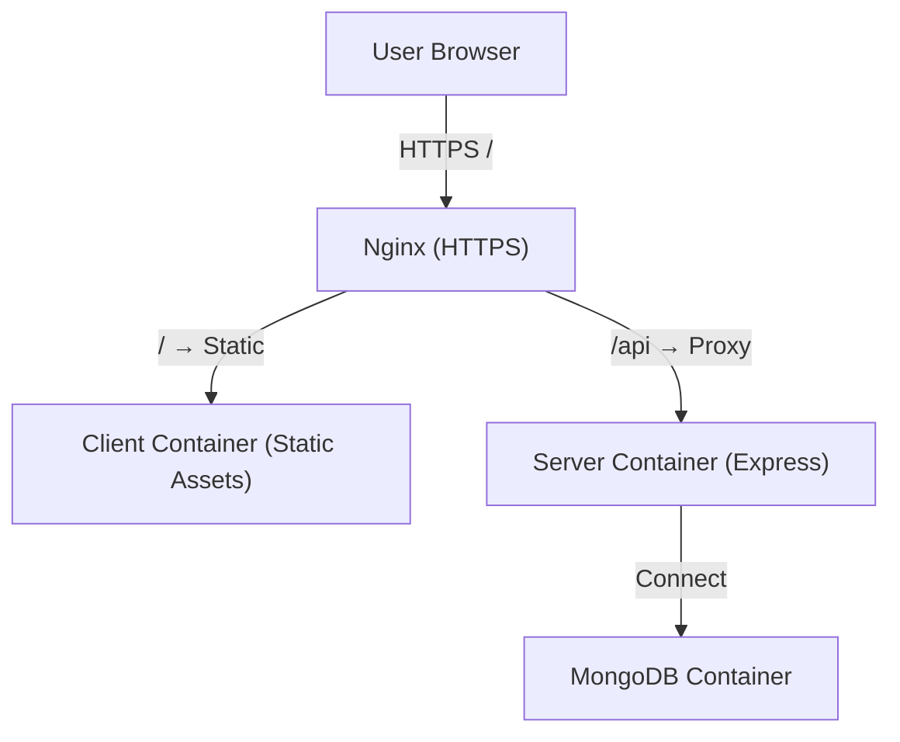
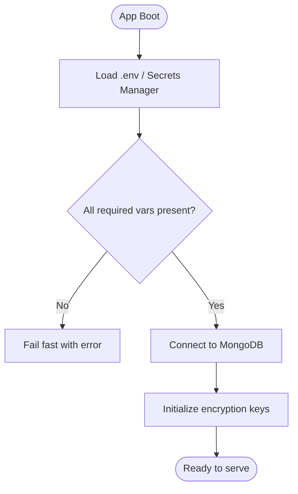
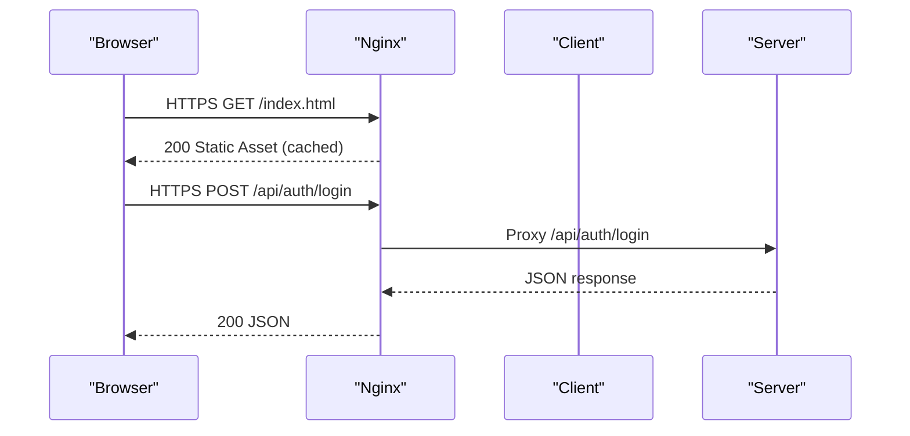
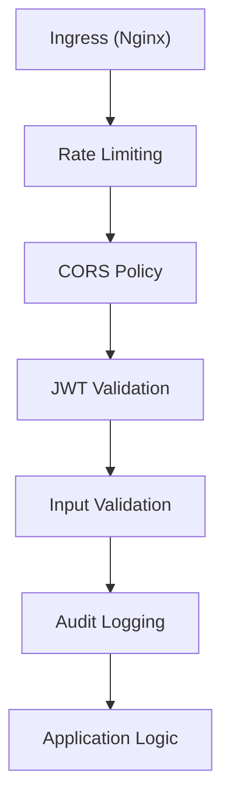
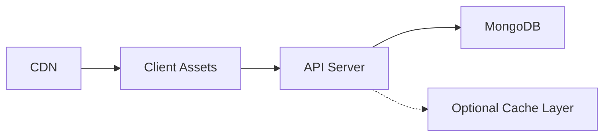
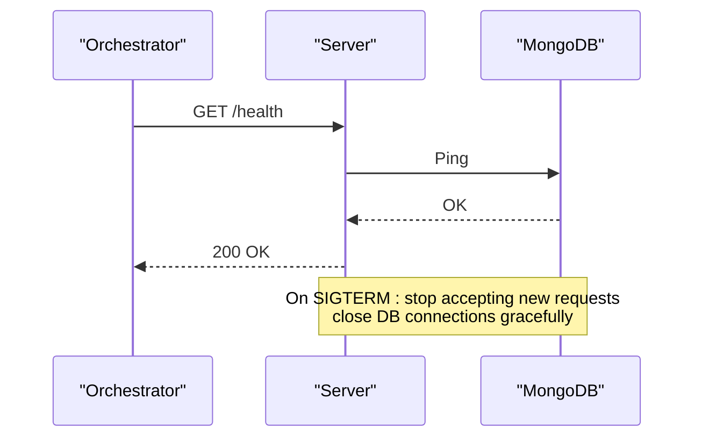
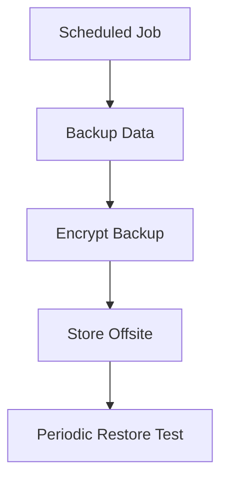
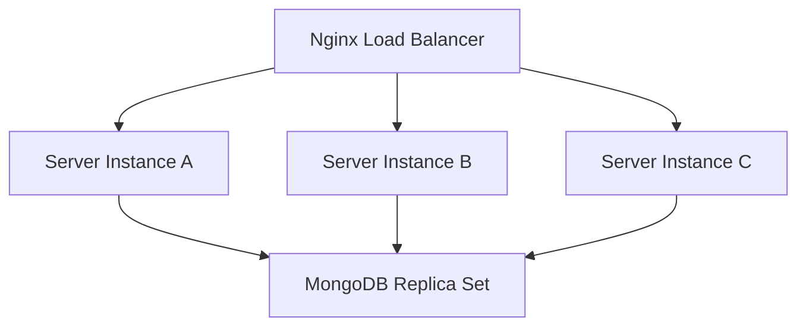
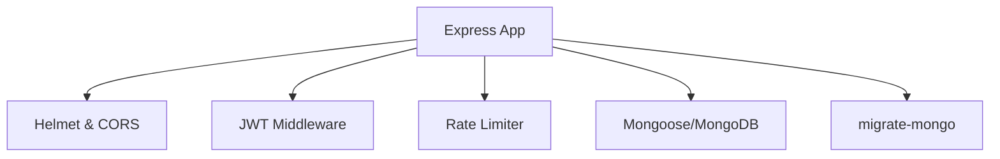

# Production Configuration

<cite>
**Referenced Files in This Document**
- [BUILD.md](file://doc/BUILD.md)
</cite>

## Table of Contents
1. Introduction
2. Project Structure
3. Core Components
4. Architecture Overview
5. Detailed Component Analysis
6. Dependency Analysis
7. Performance Considerations
8. Troubleshooting Guide
9. Conclusion
10. Appendices

## Introduction
This document provides production-grade configuration guidance for QuickLink, focusing on secure and optimized deployment. It covers environment variables (JWT secrets, encryption salts, database connection strings, CORS), Nginx reverse proxy setup for HTTPS termination, static asset serving, API routing, and load balancing. It also details security hardening (firewall, SSL certificates, rate limiting, access control), performance optimization (caching, database connection pooling, CDN), monitoring and logging, health checks, graceful shutdown, backup and recovery for MongoDB, configuration management, and scaling considerations.

QuickLink is a full-stack application with:
- Frontend: React + TypeScript + Vite
- Backend: Node.js + Express + TypeScript
- Database: MongoDB 7
- Authentication: JWT
- Encryption: AES-256-GCM and bcrypt
- Deployment: Docker Compose

The project structure and environment variables are defined in the build documentation.

**Section sources**
- [BUILD.md:17-30](file://doc/BUILD.md#L17-L30)
- [BUILD.md:33-91](file://doc/BUILD.md#L33-L91)

## Project Structure
QuickLink follows a monorepo layout with separate client and server directories, plus shared deployment artifacts.

Key elements relevant to production:
- Server configuration files under server/src/config (database, crypto, env loading)
- Environment variables documented in .env.example
- Docker Compose orchestration for MongoDB, server, and client
- Nginx reverse proxy and HTTPS as part of deployment planning

**Diagram sources**
- [BUILD.md:33-91](file://doc/BUILD.md#L33-L91)

**Section sources**
- [BUILD.md:33-91](file://doc/BUILD.md#L33-L91)

## Core Components
Production configuration centers on these areas:
- Environment variables: PORT, NODE_ENV, MONGODB_URI, MONGODB_DB_NAME, JWT_SECRET, JWT_EXPIRES_IN, ENCRYPTION_SALT, VITE_API_BASE_URL
- Database: MongoDB connection via MONGODB_URI and database name; migrations managed by migrate-mongo
- Security: JWT-based auth, AES-256-GCM encryption for sensitive fields, bcrypt for password hashing
- Deployment: Docker Compose services for MongoDB, server, and client; planned Nginx reverse proxy and HTTPS

Operational notes:
- Use strong, unique secrets for JWT and encryption salt
- Set NODE_ENV=production and restrict CORS to trusted origins
- Ensure MongoDB uses TLS where applicable and restrict network exposure
- Run migrations before starting the server

**Section sources**
- [BUILD.md:394-416](file://doc/BUILD.md#L394-L416)
- [BUILD.md:418-459](file://doc/BUILD.md#L418-L459)
- [BUILD.md:201-281](file://doc/BUILD.md#L201-L281)
- [BUILD.md:339-391](file://doc/BUILD.md#L339-L391)

## Architecture Overview
The production architecture routes user traffic through Nginx (HTTPS termination), serves static assets from the client container, and proxies API requests to the Express server, which persists data to MongoDB.

**Diagram sources**
- [BUILD.md:418-459](file://doc/BUILD.md#L418-L459)

## Detailed Component Analysis

### Environment Variables and Secrets Management
- Required variables include server port, environment mode, MongoDB connection string and database name, JWT secret and expiry, encryption salt, and frontend API base URL.
- Best practices:
  - Store secrets in a secure vault or orchestrator-managed secrets store
  - Rotate JWT_SECRET and ENCRYPTION_SALT periodically
  - Pin MongoDB version and connection parameters
  - Restrict VITE_API_BASE_URL to the production domain

**Diagram sources**
- [BUILD.md:394-416](file://doc/BUILD.md#L394-L416)

**Section sources**
- [BUILD.md:394-416](file://doc/BUILD.md#L394-L416)

### Nginx Reverse Proxy and HTTPS Termination
- Terminate TLS at Nginx using valid certificates
- Serve static assets directly from the client container
- Proxy /api requests to the backend service
- Enable HTTP/2, gzip/brotli compression, and caching headers for static assets
- Configure rate limiting per IP and path to mitigate abuse
- Add security headers (HSTS, X-Frame-Options, CSP, etc.)

**Diagram sources**
- [BUILD.md:418-459](file://doc/BUILD.md#L418-L459)

**Section sources**
- [BUILD.md:418-459](file://doc/BUILD.md#L418-L459)

### Security Hardening
- Enforce HTTPS everywhere; disable insecure protocols
- Apply strict CORS policies allowing only trusted origins
- Implement rate limiting on authentication endpoints
- Use input validation and sanitization on all API inputs
- Log sensitive events without capturing secrets or PII
- Restrict database access to application containers only
- Keep dependencies updated and scan for vulnerabilities

**Diagram sources**
- [BUILD.md:339-391](file://doc/BUILD.md#L339-L391)

**Section sources**
- [BUILD.md:339-391](file://doc/BUILD.md#L339-L391)

### Performance Optimization
- Caching:
  - Cache static assets with long-lived cache headers
  - Use CDN for global distribution of client assets
  - Consider Redis for API-level caching if needed
- Database:
  - Tune MongoDB connection pool size based on workload
  - Use appropriate indexes (as defined in the schema design)
- Application:
  - Enable compression at Nginx
  - Minimize payload sizes and use pagination

[No sources needed since this diagram shows conceptual workflow, not actual code structure]

**Section sources**
- [BUILD.md:180-197](file://doc/BUILD.md#L180-L197)

### Monitoring, Logging, Health Checks, and Graceful Shutdown
- Logging:
  - Centralize logs (e.g., stdout/stderr) for collection by a log aggregator
  - Include request IDs and correlation IDs for tracing
- Health checks:
  - Expose a lightweight endpoint to verify readiness and liveness
  - Check database connectivity and dependency status
- Graceful shutdown:
  - Close database connections and stop accepting new requests during shutdown
  - Signal handling to drain in-flight requests

[No sources needed since this diagram shows conceptual workflow, not actual code structure]

**Section sources**
- [BUILD.md:418-459](file://doc/BUILD.md#L418-L459)

### Backup and Recovery Strategy for MongoDB
- Backups:
  - Schedule regular logical backups (mongodump) or snapshot-based backups
  - Encrypt backups at rest and in transit
  - Store backups offsite with retention policies
- Recovery:
  - Test restore procedures regularly
  - Define RPO/RTO targets and validate them
- Configuration management:
  - Version-control environment templates and scripts
  - Manage secrets separately from code

[No sources needed since this diagram shows conceptual workflow, not actual code structure]

**Section sources**
- [BUILD.md:418-459](file://doc/BUILD.md#L418-L459)

### Scaling Considerations
- Horizontal scaling:
  - Run multiple server instances behind Nginx with load balancing
  - Keep stateless sessions (store JWTs server-side or use short-lived tokens)
- Database scaling:
  - Use MongoDB replica sets for high availability
  - Consider sharding for large datasets
- Auto-scaling:
  - Scale server replicas based on CPU/memory or request latency
  - Pre-warm caches and connection pools

[No sources needed since this diagram shows conceptual workflow, not actual code structure]

**Section sources**
- [BUILD.md:418-459](file://doc/BUILD.md#L418-L459)

## Dependency Analysis
QuickLink’s runtime dependencies include Express, Mongoose, JWT, bcrypt, rate limiting, CORS, and helmet. The build documentation lists these dependencies and their roles in securing and operating the application.

**Diagram sources**
- [BUILD.md:542-569](file://doc/BUILD.md#L542-L569)

**Section sources**
- [BUILD.md:542-569](file://doc/BUILD.md#L542-L569)

## Performance Considerations
- Enable HTTP/2 and compression at Nginx
- Cache static assets aggressively and leverage CDN
- Tune MongoDB indexes as defined in the schema design
- Use connection pooling and query optimization in the backend
- Monitor slow queries and optimize hot paths

[No sources needed since this section provides general guidance]

## Troubleshooting Guide
Common issues and mitigations:
- Missing or invalid environment variables: fail fast on boot and surface clear errors
- Database connection failures: check network policies, credentials, and TLS settings
- Rate limiting triggers: adjust thresholds and monitor abuse patterns
- CORS errors: ensure allowed origins match the deployed frontend domain
- High memory/CPU usage: profile the application and tune concurrency settings

**Section sources**
- [BUILD.md:394-416](file://doc/BUILD.md#L394-L416)
- [BUILD.md:339-391](file://doc/BUILD.md#L339-L391)

## Conclusion
Secure and optimized production deployment of QuickLink hinges on robust environment configuration, hardened Nginx reverse proxy, disciplined security practices, performance tuning, comprehensive observability, and reliable backup/recovery processes. Follow the guidance above to deploy with confidence and scale effectively.

[No sources needed since this section summarizes without analyzing specific files]

## Appendices

### Appendix A: Environment Variables Reference
- Server:
  - PORT: Service listening port
  - NODE_ENV: Set to production
- Database:
  - MONGODB_URI: Full MongoDB connection string
  - MONGODB_DB_NAME: Target database name
- Authentication:
  - JWT_SECRET: Strong secret for signing tokens
  - JWT_EXPIRES_IN: Token lifetime (e.g., hours)
- Encryption:
  - ENCRYPTION_SALT: Salt used for deriving encryption keys
- Client:
  - VITE_API_BASE_URL: Base URL for API calls from the frontend

**Section sources**
- [BUILD.md:394-416](file://doc/BUILD.md#L394-L416)

### Appendix B: Docker Compose Services
- mongodb: Runs MongoDB with persistent volume
- server: Builds and runs the Express backend with environment variables
- client: Builds and serves the React frontend

**Section sources**
- [BUILD.md:418-459](file://doc/BUILD.md#L418-L459)