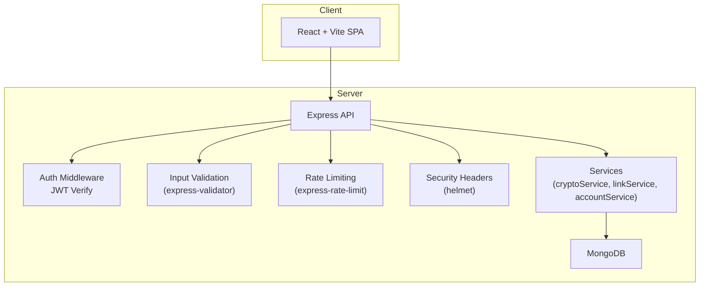
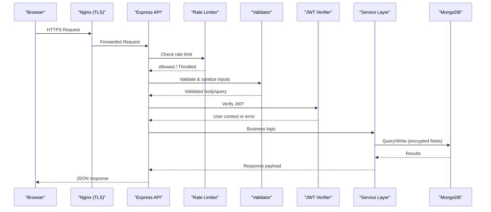
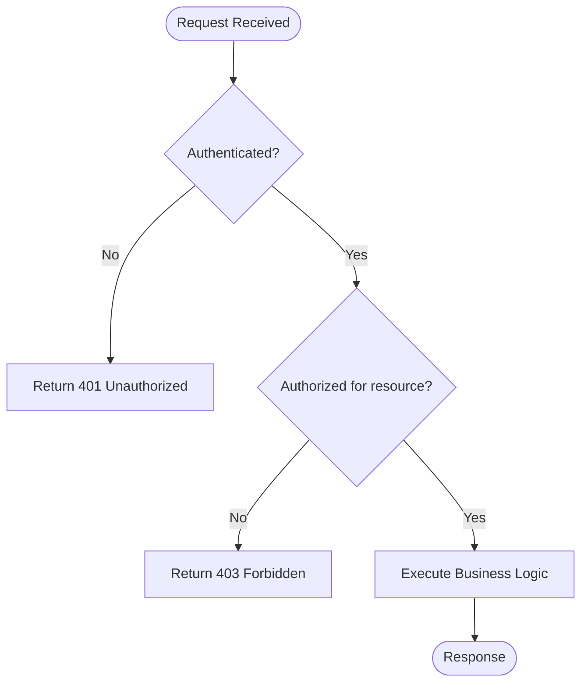
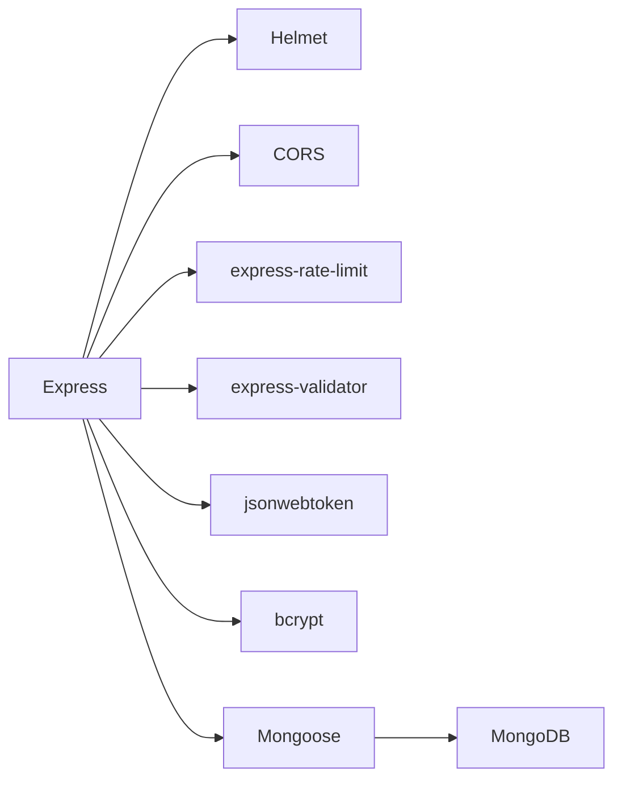

# Security Hardening

<cite>
**Referenced Files in This Document**
- [BUILD.md](file://doc/BUILD.md)
</cite>

## Table of Contents
1. [Introduction](#introduction)
2. [Project Structure](#project-structure)
3. [Core Components](#core-components)
4. [Architecture Overview](#architecture-overview)
5. [Detailed Component Analysis](#detailed-component-analysis)
6. [Dependency Analysis](#dependency-analysis)
7. [Performance Considerations](#performance-considerations)
8. [Troubleshooting Guide](#troubleshooting-guide)
9. [Conclusion](#conclusion)
10. [Appendices](#appendices)

## Introduction
This document provides comprehensive security hardening guidance for deploying QuickLink in production. It focuses on environment variable configuration (JWT secrets, encryption salts, database connection strings, CORS), SSL/TLS and HTTPS enforcement, secure headers, firewall and network policies, access control, rate limiting, input validation, security middleware, monitoring and audit logging, vulnerability scanning, and secure backup procedures. The guidance is aligned with the project’s documented technologies and security design.

## Project Structure
QuickLink is a monorepo with separate client and server applications, orchestrated via Docker Compose. The backend uses Express with TypeScript, MongoDB, JWT authentication, bcrypt for password hashing, AES-256-GCM for sensitive data encryption, express-rate-limit for throttling, express-validator for input validation, helmet for secure HTTP headers, and cors for cross-origin policy management.

**Diagram sources**
- [BUILD.md:33-91](file://doc/BUILD.md#L33-L91)
- [BUILD.md:540-569](file://doc/BUILD.md#L540-L569)

**Section sources**
- [BUILD.md:33-91](file://doc/BUILD.md#L33-L91)
- [BUILD.md:540-569](file://doc/BUILD.md#L540-L569)

## Core Components
- Authentication and Authorization:
  - JWT-based sessions with configurable expiration.
  - Passwords hashed with bcrypt; master key used to derive an AES key for encrypting sensitive fields.
- Data Protection:
  - Sensitive fields encrypted using AES-256-GCM with per-record IV and auth tag.
  - Encryption salt derived from environment configuration.
- Input Validation and Sanitization:
  - Request payloads validated and sanitized via express-validator.
- Rate Limiting:
  - Global and route-specific limits via express-rate-limit to mitigate brute-force and abuse.
- Secure Headers:
  - Helmet configured to enforce secure defaults (HSTS, X-Frame-Options, CSP, etc.).
- CORS Policy:
  - Strict allowlist of origins, methods, and headers for production.

**Section sources**
- [BUILD.md:17-29](file://doc/BUILD.md#L17-L29)
- [BUILD.md:339-391](file://doc/BUILD.md#L339-L391)
- [BUILD.md:540-569](file://doc/BUILD.md#L540-L569)

## Architecture Overview
The request flow enforces multiple layers of security before reaching business logic:

**Diagram sources**
- [BUILD.md:285-336](file://doc/BUILD.md#L285-L336)
- [BUILD.md:339-391](file://doc/BUILD.md#L339-L391)
- [BUILD.md:540-569](file://doc/BUILD.md#L540-L569)

## Detailed Component Analysis

### Environment Variables and Secrets Management
- JWT Secret:
  - Use a strong, randomly generated secret stored in a secrets manager or protected .env file not committed to version control.
  - Configure JWT expiration appropriate for your risk posture (e.g., short-lived tokens with refresh strategy).
- Encryption Salt:
  - Generate a cryptographically secure random salt for deriving the AES key used to encrypt sensitive fields.
- Database Connection String:
  - Store MongoDB URI and database name in environment variables; never hardcode credentials.
  - In production, use private networking and restrict MongoDB to internal endpoints only.
- CORS Policy:
  - Define explicit allowed origins, methods, and headers; disable wildcard origins in production.

Operational notes:
- Load environment variables at startup; validate required keys exist before booting.
- Rotate secrets periodically and support zero-downtime rotation where possible.

**Section sources**
- [BUILD.md:394-416](file://doc/BUILD.md#L394-L416)
- [BUILD.md:339-391](file://doc/BUILD.md#L339-L391)

### SSL/TLS and HTTPS Enforcement
- Terminate TLS at the reverse proxy (e.g., Nginx) using valid certificates managed by a trusted CA.
- Enforce HTTPS-only traffic; redirect all HTTP to HTTPS.
- Enable HSTS, prefer modern TLS versions and cipher suites, and disable insecure protocols.
- Ensure the frontend base URL points to HTTPS endpoints.

**Section sources**
- [BUILD.md:498-504](file://doc/BUILD.md#L498-L504)
- [BUILD.md:394-416](file://doc/BUILD.md#L394-L416)

### Secure Headers and CORS
- Apply helmet to set secure default headers (e.g., strict transport security, content type options, frameguard, XSS protection).
- Configure CORS to whitelist only trusted origins and restrict exposed headers and methods.
- Avoid permissive defaults such as allowing all origins or methods in production.

**Section sources**
- [BUILD.md:540-569](file://doc/BUILD.md#L540-L569)
- [BUILD.md:339-391](file://doc/BUILD.md#L339-L391)

### Firewall Rules and Network Security Policies
- Expose only necessary ports to the internet (typically 443 for HTTPS); keep application and database ports internal.
- Restrict inbound traffic to the server from known IP ranges if applicable.
- Isolate services within a private network; ensure MongoDB is not directly accessible from the public internet.
- Use least privilege for service accounts and container runtime permissions.

[No sources needed since this section provides general guidance]

### Access Control and Authentication Flow
- Require authentication for all sensitive endpoints; verify JWT on each request.
- Enforce authorization checks at the controller/service layer to ensure users can only access their own resources.
- Implement logout and token invalidation strategies consistent with your threat model.

**Section sources**
- [BUILD.md:285-336](file://doc/BUILD.md#L285-L336)
- [BUILD.md:339-391](file://doc/BUILD.md#L339-L391)

### Rate Limiting Configuration
- Apply global rate limits to protect against brute-force and scraping.
- Add stricter limits on authentication endpoints (login/register/password reset).
- Use sliding windows or token buckets to balance usability and protection.
- Monitor and tune thresholds based on observed traffic patterns.

**Section sources**
- [BUILD.md:540-569](file://doc/BUILD.md#L540-L569)
- [BUILD.md:339-391](file://doc/BUILD.md#L339-L391)

### Input Validation and Sanitization
- Validate all user inputs using express-validator schemas for create/update operations.
- Sanitize inputs to prevent injection attacks and ensure data integrity.
- Reject malformed or excessively large payloads early in the pipeline.

**Section sources**
- [BUILD.md:540-569](file://doc/BUILD.md#L540-L569)
- [BUILD.md:339-391](file://doc/BUILD.md#L339-L391)

### Security Middleware Configuration
- Helmet: enable secure defaults and customize as needed (CSP, HSTS, referrer-policy, etc.).
- CORS: configure strict origin allowlists and minimal exposure.
- Rate limiter: apply globally and per-route with differentiated policies.
- Validation: integrate validation middleware before controllers.

**Section sources**
- [BUILD.md:540-569](file://doc/BUILD.md#L540-L569)
- [BUILD.md:339-391](file://doc/BUILD.md#L339-L391)

### Security Monitoring, Audit Logging, and Vulnerability Scanning
- Monitoring:
  - Centralize logs (structured JSON) with correlation IDs for requests.
  - Track authentication events, authorization failures, and sensitive operations.
- Audit Logging:
  - Log creation, updates, and deletions of links and accounts; include user context and timestamps.
  - Retain logs securely with restricted access and retention policies.
- Vulnerability Scanning:
  - Integrate dependency scanning in CI/CD for both client and server dependencies.
  - Run container image scans and enforce policies to block vulnerable images.

[No sources needed since this section provides general guidance]

### Secure Backup Procedures and Data Protection
- Backups:
  - Schedule regular backups of MongoDB data volumes; encrypt backups at rest.
  - Store backups offsite with strict access controls and test restoration procedures.
- Data Minimization:
  - Only store necessary sensitive data; avoid logging secrets or tokens.
- Key Management:
  - Protect encryption keys and salts; rotate according to policy and re-encrypt data when feasible.

[No sources needed since this section provides general guidance]

## Dependency Analysis
QuickLink’s backend depends on several security-focused packages that must be kept up-to-date and configured securely:

**Diagram sources**
- [BUILD.md:540-569](file://doc/BUILD.md#L540-L569)

**Section sources**
- [BUILD.md:540-569](file://doc/BUILD.md#L540-L569)

## Performance Considerations
- Rate limiting should be tuned to avoid false positives while protecting endpoints.
- Prefer efficient queries and indexes to reduce load under attack conditions.
- Cache non-sensitive responses where appropriate to reduce overhead.
- Keep dependencies updated to benefit from performance and security improvements.

[No sources needed since this section provides general guidance]

## Troubleshooting Guide
Common issues and mitigations:
- Authentication failures:
  - Verify JWT secret and expiration settings; check token validity and clock skew.
- CORS errors:
  - Ensure frontend origin matches the allowed list; confirm preflight handling.
- Rate limit exceeded:
  - Adjust thresholds or implement progressive backoff; monitor client behavior.
- Validation errors:
  - Review schema definitions and error messages; log failed attempts for analysis.
- TLS/HTTPS issues:
  - Validate certificate chain; ensure HSTS and redirects are correctly configured.

[No sources needed since this section provides general guidance]

## Conclusion
By enforcing strict environment configuration, TLS termination, secure headers, robust authentication, input validation, rate limiting, and continuous monitoring and scanning, QuickLink can be hardened for production deployments. Regular audits, backups, and dependency updates are essential to maintain a strong security posture over time.

[No sources needed since this section summarizes without analyzing specific files]

## Appendices

### Appendix A: Environment Variables Checklist
- Server: PORT, NODE_ENV
- Database: MONGODB_URI, MONGODB_DB_NAME
- JWT: JWT_SECRET, JWT_EXPIRES_IN
- Encryption: ENCRYPTION_SALT
- Client: VITE_API_BASE_URL (HTTPS)

**Section sources**
- [BUILD.md:394-416](file://doc/BUILD.md#L394-L416)

### Appendix B: Security Controls Matrix
- HTTPS/TLS: Enforced at reverse proxy
- Secure Headers: Helmet enabled
- CORS: Strict allowlist
- Authentication: JWT with bcrypt passwords
- Authorization: Resource-level checks
- Rate Limiting: Global and endpoint-specific
- Input Validation: Schema-based validation
- Monitoring: Structured logs and audit trails
- Scanning: CI/CD dependency and image scans
- Backups: Encrypted, offsite, tested restores

**Section sources**
- [BUILD.md:339-391](file://doc/BUILD.md#L339-L391)
- [BUILD.md:540-569](file://doc/BUILD.md#L540-L569)