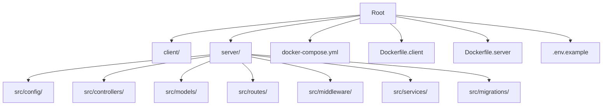
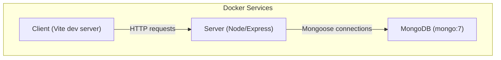

# Getting Started Guide

<cite>
**Referenced Files in This Document**
- [BUILD.md](file://doc/BUILD.md)
</cite>

## Table of Contents
1. Introduction
2. Project Structure
3. Core Components
4. Architecture Overview
5. Detailed Component Analysis
6. Dependency Analysis
7. Performance Considerations
8. Troubleshooting Guide
9. Conclusion

## Introduction
QuickLink is a personal knowledge management tool for collecting and organizing links, managing account credentials securely, and searching content quickly. It provides a modern React frontend, a Node.js/Express backend, MongoDB storage, Docker Compose deployment, and database migrations. This guide helps you set up and run QuickLink locally with minimal friction.

## Project Structure
QuickLink follows a monorepo-style layout with separate client and server directories, configuration files, and Docker assets at the root level. The documentation describes the intended structure including:
- client: React + TypeScript + Vite frontend
- server: Express + TypeScript backend with controllers, models, routes, middleware, services, and migrations
- Root-level Docker Compose and Dockerfiles for containerized deployment
- Environment configuration via .env

**Diagram sources**
- [BUILD.md:33-92](file://doc/BUILD.md#L33-L92)

**Section sources**
- [BUILD.md:33-92](file://doc/BUILD.md#L33-L92)

## Core Components
- Frontend: React 18 + TypeScript + Vite with Ant Design UI components
- Backend: Node.js + Express + TypeScript REST API
- Database: MongoDB 7 with schema migrations using migrate-mongo
- Security: JWT authentication, bcrypt password hashing, AES-256-GCM encryption for sensitive fields
- Deployment: Docker Compose to run MongoDB, server, and client together

Key environment variables include server port, Node environment, MongoDB connection details, JWT secret and expiry, encryption salt, and the client API base URL.

**Section sources**
- [BUILD.md:17-29](file://doc/BUILD.md#L17-L29)
- [BUILD.md:394-416](file://doc/BUILD.md#L394-L416)

## Architecture Overview
The application runs three main services orchestrated by Docker Compose:
- MongoDB service for data persistence
- Server service exposing the REST API
- Client service serving the web UI

**Diagram sources**
- [BUILD.md:418-459](file://doc/BUILD.md#L418-L459)

## Detailed Component Analysis

### Prerequisites
- Node.js and npm (for local development)
- Docker and Docker Compose (for containerized setup)
- MongoDB (provided via Docker Compose; alternatively connect to an external instance)

Ensure your system has Docker installed and running before proceeding.

**Section sources**
- [BUILD.md:17-29](file://doc/BUILD.md#L17-L29)
- [BUILD.md:418-459](file://doc/BUILD.md#L418-L459)

### Installation and First Run with Docker Compose
1. Clone the repository and navigate to the project root.
2. Create a .env file from the example template and fill in required values:
   - Server settings (port, environment)
   - MongoDB connection URI and database name
   - JWT secret and expiration
   - Encryption salt
   - Client API base URL
3. Start all services with Docker Compose.
4. Execute database migrations to create collections and indexes.
5. Access the application in your browser at http://localhost:5173.

Notes:
- The Docker Compose setup exposes MongoDB on port 27017, the server on port 3000, and the client on port 5173.
- Data is persisted via a named volume for MongoDB.

**Section sources**
- [BUILD.md:394-416](file://doc/BUILD.md#L394-L416)
- [BUILD.md:418-459](file://doc/BUILD.md#L418-L459)
- [BUILD.md:508-536](file://doc/BUILD.md#L508-L536)

### Environment Configuration (.env)
Set the following variables in your .env file:
- PORT: Backend server port
- NODE_ENV: Development or production
- MONGODB_URI: MongoDB connection string
- MONGODB_DB_NAME: Target database name
- JWT_SECRET: Secret used to sign JWT tokens
- JWT_EXPIRES_IN: Token lifetime (e.g., 2h)
- ENCRYPTION_SALT: Salt used for deriving encryption keys
- VITE_API_BASE_URL: Base URL for client API calls

Tips:
- Use strong, unique values for JWT_SECRET and ENCRYPTION_SALT.
- Ensure MONGODB_URI points to the correct host when using Docker Compose (e.g., mongodb://mongodb:27017 inside containers).

**Section sources**
- [BUILD.md:394-416](file://doc/BUILD.md#L394-L416)

### Running in Development Mode
You can run the backend and frontend locally without Docker:
1. Install dependencies in both server and client directories.
2. Configure .env as described above.
3. Start MongoDB (via Docker or a local instance).
4. Run database migrations in the server directory.
5. Start the backend development server.
6. Start the frontend development server.
7. Open http://localhost:5173 in your browser.

This approach allows hot reloading and easier debugging during development.

**Section sources**
- [BUILD.md:508-536](file://doc/BUILD.md#L508-L536)

### Database Migration Execution
Use migrate-mongo to manage schema changes:
- Check migration status
- Apply pending migrations
- Roll back the last migration if needed
- Create new migration scripts following the naming convention

Migration scripts are stored under server/src/migrations/.

**Section sources**
- [BUILD.md:201-281](file://doc/BUILD.md#L201-L281)

### Accessing the Application
After starting services:
- Frontend: http://localhost:5173
- Backend API: http://localhost:3000/api
- MongoDB: localhost:27017 (or mongodb:27017 within Docker network)

**Section sources**
- [BUILD.md:418-459](file://doc/BUILD.md#L418-L459)
- [BUILD.md:508-536](file://doc/BUILD.md#L508-L536)

## Dependency Analysis
QuickLink’s runtime depends on:
- Node.js ecosystem packages for Express, Mongoose, JWT, bcrypt, validation, rate limiting, CORS, and security headers
- Frontend packages for React, routing, UI components, state management, and build tooling
- Docker images for MongoDB and containerized builds for client/server

These dependencies enable a full-stack application with secure credential handling and scalable data operations.

**Section sources**
- [BUILD.md:540-593](file://doc/BUILD.md#L540-L593)

## Performance Considerations
- Use appropriate pagination and filtering on list endpoints to reduce payload sizes.
- Leverage MongoDB indexes defined for frequent queries (e.g., userId, tags, category, favorite flags).
- Keep JWT token lifetimes reasonable to balance security and user experience.
- Enable HTTPS in production and configure CORS strictly for allowed origins.
- Monitor database query performance and adjust indexes as usage patterns evolve.

[No sources needed since this section provides general guidance]

## Troubleshooting Guide
Common issues and resolutions:
- Cannot connect to MongoDB:
  - Verify MONGODB_URI is correct and reachable.
  - If using Docker Compose, ensure the MongoDB service is running and accessible at the expected hostname.
- Port conflicts:
  - Change PORT or other exposed ports in .env or docker-compose configuration if another process uses 3000 or 5173.
- JWT errors:
  - Ensure JWT_SECRET is set consistently between deployments and matches expectations in the server code.
- Migration failures:
  - Confirm migrate-mongo is configured correctly and that the target database exists.
  - Review migration logs and revert problematic migrations if necessary.
- CORS or API base URL issues:
  - Set VITE_API_BASE_URL to match the running backend address.
  - Adjust CORS settings if the frontend domain differs from the backend.

**Section sources**
- [BUILD.md:394-416](file://doc/BUILD.md#L394-L416)
- [BUILD.md:418-459](file://doc/BUILD.md#L418-L459)
- [BUILD.md:508-536](file://doc/BUILD.md#L508-L536)

## Conclusion
You now have the essentials to install, configure, and run QuickLink locally using either Docker Compose or native development servers. Follow the environment setup, execute migrations, and access the app at localhost:5173. For production, consider enabling HTTPS, securing CORS, and tuning performance based on usage patterns.

[No sources needed since this section summarizes without analyzing specific files]