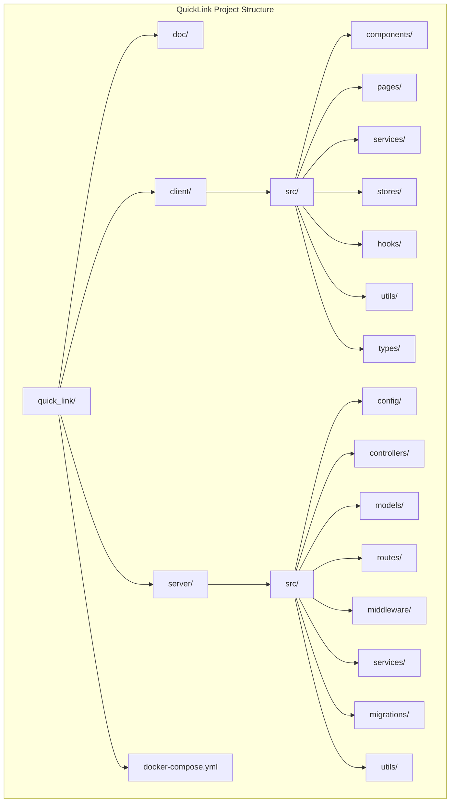
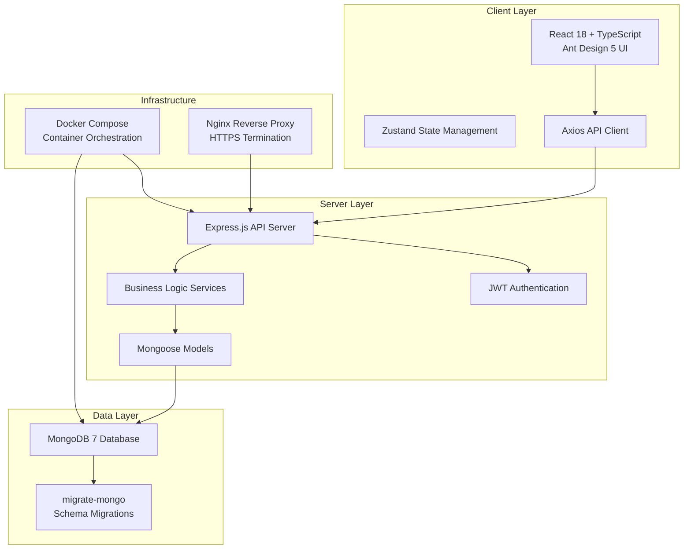
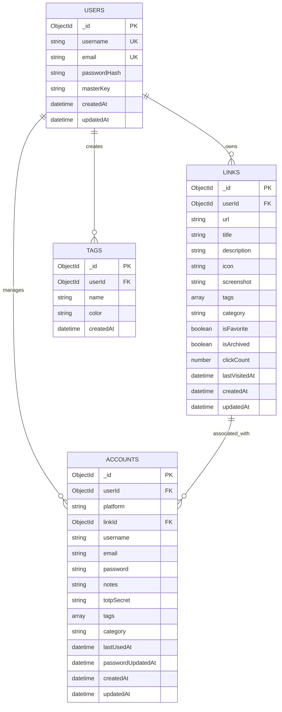
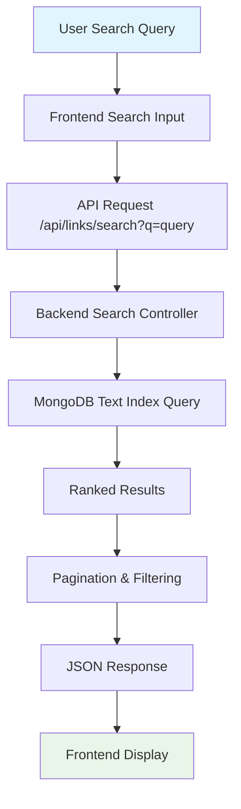
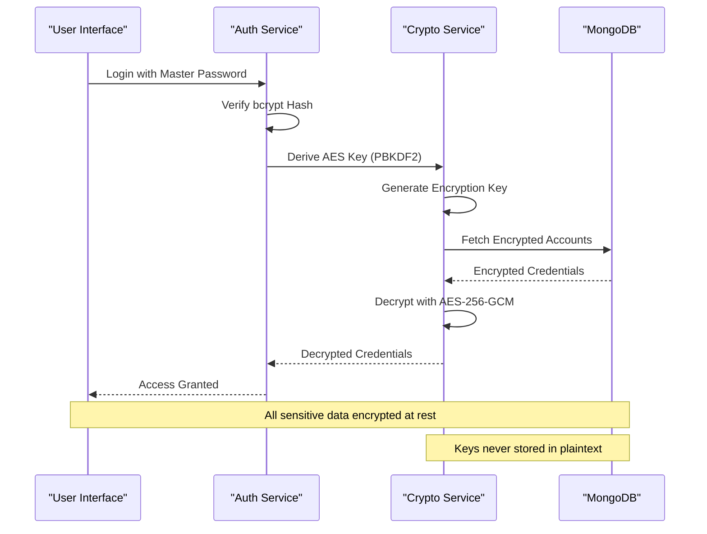
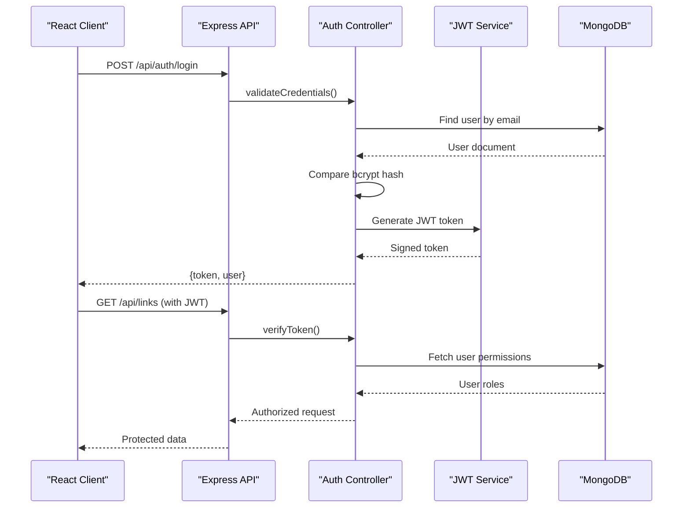
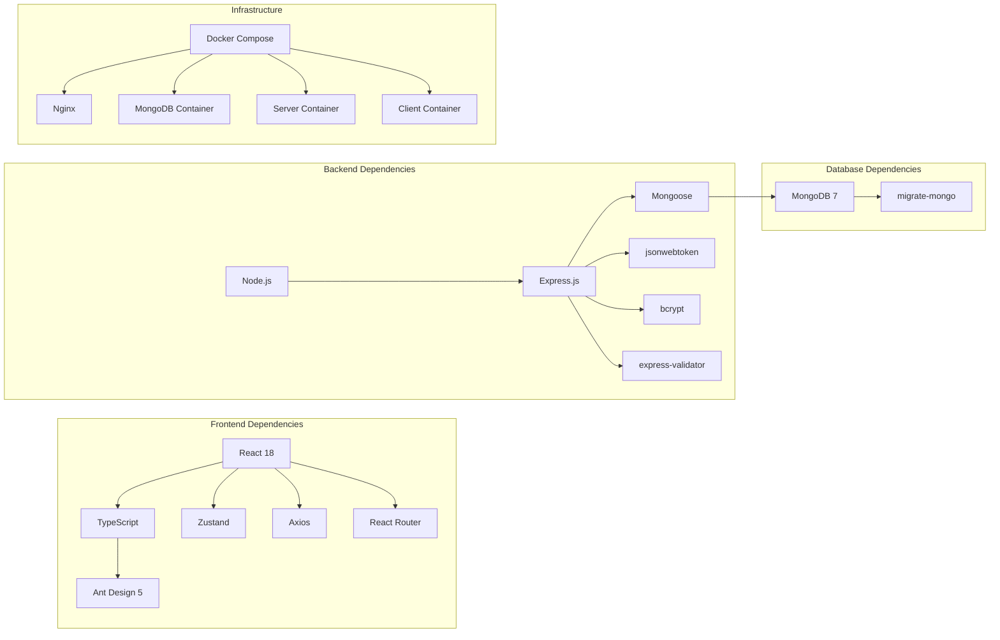

# Project Overview

<cite>
**Referenced Files in This Document**
- [BUILD.md](file://doc/BUILD.md)
</cite>

## Table of Contents
1. [Introduction](#introduction)
2. [Project Structure](#project-structure)
3. [Core Components](#core-components)
4. [Architecture Overview](#architecture-overview)
5. [Detailed Component Analysis](#detailed-component-analysis)
6. [Dependency Analysis](#dependency-analysis)
7. [Performance Considerations](#performance-considerations)
8. [Troubleshooting Guide](#troubleshooting-guide)
9. [Conclusion](#conclusion)

## Introduction

QuickLink is a comprehensive personal knowledge management tool designed to solve the common challenge of organizing and securing digital assets. As a modern link collection and account password management solution, QuickLink addresses the growing need for individuals to efficiently manage their web bookmarks while maintaining secure access credentials for various online platforms.

### What Problem Does QuickLink Solve?

In today's digital landscape, users face several critical challenges:

- **Information Overload**: Managing hundreds of useful web links across different categories becomes increasingly difficult without proper organization
- **Security Concerns**: Storing sensitive account credentials in plain text or scattered across multiple password managers creates security vulnerabilities
- **Accessibility Issues**: Finding specific links or passwords quickly when needed requires efficient search and categorization capabilities
- **Data Portability**: Users need reliable ways to import existing data and export their collections for backup or migration purposes

QuickLink provides an elegant solution by combining powerful link management with enterprise-grade security features in a user-friendly interface that works seamlessly across desktop and mobile browsers.

### Key Value Propositions

For **beginners**, QuickLink offers:
- Simple yet powerful link organization with categories and tags
- Secure password storage with military-grade encryption
- Intuitive search functionality to find anything instantly
- Easy data import from popular bookmark formats
- Cross-platform accessibility through web browser

For **experienced developers**, QuickLink demonstrates:
- Modern full-stack architecture using React 18 + TypeScript frontend and Node.js + Express backend
- Robust MongoDB database design with schema migrations
- Comprehensive security implementation including AES-256-GCM encryption and JWT authentication
- Docker-based deployment for consistent development and production environments
- Scalable API design following RESTful principles

## Project Structure

QuickLink follows a well-organized monorepo structure that separates concerns between frontend and backend components while maintaining clear boundaries and dependencies.

**Diagram sources**
- [BUILD.md:35-92](file://doc/BUILD.md#L35-L92)

The project structure demonstrates a clean separation of concerns with dedicated directories for each major component, making it easy for developers to navigate and maintain the codebase.

**Section sources**
- [BUILD.md:35-92](file://doc/BUILD.md#L35-L92)

## Core Components

QuickLink consists of several core components that work together to provide a comprehensive personal knowledge management experience.

### Frontend Architecture (React 18 + TypeScript)

The frontend is built with modern React 18 and TypeScript, providing type safety and enhanced developer experience. Key features include:

- **Component-Based Architecture**: Reusable UI components built with Ant Design 5 for consistent styling and functionality
- **State Management**: Zustand for lightweight state management across the application
- **Routing**: React Router for client-side navigation and page management
- **API Integration**: Axios for HTTP requests with centralized service layer
- **Responsive Design**: Mobile-first approach ensuring optimal experience across devices

### Backend Architecture (Node.js + Express)

The backend provides a robust REST API built with Node.js and Express, featuring:

- **RESTful API Design**: Clean, predictable endpoints following HTTP standards
- **Authentication & Authorization**: JWT-based authentication with role-based access control
- **Database Abstraction**: Mongoose ODM for MongoDB interactions with schema validation
- **Security Middleware**: Helmet for security headers, CORS configuration, and rate limiting
- **Error Handling**: Centralized error handling with meaningful error responses

### Database Design (MongoDB)

QuickLink uses MongoDB as its primary database, leveraging its flexible schema design and powerful querying capabilities:

- **Document-Oriented Storage**: Natural mapping between JavaScript objects and database documents
- **Schema Validation**: Enforced data integrity through Mongoose schemas
- **Indexing Strategy**: Optimized indexes for fast queries and searches
- **Migration Support**: Version-controlled schema changes using migrate-mongo

**Section sources**
- [BUILD.md:17-30](file://doc/BUILD.md#L17-L30)
- [BUILD.md:35-92](file://doc/BUILD.md#L35-L92)

## Architecture Overview

QuickLink implements a modern three-tier architecture that separates presentation, business logic, and data layers while maintaining clear communication patterns between components.

**Diagram sources**
- [BUILD.md:17-30](file://doc/BUILD.md#L17-L30)
- [BUILD.md:35-92](file://doc/BUILD.md#L35-L92)
- [BUILD.md:418-459](file://doc/BUILD.md#L418-L459)

The architecture ensures scalability, maintainability, and security while providing a solid foundation for future feature additions and performance optimizations.

**Section sources**
- [BUILD.md:17-30](file://doc/BUILD.md#L17-L30)
- [BUILD.md:418-459](file://doc/BUILD.md#L418-L459)

## Detailed Component Analysis

### Link Management System

The link management system serves as the core functionality of QuickLink, enabling users to organize, search, and manage their web bookmarks effectively.

#### Data Model and Relationships

**Diagram sources**
- [BUILD.md:100-178](file://doc/BUILD.md#L100-L178)

#### Search and Indexing Strategy

The link management system implements sophisticated search capabilities with full-text indexing:

**Diagram sources**
- [BUILD.md:182-197](file://doc/BUILD.md#L182-L197)
- [BUILD.md:307-308](file://doc/BUILD.md#L307-L308)

**Section sources**
- [BUILD.md:100-197](file://doc/BUILD.md#L100-L197)
- [BUILD.md:297-308](file://doc/BUILD.md#L297-L308)

### Account Password Management System

The account password management system provides enterprise-grade security for storing sensitive credentials with advanced encryption and access controls.

#### Security Architecture

**Diagram sources**
- [BUILD.md:341-378](file://doc/BUILD.md#L341-L378)

#### Encryption Implementation

The system implements a multi-layered encryption approach:

1. **Master Password Protection**: User's master password is hashed using bcrypt for secure verification
2. **Key Derivation**: PBKDF2 algorithm derives a 256-bit AES key from the master password
3. **Field-Level Encryption**: Individual sensitive fields are encrypted using AES-256-GCM
4. **Authentication Tags**: Each encrypted payload includes authentication tags for integrity verification

**Section sources**
- [BUILD.md:341-378](file://doc/BUILD.md#L341-L378)

### Authentication and Authorization System

QuickLink implements a comprehensive authentication system using JWT tokens with role-based access control.

#### Authentication Flow

**Diagram sources**
- [BUILD.md:287-295](file://doc/BUILD.md#L287-L295)

**Section sources**
- [BUILD.md:287-295](file://doc/BUILD.md#L287-L295)

## Dependency Analysis

QuickLink's architecture demonstrates careful dependency management with clear separation between frontend and backend concerns, while maintaining loose coupling between internal modules.

**Diagram sources**
- [BUILD.md:542-593](file://doc/BUILD.md#L542-L593)

The dependency structure ensures modularity, testability, and ease of maintenance while providing a solid foundation for scaling and extending functionality.

**Section sources**
- [BUILD.md:542-593](file://doc/BUILD.md#L542-L593)

## Performance Considerations

QuickLink incorporates several performance optimization strategies to ensure responsive user experiences and efficient resource utilization.

### Database Optimization

- **Strategic Indexing**: Comprehensive index design for frequently queried fields including user associations, tags, categories, and search terms
- **Query Optimization**: Efficient MongoDB aggregation pipelines for complex filtering and sorting operations
- **Connection Pooling**: Configured connection pooling for optimal database connection management

### Frontend Performance

- **Code Splitting**: Lazy loading of route-specific components to reduce initial bundle size
- **Caching Strategies**: Browser caching for static assets and API response caching where appropriate
- **Optimized Rendering**: React.memo and useMemo hooks for expensive computations and re-renders

### Security Performance

- **Efficient Encryption**: AES-256-GCM provides authenticated encryption with minimal performance overhead
- **Secure Defaults**: Built-in security headers and safe defaults for all API endpoints
- **Rate Limiting**: Protection against brute force attacks and API abuse

[No sources needed since this section provides general guidance]

## Troubleshooting Guide

QuickLink includes comprehensive error handling and debugging capabilities to help identify and resolve issues efficiently.

### Common Issues and Solutions

#### Database Connection Problems
- **Symptoms**: Application fails to start or shows database connection errors
- **Solutions**: Verify MongoDB URI configuration, check container connectivity, ensure database is running
- **Debugging**: Enable verbose logging and check connection pool status

#### Authentication Failures
- **Symptoms**: Users unable to login or sessions expire unexpectedly
- **Solutions**: Verify JWT secret configuration, check token expiration settings, validate password hashing
- **Debugging**: Enable authentication middleware logging and inspect token payloads

#### Encryption Issues
- **Symptoms**: Unable to decrypt stored credentials or encryption errors
- **Solutions**: Verify encryption salt configuration, check master password consistency, validate encryption algorithms
- **Debugging**: Enable crypto service logging and verify key derivation processes

### Monitoring and Logging

The application implements structured logging throughout all layers:
- **Request Logging**: HTTP request/response tracking with correlation IDs
- **Error Tracking**: Centralized error handling with stack traces and context
- **Performance Metrics**: Request timing and database query performance monitoring

**Section sources**
- [BUILD.md:380-391](file://doc/BUILD.md#L380-L391)

## Conclusion

QuickLink represents a comprehensive solution for personal knowledge management that successfully balances usability, security, and technical excellence. The project demonstrates modern software development practices through its clean architecture, comprehensive testing strategy, and robust security implementation.

### Key Strengths

- **Modern Technology Stack**: Leverages current best practices with React 18, TypeScript, Node.js, and MongoDB
- **Enterprise-Grade Security**: Implements military-grade encryption and authentication mechanisms
- **Scalable Architecture**: Designed for growth with modular components and clear separation of concerns
- **Developer Experience**: Well-documented codebase with comprehensive build and deployment automation
- **User-Centric Design**: Intuitive interface that makes complex functionality accessible to non-technical users

### Future Potential

The architecture provides a solid foundation for additional features such as:
- Collaborative sharing capabilities
- Advanced analytics and usage insights
- Mobile application development
- Integration with external services and APIs
- Enhanced customization and branding options

QuickLink stands as an excellent example of how modern web technologies can be combined to create powerful, secure, and user-friendly applications that solve real-world problems effectively.

[No sources needed since this section summarizes without analyzing specific files]