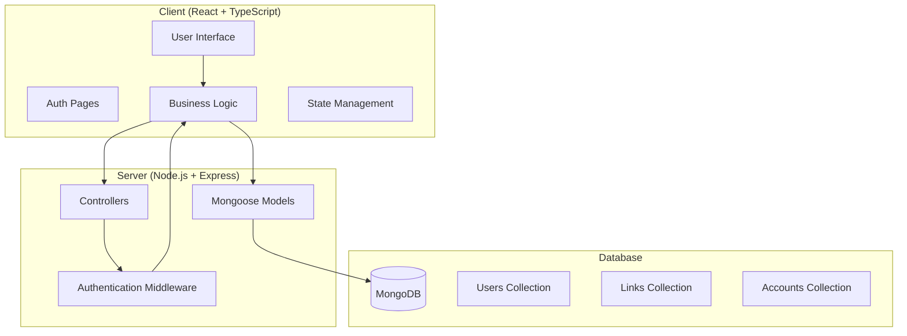
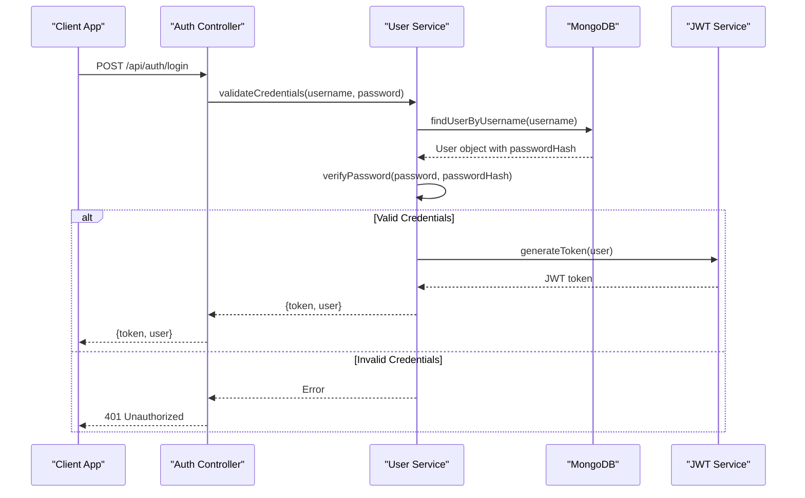
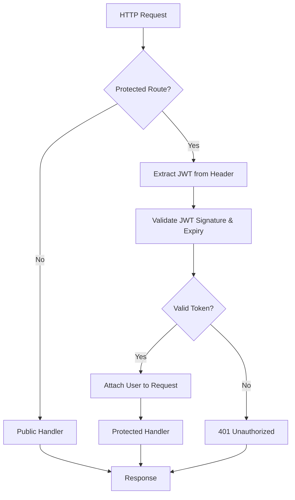
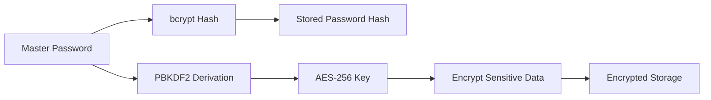
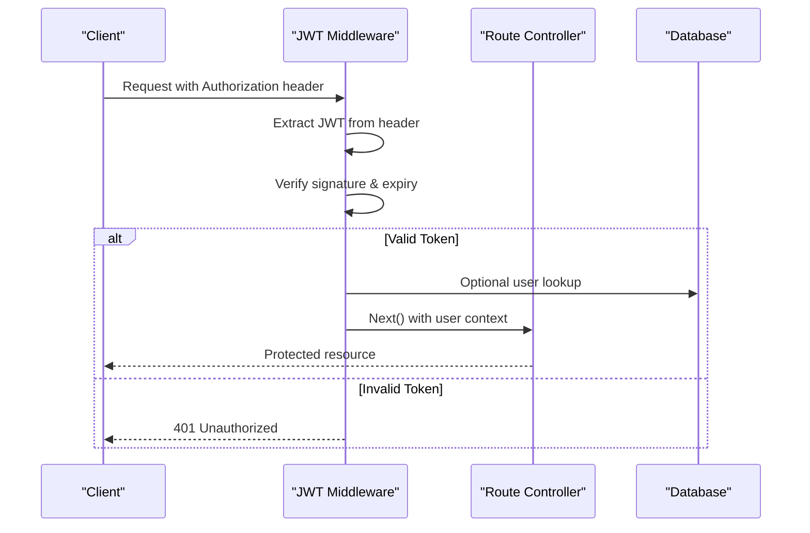
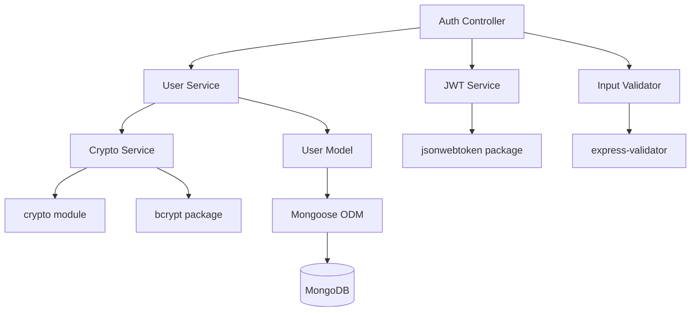

# Authentication Flow

<cite>
**Referenced Files in This Document**
- [BUILD.md](file://doc/BUILD.md)
</cite>

## Table of Contents
1. [Introduction](#introduction)
2. [Project Structure](#project-structure)
3. [Core Components](#core-components)
4. [Architecture Overview](#architecture-overview)
5. [Detailed Component Analysis](#detailed-component-analysis)
6. [Dependency Analysis](#dependency-analysis)
7. [Performance Considerations](#performance-considerations)
8. [Troubleshooting Guide](#troubleshooting-guide)
9. [Conclusion](#conclusion)

## Introduction

QuickLink is a personal knowledge management tool that supports link bookmarking and account password management. The application implements a comprehensive JWT-based authentication system to secure user sessions and protect sensitive data including encrypted passwords and credentials.

The authentication system follows industry best practices with JWT tokens for session management, bcrypt for password hashing, and AES-256-GCM encryption for sensitive data storage. The system provides complete authentication lifecycle support from user registration through login, token generation, and session management.

## Project Structure

Based on the project architecture documented in BUILD.md, QuickLink follows a monorepo structure with separate client and server components:



**Diagram sources**
- [BUILD.md:33-92](file://doc/BUILD.md#L33-L92)

The authentication system spans across multiple layers:
- **Frontend**: React components handle user interaction and token storage
- **Backend**: Express controllers manage authentication logic
- **Middleware**: JWT validation protects routes
- **Database**: MongoDB stores user credentials and session data

**Section sources**
- [BUILD.md:33-92](file://doc/BUILD.md#L33-L92)

## Core Components

### Authentication API Endpoints

QuickLink provides a comprehensive set of authentication endpoints:

| Method | Path | Description | Authentication Required |
|--------|------|-------------|------------------------|
| POST | /api/auth/register | User registration | No |
| POST | /api/auth/login | User login | No |
| POST | /api/auth/logout | User logout | Yes |
| GET | /api/auth/me | Get current user | Yes |
| PUT | /api/auth/password | Change password | Yes |

### JWT Token Structure

The JWT tokens in QuickLink contain essential user information and security metadata:

**Token Payload Fields:**
- `userId`: Unique user identifier
- `username`: User's username
- `email`: User's email address
- `iat`: Issued at timestamp
- `exp`: Expiration timestamp
- `sub`: Subject (user ID)

**Token Configuration:**
- **Secret Key**: Configured via environment variable `JWT_SECRET`
- **Expiration**: 2 hours by default (`JWT_EXPIRES_IN=2h`)
- **Algorithm**: HS256 (HMAC with SHA-256)

### Security Architecture

QuickLink implements a multi-layered security approach:



**Diagram sources**
- [BUILD.md:287-296](file://doc/BUILD.md#L287-L296)

**Section sources**
- [BUILD.md:287-296](file://doc/BUILD.md#L287-L296)

## Architecture Overview

The authentication architecture follows a stateless JWT pattern with middleware-based protection:



**Diagram sources**
- [BUILD.md:339-391](file://doc/BUILD.md#L339-L391)

### Token Lifecycle Management

1. **Registration**: New users are created with hashed passwords
2. **Login**: Validated credentials result in JWT token issuance
3. **Validation**: Middleware validates tokens on protected routes
4. **Refresh**: Tokens expire after configured duration (default 2h)
5. **Logout**: Server-side token invalidation or client-side cleanup

### Encryption Strategy

QuickLink uses a dual-encryption approach:



**Diagram sources**
- [BUILD.md:341-351](file://doc/BUILD.md#L341-L351)

**Section sources**
- [BUILD.md:339-391](file://doc/BUILD.md#L339-L391)

## Detailed Component Analysis

### Authentication Controller

The authentication controller handles all user authentication operations:

#### Registration Flow
- Validates input data using express-validator
- Checks for existing usernames/emails
- Hashes password using bcrypt with appropriate salt rounds
- Creates user document with encrypted master key
- Returns success response without sensitive data

#### Login Flow
- Validates provided credentials
- Compares password hash using bcrypt.compare
- Generates JWT token with user payload
- Sets appropriate HTTP headers for token transmission
- Returns authenticated user data

#### Logout Flow
- Clears client-side stored tokens
- Optionally invalidates server-side token blacklist
- Returns success confirmation

### JWT Middleware

The authentication middleware provides route protection:



**Diagram sources**
- [BUILD.md:287-296](file://doc/BUILD.md#L287-L296)

### Database Models

#### User Model Schema
```json
{
  "_id": "ObjectId",
  "username": "string (unique, required)",
  "email": "string (unique, required)", 
  "passwordHash": "string (bcrypt hash)",
  "masterKey": "string (encrypted, used to derive encryption key)",
  "createdAt": "Date",
  "updatedAt": "Date"
}
```

#### Account Model Schema
```json
{
  "_id": "ObjectId", 
  "userId": "ObjectId (ref: users)",
  "platform": "string (required, platform name)",
  "linkId": "ObjectId (ref: links, optional, associated link)",
  "username": "string (encrypted)",
  "email": "string (encrypted, optional)",
  "password": "string (encrypted, AES-256-GCM)",
  "notes": "string (encrypted, optional, notes)",
  "totpSecret": "string (encrypted, optional, 2FA secret)",
  "tags": ["string"],
  "category": "string (optional)",
  "lastUsedAt": "Date (optional)",
  "passwordUpdatedAt": "Date",
  "createdAt": "Date",
  "updatedAt": "Date"
}
```

**Section sources**
- [BUILD.md:100-178](file://doc/BUILD.md#L100-L178)

### Security Implementation

#### Password Encryption
QuickLink implements a sophisticated encryption strategy:

1. **Password Storage**: Uses bcrypt for password hashing
2. **Master Key Derivation**: PBKDF2 derives AES-256 key from master password
3. **Sensitive Data Encryption**: AES-256-GCM encrypts account credentials
4. **Secure Key Management**: Encryption keys derived from user's master password

#### Security Measures
- **HTTPS Enforcement**: All API endpoints require HTTPS
- **Rate Limiting**: Prevents brute force attacks on authentication endpoints
- **Input Validation**: Comprehensive validation using express-validator
- **CORS Configuration**: Whitelist-based cross-origin request handling
- **Helmet Integration**: Security headers for XSS and other attack prevention
- **Audit Logging**: Tracks sensitive operations for security monitoring

**Section sources**
- [BUILD.md:339-391](file://doc/BUILD.md#L339-L391)

## Dependency Analysis

The authentication system has well-defined dependencies between components:



**Diagram sources**
- [BUILD.md:542-568](file://doc/BUILD.md#L542-L568)

### External Dependencies

**Backend Dependencies:**
- `jsonwebtoken`: JWT token creation and verification
- `bcrypt`: Password hashing and comparison
- `express-validator`: Input validation and sanitization
- `express-rate-limit`: Rate limiting for authentication endpoints
- `helmet`: Security headers and protection
- `cors`: Cross-origin resource sharing configuration

**Security Packages:**
- `crypto`: Built-in Node.js cryptographic functions
- `dotenv`: Environment variable management

**Section sources**
- [BUILD.md:542-568](file://doc/BUILD.md#L542-L568)

## Performance Considerations

### JWT Token Optimization
- **Short-lived Tokens**: 2-hour expiration reduces risk exposure
- **Minimal Payload**: Only essential user data included in tokens
- **Efficient Verification**: Stateless validation without database lookups when possible

### Database Query Optimization
- **Index Usage**: Proper indexing on frequently queried fields (username, email)
- **Selective Field Retrieval**: Only necessary fields returned in responses
- **Connection Pooling**: Efficient MongoDB connection management

### Memory Management
- **Token Caching**: Client-side token caching to reduce network requests
- **Session Cleanup**: Regular cleanup of expired tokens and sessions
- **Resource Disposal**: Proper cleanup of cryptographic resources

## Troubleshooting Guide

### Common Authentication Issues

#### Token Validation Failures
**Symptoms**: 401 Unauthorized errors on protected routes
**Causes**:
- Expired JWT tokens
- Corrupted or tampered tokens
- Missing or malformed Authorization headers
- Incorrect JWT secret configuration

**Solutions**:
- Implement automatic token refresh before expiration
- Validate token format and structure
- Ensure consistent JWT secret across all services
- Add comprehensive error logging for debugging

#### Password Authentication Problems
**Symptoms**: Login failures despite correct credentials
**Causes**:
- Incorrect bcrypt salt rounds configuration
- Database connection issues
- User record corruption
- Character encoding problems

**Solutions**:
- Verify bcrypt configuration consistency
- Check database connectivity and user records
- Implement proper error handling and logging
- Use consistent character encoding throughout the application

#### Security Headers and CORS Issues
**Symptoms**: Cross-origin requests blocked, security warnings
**Causes**:
- Misconfigured CORS settings
- Missing security headers
- Development vs production environment differences

**Solutions**:
- Configure CORS whitelist for allowed origins
- Enable Helmet security headers in production
- Use environment-specific configurations
- Test CORS policies thoroughly in development

### Debugging Techniques

#### Logging Strategy
- **Authentication Logs**: Track login attempts, token generation, and validation
- **Error Tracking**: Centralized error logging with stack traces
- **Performance Metrics**: Monitor authentication endpoint performance
- **Security Audit**: Log failed authentication attempts for security analysis

#### Testing Approaches
- **Unit Tests**: Individual component testing for auth logic
- **Integration Tests**: Full authentication flow testing
- **Security Tests**: Penetration testing for common vulnerabilities
- **Load Testing**: Authentication endpoint stress testing

**Section sources**
- [BUILD.md:339-391](file://doc/BUILD.md#L339-L391)

## Conclusion

QuickLink's JWT-based authentication system provides a robust, secure foundation for protecting user data and managing user sessions. The implementation follows security best practices with proper token management, encryption strategies, and comprehensive error handling.

Key strengths of the authentication system include:
- **Stateless Design**: JWT tokens enable scalable, distributed authentication
- **Strong Encryption**: Multi-layered encryption protects sensitive user data
- **Comprehensive Security**: Multiple defense mechanisms against common attacks
- **Flexible Architecture**: Modular design allows for easy extension and maintenance

The system successfully balances security requirements with usability, providing seamless authentication experiences while maintaining strong protection against various attack vectors. Future enhancements could include additional security features like two-factor authentication, advanced rate limiting, and enhanced audit logging capabilities.