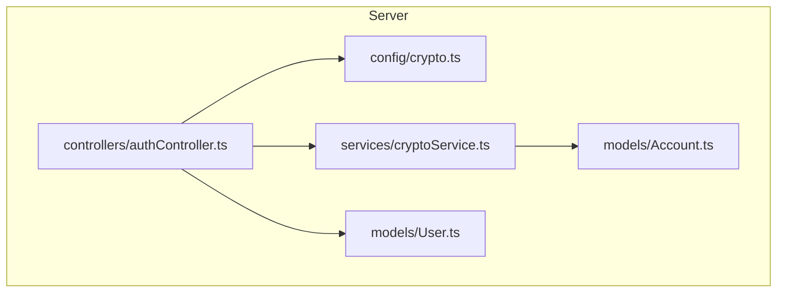
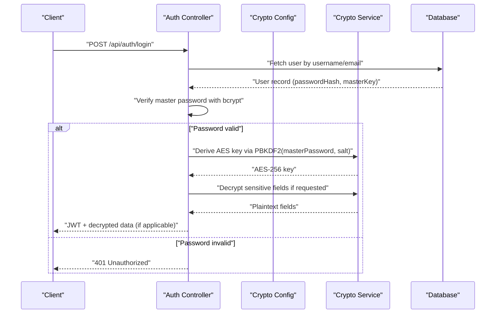
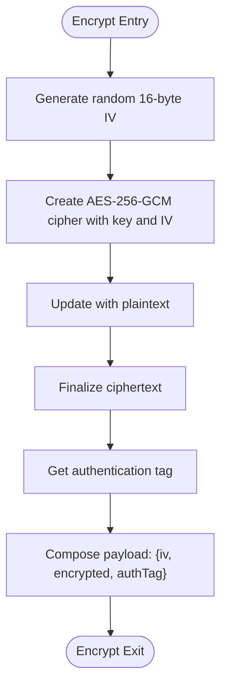
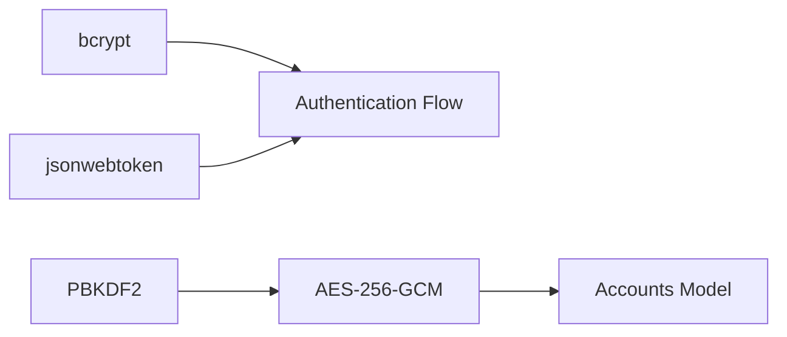

# Encryption Implementation

<cite>
**Referenced Files in This Document**
- [BUILD.md](file://doc/BUILD.md)
</cite>

## Table of Contents
1. [Introduction](#introduction)
2. [Project Structure](#project-structure)
3. [Core Components](#core-components)
4. [Architecture Overview](#architecture-overview)
5. [Detailed Component Analysis](#detailed-component-analysis)
6. [Dependency Analysis](#dependency-analysis)
7. [Performance Considerations](#performance-considerations)
8. [Troubleshooting Guide](#troubleshooting-guide)
9. [Conclusion](#conclusion)

## Introduction
This document explains QuickLink’s dual-layer encryption design that secures both authentication credentials and sensitive account data:
- Authentication layer: Master password hashing with bcrypt for secure login verification.
- Data protection layer: PBKDF2 key derivation to generate AES-256-GCM keys from the master password, used to encrypt/decrypt sensitive fields such as passwords and secrets stored in the database.

The goal is to provide a clear, code-aligned understanding of how these components work together, including parameters, flows, error handling considerations, and best practices for key management.

## Project Structure
QuickLink’s backend organizes security-related concerns under server/src/config and server/src/services, with encryption configuration and services referenced in the project documentation. The build document outlines the overall architecture and where encryption logic resides conceptually within the server module.

**Diagram sources**
- [BUILD.md:33-91](file://doc/BUILD.md#L33-L91)

**Section sources**
- [BUILD.md:33-91](file://doc/BUILD.md#L33-L91)

## Core Components
- Master password hashing (bcrypt): Used to store and verify user passwords securely during authentication.
- Key derivation (PBKDF2): Derives a 256-bit AES key from the master password using a per-user salt and iteration count.
- Symmetric encryption (AES-256-GCM): Encrypts sensitive account fields with unique IVs and produces authentication tags for integrity verification.

These components form a cohesive pipeline:
- On registration or first use, derive an AES key via PBKDF2 from the master password and store it encrypted in the user record.
- On login, verify the master password via bcrypt; on successful authentication, derive the AES key again to decrypt sensitive fields when needed.

**Section sources**
- [BUILD.md:339-378](file://doc/BUILD.md#L339-L378)
- [BUILD.md:100-112](file://doc/BUILD.md#L100-L112)
- [BUILD.md:136-156](file://doc/BUILD.md#L136-L156)

## Architecture Overview
The dual-layer approach separates authentication from data encryption while sharing the same secret root (the master password).

**Diagram sources**
- [BUILD.md:287-295](file://doc/BUILD.md#L287-L295)
- [BUILD.md:339-378](file://doc/BUILD.md#L339-L378)

## Detailed Component Analysis

### Master Password Processing with bcrypt
- Purpose: Securely hash and verify the user’s master password for authentication.
- Storage: The hashed value is stored in the user model’s passwordHash field.
- Verification: During login, compare the provided master password against the stored hash.

Security rationale:
- bcrypt is designed for password hashing with built-in salting and configurable cost factors to resist brute-force attacks.
- It is computationally expensive, making offline cracking impractical.

Operational notes:
- Ensure consistent hashing algorithms across environments.
- Store only the hash; never log or expose raw passwords.

**Section sources**
- [BUILD.md:100-112](file://doc/BUILD.md#L100-L112)
- [BUILD.md:339-351](file://doc/BUILD.md#L339-L351)

### PBKDF2 Key Derivation for AES-256-GCM Keys
- Purpose: Generate a strong, deterministic AES-256 key from the master password for encrypting sensitive fields.
- Parameters:
  - Algorithm: PBKDF2
  - Iteration count: 100,000
  - Output length: 32 bytes (256 bits)
  - Salt: Per-user random salt stored alongside the derived key or embedded in storage
- Usage: The derived key is used to initialize AES-256-GCM ciphers for encrypting and decrypting sensitive data.

Security rationale:
- PBKDF2 transforms a potentially weak master password into a high-entropy symmetric key suitable for AES.
- High iteration counts increase resistance to brute-force attacks without severely impacting performance.

Operational notes:
- Keep salts unique per user and persist them with the encrypted payload or metadata.
- Never reuse the same salt for different users or datasets.

**Section sources**
- [BUILD.md:339-351](file://doc/BUILD.md#L339-L351)

### AES-256-GCM Encryption for Sensitive Account Credentials
- Purpose: Protect sensitive fields such as usernames, emails, passwords, notes, and TOTP secrets in the accounts collection.
- Process:
  - Initialization Vector (IV): Generate a fresh, random 16-byte IV for each encryption operation.
  - Cipher creation: Use AES-256-GCM with the PBKDF2-derived key and the generated IV.
  - Authentication tag: Capture the GCM authentication tag to ensure ciphertext integrity and authenticity.
  - Storage: Persist the IV, ciphertext, and authentication tag together with the encrypted payload.
- Decryption:
  - Reconstruct the decipher with the same key and stored IV.
  - Set the authentication tag before decryption to validate integrity.
  - Decrypt and return plaintext only when necessary.

Security rationale:
- AES-256-GCM provides confidentiality and integrity in a single pass.
- Unique IVs prevent pattern leakage and replay attacks.
- Authentication tags detect tampering and ensure ciphertext has not been altered.

Operational notes:
- Always handle errors around cipher operations to avoid leaking partial plaintext or failing open.
- Limit exposure of decrypted data to endpoints that explicitly require it.

**Diagram sources**
- [BUILD.md:353-378](file://doc/BUILD.md#L353-L378)

**Section sources**
- [BUILD.md:136-156](file://doc/BUILD.md#L136-L156)
- [BUILD.md:353-378](file://doc/BUILD.md#L353-L378)

### Error Handling and Best Practices
- Cryptographic operations should be wrapped in try/catch blocks to handle malformed inputs, invalid tags, or missing IVs.
- On decryption failure (e.g., wrong tag), do not leak information about why decryption failed; return a generic error.
- Avoid logging sensitive values (keys, IVs, plaintext).
- Rotate keys and re-encrypt data when necessary, following a documented migration plan.
- Enforce least privilege: decrypt only when required by the endpoint and scope results accordingly.

**Section sources**
- [BUILD.md:339-378](file://doc/BUILD.md#L339-L378)

## Dependency Analysis
QuickLink’s security stack depends on well-known cryptographic primitives and libraries:
- bcrypt for password hashing
- Node.js crypto module for PBKDF2 and AES-256-GCM
- JWT for session management post-authentication

**Diagram sources**
- [BUILD.md:540-568](file://doc/BUILD.md#L540-L568)
- [BUILD.md:339-378](file://doc/BUILD.md#L339-L378)

**Section sources**
- [BUILD.md:540-568](file://doc/BUILD.md#L540-L568)

## Performance Considerations
- bcrypt cost factor: Choose a cost that balances security and response time; tune based on deployment environment.
- PBKDF2 iterations: 100,000 iterations provide strong security with acceptable latency on modern hardware; adjust if needed.
- AES-256-GCM: Efficient authenticated encryption; ensure IV generation remains fast and non-blocking.
- Minimize decryption: Only decrypt fields when explicitly requested to reduce CPU overhead.

[No sources needed since this section provides general guidance]

## Troubleshooting Guide
Common issues and resolutions:
- Decryption fails due to mismatched IV or tag:
  - Verify that the stored IV and authTag are correctly persisted and retrieved.
  - Ensure the same PBKDF2 parameters (iterations, output length, salt) are used for derivation.
- Authentication failures:
  - Confirm bcrypt hashing algorithm and cost settings match between registration and login.
- Unexpected plaintext exposure:
  - Audit endpoints to ensure decrypted data is not included in list responses or logs.

**Section sources**
- [BUILD.md:339-378](file://doc/BUILD.md#L339-L378)

## Conclusion
QuickLink’s dual-layer encryption strategy combines bcrypt for secure authentication and PBKDF2-derived AES-256-GCM for robust data protection. By using per-operation IVs, authentication tags, and carefully chosen parameters, the system ensures confidentiality, integrity, and resilience against common cryptographic threats. Adhering to the outlined best practices and error-handling patterns will help maintain a secure and performant implementation over time.

[No sources needed since this section summarizes without analyzing specific files]