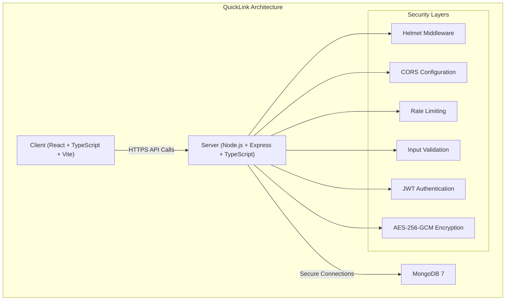
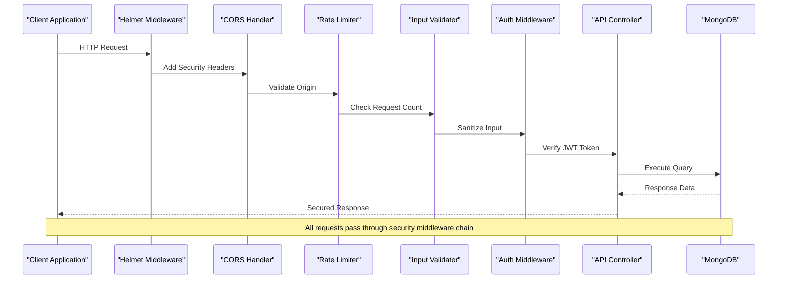
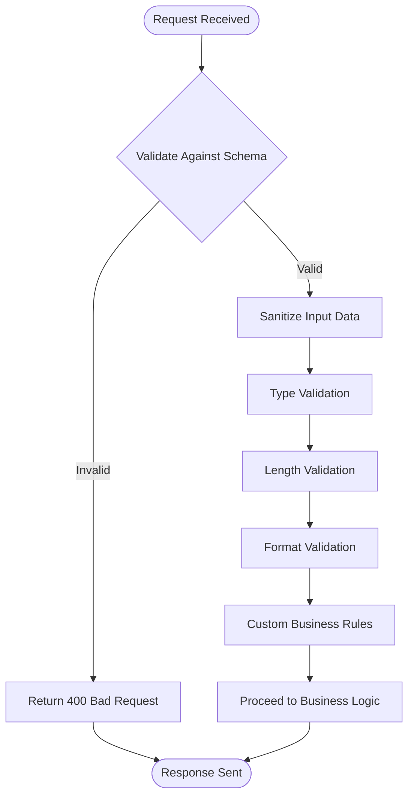
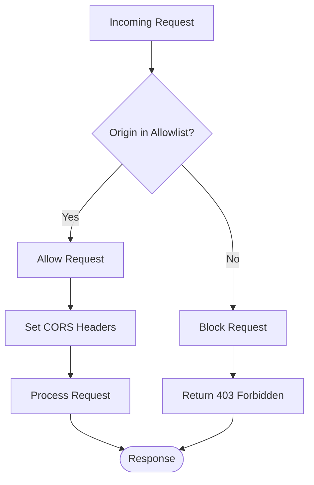
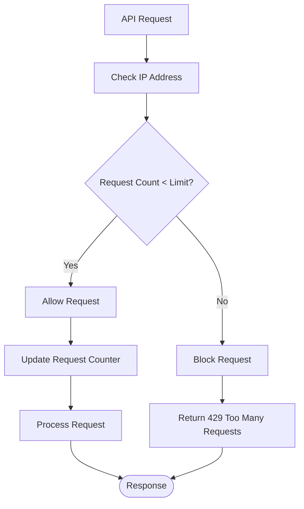
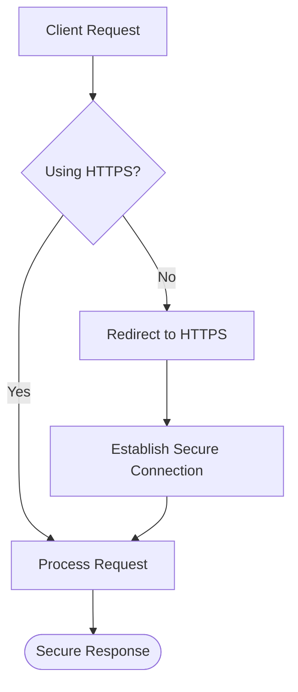
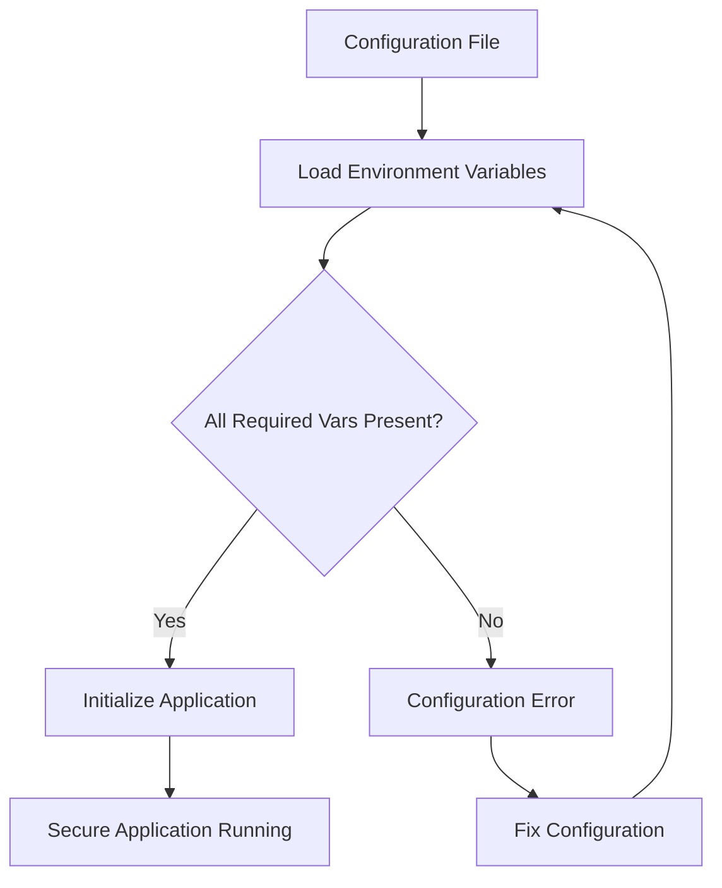
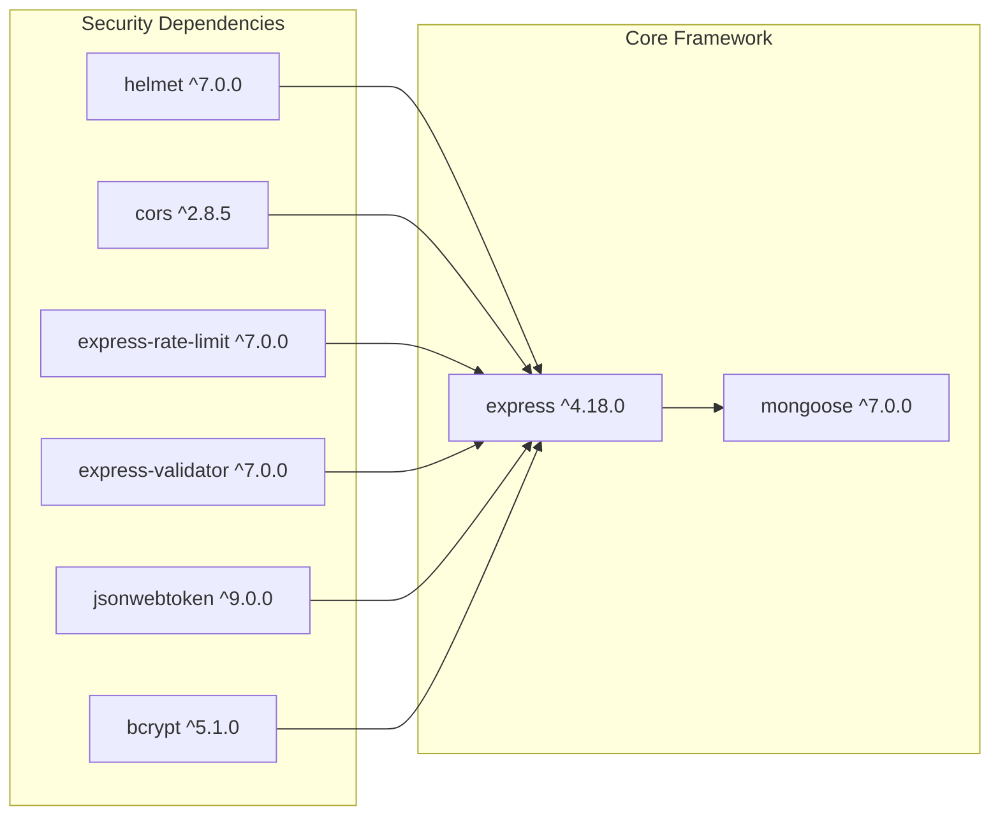

# Security Best Practices

<cite>
**Referenced Files in This Document**
- [BUILD.md](file://doc/BUILD.md)
</cite>

## Table of Contents
1. [Introduction](#introduction)
2. [Project Structure Overview](#project-structure-overview)
3. [Core Security Components](#core-security-components)
4. [Architecture Overview](#architecture-overview)
5. [Detailed Security Implementation Guide](#detailed-security-implementation-guide)
6. [Dependency Analysis](#dependency-analysis)
7. [Performance Considerations](#performance-considerations)
8. [Troubleshooting Guide](#troubleshooting-guide)
9. [Conclusion](#conclusion)
10. [Appendices](#appendices)

## Introduction

This document provides comprehensive security best practices for implementing and deploying QuickLink, a link bookmarking and credential management tool built with Node.js, Express, TypeScript, and MongoDB. The guide covers input validation, CORS configuration, rate limiting, security headers, HTTPS enforcement, secure cookie configuration, environment variable management, monitoring, incident response, and secure development practices.

QuickLink is designed as a personal knowledge management tool that supports link collection, account password management, NoSQL database storage with schema migration, full-text search, and data import/export capabilities. The application uses modern security practices including AES-256-GCM encryption for sensitive data and bcrypt for password hashing.

## Project Structure Overview

The QuickLink project follows a monorepo structure with separate client and server components:

**Diagram sources**
- [BUILD.md:33-92](file://doc/BUILD.md#L33-L92)

The project includes essential security dependencies such as express-validator for input validation, express-rate-limit for brute force protection, cors for cross-origin request handling, and helmet for security headers configuration.

**Section sources**
- [BUILD.md:33-92](file://doc/BUILD.md#L33-L92)
- [BUILD.md:540-569](file://doc/BUILD.md#L540-L569)

## Core Security Components

### Security Technology Stack

QuickLink implements a comprehensive security architecture using industry-standard libraries and practices:

| Component | Technology | Purpose | Security Benefit |
|-----------|------------|---------|------------------|
| **Password Hashing** | bcrypt | Secure password storage | Protects against rainbow table attacks |
| **Data Encryption** | AES-256-GCM | Sensitive field encryption | Ensures confidentiality of stored credentials |
| **Authentication** | JWT (jsonwebtoken) | User session management | Stateless authentication with token expiration |
| **Input Validation** | express-validator | Request sanitization | Prevents injection attacks and malformed data |
| **Rate Limiting** | express-rate-limit | Brute force protection | Throttles excessive requests |
| **CORS** | cors | Cross-origin policy | Controls which domains can access resources |
| **Security Headers** | helmet | HTTP header security | Mitigates common web vulnerabilities |

### Security Design Principles

The application follows these core security principles:

1. **Defense in Depth**: Multiple layers of security controls
2. **Least Privilege**: Minimal permissions for each component
3. **Secure by Default**: Safe defaults for all configurations
4. **Fail Secure**: Errors don't expose sensitive information
5. **Complete Mediation**: Every access request is checked

**Section sources**
- [BUILD.md:339-391](file://doc/BUILD.md#L339-L391)
- [BUILD.md:540-569](file://doc/BUILD.md#L540-L569)

## Architecture Overview

The QuickLink security architecture implements multiple protective layers to ensure comprehensive protection against common web vulnerabilities:

**Diagram sources**
- [BUILD.md:285-337](file://doc/BUILD.md#L285-L337)
- [BUILD.md:540-569](file://doc/BUILD.md#L540-L569)

The security middleware chain processes every incoming request through multiple validation and protection layers before reaching the business logic, ensuring comprehensive security coverage.

## Detailed Security Implementation Guide

### Input Validation with express-validator

Implement robust input validation to prevent injection attacks and ensure data integrity:

#### Schema Validation Strategy

**Diagram sources**
- [BUILD.md:386-387](file://doc/BUILD.md#L386-L387)

Key validation strategies include:
- **Schema-based validation**: Define strict schemas for all API endpoints
- **Type coercion**: Ensure proper data types for all inputs
- **Length constraints**: Prevent buffer overflow and DoS attacks
- **Format validation**: Validate email addresses, URLs, and other structured data
- **Custom validators**: Implement business-specific validation rules

#### Protection Against Injection Attacks

Implement comprehensive input sanitization to prevent:
- **SQL Injection**: Use parameterized queries and ORM frameworks
- **XSS Prevention**: Escape user input and validate content types
- **Command Injection**: Sanitize system command parameters
- **Path Traversal**: Validate file paths and directory access

**Section sources**
- [BUILD.md:386-387](file://doc/BUILD.md#L386-L387)

### CORS Configuration for Secure Cross-Origin Requests

Configure CORS policies to restrict cross-origin access while maintaining functionality:

#### CORS Policy Implementation

Best practices for CORS configuration:
- **Whitelist specific origins**: Only allow trusted domains
- **Restrict methods**: Limit allowed HTTP methods (GET, POST, etc.)
- **Control headers**: Specify allowed request/response headers
- **Enable credentials carefully**: Only when necessary and with proper configuration
- **Use environment variables**: Configure CORS settings per environment

### Rate Limiting with express-rate-limit

Implement rate limiting to prevent brute force attacks and API abuse:

#### Rate Limiting Strategy

Recommended rate limiting configurations:
- **Per-IP limiting**: Prevent single IP from overwhelming the API
- **Per-user limiting**: Restrict authenticated users appropriately
- **Endpoint-specific limits**: Different limits for login vs. read operations
- **Sliding window**: Track requests over rolling time periods
- **Graceful degradation**: Return informative error messages

### Helmet Middleware Setup for Security Headers

Configure helmet to automatically set security-related HTTP headers:

#### Security Headers Configuration

Essential security headers configured by helmet:
- **Content-Security-Policy**: Prevent XSS and data injection attacks
- **X-Frame-Options**: Prevent clickjacking attacks
- **X-Content-Type-Options**: Prevent MIME type sniffing
- **Strict-Transport-Security**: Enforce HTTPS connections
- **X-XSS-Protection**: Enable browser XSS filtering
- **Referrer-Policy**: Control referrer information sharing

**Section sources**
- [BUILD.md:553-555](file://doc/BUILD.md#L553-L555)

### HTTPS Enforcement

Ensure all communications use encrypted HTTPS connections:

#### HTTPS Implementation Strategy

HTTPS enforcement best practices:
- **Force HTTPS redirect**: Automatically redirect HTTP to HTTPS
- **HSTS headers**: Enable HTTP Strict Transport Security
- **Certificate management**: Use valid SSL certificates from trusted CAs
- **TLS configuration**: Disable outdated protocols and weak ciphers
- **Certificate monitoring**: Monitor certificate expiration dates

### Secure Cookie Configuration

Implement secure cookie settings to protect session data:

#### Cookie Security Settings

Critical cookie security attributes:
- **Secure**: Send cookies only over HTTPS connections
- **HttpOnly**: Prevent JavaScript access to cookies
- **SameSite**: Control cross-site request behavior
- **Domain**: Restrict cookie scope to specific domains
- **Path**: Limit cookie availability to specific URL paths
- **Expires/Max-Age**: Set appropriate cookie lifetimes

### Environment Variable Management

Manage sensitive configuration securely using environment variables:

#### Environment Variable Strategy

Environment variable management best practices:
- **Never hardcode secrets**: Use environment variables for all sensitive data
- **Separate environments**: Maintain different configs for dev/staging/prod
- **Secret rotation**: Implement regular secret rotation procedures
- **Access control**: Restrict environment variable access to authorized personnel
- **Audit logging**: Log configuration changes without exposing values

**Section sources**
- [BUILD.md:394-416](file://doc/BUILD.md#L394-L416)

## Dependency Analysis

The QuickLink application relies on several critical security dependencies that must be kept up-to-date:

**Diagram sources**
- [BUILD.md:540-569](file://doc/BUILD.md#L540-L569)

### Dependency Security Monitoring

Regular security maintenance tasks:
- **Automated updates**: Use dependency update tools to track security patches
- **Vulnerability scanning**: Scan dependencies for known vulnerabilities
- **License compliance**: Ensure all dependencies have compatible licenses
- **Supply chain security**: Verify package integrity and authenticity

**Section sources**
- [BUILD.md:540-569](file://doc/BUILD.md#L540-L569)

## Performance Considerations

Security implementations should not significantly impact application performance:

### Optimization Strategies

- **Efficient rate limiting**: Use Redis or in-memory stores for high-performance rate limiting
- **Caching security headers**: Cache computed security headers where appropriate
- **Connection pooling**: Optimize database connections for concurrent requests
- **Memory management**: Monitor memory usage of security middleware
- **Load testing**: Test security measures under various load conditions

### Performance Impact Assessment

Monitor the performance impact of security measures:
- **Request latency**: Measure overhead added by security middleware
- **Memory usage**: Track memory consumption of security features
- **CPU utilization**: Monitor CPU usage during security processing
- **Database queries**: Optimize security-related database operations

## Troubleshooting Guide

### Common Security Issues and Solutions

#### CORS Configuration Problems
- **Issue**: Cross-origin requests blocked
- **Solution**: Verify origin whitelist and CORS headers configuration
- **Debugging**: Check browser console for CORS errors

#### Rate Limiting False Positives
- **Issue**: Legitimate users being rate limited
- **Solution**: Adjust rate limit thresholds and consider user-based limiting
- **Monitoring**: Track rate limit hits and adjust accordingly

#### JWT Authentication Failures
- **Issue**: Users unable to authenticate
- **Solution**: Verify JWT secret configuration and token expiration settings
- **Logging**: Enable detailed authentication logs for debugging

#### HTTPS Certificate Issues
- **Issue**: SSL/TLS connection failures
- **Solution**: Check certificate validity and TLS configuration
- **Testing**: Use SSL testing tools to verify configuration

### Security Incident Response

#### Monitoring and Alerting

Implement comprehensive monitoring for suspicious activities:
- **Failed login attempts**: Alert on multiple failed authentication attempts
- **Unusual API usage**: Detect abnormal request patterns
- **Privilege escalation**: Monitor for unauthorized access attempts
- **Data exfiltration**: Track unusual data access patterns

#### Incident Response Procedures

1. **Detection**: Identify security incidents through monitoring and alerts
2. **Assessment**: Evaluate the severity and scope of the incident
3. **Containment**: Isolate affected systems to prevent further damage
4. **Eradication**: Remove the cause of the security incident
5. **Recovery**: Restore normal operations and verify system integrity
6. **Post-incident**: Analyze the incident and improve security measures

**Section sources**
- [BUILD.md:380-391](file://doc/BUILD.md#L380-L391)

## Conclusion

Implementing comprehensive security measures in QuickLink requires a multi-layered approach combining input validation, access control, encryption, monitoring, and regular maintenance. The security architecture described in this guide provides robust protection against common web vulnerabilities while maintaining application performance and usability.

Key recommendations for ongoing security maintenance:
- Regular security audits and penetration testing
- Continuous monitoring and alerting for suspicious activities
- Prompt response to security advisories and vulnerability disclosures
- Regular security training for development teams
- Comprehensive incident response planning and testing

By following these security best practices and maintaining vigilance against emerging threats, QuickLink can provide a secure platform for link bookmarking and credential management.

## Appendices

### Security Checklist

#### Password Security Requirements
- Minimum password length: 8 characters
- Require uppercase and lowercase letters
- Include numbers and special characters
- Implement password history to prevent reuse
- Regular password expiration policies

#### Audit Logging Implementation
- Log all authentication attempts (success and failure)
- Record administrative actions and privilege changes
- Track data access patterns and modifications
- Implement centralized log management
- Regular log review and analysis

#### Vulnerability Scanning Procedures
- Automated dependency vulnerability scanning
- Regular code security reviews
- Penetration testing schedules
- Container image vulnerability scanning
- Third-party service security assessments

#### Regular Security Updates
- Subscribe to security advisories for all dependencies
- Establish update testing procedures
- Plan for emergency security patch deployment
- Maintain backup and rollback procedures
- Document update procedures and impacts

### Secure Development Practices

#### Code Review Checklists
- Input validation and sanitization verification
- Authentication and authorization checks
- Error handling and exception management
- Security header configuration
- Database query security and parameterization

#### Deployment Security Considerations
- Environment-specific security configurations
- Secret management and rotation procedures
- Container security and image scanning
- Network security and firewall configuration
- Backup and disaster recovery procedures

### Security Testing Methodologies

#### Automated Security Testing
- Static application security testing (SAST)
- Dynamic application security testing (DAST)
- Software composition analysis (SCA)
- Interactive application security testing (IAST)
- API security testing

#### Manual Security Testing
- Penetration testing by security professionals
- Security architecture reviews
- Threat modeling exercises
- Security control effectiveness testing
- Red team exercises