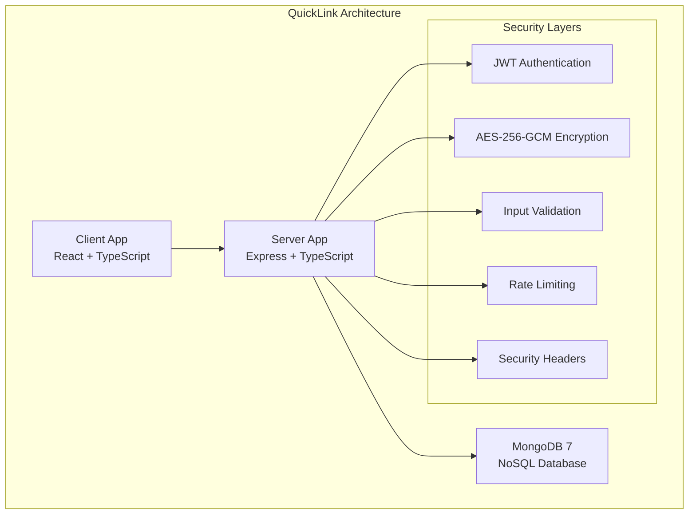
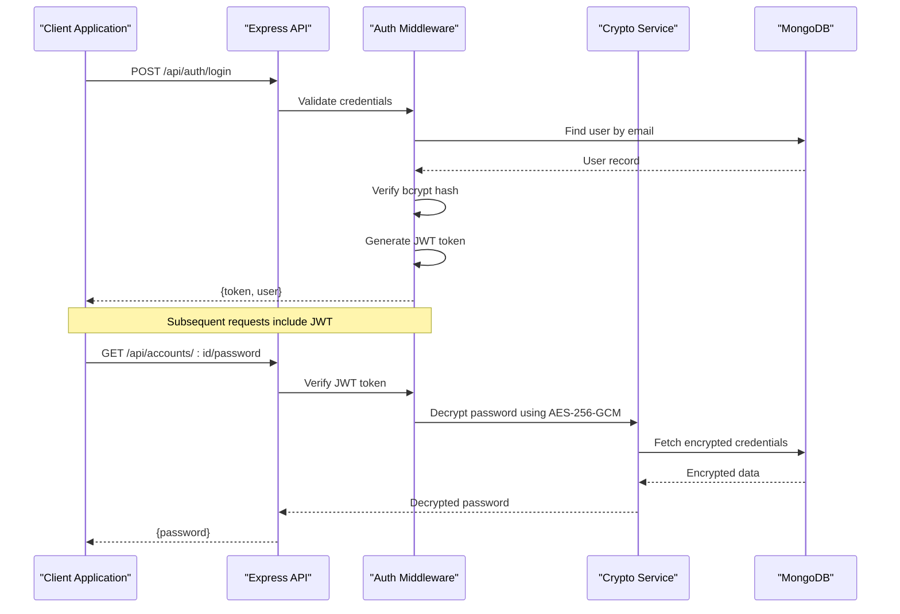
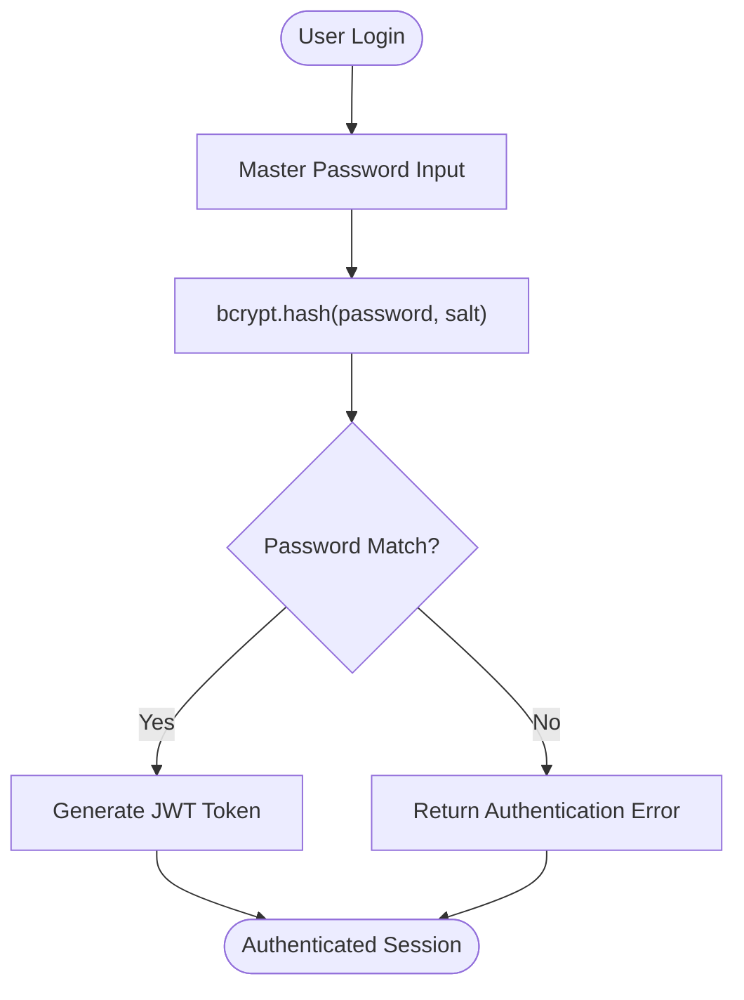
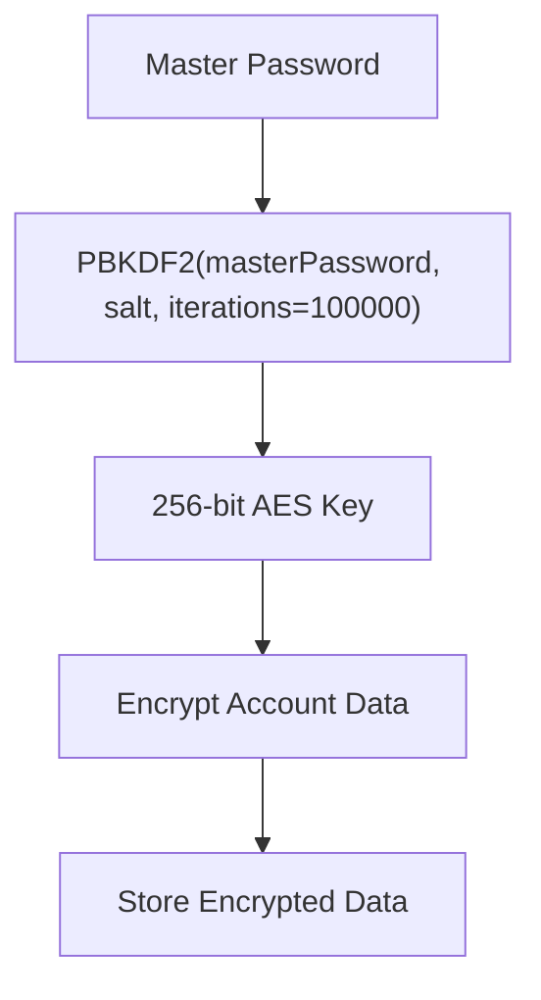
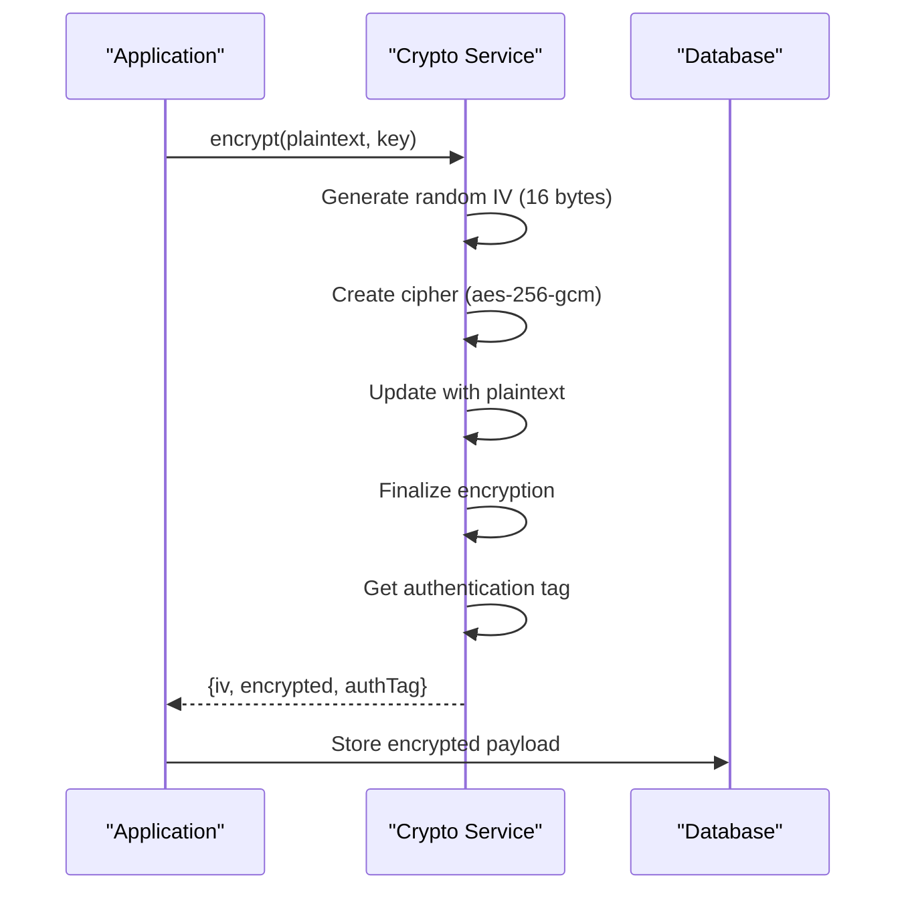
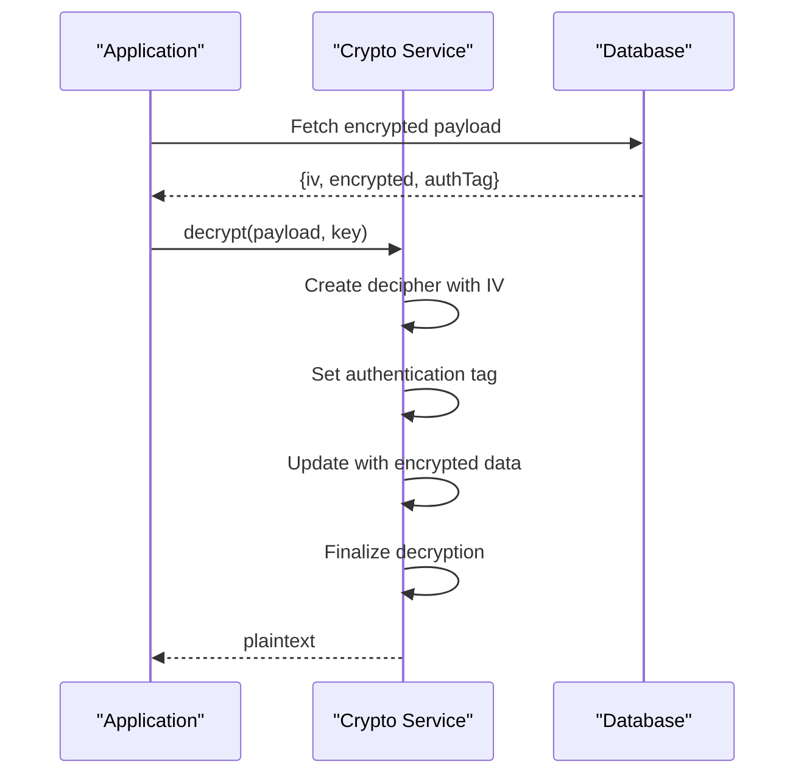
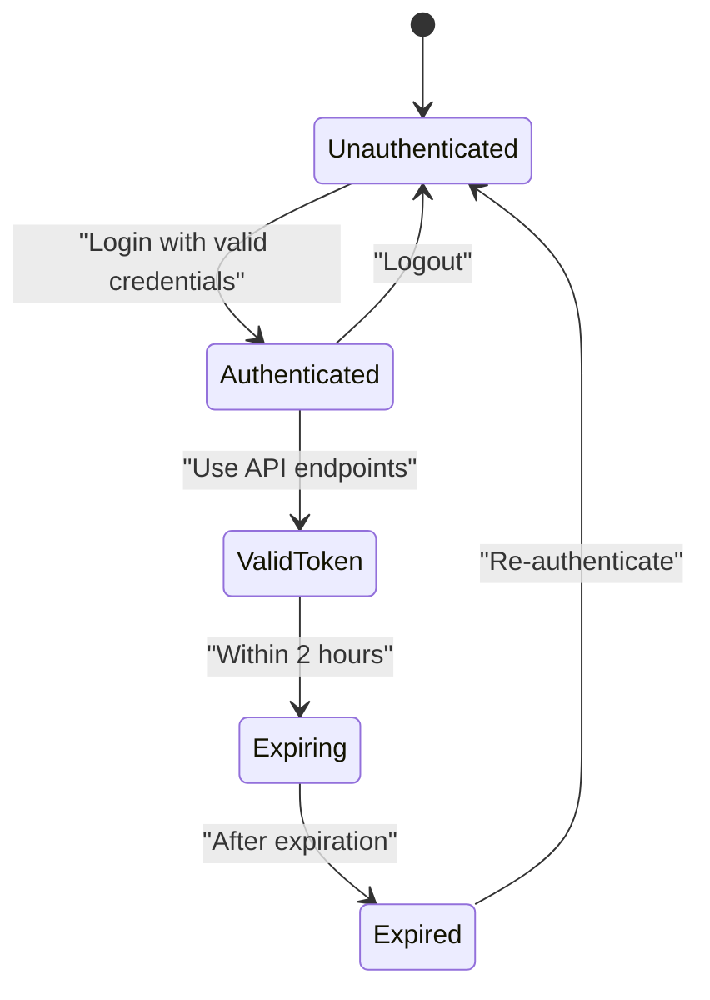
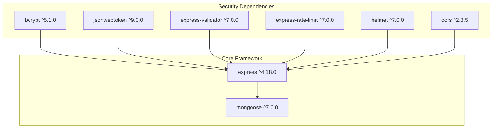

# Security Implementation

<cite>
**Referenced Files in This Document**
- [BUILD.md](file://doc/BUILD.md)
</cite>

## Table of Contents
1. [Introduction](#introduction)
2. [Project Structure](#project-structure)
3. [Core Components](#core-components)
4. [Architecture Overview](#architecture-overview)
5. [Detailed Component Analysis](#detailed-component-analysis)
6. [Dependency Analysis](#dependency-analysis)
7. [Performance Considerations](#performance-considerations)
8. [Troubleshooting Guide](#troubleshooting-guide)
9. [Conclusion](#conclusion)
10. [Appendices](#appendices)

## Introduction

QuickLink is a comprehensive link bookmarking and credential management tool that implements a multi-layered security architecture to protect sensitive user data. The system provides secure storage for website credentials, bookmarks, and personal information while maintaining high performance and usability standards.

The security implementation focuses on several critical areas: password encryption using bcrypt hashing, AES-256-GCM encryption for sensitive data, JWT-based authentication, input validation, rate limiting, and comprehensive security headers. This document provides detailed analysis of each security component and their implementation rationale.

## Project Structure

The QuickLink project follows a monorepo structure with separate client and server applications:

**Diagram sources**
- [BUILD.md:33-92](file://doc/BUILD.md#L33-L92)

**Section sources**
- [BUILD.md:33-92](file://doc/BUILD.md#L33-L92)

## Core Components

### Password Encryption Architecture

QuickLink implements a dual-layer password protection system:

1. **Authentication Layer**: Uses bcrypt hashing for master password verification during login
2. **Encryption Key Derivation**: Employs PBKDF2 to derive AES-256 encryption keys from master passwords

The architecture ensures that:
- Master passwords are never stored in plaintext
- Sensitive account credentials are encrypted using AES-256-GCM
- Each user has unique encryption keys derived from their master password

### Data Storage Security

The database schema implements field-level encryption for sensitive data:

| Collection | Encrypted Fields | Purpose |
|------------|------------------|---------|
| users | passwordHash, masterKey | Authentication and key derivation |
| accounts | username, email, password, notes, totpSecret | Credential protection |
| links | None | Public bookmark data |

**Section sources**
- [BUILD.md:100-178](file://doc/BUILD.md#L100-L178)

## Architecture Overview

The security architecture follows a layered defense approach with multiple independent security controls:

**Diagram sources**
- [BUILD.md:287-320](file://doc/BUILD.md#L287-L320)
- [BUILD.md:341-378](file://doc/BUILD.md#L341-L378)

## Detailed Component Analysis

### Password Encryption and Key Derivation

QuickLink implements a sophisticated encryption pipeline that processes master passwords through multiple security layers:

#### Bcrypt Hashing for Authentication

The system uses bcrypt to hash master passwords for secure authentication:

**Diagram sources**
- [BUILD.md:341-352](file://doc/BUILD.md#L341-L352)

#### PBKDF2 Key Derivation for Encryption

For encrypting sensitive data, the system derives AES-256 encryption keys using PBKDF2:

**Diagram sources**
- [BUILD.md:348-351](file://doc/BUILD.md#L348-L351)

### AES-256-GCM Encryption Implementation

The encryption system uses AES-256-GCM (Galois/Counter Mode) for authenticated encryption:

#### Encryption Process

The encryption flow includes IV generation, cipher initialization, and authentication tag creation:

**Diagram sources**
- [BUILD.md:355-364](file://doc/BUILD.md#L355-L364)

#### Decryption Process

The decryption process validates authentication tags before returning plaintext:

**Diagram sources**
- [BUILD.md:366-377](file://doc/BUILD.md#L366-L377)

### JWT Token Implementation

QuickLink implements JSON Web Tokens for stateless authentication:

#### Token Lifecycle

**Diagram sources**
- [BUILD.md:383-384](file://doc/BUILD.md#L383-L384)

#### Security Features

- **Expiration Handling**: JWT tokens have configurable expiration times (default 2 hours)
- **Secure Storage**: Tokens stored securely in client-side storage
- **Middleware Protection**: Protected routes require valid JWT tokens
- **Refresh Strategy**: Implements token refresh mechanisms for long sessions

### Input Validation and Sanitization

The system uses express-validator for comprehensive input validation:

#### Validation Rules

| Field Type | Validation Rules | Security Purpose |
|------------|------------------|------------------|
| Email | Format validation, length limits | Prevent injection attacks |
| Password | Minimum length, complexity requirements | Enforce strong passwords |
| URLs | Protocol validation, domain sanitization | Prevent XSS and SSRF |
| Text Fields | Length limits, character filtering | Prevent buffer overflows |

#### CORS Configuration

Cross-Origin Resource Sharing is configured with strict origin whitelisting to prevent unauthorized cross-origin requests.

### Rate Limiting and Security Headers

#### Rate Limiting Implementation

The system implements express-rate-limit to prevent brute force attacks:

- **Login Attempts**: Limited to prevent password guessing
- **API Requests**: Global rate limiting to prevent abuse
- **IP-based Tracking**: Limits applied per IP address

#### Helmet Security Headers

Helmet middleware configures essential security headers:

- **Content-Security-Policy**: Prevents XSS and injection attacks
- **X-Frame-Options**: Prevents clickjacking
- **X-Content-Type-Options**: Prevents MIME type sniffing
- **Strict-Transport-Security**: Enforces HTTPS connections

**Section sources**
- [BUILD.md:379-391](file://doc/BUILD.md#L379-L391)
- [BUILD.md:544-568](file://doc/BUILD.md#L544-L568)

## Dependency Analysis

The security implementation relies on several key dependencies:

**Diagram sources**
- [BUILD.md:544-568](file://doc/BUILD.md#L544-L568)

**Section sources**
- [BUILD.md:544-568](file://doc/BUILD.md#L544-L568)

## Performance Considerations

### Encryption Performance

- **bcrypt Cost Factor**: Configurable work factor balances security vs. performance
- **AES-256-GCM Efficiency**: Hardware-accelerated encryption for optimal performance
- **Connection Pooling**: MongoDB connection pooling reduces latency
- **Caching Strategy**: In-memory caching for frequently accessed non-sensitive data

### Memory Management

- **Stream Processing**: Large files processed in streams to prevent memory exhaustion
- **Buffer Reuse**: Efficient buffer allocation and reuse patterns
- **Garbage Collection**: Proper cleanup of cryptographic objects after use

### Database Optimization

- **Index Strategy**: Strategic indexing on frequently queried fields
- **Query Optimization**: Efficient aggregation pipelines for complex queries
- **Connection Management**: Proper connection lifecycle management

## Troubleshooting Guide

### Common Security Issues

#### Authentication Failures

**Symptoms**: Users unable to log in despite correct credentials

**Possible Causes**:
- Incorrect bcrypt salt configuration
- Database connection issues
- JWT secret misconfiguration

**Resolution Steps**:
1. Verify bcrypt salt consistency across deployments
2. Check database connectivity and user records
3. Validate JWT secret configuration in environment variables

#### Encryption Errors

**Symptoms**: Unable to decrypt account credentials

**Possible Causes**:
- Corrupted encryption keys
- Missing or invalid IV values
- Authentication tag mismatches

**Resolution Steps**:
1. Verify encryption key integrity
2. Check IV and authentication tag storage
3. Validate encryption algorithm consistency

#### Rate Limiting Issues

**Symptoms**: Legitimate users being rate limited

**Possible Causes**:
- Overly aggressive rate limiting configuration
- Shared IP addresses (proxies, NAT)
- Misconfigured rate limit windows

**Resolution Steps**:
1. Adjust rate limiting thresholds based on usage patterns
2. Configure proper proxy detection
3. Implement per-user rate limiting where appropriate

**Section sources**
- [BUILD.md:379-391](file://doc/BUILD.md#L379-L391)

## Conclusion

QuickLink's security implementation demonstrates a comprehensive approach to protecting sensitive user data through multiple layers of defense. The combination of bcrypt hashing, AES-256-GCM encryption, JWT authentication, input validation, and security headers creates a robust security posture that protects against common web application vulnerabilities.

The architecture successfully balances security requirements with performance considerations, implementing efficient encryption algorithms and optimized database queries while maintaining strong security guarantees. The modular design allows for easy updates and improvements to security measures as new threats emerge.

Key strengths of the implementation include:
- Strong cryptographic practices with industry-standard algorithms
- Comprehensive input validation and sanitization
- Multi-layered authentication and authorization
- Proper error handling and logging
- Scalable architecture supporting growing user bases

## Appendices

### Security Best Practices Checklist

#### HTTPS Enforcement
- [ ] All API endpoints accessible only via HTTPS
- [ ] HTTP to HTTPS redirects configured
- [ ] HSTS headers enabled for browser enforcement

#### Password Strength Validation
- [ ] Minimum 8 characters required
- [ ] Mixed case letters enforced
- [ ] Numbers and special characters encouraged
- [ ] Common password blacklist implemented

#### Audit Logging
- [ ] Authentication attempts logged
- [ ] Sensitive data access tracked
- [ ] Administrative actions recorded
- [ ] Security events monitored and alerted

#### Vulnerability Mitigation
- [ ] Regular dependency updates performed
- [ ] Security scanning integrated into CI/CD
- [ ] Penetration testing scheduled regularly
- [ ] Security patches applied promptly

### Environment Configuration

#### Required Environment Variables

| Variable | Description | Example |
|----------|-------------|---------|
| PORT | Server port | 3000 |
| NODE_ENV | Environment mode | production |
| MONGODB_URI | Database connection string | mongodb://localhost:27017 |
| MONGODB_DB_NAME | Database name | quicklink |
| JWT_SECRET | JWT signing secret | your-jwt-secret-here |
| JWT_EXPIRES_IN | Token expiration time | 2h |
| ENCRYPTION_SALT | Encryption salt | your-encryption-salt-here |

**Section sources**
- [BUILD.md:394-416](file://doc/BUILD.md#L394-L416)